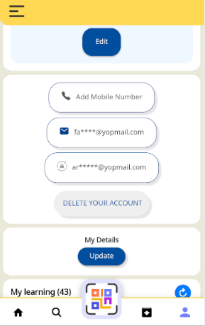
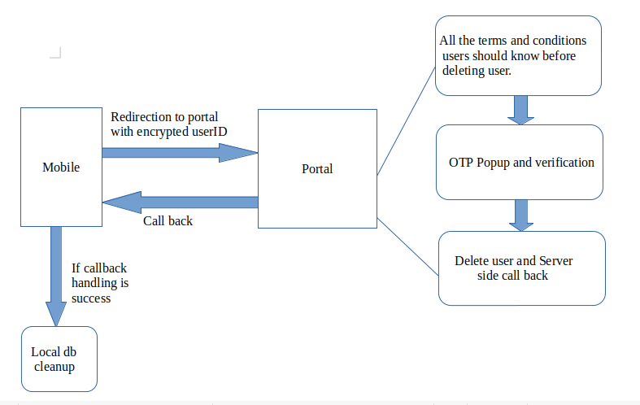

## Background:
Google Play’s data deletion badge and Data deletion area within the Data safety section give users a new set of transparency and controls over their user data while providing developers a way to showcase how they treat user data responsibly the app allows users to create an account from within the app, then it must also allow users to request for their account to be deleted.

 **Problem statement:** The design Proof of Concept (POC) aims to address the challenge of securely and efficiently enabling users to delete their accounts within a system that involves multiple components. This process involves defining a deep link for the "Delete Your Account" action, handling user interactions, performing login and OTP verification, managing server-side callbacks, and ensuring local database cleanup while also collecting telemetry data for analytical purposes.

 **Design:**  **1. Components:** 

*  **_Profile Page_** :  This is where the "DELETE YOUR ACCOUNT" button is located.

*  **_Portal Page_** :  The page where users will be redirected to handle the login, OTP, and confirmation.

*  **_Mobile App_** :  Will trigger the deep link and handle the server-side callback and local cleanup.

 **2. Deep Link Setup:** 

* Defined a deep link for the "Delete Your Account" action in the mobile app. 

 **3. Profile Page Interaction:** 

* On the profile page, create a button with the text "DELETE YOUR ACCOUNT"

* Implement an onClick event handler for the button that triggers the deep link with the appropriate URL.

 **4. Portal page** 

* When users click the "DELETE YOUR ACCOUNT" button, they are redirected to the Portal Page using the deep link.

 **5. Handling Login and OTP:** 

* On the Portal Page, prompt the user to log in even if they are already logged in mobile app.

* Collect the user's credentials and verify them.

* If successful, prompt the user for an OTP and confirm the deletion.

 **6. Server-Side Callback:** 

* After successful deletion on the server side, send a callback to a predefined callback URL. This callback should contain information about the success of the deletion.

 **7. Mobile App Callback Handling:** 

* In the mobile app, set up a URL handler to capture the callback sent by the portal page. When the callback is received, extract the necessary information (success status).

 **8. Local Database Cleanup:** 

* If the server-side callback indicates a successful deletion, trigger the local database cleanup in the mobile app. This can involve deleting the user's data and any associated records in the local database.

* Refer [[Delete User Account|Delete-User-Account]]  for this.

 **9. Telemetry** 

* Generate telemetry at three key points: a. When users click on the "DELETE YOUR ACCOUNT" button on the profile page. b. While redirecting to the Portal Page. c. After deleting the user and redirecting back to the mobile app.

* Use telemetry to track how many users have deleted their accounts for analytics purposes.

*****

[[category.storage-team]] 
[[category.confluence]] 
