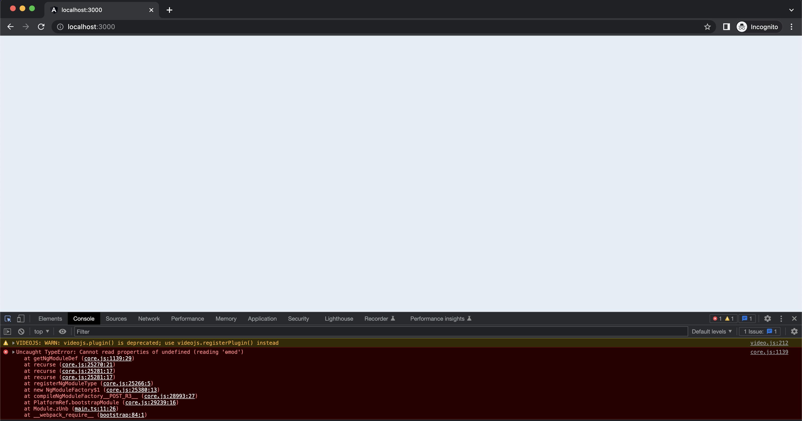

 **Introduction** 

 **Background** Currently,  **Sunbird-Ed**  is in Angular version 11. Since Angular team is releasing multiple updated versions in a year, it is necessary to cope-up with the latest version and update the project since the support for the older versions of Angular will be stopped, no security updates and not maintained (Non LTS) by the Angular team.

Since Sunbird-Ed is following the Open-Source approach, it is necessary that the codebase should be upto date with the latest available version.

Currently [Angular 15](https://angular.io/guide/update-to-version-15) is the latest version of the Angular framework available.

Roadmap for Angular future releases - [Angular Roadmap](https://angular.io/guide/releases#actively-supported-versions)

[Source](https://angular.io/guide/releases#actively-supported-versions) : \*  _Angular version 2 to version 12 are no longer under support_ 

 **Problem Statement** Sunbird-Ed should be updated from Angular 11 to Angular 12 version and all the peer dependencies needs to be updated to Angular 12 with [ivy compilation](https://v12.angular.io/guide/ivy) enabled as mandatory checklist task

 **Key design problems** 
* All the dependencies that are used must be [upgraded](https://v12.angular.io/guide/creating-libraries#ivy-libraries) to Angular 12

* Resolve the issues caused by ivy compilation and strict type checking

* Resolve the circular dependencies that exists in the application modules

 **Design** Angular Upgrade Guide:[https://update.angular.io/?l=3&v=11.0-12.0](https://update.angular.io/?l=3&v=11.0-12.0)

Dependencies List:[https://docs.google.com/spreadsheets/d/1VJZ21MBFIiuwQjbVUwokVyBrEKJeXkYYJyWHHL19gIw/edit#gid=1364778090](https://docs.google.com/spreadsheets/d/1VJZ21MBFIiuwQjbVUwokVyBrEKJeXkYYJyWHHL19gIw/edit#gid=1364778090)

*  **Approach 1** 

    * Updated the portal to Angular 12 using official upgradation guide [https://update.angular.io/?l=3&v=11.0-12.0](https://update.angular.io/?l=3&v=11.0-12.0)

    * Used the available updated dependencies that are migrated to v12 in Dependencies List:[https://docs.google.com/spreadsheets/d/1VJZ21MBFIiuwQjbVUwokVyBrEKJeXkYYJyWHHL19gIw/edit#gid=1364778090](https://docs.google.com/spreadsheets/d/1VJZ21MBFIiuwQjbVUwokVyBrEKJeXkYYJyWHHL19gIw/edit#gid=1364778090)

    

 **Result** :  _We encountered many module errors and binding errors_ 

*  **Approach 2** 

    * Removed Alias paths that were present in tsconfig and added relative imports in whole codebase by manually changing imports in all files.

    * Added exports to all components,directives, services in root barrel file.

    * Updated some dependencies that were being used in repo to 12 like  _ng2-sematic-ui,@project-sunbird/web-extensions._ 

    * Used alternatives to some dependencies that lost support long back

    * Eg:angular-inport->@stockopedia/angular-inport, slick-carousel->ngx-slick-carousel

    

    

 **Result** :  _Errors faced in phase 1 approach still persists_ 

*  **Approach 3** 

    * Made Ivy flag to true in Angular 11 version of portal to check if those errors were because of Ivy compilation

    * Portal client outdated dependencies were updated to available latest version

    * Resolved some errors and changed some absolute paths to relative paths for module imports

    * Used some alternate dependencies that were available in place of the the outdated dependencies 

    * Eg:ng2-ace-editor->@derekbaker/ngx-ace-editor-wrapper

    

    

 **Result** :  _Compilation was successful but application was not loading as expected_ 

 **Approach 4** 

* Created a fresh Angular 12 project using Angular CLI to simulate actual behaviour

* Added base code of the portal like app component, shared module, core module etc one by one

* Used available updated dependencies

* Resolved some typescript errors that arouse due to strict type checking

Result:

 **Reference links** 
* Angular Upgrade Guide:[https://update.angular.io/?l=3&v=11.0-12.0](https://update.angular.io/?l=3&v=11.0-12.0)

* Dependencies List:[https://docs.google.com/spreadsheets/d/1VJZ21MBFIiuwQjbVUwokVyBrEKJeXkYYJyWHHL19gIw/edit#gid=1364778090](https://docs.google.com/spreadsheets/d/1VJZ21MBFIiuwQjbVUwokVyBrEKJeXkYYJyWHHL19gIw/edit#gid=1364778090)

* [Angular Ivy](https://v12.angular.io/guide/ivy)

* [Angular Roadmap](https://angular.io/guide/releases#actively-supported-versions)

* [Creating Ivy Libraries](https://v12.angular.io/guide/creating-libraries#ivy-libraries)

[ **Discussion Thread For Angular 12 Migration** ](https://github.com/orgs/Sunbird-Ed/discussions/333)

*****

[[category.storage-team]] 
[[category.confluence]] 
