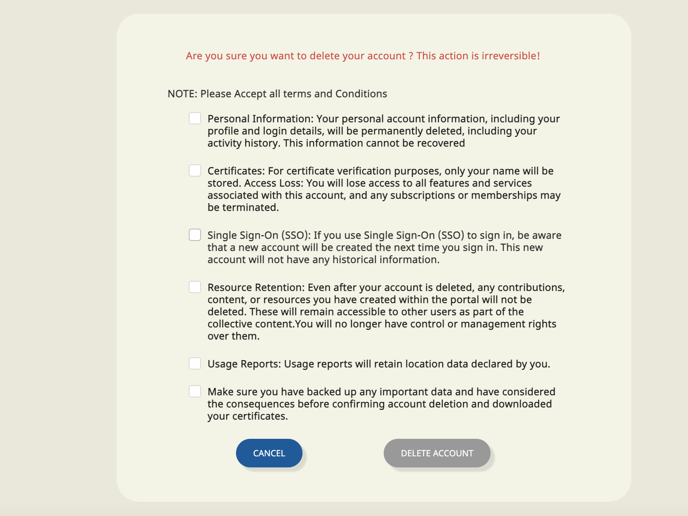
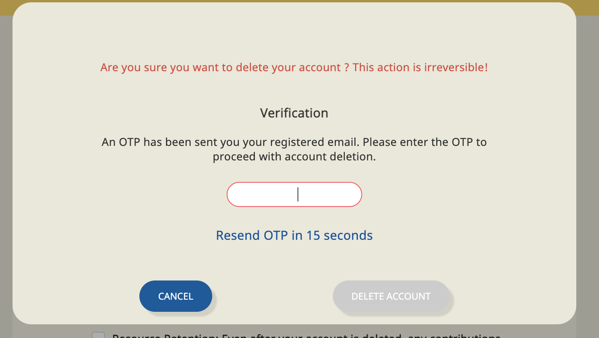

## Introduction:

* [Background](https://project-sunbird.atlassian.net/wiki/spaces/SUN/pages/3359146039/Design+Front-end+Delete+User+Functionality#Background%3A)

* [Problem Statement](https://project-sunbird.atlassian.net/wiki/spaces/SUN/pages/3359146039/Design+Front-end+Delete+User+Functionality#Problem-Statement-%3A)

* [Design](https://project-sunbird.atlassian.net/wiki/spaces/SUN/pages/3359146039/Design+Front-end+Delete+User+Functionality#Design-%3A)

* [References](https://project-sunbird.atlassian.net/wiki/spaces/SUN/pages/3359146039/Design+Front-end+Delete+User+Functionality#References%3A)

## Background:
Google Play’s data deletion badge and Data deletion area within the Data safety section give users a new set of transparency and controls over their user data while providing developers a way to showcase how they treat user data responsibly the app allows users to create an account from within the app, then it must also allow users to request for their account to be deleted.

 **Problem Statement :** Since this delete user feature will be rolled out in the  **Sunbird release-7.0.0** , the adapters who are using the older versions of the SunbirdEd might not be able to use this feature and their app might get delisted from the Google Play store due to play store policies. Also since the same functionality has to be achieved by  **SunbirdEd-Portal** ,  **SunbirdEd Mobile**  and  **SunbirdEd coKreat**  it will involve in the duplication of efforts

 **Design :** 
## Solution1:
Create an Angular(v13) library that can be integrated across  **SunbirdEd-Portal** ,  **SunbirdEd Mobile**  and  **SunbirdEd coKreat**  which will offer the same functionality across the platforms

The library will consists of 

* Terms and conditions Page

    * 

    
* Otp popup for verification

### Pros: 

* Code reusability across platforms

* Similar feature integration

### Cons:

* Will work for only adapters who has Angular version 13 or more

* API integration in portal backend

* Older versions of SunbirdEd wont be supported

## Solution2:
Create a web-component along with the library which can be integrated across Sunbird-Ed platforms and also on older version of the portal/mobile

### Pros: 

* Framework agnostic feature

* Supports older versions of portal/mobile

### Cons:

* Development overhead

* API integration in portal backend

## Solution 3:
Create static HTML pages that can be used across platforms

### Pros: 

* Supports older versions of portal/mobile

### Cons:

* Hardcoded data

* How to handle interactions

## References:

* [PRD- Delete user functionality](https://project-sunbird.atlassian.net/wiki/spaces/SBDES/pages/3351969808/PRD+Delete+Account+functionality)

* [Front End Design](https://www.figma.com/file/krTuutMhS6QxI2kRku04eh/Delete-Account?type=design&node-id=0-1&mode=design&t=1mbrQILh71AASyse-0)

* [Design- Delete User Functionality](https://project-sunbird.atlassian.net/wiki/spaces/SBDES/pages/3354492949/Design+Delete+Account+Functionality)

*****

[[category.storage-team]] 
[[category.confluence]] 
