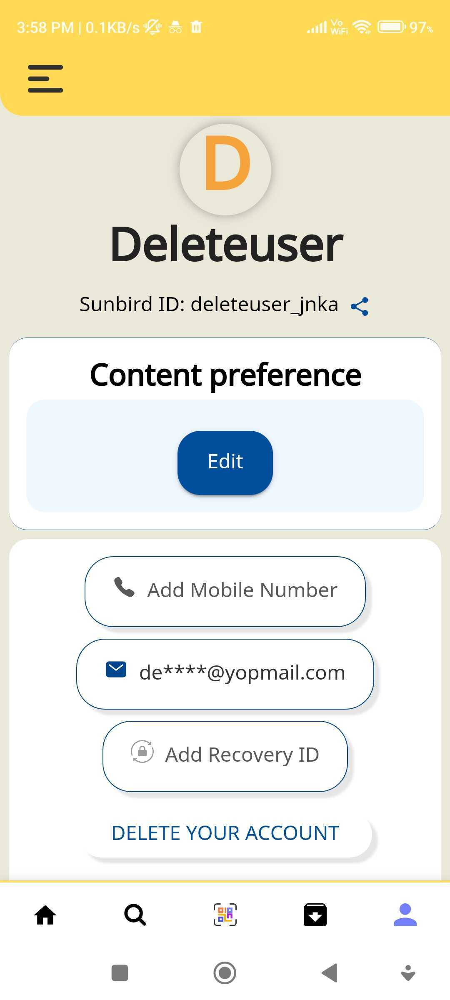
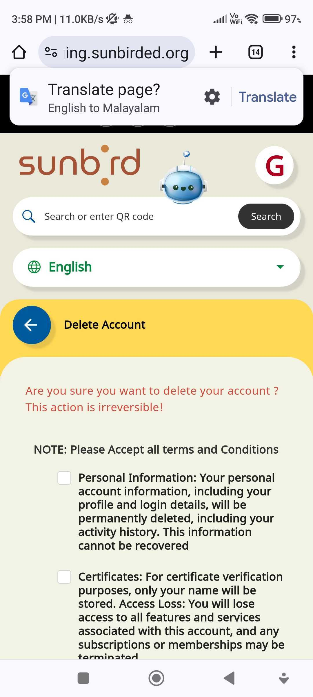
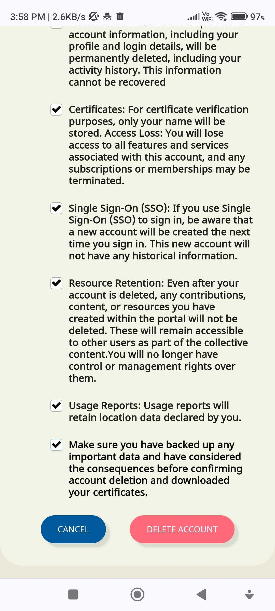
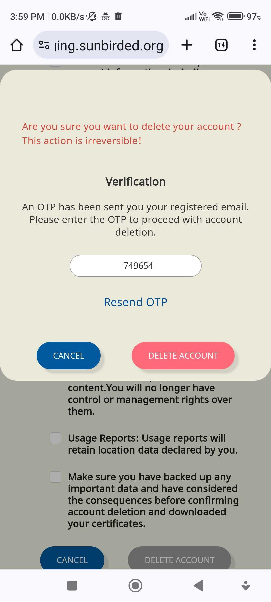

## Background:
This document outlines the workflow for deleting a user account from the Sunbird mobile app. The deletion process involves logging in to the Sunbird mobile app, navigating to the user's profile page, initiating the deletion process by clicking on the "Delete" button, confirming the deletion by checking checkboxes, and verifying OTP (One-Time Password) for security purposes.

## Workflow:

1.  **Access your profile page and initiate account deletion** 

* On the profile page, look for the option to delete your account. This is usually represented by a "DELETE YOUR ACCOUNT" button.

* Click on the "DELETE YOUR ACCOUNT" button to initiate the account deletion process.

1.  **Confirm the deletion** 

* After clicking on the "DELETE YOUR ACCOUNT" button, you will be presented with a confirmation dialog box.

* Carefully read the information provided in the confirmation dialog box.

* Check the checkboxes to confirm that you understand the consequences of deleting your account.

* Click on “DELETE YOUR ACCOUNT“ account

 

 

1.  **Verify OTP** 

* As an additional security measure, Sunbird requires you to verify your identity using OTP (One-Time Password).

* An OTP will be sent to your registered email address or mobile number.

* Retrieve the OTP from your email or mobile device and enter it into the verification field provided on the screen.

* Click on the "Delete Account" button to proceed.

* Once the OTP is successfully verified, a deletion of the account is initiated

After the deletion, you will be redirected back and logged out of the Sunbird Mobile App. Any associated data or content linked to your account will be permanently removed.

 **Note:** 

* Please exercise caution while deleting your account as this action is irreversible and may result in loss of data.

* Ensure that you have retrieved any important information or data associated with your account before proceeding with the deletion process.

*****

[[category.storage-team]] 
[[category.confluence]] 
