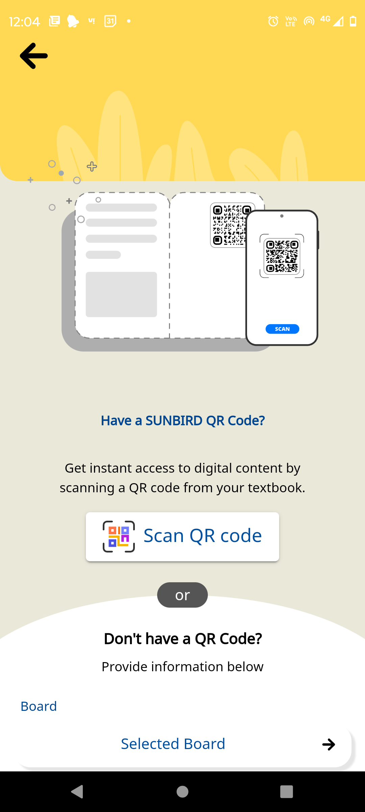
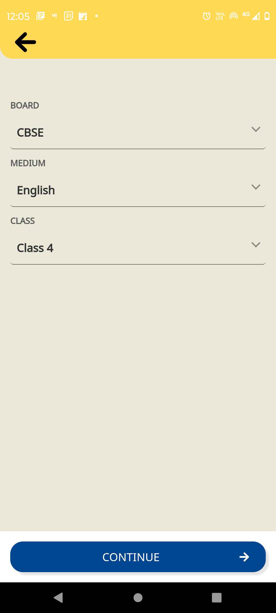
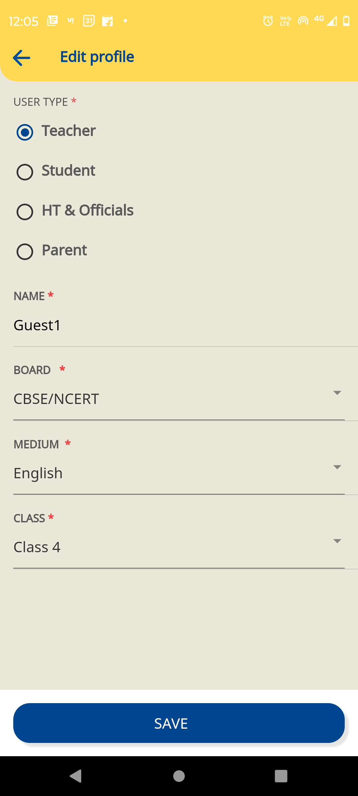
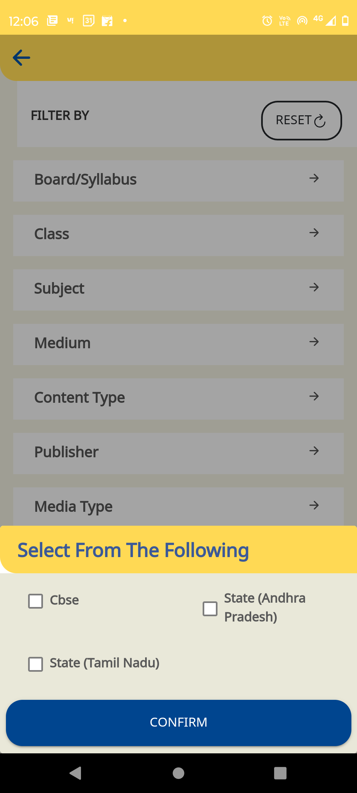
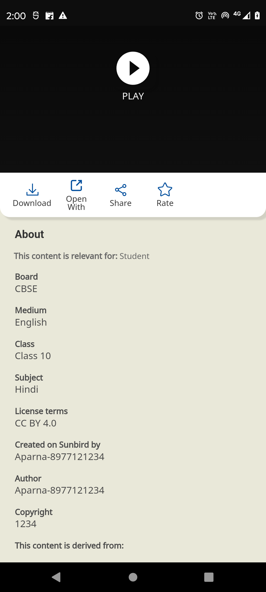

## Introduction:

* [Background](https://project-sunbird.atlassian.net/wiki/spaces/SUN/pages/3342532609#Background:)

* [Existing workflow:](https://project-sunbird.atlassian.net/wiki/spaces/SUN/pages/3342532609#Existing-workflow:)

* [Module](https://project-sunbird.atlassian.net/wiki/spaces/SUN/pages/3342532609#Module:)

## Background:
Currently, Sunbird uses hard coded of BMGS so, we can use this app only for the educational domain.

If User wants to use this application in non-educational domain, then we have to remove the hardcode of BMGS and make it dynamic then the app will support multiple frameworks.

Jira ticket: [https://project-sunbird.atlassian.net/jira/software/c/projects/ED/issues/ED-1957?filter=myopenissues](https://project-sunbird.atlassian.net/jira/software/c/projects/ED/issues/ED-1957?filter=myopenissues)

## Existing workflow:
 **Here are some screenshots of the Harcoded BMGS :-** 

* Screenshot-1: Onboarding BMG

* Screenshot-2: Edit user

* Screenshot-3: Search filters

* Screenshot-4: Content data

 **Module:** 
1. [[Framework|Gap-Analysis-for-Framework-Details]]

1. [[Profile|Update-user-profile]]

1. [[Search|Search-Filter]]

1. [[Content|Content-Details]]

1. [[DB Migration|Database-updation-for-profile-and-content-table]]

*****

[[category.storage-team]] 
[[category.confluence]] 
