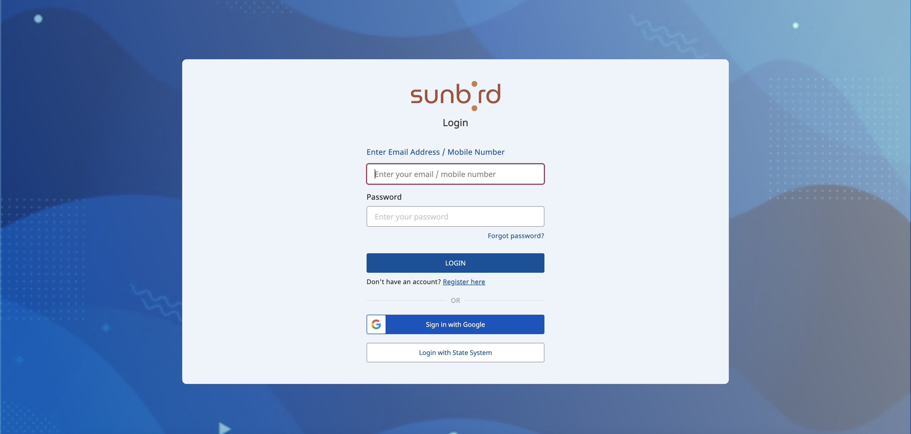
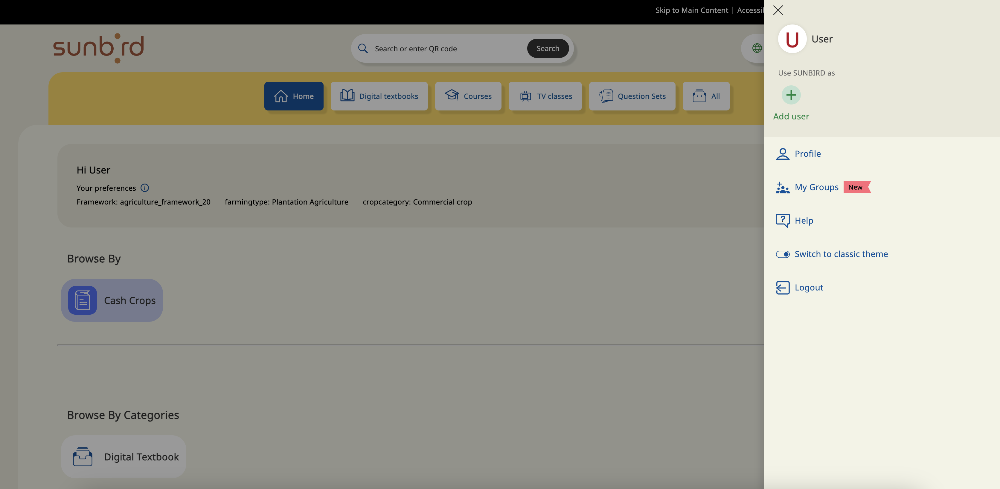
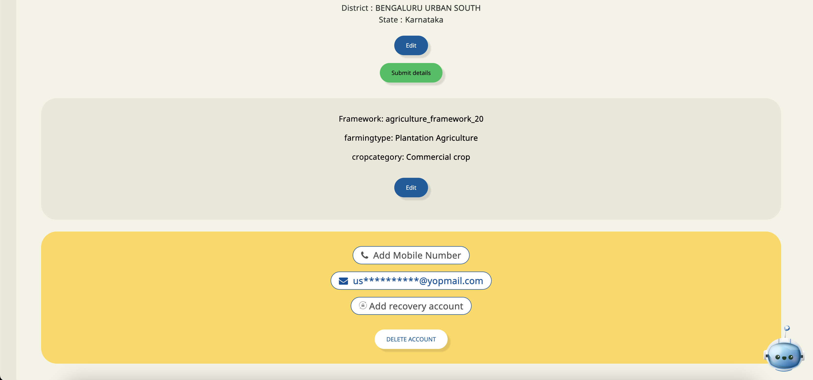
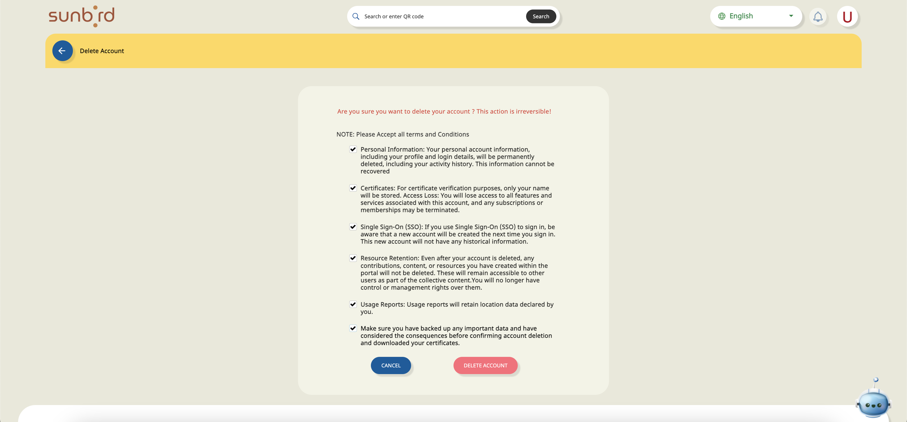
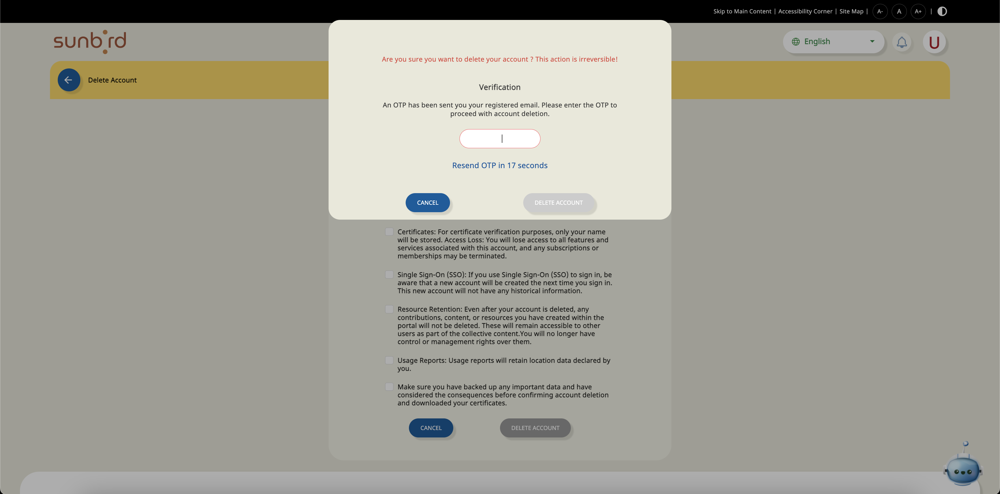
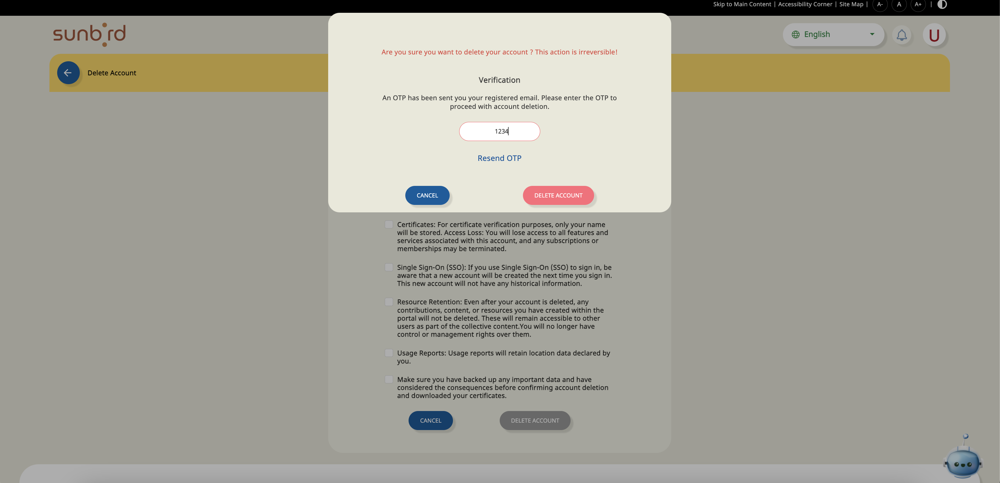

## Background:
This document outlines the process for deleting a user account from the Sunbird portal. The deletion process involves logging in to the Sunbird portal, navigating to the user's profile page, initiating the deletion process by clicking on the "Delete" button, confirming the deletion by checking checkboxes, and verifying OTP (One-Time Password) for security purposes.

 **Procedure:** 

1.  **Logging In:** 

* Open your web browser and navigate to the Sunbird portal login page.

* Enter your credentials (username and password) and click on the "Login" button to access your account.

1.  **Accessing Profile Page:** 

* After successful login, you will be redirected to the homepage of the Sunbird portal.

* Navigate to the user profile section. This can typically be accessed by clicking on your profile picture or username at the top right corner of the page.

* From the menu, select the "Profile" option to access your profile page.

1.  **Initiating Deletion Process:** 

* On the profile page, look for the option to delete your account. This is usually represented by a "Delete" button.

* Click on the "Delete" button to initiate the account deletion process.

1.  **Confirming Deletion:** 

* After clicking on the "Delete" button, you will be presented with a confirmation dialog box.

* Carefully read the information provided in the confirmation dialog box.

* Check the checkboxes to confirm that you understand the consequences of deleting your account.

* Click on “Delete“ account

1.  **Verifying OTP:** 

* As an additional security measure, Sunbird require you to verify your identity using OTP (One-Time Password).

* An OTP will be sent to your registered email address or mobile number.

* Retrieve the OTP from your email or mobile device and enter it into the verification field provided on the screen.

* Click on the "Delete Account" button to proceed.

* Once the OTP is successfully verified, a deletion of the account is initiated

1.  **Post-Deletion Actions:** 

* After the deletion, you will be logged out of the Sunbird portal.

* Any associated data or content linked to your account may be permanently removed.

 **Note:** 

* Please exercise caution while deleting your account as this action is irreversible and may result in loss of data.

* Ensure that you have retrieved any important information or data associated with your account before proceeding with the deletion process.

This document provides a step-by-step guide for users to delete their accounts from the Sunbird portal. If you encounter any issues or require further assistance, please reach out to the Sunbird support team for help.

*****

[[category.storage-team]] 
[[category.confluence]] 
