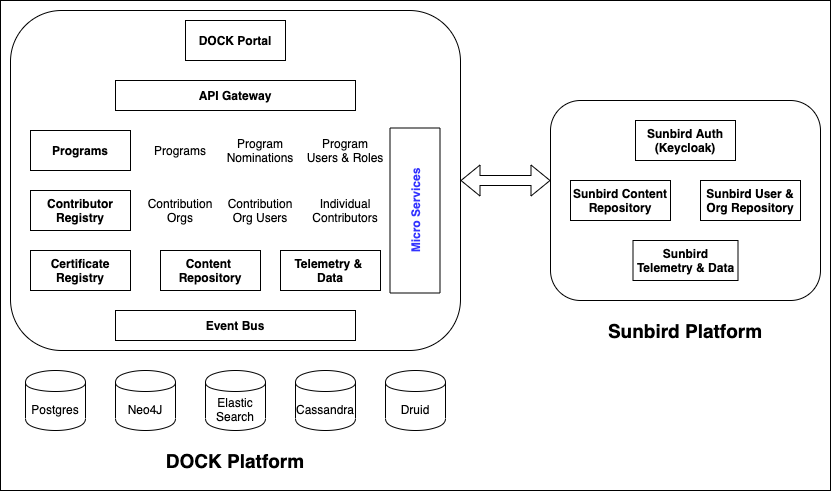
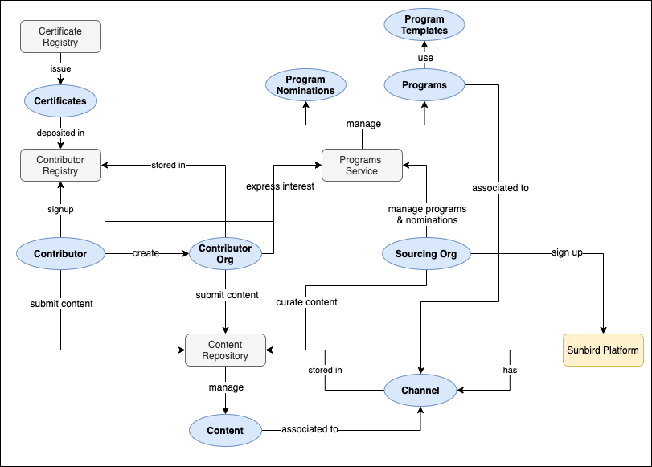
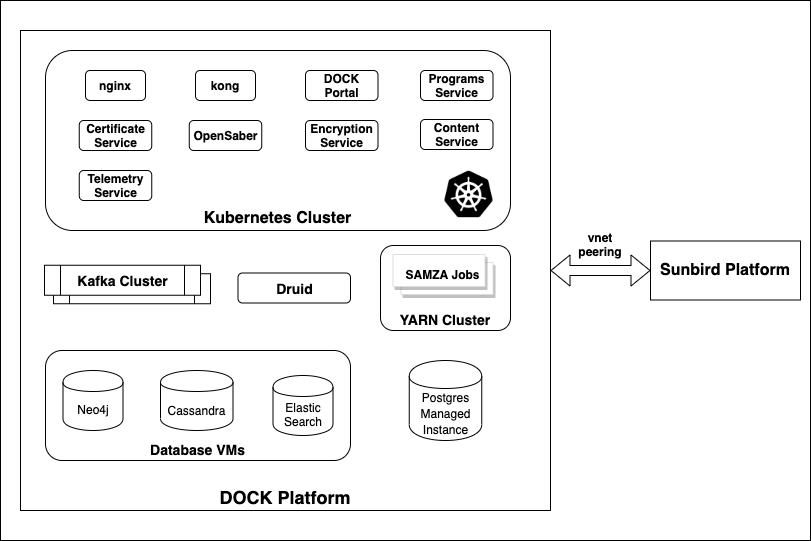

## Introduction
Although content creation and curation capability exists in Sunbird platform, it is not recommended to open content creation in Sunbird to a large number of people. This is mainly to avoid irrelevant and large quantity of content in the platform’s content repository which is also serving the users consuming the content. It may lead to sub-optimal experience for users due to low quality of content or slowness in serving the content.

Thus, there is a need for a new platform which addresses the above concerns and provide the following capabilities:

* Organise & coordinate contribution of content in an open way from any individual or organisation

* Organise & coordinate contribution from a curated group of individuals 

* Organise & coordinate discovering, modifying/translating & linking existing content on the platform

This document details the architecture of this new platform, named as DOCK platform, its key components and entities. Following are the  **_key premises_**  of the DOCK platform architecture:

* Enable separation of creation & consumption content repositories for a Sunbird instance.

* Maximise reuse of Sunbird components - either as a binary library or as a runtime service.

* Loosely coupled with Sunbird platform - though initial version has dependencies on an existing Sunbird platform, the architecture will enable usage of this platform for sourcing content by non-sunbird platforms also.

 **Terminology:** 

* Sourcing Org

* Program

* Contribution Org

* Individual Contributor

## Key Interactions (use cases)

* Publish Content Needs by Sourcing Org

* Discover Content Needs by contributing org 

* Discover Content Needs by individual contributor

* Express Interest for Contribution by contributor org

* Express Interest for Contribution by individual contributor

* Shortlist Contributors by sourcing org

* Submit Content to a Program by contributing org

* Submit Content to a Program by individual contributor

* Curate Contributed Content and Publish by sourcing org

* Reward/recognition to contributors based on curated content and/or content usage

* View usage data of content

* View and Manage contributor profiles

## Logical View
DOCK PortalDOCK Portal is the web interface for accessing the DOCK platform functionality. This portal uses micro-services of Sunbird & DOCK platform to create a unified experience for the users. It uses the following Sunbird platform services:

* Sunbird platform’s keycloak for user authentication. This enables users of the sunbird platform to use their existing user accounts to login to DOCK platform and vice versa. 

* Sunbird user & org repository for user management and identifying sourcing orgs & its users.

* Sunbird content repository to search for text books in Sunbird and copy them to DOCK platform while creating programs.

Programs ServiceThis is a new micro-service which provides services for creating programs, managing nominations and assigning users & roles for a program. 

Contributor RegistryContributor registry uses OpenSaber for managing contribution orgs, contribution org users and individual contributor profiles. OpenSaber instance is configured with schemas for the entities - contributor org, contributor users and user-org association.

Though all contributors on DOCK platform are created as users in the Sunbird platform, this registry is required to store additional data about the contributors. This additional data  comprises of contributor org or user preferences, contribution & org associations, summary data like content contribution counts, rewards & recognition data.

Certificate RegistryAn instance of Sunbird certificate registry is deployed within DOCK platform for issuing and storing digital certificates issued to contribution orgs and users. The certificate reference is stored within the contribution registry against the contribution org or user profile.

Content RepositoryAn instance of Sunbird content repository is deployed in DOCK platform for managing all types of content (collection, resources, questions & question sets). This repository is configured with a customised schema for content to store additional attributes related to contribution. 

Telemetry & DataSunbird telemetry service and analytics module is used for storing and processing the telemetry generated by DOCK portal and other micro-services in the DOCK platform. Instead of the complete pipeline, telemetry service in DOCK platform is configured to directly push the telemetry events to Druid. In addition, this telemetry service also receives the SUMMARY events from Sunbird platform on a scheduled interval to update the content usage data in DOCK’s content repository.

## Process View & Entities
 **Channel** Channel entity is used to store the details of the platform that is using DOCK platform for sourcing content. For example, DIKSHA and Shikshalokam will be two channels in the DOCK platform. There could be multiple sourcing orgs within each channel. All programs, collections & content created will be associated with the respective channel.

Sourcing OrgSourcing Org is a tenant within the platform that is sourcing content on the DOCK platform. There is no separate entity created in DOCK platform for sourcing orgs. DOCK portal connects to the corresponding Sunbird instance to fetch the details of sourcing org and its users.

ContributorContributors are users who signup in DOCK platform for contributing content. All contributors signed up in DOCK platform will also automatically get access to the associated Sunbird platform and also, any user in the associated sunbird platform can also login to DOCK platform as contributor (even sourcing org users can login as contributors to the DOCK platform). Contributor registry manages the contribution profile of all the contributors.

Contributor OrgContributors can create organisations in DOCK platform and contribute content as an organisation. These organisations are stored in the contribution registry of DOCK platform. DOCK platform provides the ability to manage users within a contributor org, i.e. add new users, assign roles, remove users, etc.

Program & Program TemplatesSourcing org admins can create programs to publish their needs. A program consists of basic information like name, description, etc; schedule of the program like nomination dates, contribution dates, etc; and scope of the program like the list of content types, list of collections, etc. Programs are created using program templates which can be created with pre-defined configuration for different types of programs like ETB sourcing program, TPD sourcing program, etc.

Program NominationsContributors can express interest, i.e. create a program nomination, to contribute content for a program. Contributors can create the program nomination as an individual or on behalf of the contributor org. While creating a nomination, contributor can select list of content types & collections in the program and optionally upload sample content. These details will be stored as part of the nomination. Sourcing org admins can review the nomination details and either accept/reject the nomination.

ContentContent entity is used to store the collections for which a program is created and the content contributed for programs. All content are associated with the program and channel for which they are created. Content entities also have their own publish lifecycle.

CertificatesThese are digital certificates that are awarded to contributors or contributor orgs based on different criteria - like number of content contributed by them that is accepted by the sourcing org or the usage of content contributed by them. Certificates are a generic and can also be awarded to content or any other entity in the platform.

## Deployment View

## Content and Data copy

* Copy collections from Sunbird to DOCK

* Copy content from DOCK to Sunbird

* Get usage data from Sunbird

## Data Model
Program

| program_id | text | 
| channel | text | 
| config | JSON | 
| default_roles | list of roles that assigned by default to all users | 
| description | text | 
| template_id | text | 
| startdate | timestamp | 
| enddate | timestamp | 
| nomination_enddate | timestamp | 
| image_path | text | 
| name | text | 
| rootorg_id | text | 
| rootorg_name | text | 
| slug | text | 
| status | text - draft, live, closed, retired | 
| content_types | list<text> | 
| recognition_text | text | 
| shortlisting_enddate | timestamp | 
| content_submission_enddate | timestamp | 
| roleMapping | {"reviewer": \[user_ids],"contributor": \[user_ids]}, | 

Program Nominations

| program_id | text | 
| user_id | text | 
| organisation_id | text | 
| status | text - initiated, pending, approved, rejected | 
| content_types | list<text> | 
| collection_ids | list<text> | 
| feedback | text | 
| roleMapping | {"reviewer": \[user_ids],"contributor": \[user_ids]}, | 

Program Certificates

| program_id | text | 
| certificate_criteria | JSON | 
| certificate_template_id | text | 
| issuer_details | JSON | 
| certificate_name | text | 
| certificate_desc | text | 
| status | text - draft, published | 

Contributor User Schema

| identifier | uuid | 
| firstName | Mirrored from Sunbird | 
| lastName | Mirrored from Sunbird | 
| userId | Sunbird User Id | 
| channel | Channel id | 
| enrolledDate |  | 
| certificates | list of certificates | 
| totalContributedContent |  | 
| totalAcceptedContent |  | 
| description |  | 
| website |  | 
| contentTypes |  | 
| board |  | 
| medium |  | 
| gradeLevel |  | 
| subject |  | 
| status |  | 

Contributor Org Schema

| identifier |  | 
| name |  | 
| description |  | 
| website |  | 
| contentTypes |  | 
| board |  | 
| medium |  | 
| gradeLevel |  | 
| subject |  | 
| totalContributedContent |  | 
| totalAcceptedContent |  | 
| createdBy |  | 
| status |  | 

Contributor User-Org Association

| userid |  | 
| orgId |  | 
| roles | admin, user | 

Channel SchemaCollection SchemaContent Schema
## API Specification
Program APIs
* Read Program - {{host}}/api/program/v1/read/<program_id>

* Create Program - {{host}}/api/program/v1/create

* Update Program - {{host}}/api/program/v1/update

* Close Program - {{host}}/api/program/v1/close

* Delete Program - {{host}}/api/program/v1/delete

* Search Programs - {{host}}/api/program/v1/search

* Create Nomination - {{host}}/api/program/v1/nomination/create

* Update Nomination - {{host}}/api/program/v1/nomination/update

* Accept Nomination - {{host}}/api/program/v1/nomination/accept

* Reject Nomination - {{host}}/api/program/v1/nomination/reject

* Get Nomination Details - {{host}}/api/program/v1/nomination/read

* List Nominations - {{host}}/api/program/v1/nomination/list

* Remove Nomination - {{host}}/api/program/v1/nomination/remove

* Link Collections to program - {{host}}/api/program/v1/collection/link

* List content types in program - {{host}}/api/program/v1/contenttypes/list

* List collections in program - {{host}}/api/program/v1/collection/list

Contributor Registry APIs
* OpenSaber APIs - [http://docs.opensaber.io/api-specs.html](http://docs.opensaber.io/api-specs.html)

* Entity Types - User, Org, User_Org

## Telemetry Specification
Telemetry Envelope

|  |  |  |  **Sourcing Pages**  |  **Contribution Pages**  | 
| actor | id |  | user_id | user_id | 
|  | type |  | USER | USER | 
| context | channel |  | Sunbird_tenant_id | DOCK_Local_Channel | 
|  | pdata | id | dev.dock.portal | dev.dock.portal | 
|  |  | pid | sourcing-portal | creation-portal | 
|  |  | ver | 1.0.0 | 1.0.0 | 
|  | env |  | sourcing-portal | creation-portal | 
|  | sid |  | portal_SID | portal_SID | 
|  | did |  | deviceID | deviceID | 
|  | cdata | type | Program_ID | Program_ID, Organisation_id | 
|  |  | id | Program | Program, organisation | 

*****

[[category.storage-team]] 
[[category.confluence]] 
