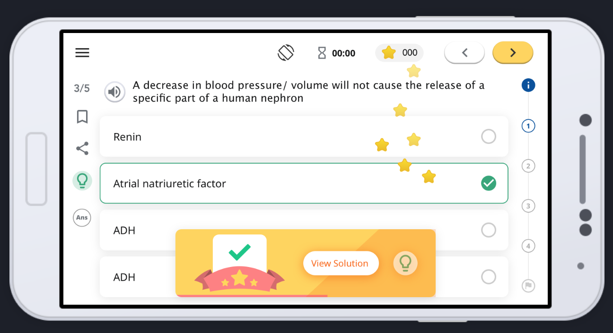

# Sunbird inQuiry
Sunbird inQuiry is a building block, open sourced under MIT license, that enables setting up of question banks that can contain questions and question sets for various use cases such as practice, assessment, quiz, worksheet, survey, observations and many more. 

## Key capabilities of inQuiry:

1.  **Creation:**  of question(s) and question set(s) as per an interoperable QuML spec either using the question set editor, by bulk upload of questions or API .

1.  **Configuration** : of the question set behaviour. For ex., randomize the questions from the question bank, limit the number of attempts, set timer etc.

1.  **Tagging** : of question(s) and question set(s) with meaningful metadata useful for discovery and analysis.

1.  **Publish:** Curation and publishing of question(s) and question set(s). Publish workflow also ensures that the published assets can be played in both offline & online modes.

1.  **Play** : The player for question set(s) is embeddable, configurable and extendable.

1.  **Data Emission** :

    1. Emission of question response and result data using an interoperable specification (QuML)

    1. Emission of question set result and summary data using an interoperable specification (QuML)

    1. The editor and player emit useful telemetry to make meaning of the user's action, which can be used to generate reports and derive insights.

    

As part of GSoC, we are looking at the below ideas for contribution. However, we’d also encourage the contributors to engage with the inQuiry community to propose their own original ideas for contribution. 

# Project ideas

## 1. Learners would feel motivated if they earned some rewards when answering questions
As learners play a quiz, worksheet, or practice question set, they would feel motivated to keep on attempting questions if they earned some rewards resulting in instant gratification. Sunbird inQuiry provides a question set player which can be enhanced to provide these instant gratification. Check screenshot below

This would require us to build a configurable points mechanism which can be enabled/disabled for different categories of the question set. The points can be relative to the marks earned by the user.

Difficulty level: medium

Prerequisite:

1. Typescript

1. Angular 9

Mentors: 

Experience level: Student and/or Skilled professionals, both are welcome.

Expected size of the project: 175 hours

## 2. More question types to make learning more fun
Learning can be fun and engaging if learners are to answer various types of questions such as fill in the blanks, multiple choice questions (mcq), match & classify, and many more interactive questions. The current capability of inQuiry supports only mcq and subjective questions and contributors can enhance this capability to support a wide variety of question types. 

Expected outcome: To have atleast one new type of question to be contributed.

Difficulty level: hard

Prerequisite:

1. Typescript

1. Angular 9

1. Java

1. Scala

Mentors: 

Experience level: Student and/or Skilled professionals, both are welcome.

Expected size of the project: 350 hours

## 3. Shuffle answers to increase the efficacy of learning
Randomization of questions in a question set and shuffling of answers are some of the ways to ensure that learners are prevented from gaming the assessment or quiz. inQuiry has the capability to randomize questions within a question set but does not yet enable creators to shuffle answers within each question. 

Difficulty level: medium

Prerequisite:

1. Typescript

1. Angular 9

1. Java

1. Scala

Mentors: 

Experience level: Student and/or Skilled professionals, both are welcome.

Expected size of the project: 175 hours

## 4. Question set completion rules
As part of this idea, we would like question set creators to be able to define certain question set consumption rules for the learners. For example.,a learner can view the next question only after answering the current question or if a question set has multiple sections learners can proceed to the next section only after completing the current section. 

Difficulty level: hard

Prerequisite:

1. Typescript

1. Angular 9

1. Java

1. Scala

Mentors: 

Experience level: Student and/or Skilled professionals, both are welcome.

Expected size of the project: 350 hours

## What we’d want to know about you?
Please include the following in your application: 

* A descriptive title and information about your proposed project. This should be fairly detailed and include a timeline.

* A brief CV

* Link to a code contribution you have made in the past (usually this is a link to a pull request). 

* Is there anything that you’ll be studying or working on whilst working alongside us?

Read more for contribution guidelines

[[Contributors to Sunbird - Getting Started - EkStep Process Knowledge Repository - Confluence (atlassian.net)|Contributors-to-Sunbird---Getting-Started]]

[[Sunbird Contributions Process - EkStep Process Knowledge Repository - Confluence (atlassian.net)|Sunbird-Contributions-Process]]

*****

[[category.storage-team]] 
[[category.confluence]] 
