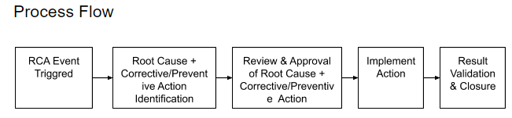

# Process General Details

| Root Cause Analysis (RCA) Process | 
| The RCA process is a quality management tool. It is the process of defining, understanding and solving a problem. It has a two-fold purpose: 1) to identify the real cause of a non-conformance or quality problem 2) to suggest changes to permanently eliminate the problem through process improvements. By doing the RCA, it is possible to identify the precise point in the causal chain where corrective action or intervention prevents the non-conformance from occurring. | 
| Root Cause and its corrective action identification process will be initiated for specific events which are listed below. The initiation of RCA process is not limited only for these events but can be initiated of other events by notifying the Solutions Program Management team about the event and its impact. The below events will mandatorily trigger a RCA and identification of corrective actions either to improve the product or to improve the delivery process 
1. Any P1/S1 Bug identified in production
1. Recurring defects across the release testing (twice or more)
1. Recurring Bugs in production irrespective of severity (Twice or more)
1. Deployment issue
1. Metrics missing the LCL & UCL
1. Adhoc items e.g Failed Migration, Environment unavailability etc.

RCA will mainly focus on identifying the preventive actions i.e the actions that will help to reduce or remove the potential of similar issue to happen again. Some of the above trigger will need a corrective action to fix the issue and will call for a RCA to identify the preventive action. | 
| Solution Program Management, Release Manager, Product Manager, Tech Manager, Tech Leads | 
| The end of a release cycle triggers the start of the RCA process. The RCA Meeting for P1s will be held once a month on the 4th Thursday of the month. The acceptance and implementation of the corrective/preventive actions that have devolved mark the end of the RCA process. | 
| The RCA process has 5 stages.  1) RCA Event Trigger  2) Identify Root Cause and Corrective Action  3) Review and Approve Root Cause and Corrective Action  4) Implement Action  5) Validate Results and Close | 
|  --- | 
|  --- | 
|  --- | 
|  --- | 
|  --- | 
|  --- | 
| Root Cause Analysis (RCA) Process | 
| The RCA process is a quality management tool. It is the process of defining, understanding and solving a problem. It has a two-fold purpose: 1) to identify the real cause of a non-conformance or quality problem 2) to suggest changes to permanently eliminate the problem through process improvements. By doing the RCA, it is possible to identify the precise point in the causal chain where corrective action or intervention prevents the non-conformance from occurring. | 
| Root Cause and its corrective action identification process will be initiated for specific events which are listed below. The initiation of RCA process is not limited only for these events but can be initiated of other events by notifying the Solutions Program Management team about the event and its impact. The below events will mandatorily trigger a RCA and identification of corrective actions either to improve the product or to improve the delivery process 
1. Any P1/S1 Bug identified in production
1. Recurring defects across the release testing (twice or more)
1. Recurring Bugs in production irrespective of severity (Twice or more)
1. Deployment issue
1. Metrics missing the LCL & UCL
1. Adhoc items e.g Failed Migration, Environment unavailability etc.

RCA will mainly focus on identifying the preventive actions i.e the actions that will help to reduce or remove the potential of similar issue to happen again. Some of the above trigger will need a corrective action to fix the issue and will call for a RCA to identify the preventive action. | 
| Solution Program Management, Release Manager, Product Manager, Tech Manager, Tech Leads | 
| The end of a release cycle triggers the start of the RCA process. The RCA Meeting for P1s will be held once a month on the 4th Thursday of the month. The acceptance and implementation of the corrective/preventive actions that have devolved mark the end of the RCA process. | 
| The RCA process has 5 stages.  1) RCA Event Trigger  2) Identify Root Cause and Corrective Action  3) Review and Approve Root Cause and Corrective Action  4) Implement Action  5) Validate Results and Close | 

# Process Diagram

| 
1. Any P1/S1 Bug identified in production
1. Recurring defects across the release testing (twice or more)
1. Recurring Bugs in production irrespective of severity (Twice or more)
1. Deployment issue
1. Metrics missing the LCL & UCL
1. Adhoc items e.g Failed Migration, Environment unavailability etc.

 | 
| 1. List of Corrective/Preventive Action | 
| Solution Program Management, Release Manager, Product Manager, Tech Manager, Tech Leads | 
| All the stakeholder meet with a primary goal to analyze problems or events to identify:<ul><li>What happened</li><li>How it happened</li><li>Why it happened…so that</li><li>Actions for preventing re occurrence are developed</li></ul> | 
|  --- | 
|  --- | 
|  --- | 
|  --- | 
| 
1. Any P1/S1 Bug identified in production
1. Recurring defects across the release testing (twice or more)
1. Recurring Bugs in production irrespective of severity (Twice or more)
1. Deployment issue
1. Metrics missing the LCL & UCL
1. Adhoc items e.g Failed Migration, Environment unavailability etc.

 | 
| 1. List of Corrective/Preventive Action | 
| Solution Program Management, Release Manager, Product Manager, Tech Manager, Tech Leads | 
| All the stakeholder meet with a primary goal to analyze problems or events to identify:<ul><li>What happened</li><li>How it happened</li><li>Why it happened…so that</li><li>Actions for preventing re occurrence are developed</li></ul> | 

# Exceptions 
 _No exceptions to the process_ 

# Process Metrics
 _No metrics for the process_ 

*****

[[category.storage-team]] 
[[category.confluence]] 
