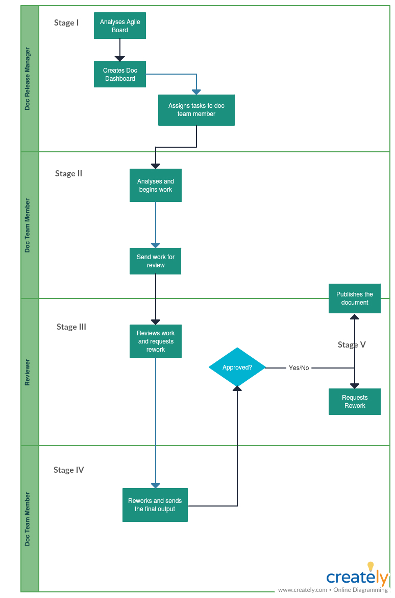

# Process General Details

| Release Documentation Process | 
| The release documentation process involves creating, maintaining and publishing documentation for external user consumption, for every version of the solution released to the client. Documentation delivery is part of the solution delivery. It follows the same delivery cadence. Documentation deliverables are defined by the scope of the release. Documentation for release delivery typically entails creating and publishing the following artefacts:<ul><li>Release Notes

</li><li>End-user documents (How-To Documents published on the websites, pdfs, videos)

</li><li>Developer Documents

</li></ul> | 
| As part of the Release Documentation process, the team lead identifies the Jira tickets with stories and enhancements being delivered for a particular release. In other words, the team lead identifies the release delivery scope. After the release scope is frozen, the team lead analyzes the relevant stories or tasks and defines the documentation scope for the release. After a careful analysis, tasks are created, effort analysed and work is assigned to the respective team members. Each assignee takes up the task and delivers as per the schedule. After sign-off, the relevant documents are published to the relevant website.The process does not take into account interrupts or scope creeps after the release scope is frozen.  | 
| Product Manager, Tech Manager, Implementation Team, Documentation Team | 
| The release documentation cycle begins with each release cycle and ends when the release is pushed to production (live) | 
| Release Documentation has 5 stages: 1) Requirement analysis2) Planning and estimation3) Document creation4) Review & Rework5) Publish | 
|  --- | 
|  --- | 
|  --- | 
|  --- | 
|  --- | 
|  --- | 
| Release Documentation Process | 
| The release documentation process involves creating, maintaining and publishing documentation for external user consumption, for every version of the solution released to the client. Documentation delivery is part of the solution delivery. It follows the same delivery cadence. Documentation deliverables are defined by the scope of the release. Documentation for release delivery typically entails creating and publishing the following artefacts:<ul><li>Release Notes

</li><li>End-user documents (How-To Documents published on the websites, pdfs, videos)

</li><li>Developer Documents

</li></ul> | 
| As part of the Release Documentation process, the team lead identifies the Jira tickets with stories and enhancements being delivered for a particular release. In other words, the team lead identifies the release delivery scope. After the release scope is frozen, the team lead analyzes the relevant stories or tasks and defines the documentation scope for the release. After a careful analysis, tasks are created, effort analysed and work is assigned to the respective team members. Each assignee takes up the task and delivers as per the schedule. After sign-off, the relevant documents are published to the relevant website.The process does not take into account interrupts or scope creeps after the release scope is frozen.  | 
| Product Manager, Tech Manager, Implementation Team, Documentation Team | 
| The release documentation cycle begins with each release cycle and ends when the release is pushed to production (live) | 
| Release Documentation has 5 stages: 1) Requirement analysis2) Planning and estimation3) Document creation4) Review & Rework5) Publish | 

# Process Diagram

# Requirement Analysis

| Final scoped items for the release | 
| Documentation dashboard for the release | 
| Doc Release Manager  | 
| Analyse the items scoped for the release and plan documentation tasks | 
|  --- | 
|  --- | 
|  --- | 
|  --- | 
| Final scoped items for the release | 
| Documentation dashboard for the release | 
| Doc Release Manager  | 
| Analyse the items scoped for the release and plan documentation tasks | 

# Planning and Estimation

| Documentation dashboard for the release | 
| Time and assignee set against each task in the created dashboard | 
| Doc Release Manager  | 
| Doc release manager assigns each ticket to the doc team members | 
|  --- | 
|  --- | 
|  --- | 
|  --- | 
| Documentation dashboard for the release | 
| Time and assignee set against each task in the created dashboard | 
| Doc Release Manager  | 
| Doc release manager assigns each ticket to the doc team members | 

# Document Creation

| List of tasks assigned | 
| First draft for review | 
| Doc team members, PMs, Tech Managers  | 
| Doc member works on the tasks assigned. In case of queries, has conversations with relevant PMs or Tech Managers. | 
|  --- | 
|  --- | 
|  --- | 
|  --- | 
| List of tasks assigned | 
| First draft for review | 
| Doc team members, PMs, Tech Managers  | 
| Doc member works on the tasks assigned. In case of queries, has conversations with relevant PMs or Tech Managers. | 

# Review and Rework

| Draft of the task assigned | 
| Reworked draft | 
| Doc team members, PMs, Tech Managers | 
| The draft is reviewed for accuracy and completeness by the PM (for product functionality) or the Tech Manager (for technical accuracy) or the doc team member (for a language edit) and sent back to the author to incorporate review comments | 
|  --- | 
|  --- | 
|  --- | 
|  --- | 
| Draft of the task assigned | 
| Reworked draft | 
| Doc team members, PMs, Tech Managers | 
| The draft is reviewed for accuracy and completeness by the PM (for product functionality) or the Tech Manager (for technical accuracy) or the doc team member (for a language edit) and sent back to the author to incorporate review comments | 

# Publish

| Reworked drafts | 
| Final doc output | 
| Doc team members | 
| Doc release manager approves and publishes the document | 
|  --- | 
|  --- | 
|  --- | 
|  --- | 
| Reworked drafts | 
| Final doc output | 
| Doc team members | 
| Doc release manager approves and publishes the document | 

# Exceptions 
No Exceptions

# Process Metrics
The process does not have any metrics as on date.

*****

[[category.storage-team]] 
[[category.confluence]] 
