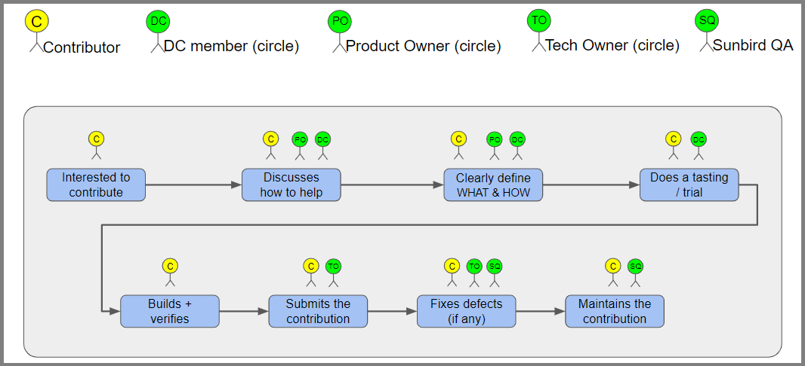

# High level flow of the contributions process
If you are interested in contributing to Sunbird, thank you for taking the first step! This document will help you understand what to do and what to expect in your journey. This is a living document, so please feel free to add any suggestions/comments you have on this  **discussion thread**  here.

In this document, we cover what to expect at each of the above stages, and frequently asked questions therein.

* [High level flow of the contributions process](#high-level-flow-of-the-contributions-process)
* [Interested to contribute](#interested-to-contribute)
  * [Open list of requirements](#open-list-of-requirements)
  * [Suggest a new enhancement](#suggest-a-new-enhancement)
* [Discuss how to help](#discuss-how-to-help)
* [Clearly define WHAT & HOW](#clearly-define-what-&-how)

# Interested to contribute
You likely came across Sunbird within a video or article that informed you about how we’re building an open source stack which enables federated management of educational resources for an audience with the diversity of a large nation.

If you wish to support this initiative, you may join us as a contributing organization. We are looking for partners who can commit to co-building and maintaining Sunbird alongside us. Information on the current Sunbird architecture and our building principles are on the Sunbird website for your reference.

There are atleast two ways in which you can choose to help:

## Open list of requirements
We have a list of fleshed out product requirements and open bugs that are great candidates for contributions for different levels of expertise at  **this link** . If any of these are of interest to you, you may move to  **Does a trial** .

## Suggest a new enhancement
If you wish to add a capability not listed here, you may submit details of your suggested enhancement  **here** . Once submitted, the Sunbird team will respond to you within seven working days.

The criteria, for further engagement, would include the following parameters:

* Is the enhancement generic enough to apply to multiple scenarios?

* Is the enhancement configurable by adopters of Sunbird, demonstrating flexibility?

* Will this enhancement impact a significant portion of the current userbase?

* Is there a commitment by the contributor to maintain this enhancement for a reasonable timeframe beyond the contribution?

* More…

 **Outcome at this stage** : A shared understanding of how the Sunbird team and the contributor team can work together.

# Discuss how to help
After deciding to take the engagement forward, the Sunbird team will initiate a discussion on the  **discussion forums**  introducing you to relevant product and tech leads, who will help you with refining the high level design and capabilities of the enhancement, so it’s in line with the architecture and product principles of the Sunbird suite.

This includes working together to identify where to enhance the existing components of Sunbird (or create new components if needed), and arriving at a high level consensus on the approach to take. As far as possible, these interactions will happen on the forums in an asynchronous manner. Synchronous communication will happen only as a last option, and the conversation will be recorded for sharing on the public forums, in line with our intent of being fully transparent and building a knowledge base.

 **Outcome at this stage** : A shared understanding of the high level design of the enhancement(s).

# Clearly define WHAT & HOW
Once we have a shared understanding of the high level design, the contributing team will need to request edit access on our open-source project on the Atlassian suite (Jira, Confluence) ( **here** ). You should then create Product Requirement Documents (PRDs) and epics and stories in Jira. A primer for how to create documents in Confluence, and epics and stories in Jira can be found in  **this document** . We do this so that future contributors understand the history of how specific features have been built.

A few samples of enhancements, with their PRDs, epics and stories can be found here:

* Adding question types in the content player:  **PRD** ,  **Epic** 

* Adding new skins to the consumption clients:  **PRD** ,  **Epic** 

* Adding a new service to the Knowledge platform:  **PRD** ,  **Epic** 

Once the PRD and Jira epics/stories are done, the product lead and tech lead will review it to confirm an aligned approach with the Sunbird principles. Once done, the status of the tickets will be changed, and you may begin the development activities.

 **Outcome at this stage** : Clear detailing of the enhancement from a tech design and product lens. Clear breakup of activity into atomic user stories.

*****

[[category.storage-team]] 
[[category.confluence]] 
