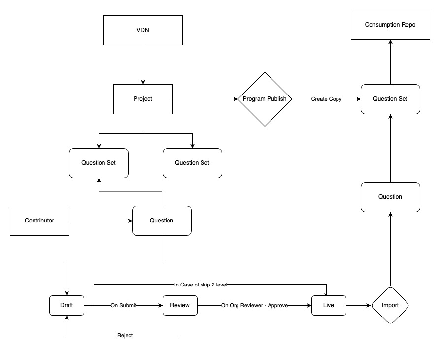

Use case - Question paperState SCERT will source the question papers for conducting SAT, Regular interval (Fortnightly, Monthly, etc) Quiz and tests on Diksha. To create the question paper, the state will use Vidyadaan (Prashnavali) to create the question paper (with 2 level review).

 _Offline usage of question paper_  - Print a PDF and share with District Officers who further share with the Schools to conduct the exam. \[This is not possible due to the physical schools being shut due to pandemic]

 _Online usage of question paper_  - Due to the 2nd wave of the pandemic, the opening of schools is for a physical test is not foreseeable. The states are looking to conduct teaching and learning activities online. And also conduct tests online.

* There are State Education Applications - which will 

    * Get the Question paper from Diksha 

    * Show it to students

    * Generate and maintain the student’s performance report

    * Share usage telemetry back to the student

    
* State SCERT Administrators who will have access to view and modify the question paper or its properties on Diksha

    * Update/Edit any question in the question paper

    * Update different property/metadata of the question paper 

    

Key requirements:

1. Questions paper can not be publicly available - They need to be shared only with the users who have the authentication and authorization to view the question paper.

1. Question paper needs to be sequenced. Have a Go-live/ Start date and a Live-Until/ End date. These are required to ensure that the Question paper can be prepared and published beforehand and will only be shown to students only after the start date and until the end date.

1. If a question paper or any of its metadata is updated. It should immediately be reflected for the students who refresh/request the question paper after the update is made.

User Journey:

1. Rohan a student of 5th Grade in Haryana opens the State education app (Avsar). 

1. He sees a section to take the test. In this section, he views all the tests that are to be taken by all the 5th-grade students today. 

1. He clicks on Take Test, to begin his test. He completes the test on the state app digitally.

1. Once the test is completed, his performance report is generated and stored in his student profile, This student profile is visible to Rohan and his teachers.

What will it take to achieve it:

Approach 1:

1. Create a question paper on Sourcing(Vidyadaan) and Published on consumption (Diksha) - With private visibility - meaning that only authorized users can view it on consumption.

1. Authorized Applications make and authenticated API calls get the Content from Diksha that is Private(not visible/ available publicly)

1. If the Applications have permission to view the question paper and the date on which the request is made lies between the start/end date of the question paper. They get the question paper details.

Journey of a question paper after the exam is done.

1. The state can choose to make the question paper visible to the students as part of an additional resource for practice. 

    * A student can go to Diksha and view past question papers

    * A student can go to state application and view past question papers (State application will make an API call to get this data from Diksha)

    
1. There can also be cases when a Public question paper is required to be made private or be unpublished 

    * If the content is made private - it will stop being publicly available;  be visible to authorized users only

    * If the content is unpublished - it will be made visible only to the Sourcing admin and no one else

    

Scope:

Immediate: In the first version we are looking to use:

 _Target Object:_  Question paper collection;  _Target content:_  Exam Question

Near Future: After migration of Prashanvali to QuML 1.0 from 0.5 

 _Target Object_ : Question Set;  _Target content:_  Questions

The behavior of the question paper will remain the same as above.

Future: The same logic of private can be applied to any type of content that is created on Diksha

– An initial draft; (open to suggestion for modifications)

Proposed Screens for Setting and editing visibility: (For the initial discussion)

Defining Visibility during project creation

Design Flow:[https://docs.google.com/presentation/d/12JW58Iokn-3IdwifUeWab8F8vPC8HFHqZjkbERtwsLc/edit?usp=sharing](https://docs.google.com/presentation/d/12JW58Iokn-3IdwifUeWab8F8vPC8HFHqZjkbERtwsLc/edit?usp=sharing)

 **Tech Implementation**  **Approach 1:** 

1.  **Publish Project** 

    1. In a published project, the status of QuestionSets remains draft.

    1. In the QuestionSet, questions will be:    

    1. Added and submitted by Contributors(status: Draft, but Review Pending ),

    1. Reviewed by ContributorOrg reviewer(status: Live but Approval pending) and then

    1. Approved and published by SourcingOrg reviewer(status: Live but Approved).

    
    1. For QuestionSets having all approved questions, we’ll publish the QuestionSet on click of button(Publish Question Set) which will be enabled on the basis of config we’ll pass to category definition API.

    1. An existing key publishQuestionset will be used in category definition which will have boolean values.

    1. API: category/definition/v1/read

    
    1. On click of button(Publish Question Set), we’ll hit publish API so the status of QuestionSets will become live.

    1. API : questionset/v1/publish/do_id

    It’s an Async API.

    

    
1.  **Adding Import Button on TOC** 

    1. After having the status of QuestionSet as live, will show a button “Import QuestionSet” to import it on Ed Portal.

    1. This will be enabled on the basis of the category definition config we used for the button(Publish Question Set) in 1(D).

    1. On click of the button(Import QuestionSet) we’ll hit the import API.

     API: questionset/v1/import

    

    

 **Pros** : Use of existing API

 **Cons** : Existing API only allows the QuestionSet having all approved questions

 **Open questions:** 

1. As the publish QuestionSet API is Async, how will we show the Import QuestionSet button.

1. If the publish QuestionSet API fails, what shall we show there or how should we handle this?

 **Approach 2: ** 

1.  **Importing QuestionSet on Ed Portal** 

    1. At the time of publishing a project by SourcingOrg Admin, a copy of the QuestionSets will be created at Ed portal as well using import QuestionSet API(New).

    1. Import QuestionSet API will make a copy of QuestionSet having a common key “originalPath” to define relation/reference between both the QuestionSets i.e; original and cloned.

    
    1. Questions will be added by contributor, reviewed by ContributorOrg reviewer and then SourcingOrg reviewer i.e; complete question journey upto approval pending will be on Vdn portal only.

    
1.  **Importing Questions on Ed** 

    1. At the time of approval from SourcingOrg Admin/reviewer the question will get directly published at Vdn portal and imported at Ed Portal using import Question API(New).

    1. Import question API will make a copy of approved questions from Vdn portal and import them on Ed portal.

    
    1. originalPath key will be helpful in adding the approved questions in the correct QuestionSet.

    

 **Requirements: 2 New API** 

1. To import QuestionSets of a project from the Vidyadan portal to the Ed portal while publishing it.

1. To import all the approved questions to the imported project on Ed Portal.

 _*This document has been updated on 16th June, the comments might be outdated for an earlier version of this document._ 

*****

[[category.storage-team]] 
[[category.confluence]] 
