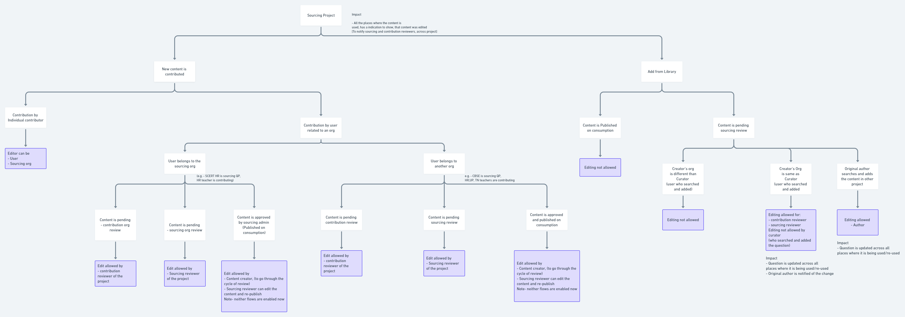

## Functional use case

### Overview
 **Question sets are being created using Prashnavali solution on VDN portal for the following programmatic use cases - ** 


1. Formative Assessment Question Papers (SAT)


1. Chapter linked Practice Worksheets/Higher Order Thinking (HOTs) question banks


1. Fortnightly practice quizzes


The **user personas**  of question contributors and reviewers across state education programs for the above mentioned use cases are as follows - 


* Contributors - Teachers, State Resource Group members (teachers again)


* Contribution Reviewers - DIET faculty members, senior teachers


* Sourcing Reviewers - State assessment cell members (Subject lecturers usually)


 **Problem Statement** 

The duration of curating question sets by users varies depending on the use case. It is 3/4 weeks for an assessment and 1/2 weeks only for generating practice material.

Since question contributors are teachers with sometimes low comfort with tech, minor mistakes in the question creation process such as spelling errors, grammatically incorrect sentences, incorrect order of sentences etc. are common and inevitable

Based on the data, about 30% of total questions created have had quality issues.

Of all the questions which have been created, the rejection rate of questions is lower than 10% because reviewers started reviewing questions offline before they were uploaded on the portal to avoid back and forth between them and the creators.

Since they could not make edits to the questions on the portal, they preferred reviewing questions offline initially to be able to meet project contribution timelines.

Practically, the cohort for contributors (teachers) for a particular project stay in for 4-6 months post which new contributors come in on rotation basis. So even with continuous training sessions with the contributors, we have not seen much delta in the errors and mistakes committed while creating/typing of questions.

Additionally sometimes, the guidelines on the format and structure of the question sets are revised at the state level due to which minor changes might need to be made to the question content.

For example - Question to be typed in Hindi and English both instead of just in 1 language,

 the order of the language to be sequenced such that Hindi is typed first followed by English version of the question.

For reviewers to have to send back the question for correction for minor changes which might not be related to pedagogy or quality,  **there is a high turnaround time.** 

This does not work well for curation of content for shorter projects and time can be optimized if the reviewer has access to make minor changes to the content or structure of the question.

 **Current Flow -** 

There are 3 actors involved in contribution of content to a question set when contributions are made within the same organization - 

Contributor, Contribution org reviewer and sourcing org reviewer


|  **Repo**  |  **Contributor**  |  **Contribution org reviewer**  |  **Sourcing org reviewer**  | 
| Sourcing Repo | Creator | Publisher |  | 
| Consumption Repo | Creator |  | Publisher | 


 **Accountability and ownership of content lies with the Creator as well as Publisher in the current workflow** 

For enabling editing of content by reviewers and publishers, an aspect of  **“Collaboration”**  is being introduced wherein - 


1. Contribution org reviewer as well as sourcing org reviewer will have access to make edits to a question


1. The reviewer who makes edits to the question will become co-authors of the question (the question will be attributed to them in the reports)


1. The reviewers will only be allowed to make edits to the question if it has been consented by the original contributor


 **Functional Solution - ** 

Following changes will be made in the existing workflow to enable editing of content if  **_new content_**  is contributed in a question set-


1.  **During Project creation** 


* While setting up a project, project admin will also get the option to select if content under that project will be allowed for review editssimilar to selection of levels of content review. Option to be made available -  **“Allow Edits to questions by reviewers”** 


 **Note - Once a project is published, project admin should not be allowed to update “Allow Review Edit option.** 

 **2. During Question Contribution ** 


* Upon submission of each question, the user is taken consent for allowing reviewers to make edits to their question


* A T&C condition is added during submission of each question mentioning - 

     _"I agree that by submitting / publishing this Content,_ 

 _I confirm that I am allowing my reviewer to make edits to the content and metadata of the content. I consent my reviewer to make changes, if any and publish the content thereafter._ 

    This consent is an  **“Optional” field** 


 **3. During Question Review ** 

a. By Contribution and Sourcing Reviewer - 


* Sees the list of all the questions in the question set


* On the details page of a question, contribution reviewer gets the option to →


* Accept,


* Reject,


* Request for change


*  **_Edit (new)_** 


b. Edit option is only available for the questions which are Pending Review (For cont. reviewer)/Pending approval (for sourcing reviewer) and for those questions where Contributor has given “Edit Access”


* When the user clicks on edit:


* The question editor opens


* Reviewer can make edits to all the fields which are editable to Contributor - 

    a.  **Editable fields** – Name, Question text, answer options, correct answer of a question, Chapters covered, Competency, Subject, Marks, Skills


     b.  **Non-Editable fields**  – Board, Medium of the audience, Class, Author, Copyright and Year


* On submission of question, user clicks on option - “Save changes and Submit for Approval” for Cont. reviewer and “Save changes and Publish” for sourcing reviewer


Following changes will be made in the existing workflow to enable editing of content if a content is picked from  **_“Add from Library”_** for a question set - 

 **Scenario 1 -**  When the user re-using content from library and the original author (contributor) of the content is from the same org


1.  **During Question Contribution ** 


* There will be no change in the flow. Contributor can select questions from the library and it gets listed in the question list view of question set.


2.  **During Question Review by Contributor Reviewer** 


* There will be no Edit provision for Cont. reviewer 


 **3. During Question Review by Contributor Reviewer** 

a. User has the option to click “Make a copy and Edit” in question list view

b. Once user clicks on this option copy workflow is triggered as follows - 


* Original Question created by the contributor will get auto-rejected from the question list


* A pop up message will come for Sourcing reviewer to add comments for rejection


* The rejected question is removed from question list view


* For the copied question, contributor name is changed to “sourcing reviewer’s name” and original contributor becomes the Co-Author of the question


* Reviewer can edit and submit the question for publishing.


 **The use cases which are out of scope from this feature for now are as follows - ** 


1. Editing of Content for a sourcing project when content is contributed by individual contributor


1. Editing of Content for a sourcing project when content is contributed by users from another organization


 **Open Questions - ** 


1. Decision on whether consent for content collaboration will be provided by contributor once per project/needs to be provided for each question


1. Does the name of the contributor in the question list view update to include the contribution reviewer/sourcing reviewer username if edits to a question are made by them ?


1. Every time edits to a question are made by a sourcing reviewer, is the question re-published/made live again on sourcing repo? Need to confirm editing of live questions is supported through APIs?


1. How is the ownership and attribution of a question maintained at the backend? 


Link to [Wireframes](https://docs.google.com/presentation/d/1JzSKL_GFqKiul4KLOOnuLXR6EqDImvpL/edit?usp=sharing&ouid=110522290077284485945&rtpof=true&sd=true) -  

Tree capturing options of question paper

[whimsical link](https://whimsical.com/prashnavali-4-3-J2tG6LZ6VfVVBDCjgfyWnZ)


 **Tech Implementation** 

 **Enabling editing:** 


* We’ll introduce a new variable  **enableReviewEdit**  in the environment file.


* The default value will be false.


 **Possible Values** : true/false

 **Cases:** 


*  **True** : The contributor can give the option to edit the question.


*  **False** : No editing will be allowed


 **Enable editing at the tenant level:** 

 **Approach 1:** 


* We’ll override this configuration via  **channel API.** 


 **Approach 2 (Final approach):** 


* We’ll override this configuration via category definition. 


 **Project**  **Detail Page (** [ **Slide 4** ](https://docs.google.com/presentation/d/1mKSiIQq44OKxz0l9hl132OqfLZt6HL9j/edit#slide=id.p4) **):** 


* based on  **enableReviewEdit** , will show allow edit option


 **APIs** :


* program/v1/read/do_id is used to read program detail


 **Question Contribution (** [ **Slide 5-6** ](https://docs.google.com/presentation/d/1mKSiIQq44OKxz0l9hl132OqfLZt6HL9j/edit#slide=id.p6) **)** :


* Contributor will get consent message while creating 


* A new key **isReviewerCollaborationEnabled** will be added in question schema.


 **Cases:** 


*  **True** : The contributor allows others to edit the contribution.


*  **False** : Collaboration is disabled for the contribution.


```
{
   ...
   "isReviewerCollaborationEnabled": "boolean"
}
```


 **APIs** :


* question/v1/create


 **Implementation of consent message in Collection Editor** :


* We'll pass  **enableReviewEdit**  in the editor context configuration.


* We'll hardcode this consent message like previous consent messages and based on the above key we'll show/hide this message.


 **Question Review:** 


* Edit option will be visible If isCollaborationEnabledis true


* The reviewer can modify the question and become a  **collaborators** 


```
{
   ….
   "collaborators": []
}
```


 **Contributor** /  **First-level review (** [ **Slide 8 -11** ](https://docs.google.com/presentation/d/1mKSiIQq44OKxz0l9hl132OqfLZt6HL9j/edit#slide=id.p9) **):** 


* At this stage question status is Review


* Reviewers can click on edit content to edit the question


* All fields which are enabled during the creation will be editable (This is handled by category definition).


 **APIs** :


* Read API: question/v1/read/do_id


*  Update question API: question/v1/update/do_id


 **Sourcing /Second-level Review (** [ **Slide 13-15** ](https://docs.google.com/presentation/d/1mKSiIQq44OKxz0l9hl132OqfLZt6HL9j/edit#slide=id.p14) **)** : 


* At this stage question status is Live


 **APIs** :


* Read API: question/v1/read/do_id


* To update the question we have 2 Approaches


    *  **Approach 1** : We’ll hit update and publish API one by one


    *  **Approach 2** : We’ll hit the node route which will further hit update and publish API


    


 **Implementation of collaborators in Collection Editor** :


* We’ll add the following conditions in the collection editor to show edit:


    * check isCollaborationEnabledis enabled  (isCollaborationEnabled is a part of the question object)


    * based on  **objectType** (questionset in our use case). It’ll prevent editing in other flows.


    
* If createdBy is not equal to the current userId then push it to the collaborators array


    * createdBy we’ll get this from the question object


    * userId is present in the editor config. 


    


### 

 **Add From Library (** [ **Slide 19-22** ](https://docs.google.com/presentation/d/1mKSiIQq44OKxz0l9hl132OqfLZt6HL9j/edit#slide=id.p20) **)** :
 **Contributor** : will use the existing flow to add the questions in the questionSet.

 **Reviewer** : 


* Edit is enabled only if isCollaborationEnabled is true


* Edit and copy questions have the following 2 approaches:


 **Approach 1** 


* Reviewer click on copy/edit button


* Questions content open in collection editor using old question get API call


* When a reviewer clicks the submit button, create, and add-hierarchy API gets called 


 **Approach 2** 


* Reviewer clicks the copy/edit button, a new copy API called. Which creates a copy of the provided question.


* Reviewer can update the copied question


 **APIs** :


* Read API: question/v1/read/do_id


* Create API: Read API: question/v1/create


* Copy API: New API


*****

[[category.storage-team]] 
[[category.confluence]] 
