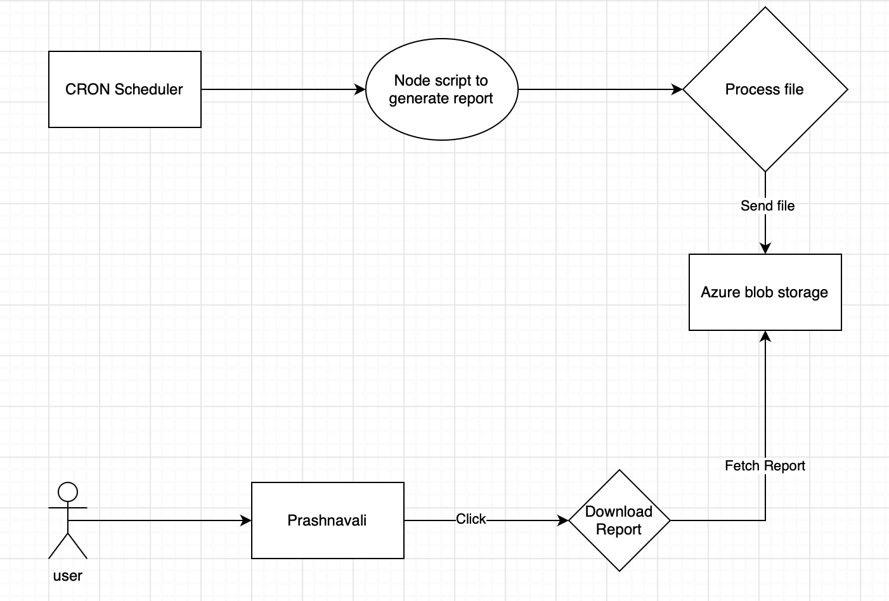

 **Functionality: ** 

The admin is able to view & download actionable reports to track progress on the question status available on contribution portal

 **Challenges in the current solution flow:** 

There are 3 overarching use cases for which Prashnavali is being used for creation of good quality questions:-

1. Assessments

1. Practice Worksheets

1. Question Banks

The mentioned use cases require a quick turnaround time and close monitoring on the progress of the status and regular reminders to users to complete the assigned task. Just to add some colour:-

* For an assessment, usually 5 days are allotted to the creator & contribution reviewer to create, review, make required changes, resubmit and re-review around 40 questions each.  

* For a practice worksheet, each creator has to complete two chapters per week (15 questions each), and each reviewer has to review questions for around 4 chapters per week (15 questions each)

Currently, to monitor the progress the admin has to do these steps:-

1. Login to the contribution portal

1. Go to ‘My Projects’

1. Open the desired project (approx. 46 projects in chapter worksheets)

1. See the overall progress status of the project

1. Open the desired question set (approx 15-30 question sets per project in case of chapter worksheets)

1. See the progress in that particular question set

1. Send reminder to the concerned creator & reviewer

 **_Steps 3-7 need to be repeated for all projects & all question sets in that project_** 

 **Functional solution:** 

The admin has a downloadable report available where he/she can access the progress of the live projects & question sets.

The proposed solution is:

1. Login to the sourcing portal

1. Go to  the ‘Organisational Reports’ section

1. A report ‘Contribution portal progress report’ is available for download

1. An excel is downloaded ([sample](https://docs.google.com/spreadsheets/d/1UtZQKNW9zeQ4QlV03ykD2OE6BG0t0QXq/edit?usp=sharing&ouid=109128788721314711672&rtpof=true&sd=true))

Slide [22-24](https://docs.google.com/presentation/d/13_KfHUE53_jqaGS6WBpDactC4b9KK7UT/edit#slide=id.g13681ada685_0_9) attached for wireframes of the solution

 **Technical solution:** 

* We’ll schedule a daily midnight cron to generate this report

* When user click the download it will fetch the existing file generated by cron

 **Following APIs are used to create this report:** 

* program/v1/list: Get all the project list

* program/v1/read/do_id: We’ll get project details 

* collection/v4/hierarchy/do_id: We’ll get question-set details 

*****

[[category.storage-team]] 
[[category.confluence]] 
