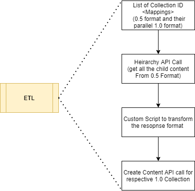

### Overview
For some time, the Haryana SCERT has been using the Prashnavali (VDN) and adding questions. The primary use cases so far have been:

a) Creation of Question paper for bi-monthly SAT

b) Creation of Question Library for various Grade-Subjects

In Summary:

No of question added > 3000

Type of questions added - MCQ

No of questions with images ~ 20%

Primary category: Question paper collection

Target Content: Exam Question

### Scenario
All the above content has been added in the QuML 0.5 format. As we migrate to QuML 1.0 format, to make sure, we do not miss out on all the content that is already created. We have to migrate the questions from the older format to the newer format.

Till now, Question paper collection → has Exam Questions → Question set with 1 question only

This needs to be mapped to:

New Question set collection (to be created) → Question types

### Proposed Approach

### Open Questions

1. How and what precautions are to be taken for rollback?

1. How can we handle the prevention of the duplication of questions?

 **Scenario** :  Ex: say 100 questions are there, start the script and after some time it fails, if I start the script again, previously generated questions will get generate again, i.e duplication of question.

 **Approach** :  Need to create a variable “Global Que's identifier“ in new create questions.

Need to pass old question id to Create API, so that it can create new question id and old question id as reference.

And after migrating the question, should write new and old question ids to the CSV file, and every time before migrating the questions, should check this CSV, whether CSV has this old question id or not, If present should skip calling create API else, should call the create question API. 

Please suggest any other Approach.

 **Updated Approach:** Instead of creating a new variable in old questions, pass the old question id as a new attribute named “reffrenceQueID“  to “create question API“.  

So before creating a new question verify weather the Id is present in a new question set. If ID is present don’t create the question, else Create the question.

 **Need of update question API:** 

If you want to get the total number of questions migrated or which not migrated with the reason, we can follow this implementation.

1. On creating the migrate questions we can call update question API. say new question id is  do_12234 and old question id is do_45677.

1. I am calling update question API for do_45677 and updating the fields called “migrationStatus“ and “migrationError“

1. If successfully migrated, the value of “migrationStatus“  = true.

1. If not migrated , then value of “migrationStatus“  = false, “migrationError“ = “actual error message for not migrating“

1. To do so Need to add these fields in schema.json in the creation portal, and I should raise the PR and need to merge and deploy it to the dev.

1. It may help in testing, using composite search if we give filter value with “migrationStatus“  = false, then we will get all those ids are not migrated with the reason. It will be easy to get the details.

Please let me know the flow is correct.

 **How we can run Script on production:** 

1. Locally I will run my script on the file path and run the command - “node fileName.js“.

1. Need to change the BaseUrl , (Use localhost server instead of the actual domain in the server.

*  Current API is for ex: `${envVariables.baseURL}/action/composite/v3/search

* And BaseUrl I am placing in .env file so that we can use it everywhere. 

* Say we will push the code to stagging then baseURL get replaced with stagging URL.

* But as we discussed we should not use the actual base URL, use the http://localhost:port/action/composite/v3/search

* If it is localhost, then where it should points be?

    Implementation

1.  **Search:** /composite/v3/search

    to get all  **collections** of  **primary category** Question Paper in the required channel

    

1.  **For each** collection

    1.  **Hierarchy read** : hierarchy/v1/read

    to get all  **contents**  of  **primary category** Exam Question

    1. For each content,

    1.  **Read** : content/v1/read

    to get the  **itemset** values

    1. check for the duplication of the questions.

    1.  _Transform_ to QuML 1.0 format

    1. Construct the editorState value

    1. Construct the interactionTypes, responseDeclaration

    1. Construct any other required attribute

    1. Copy all other attributes from the existing question

    
    1.  **Create:** question/v1/create the corresponding QuML 1.0 question

    - organisationId and collectionId attributes are not permitted in the question create body as of now, so will  **create these questions directly against the target framework only** .

    

    

*****

[[category.storage-team]] 
[[category.confluence]] 
