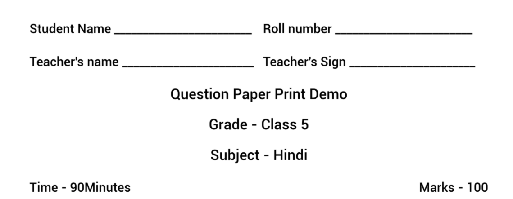

 **Current behavior of print preview service** The style of print preview is determined by three variables:  **Grade** ,  **medium,** and  **question type** . 

The question paper is divided into 3 sections, style for each section is explained below:

1.  **Start of question paper** 

1.  **Question paper name, Grade, Subject, Max marks, Max time** 

1.  **Question style** 

 **Start of question paper** 

|  **Grade**  |  **Medium**  |  **Start of question paper**  | 
|  --- |  --- |  --- | 
| 1-5 | Hindi | Student name, Roll, Teacher name and sign are in Hindi. | 
| 1-5 | English | Student name, Roll, Teacher name and sign are in English. | 
| 6-12 | Hindi | Student name, Roll, Teacher name and sign are in Hindi. | 
| 612 | English | Student name, Roll, Teacher name and sign are in English. | 

 **Question paper name, Grade, Subject, Max marks, Max time -** has a fixed view <image below>

 **Question style** 

|  **Grade**  |  **Question type**  |  **Style**  | 
|  --- |  --- |  --- | 
| 1-5, 6-12 | MCQ | Question fowllwed by answers options are added in pairs of 2. | 
| 1-5, 6-12 | MTF | Tabular view of all the columns and its items | 
| 1-5, 6-12 | FTB | Exact copy of what question is added, the blank is entered at the time of question creation | 
| 1-5 | VSA | One dotted line for answer (fixed) | 
| 1-5 | SA | Three dotted lines for answer (fixed) | 
| 1-5 | LA | Eleven (11) dotted lines for answer (fixed) | 
| 6-12 | VSA | Only question, no line for answering  | 
| 6-12 | SA | Exact same as question, No line for answering  | 
| 6-12 | LA | Exact same as question, No line for answering  | 

 **Requirements** There can be two types of question paper:

1. Questions, where a student is required to answer, is to be done in the question paper

1. Questions where a student is required to answer in a separate answer booklet 

    (p.s. -  _For Haryana, this is not a requirement, all the question papers are booklet with provision to write answers. However, this can be required in other SCERTs)_ 

Case1: Answer in the question paper booklet:

1. Grade 1-5 number of lines are fairly standard:

    1. 1 marks - 2 line (VSA)

    1. 2 marks - 4 lines (SA)

    1. 5 marks - 10 lines (LA)

    1. Comprehension -

    1. same as above (marks and no of lines co-relation)

    

    
1. Grade 6-12

    1. There is no clear pattern, the number of lines provided is not standard

    1. There are two questions provided where the student is supposed to attempt only one.

    There is only one answer section provided for such questions

    

 **Special case:**  There are some questions where blank space is provided, where the student is expected to draw, a diagram or write in free space. 

 **Header and Footer:**  Currently there is no header and footer shown, in Haryana

Header is set as - Subject/Grade

Footer is set as - Page number

 **Proposed approach** We can have a question-level variable called ' **_Number of answering lines'._** 

At the time of the question paper definition, it can be marked as:

1. To be answered within the question paper booklet 

    1. A default value for ‘ **_Number of answering lines_** ’ for each question type can be set based on grade

    1. The value can be editable. 

    Question- Who will have access to edit this value? 

    Question creator (contributor) OR Question paper creator (souring reviewer). 

    Ideally, since the adjustments in the preview would be done by the question paper creator, it would be helpful if they have this as well.

    
1. To be answered separately

    1. The default value for all the questions is set as  **0** 

    Question- Should this be editable as well, for the admin to provide lines for any question if needed? 

    

 **Line visibility:** 

There are questions where blank space is required for students to draw. In such cases, we can still have the number of lines variable defined (to define the height of space needed) and in addition, we can have another variable  **_Line visibility_**  **.** 

The default value for  **_Line visibility_**  can be set as true, and only manually for each question can be changed to false, creating a blank space for the answering.

Question -  _(same as above)_ Who will have access to edit this value? Question creator (contributor) OR Question paper creator (souring reviewer). Ideally, since the adjustments in the preview would be done by the question paper creator, it would be helpful if they have this as well.

|  **Question type**  |  **Grade**  |  **Default value for**  **_Number of answering lines_**  | 
|  --- |  --- |  --- | 
| VSA | 1-5 | 2 lines | 
| VSA | 6-12 | 3 lines | 
| SA | 1-5 | 4 lines | 
| SA | 6-12 | 5 lines | 
| LA | 1-5 | 8 lines | 
| LA | 6-12 | 15 lines | 

 **Open questions:** 

1. These default values should be set at the channel level, what is the possible value in it?

1. If tomorrow we decide to provide the option to configure the look of the start of the question paper as well, section 1 in the current scenario, how can we do it?

    One approach could be to make an exhaustive list of all the variables (Student name, student sign, teacher name, teacher sign, roll number, date, examination batch etc) that can come at the start of the question paper and then as users to select what all do they want.

1. Not considered now, the position of logo and provision to allow edits to that position, current thinking is to have a fixed place and fixed dimension for it. (Right - SCERT logo)

 **Header and Footer:**  This can be fixed to the below values and can be directly managed in the print service.

Header is set as - Subject/Grade

Footer is set as - Page number

Question- Should this be made configurable? Where admin defines the value of the header and footer while defining the question paper. What is the merit in making it configurable now? 

 **Sample question papers** 

|  **Grade**  |  **Subject**  |  **Link**  | 
|  --- |  --- |  --- | 
| 11 | Maths | [Maths Paper -11](https://drive.google.com/file/d/1ubVBfnZgMBelg6JSDNtVTyz7bnbQgpFW/view?usp=sharing) | 
| 12 | Hindi | [Hindi - 12](https://drive.google.com/file/d/1ygsuMvZ4FXhEQZVYZiJLWzGcHErORd6_/view?usp=sharing) | 
| 11 | Business Study | [Business Study - 11](https://drive.google.com/file/d/1HsBpZzpDsslNDQglW1Zd6dS2Wz2H8pwV/view?usp=sharing) | 
| 6 | Science | [Science - 6](https://drive.google.com/file/d/1MRrGv5jWaJimlEqfuWq_3ckA7xdQpFJM/view?usp=sharing) | 
| 7 | Maths | [Maths - 7 ](https://drive.google.com/file/d/1FqCequgpFoy8Xqj5lTMUwGcgvf0LCVjI/view?usp=sharing) | 
| 2 | English | [English - 2](https://drive.google.com/file/d/1ckYnzUSmE3unuP6XKB47ixQM8gzEw9V0/view?usp=sharing) | 
| 1 | English | [English - 1](https://drive.google.com/file/d/1qZbPDamZd4RiKHdMNr9Z1aRTyox6luiJ/view?usp=sharing) | 

Old discussion (for reference)Can be ignored

1. Templates are configured at channel level.

1. For each question paper, template can be chosen from the list of templates

1. At the time of print preview, the paper is generated using the defined template

*****

[[category.storage-team]] 
[[category.confluence]] 
