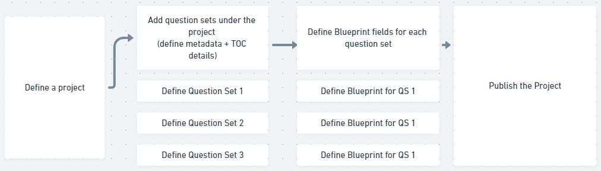

 **Overview -** Question paper creation is being used for 2 use cases in Haryana - 


1.  **Creation of Exam Question papers** 


    Creation of subject level question paper for bi-monthly SAT


* No of users: 900 Question creators, 100 Contribution Reviewers, 10 Sourcing Reviewers


* Nos of projects created : 8


* No of Question sets defined : 40


* Nos of question sets per project : 5/6


* No of Questions added: 1500


 

2.  **Creation of Practice Material (Worksheets)** 

    Creation of chapter/subject-grade level worksheets by reusing existing questions from “Add from library”   feature

 **Problem Statement - ** 

For creation of projects prior to each assessment cycle, the sourcing org admin defines the project scope, defines metadata and TOC details of question sets grouped under the project and then set the blueprint for each question set 

The project is then published and made live. (as shown in the workflow)



 **Many times, there is a need to make changes to the text fields (name, description, instructions) or TOC details to a question set due to manual error or updates in the question set.** 

 **Sometimes, there are also changes in the syllabus or paper pattern of the assessment due to which Blueprint form details need to be revised.** 

Currently, there is no provision for the sourcing org admin to make any changes to the question set/blueprint after a project is published.

As a result, the org admin has to create a new project if a change to even 1 of the existing question sets under the project has to be made. 


 **Functional solution - ** 


1. Allow the sourcing org admin to make changes to following text fields of a question set after a project is published -


a. Name (Text field)

b. Description (Text field)

c. Instructions (Text field)

d. Audience (Admin/Student/Teacher)

e. Visiblity (Default/Public/Private)

 **f. Sections and name of sections (Text field)** 

Note - Sourcing org admin should not be allowed to add a new section to the question set. _Deleting an existing section of the question set should not be allowed_ 


2. Allow the sourcing org admin to Update the following Blueprint fields of a question set after a project is published -

a. Chapter (Drop down field)

b. Competency (Drop down field)

c. Count of questions of diff type (MCQ, short, long answer etc)

d. Total count of questions

e. Total marks of question set


 **3. Allow the sourcing org admin to add a new question set to an already published project** 

a. When user clicks on “Modify project” option and moves to the “Project scope” screen (2nd tab) under project setup, the  **“Add New”**  Question Set button should be enabled.

b. Sourcing org admin is able to add a “New Exam Question Set” and define the question set metadata and TOC by using the Generalised Question Set Editor.

c. Once setup of a new question set is done, user can click “Update” and the project is updated with a new question set.

d. User and Role management for the newly created question set will remain the same as it is for the existing project.

 **Business rules/conditions -** 


* The “Add New” Question set option should be disabled and greyed out for sourcing org admin if the project end date has passed/project is expired.


* Content contributions made under a new question set created should also reflect in organisational reports


* Discuss other implications “Add New Question Set” for live projects with QA


 **_ Note: Deleting an existing question set will not be allowed to the sourcing org admin_** 


A  **“Next Button”**  will be added in addition to  **“Update Button”**  in the first tab and an  **“Update”**  button will be added to the second tab of a project when user clicks on Edit project button.


 **Tech design implementation:** 

In the current edit button for published projects, we will enable the 2nd tab (containing project scope) to edit all details.  

We will introduce a new key in definition (need to confirm API/File for this configuration) through which we can identify the editable fields.  


```
 {   
    "editableKeys": ["blueprint", "questionset.section",....]
 }
```


We’ll pass these keys to the collection editor and on the basis of these keys, corresponding fields (are mentioned in the functional solution point 1) will get enabled in the generalized question set editor.

We’ll fetch the question set information with versionKey, which we'll use to update the collection data. If there is any conflict in versionKey while updating question set metadata, then the user has to fetch the latest information of that question set in order to update.


 **We'll give the org admin an option to change the status of a project to Draft before editing, this will restrict the parallel contribution and If someone is already doing a contribution then an error message will be sent when the user saves the contribution. When the changes are completed by the org admin then the project will be re-published.** 


We will fetch data from API keys such as -


* Question Set Read: content/questionset/v1/read/do_id


* Question Set Update: action/questionset/v1/hierarchy/update


* Program Update: content/program/v1/update


 **Open Questions -** 


1. Need clarity on where the editable keys of question set need to be stored


1. Need confirmation on whether version key of the question set gets updated every time it is saved by the user.


 **Issues with this approach** :


1. Parallel contribution can cause update issues as there is no version key while updating the complete questionset.


 **Alternative Approach** 

We’ll use SB-form to update meta info and add sections. 

Users will get an edit option like the blueprint and on clicking the edit button a popup will be visible with all the details, users can update the metadata from that popup.

We can hardcode this form config in the code as we want to update only the selected fields and we also don’t have any tenant-specific API where we store this config.


APIs Used

Update basic info  **/api/questionset/v1/update/do_id** 


```
{
    "request": {
        "questionset": {
            "name": "Question Set Update 3",
            "description": "Updated question Set Desc",
            "instructions": "updated instructions",
            "audience": [
                "Teacher"
            ]
        }
    }
}

```


 **Open Questions:** 


1. Currently, the update API is working fine without versionKey.


1. We can’t update the visibility and add sections through the above update API. (The API is throwing an error Properties in list \[children, visibility, code, status, mimeType] are not allowed in request)


*****

[[category.storage-team]] 
[[category.confluence]] 
