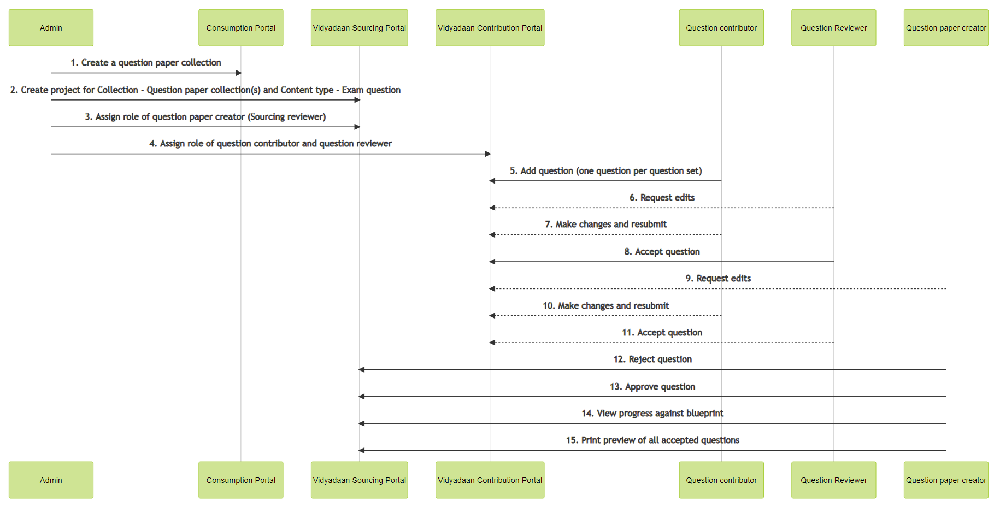
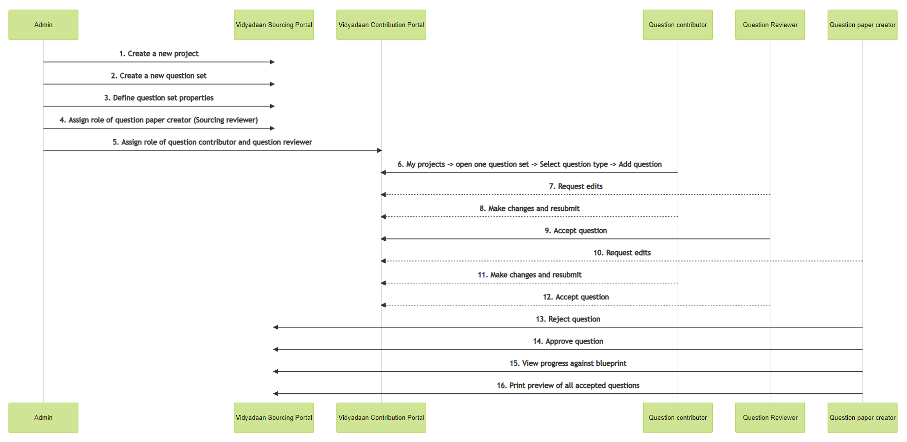

 **Overview:** On Sunbird the core definition of the QuML editor is upgrading. This means the question set, object definition is being changed. Prashnavali essentially is about the question and question paper creation, which means that the core way of how questions are added and question paper is created, needs an upgrade.

However, the overall user stories for all the actors (Admin, Question contributor, Question Reviewer, Question paper creator) do not change drastically.

There are some user interaction design and some User interface changes that will be visible to the end-user, on the backend, there will be complete rewiring of the fundamental building blocks.

 **User story level mapping:** 

| Sl | User story | Present user interaction | Proposed user interaction | Open Items/ Decisions | 
| 1 | Admin can create a Project for sourcing question papers. | 
1. Go to Diskha Portal, to create a new Question paper collection

1. Define metadata for the question paper 

1. Define sections of the question paper

1. Define instructions for the question paper

 | Admin will go to sorucing (vdn sourcing) and create project along with the question set defining the scope. 
1. Go to souricng portal, Create new project

1. Name the project, allow or not allow nominations

1. Define relevant dates

1. Select target object (of the type Collection or question paper set)

1. Selects the target assets (filtered list based on selected target object)

1. Create or select target Object(s)

    1. Creation flow

    1. Define metadata for question set \[Grade, Subject, medium, etc]

    1. Define sections for the question set

    1. Define Instructions for the question set 

    
    1. Select from existing flow

    1. Admin can also search for past question sets, using filters for grade, subject, medium.

    1. Admin can select one or more existing question sets

    

    
1. Define blueprint for each of the question set(s)

1. Pubish project

 | Closed:
1. Question set on the dev portal now, does not allow to add sections. Is that a limitation?  Creation of sections can be managed through configuration, we need to specify/limit levels at which sections can be created.

1.  Question sets, can only be created/selected through this flow. There is no separate screen/ touchpoint where user can view/create question sets.

1. Blueprint definition will happen as per the current flow. 

1. For point number 6 in the proposed flow:

    1. Object level value will be stored for

    1. Allow creation of new target → This will show the button of create new

    1. Allow selection from existing target → This will show the button of select from existing which will open a pop-up to create/select from the exisiting

    

    
1. Since we are already defining the question set definition what is the use of collection creator role? This has been removed from the design

Open Tasks:
1. Review by design team on the UI Mockup

1. Use case grooming session with Kartheek

1. Enginnering implementation design to be shared by Bharat

 | 
| 3 | Admin can assign users as Souricng reviewers (Question paper creator) | 
1. Go to Souricng portal 

1. Select a published project 

1. Go to assign users tab (in project details page) 

1. Search for user and assign them the role of reviewer

 | No interaction ChangeNo UI Change | Closed:
1. There will not be any change in this flow due to the change in project creation flow.

 | 
| 4 | Admin can assign users as Question contributors and Question reviwers | 
1. Go to Contribution portal

1. Select a published project 

1. Go to assign users tab (in project details page) 

1. Search for user and assign them the role of reviewer

 | No interaction ChangeNo UI Change | Closed:
1. There will not be any change in this flow due to the change in project creation flow.

1. It is not possible to allow for contribution roles from the sourcing portal.

Open:
1. Design flow for taking user to the contribution role assignment page from souricng project.

 | 
| 5 | Question contributor can view projects assigned to them | 
1. Login on to contribution portal

1. Click on my projects

 | No Change |  | 
| 6 | Question contributor can Create a new question | 
1. Login on to contribution portal

1. Open the project

1. View all the sections in the question paper

1. Click on upload create question on any one section

1. Select the type of question that is to be uploaded

1. Add the question and answer key

1. Click on edit details

1. Add tags to the question

1. Submit the question

 | 
1. Go to contribution portal

1. Open the project

1. See the sections in the question set

1. Click on Add new

1. Select the type of question

1. Add the question, answer key, set the question tags here itself.

1. Submit the question for review

 | Open:
1. Closing on UI Mockups

1. There is no change in user interaction flow

1. There is change in the type of content being opened, when a contribution reviewer or sourcing reviewer opens a question for review

1. Bharat needs to share engineering design implementation approach.

Closed:
1. Is there any change in the question defintion as well?

 | 
| 7 | Question contributer can make edits in a question for which edits are requested and can re-submit the question | 
1. Go to contribution portal

1. View all the added questions and their status

1. Open a question which is requested for change

1. Make edits and resubmit

 |  _No Change_ 
1. Go to contribution portal

1. View all the added questions and their status

1. Open a question which is requested for change

1. Make edits and resubmit

 | Closed: (Approach)
1. Frontend to remain the same as the current view

1. APIs exist for displaying question object (as opposed to questioning set object)

1. Wiring has to be done for the question object

    1. Open question editor

    1. Enter question and answer

    1. Add tags

    1. submit for review

    

Open:
1. Implementaion approach to be shared and closed

 | 
| 8 | Question reviewer can view all the uploaded questions | 
1. Go to contribution portal

1. View all the project, open a project

1. View all the added questions

 |  _No Change_ 
1. Go to contribution portal

1. View all the project, open a project

1. View all the added questions

 | Closed: (Approach)
1. Frontend to remain the same as the current view

1. APIs exist for displaying question object (as opposed to questioning set object)

1. Wiring has to be done for the question object

    1. Open question editor

    1. Enter question and answer

    1. Add tags

    1. submit for review

    

Open:
1. Implementaion approach to be shared and closed

 | 
| 9 | Question reviewer can Accept a question or request for change | 
1. View all the added questions

1. Open a question and take action

1. Accept the question or Request for change( with comments)

 |  _No Change_ 
1. View all the added questions

1. Open a question and take action

1. Accept the question or Request for change( with comments)

 | Closed: (Approach)
1. Frontend to remain the same as the current view

1. APIs exist for displaying question object (as opposed to questioning set object)

1. Wiring has to be done for the question object

    1. Open question editor

    1. Enter question and answer

    1. Add tags

    1. submit for review

    

Open:
1. Implementaion approach to be shared and closed

 | 

## [[QuML \[Refactor phase 1 & 2] - Mockups + User stories|QuML-[Refactor-phase-1-&-2]---Mockups-+-User-stories]]
 **Old Flow:** 

A question paper collection is created on the Consumption portal, followed by project creation on sourcing and contribution portals. The life cycle is shown below.

 **New Flow:** 

The question set is created on the sourcing portal. The new life cycle is shown below

Old Commentsonly for reference

1. Instead of question collection, create a question category

1. Define sections (chapters) at question set level

1. Define instructions at question set level (This will be used as instruction in the question paper)

1. Define blueprint at the project level for a question set

1. Contribute to a question set

    1. Instead of contributing a question set in the question paper collection, contribute a single question in the question set

    1. Instead of tags being defined at question set, define the tags at the question level

    
1. Question review - Instead of question set review, now the review will happen at the question level

1. Progress against blueprint - Show the progress against blueprint widget for the question set

1. Print service - Instead of Question paper collection hierarchy, update the print service to work on new question set hierarchy.

Next steps:

1. Define engineering step by step plan for migration

1. Close discussions on the new changed frontend flow

 **Points for Discussion in Implementation of Refactor Flow -** 

1. Reject Question API: We will add rejectedContributionComments key of an object type to store questions rejection comments in the question-set schema.

2. Sending a question back for corrections (From Sourcing reviewer to Contributor): Getting error while using /v1/update/do_id API to update status.

3. Adding marks as an attribute for questions:  Add marks key in question schema.

4. Opening up of previously created UI when user clicks on Upload Content and selects Subjective Questions: We are checking for targetprimarycategories in sessionContext's nominationDetails to list the supported primary categories. On submit we fetch the category definition and check the supportedMimeTypes from schema > properties > mimeType if the supported mime type has more than 1 child then we open the second popup to select mime type else we open the question editor page.

*****

[[category.storage-team]] 
[[category.confluence]] 
