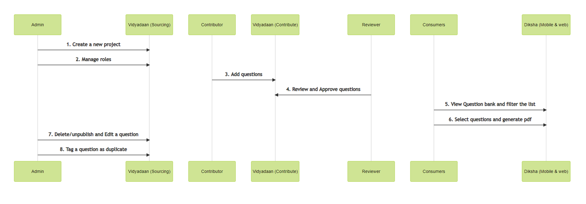
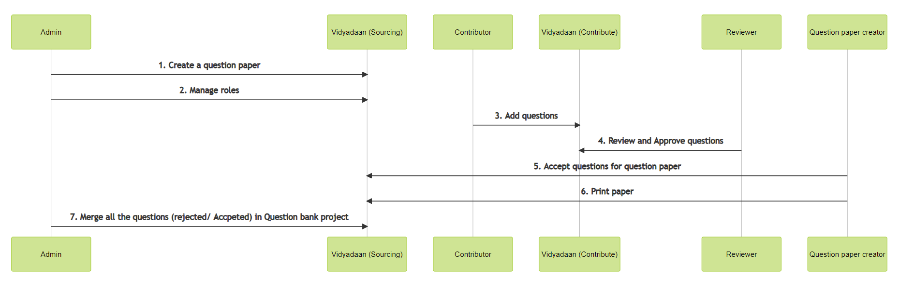

|  **Actors**  |  **Actual users**  |  **Actions**  | 
|  --- |  --- |  --- | 
| Contributor | Teachers, 3rd party vendors | 
1. Contribute questions

 | 
| Reviewer | Teachers, 3rd party vendors | 
1. Review and Approve questions

 | 
| Consumers | All the teachers in the state | 
1. View question bank

1. Filter by subject, medium, grade, topics and lo’s

1. Select a group of questions to create practice set

1. Suggest edits in the question

 | 
| Admin | SCERT team | 
1. Edit a question

1. Mark a question as duplicate

1. Publish/ unpublish a question in question bank

 | 

 **Problem Statement -** Questions are sourced as part of the question paper project flow, with visibility being limited to the users (contributors, reviewers, and sourcing reviewers) of the specific projects. We need to solve for the visibility and discoverability of the question to all, a set of users (teachers of a state, or any other defined group).

 **End outcome -** A set of teachers should be able to view all the questions added as part of any question project if it is allowed to be viewed by the question paper project ( Visibility might be restricted till the examination date for a project).

 **Implementation Approaches:** 

 **Approach 1 - Question bank as a separate project which has statewide visibility** 

In this approach - a common question bank project is created, which is available to all the teachers and it also allows continuous addition of questions. Any question added in this project is accessible to the teachers

 **Open questions:** 

1. How will the access to the question paper project made available to all the consumers? (If this exists, SamagraX team is not aware of it, where can I read about it?)

1. Where will the consumers see it on the Diksha web portal and Diksha mobile application?

1. Contributions to the question bank will be an ongoing process, how will we achieve this (current understanding is that, once a project is published on Diksha, the contributions can not be edited)

1. Engineering delta that needs to be planned for Diksha web and mobile portals?

 **Approach 2 - The questions are visible cross-project** 

Another approach that is thought through here is, that we have one common project (let’s call it question bank). This project has visibility of all the questions added in all the question paper projects.

Open question:

1. Will the questions be moved/ copied from one project to another?

 **Open to any other implementation approach** 

*****

[[category.storage-team]] 
[[category.confluence]] 
