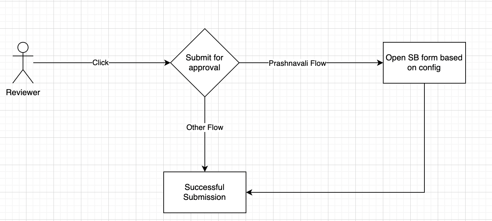

 **Functionality: ** 

A question reviewer is reviewing each question across some defined parameters before submitting for approval

 **Challenges in the current solution flow:** 

Ensuring a certain level of quality of questions is paramount for any education body creating questions for any purpose, and especially for assessment purposes. Hence to ensure good quality standards are maintained, there are some steps that each reviewer is asked to go through before approving a question. In haryana the review process is divided into 4 steps, which involves:-


1. The reviewer opens Prashnavali and opens a question submitted by the contributor


 _In this step the reviewer goes through the question statement, the options of the question (only in case of MCQ questions), the correct answer of the question & the tags added to the question (topic, competency, marks & skill)_ 

2. The reviewer opens a Google sheet ([sample](https://docs.google.com/spreadsheets/d/1LVFqsyMoCSiYTQYesjUO-s_IphyHj0MBM2x0FHJHQ1Y/edit?usp=sharing)) shared with them and marks the questions against the specified parameters

 _In this step, the reviewer pastes the question statement from Prashnavali to the given google sheet, and gives a score (out of 5) for all the parameters specified in the sheet. Based on a pre-defined logic a total score is generated for the question and ‘Approved’ or ‘Rejected’ is displayed on the google sheet_ 

3. The reviewer goes back to Prashnavali and marks the question as ‘Submit for approval’ or ‘Request changes’ based on the result from step 2.

4. The admin goes through the filled sheets in order to ensure that each question undergoes a quality check before approval


In the above mentioned steps, there are 4 major pain points:-


1. Multiple google sheets (25+) have to created for every assessment (Bi-monthly)


1. Reviewers have to navigate between Prashnavali & google sheets to review a single question and this exercise is repeated for all questions (~30 questions are added per subject-grade combination)


1. Navigating on different platforms is not ideal for reviewers as the cadre of reviewers are not very tech savvy and are mostly using mobile phones to carry out the entire process


1. The admin has to go through all the google sheets to maintain high quality standards of assessments


 **Functional solution:** 

Allow users to get a form/pop-up window where they can mark (yes/no or a checkbox) against all parameters to denote if they have gone through all the parameters before reviewing the question & also allow them to add a score against each parameter which with a pre-defined logic enables/grey-out the submit for review or request changes button


The proposed step-by-step solution is:-

A reviewer will


1. Log in to the contribution portal


1. Go to ‘My Projects’


1. Open the desired project


1. Open the desired question set


1. Open the desired question


1. Review the question body, options, details, tags


1. Click on Submit for review


1. A form opens with the following parameters:-  _Suitability, comprehensibility, pedagogy and grammar_ 


1. The reviewer gives scores across each parameter


1. The reviewer can see a total score


1. Based on the total score, the reviewer Accepts/Rejects/Requests for change the question


 _Logic: If total score <=15, the following message pops-up:- “Please re-evaluate the question for quality, & ‘Submit for Approval’ accordingly”_ 


[Slide 2-6](https://docs.google.com/presentation/d/13_KfHUE53_jqaGS6WBpDactC4b9KK7UT/edit#slide=id.p8) attached for wireframes of the solution


 **Technical solution:** 




* We’ll use SB-Forms to create quality-check form.


* The config will be stored in the category definition and rest data is hardcoded in the popup


* If quality check form exist in category definition then we’ll open the pop-up


* The value of quality-check form will be stored in question object.


 **Category Definition:** 

We’ll add following keys in category definition:


*  **isReviewerQualityCheckEnabled** : based on the value we’ll enable quality check form

    Possible Values: true/false


*  **reviewerQualityCheck** : This key will store SB-form config


```js
{
  "objectCategoryDefinition": {
     ...
     "objectMetadata": {
        ...
        "config": {
            ...
            "isReviewerQualityCheckEnabled": true,
        }
     },
     "forms": {
       "create": {},
       "delete": {},
       "publish": {},
       "review": {},
       "search": {},
       "reviewerQualityCheck": {
          "templateName": "",
          "required": [],
          "properties": [
            ...
          ]
       }
     }
  }
}
```


 **Question Schema** : 

We’ll add a new key of object type  **reviewerQualityChecks** which will store quality-check form information.


```json
{
   "identifier": "do_id",
    ...
    "reviewerQualityChecks": {
       "comprehensibility":  "2",
       ...
    }
}
```


Reason for storing reviewerQualityChecks in question schema:


* Leveraging existing API


* Avoiding multiple API calls


*****

[[category.storage-team]] 
[[category.confluence]] 
