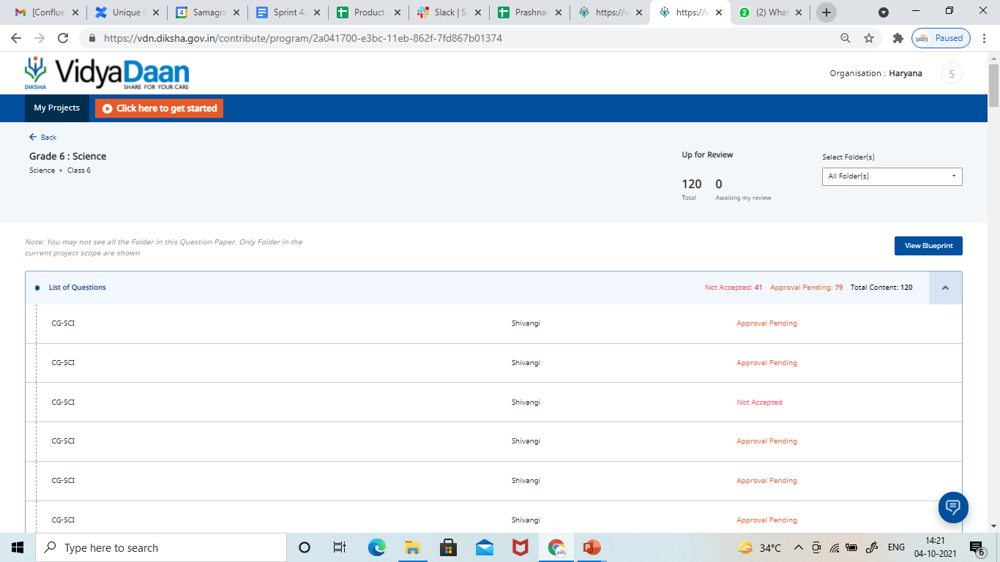

 **Overview - ** 

Question paper creation flow on VDN is being used for two use cases in HR:


Use case 1: Question paper creation

Creation of subject level question paper for bi-monthly SAT

No of users: 900 Question creators, 100 Contribution Reviewers, 10 Sourcing Reviewers

No of Question papers created: 36

No of Questions added: 1500


Use case 2:

Creation of question library. In a Question paper project specific to BMGS, a lot of questions are uploaded to create a digital question repository.

No of users: 100 question creators, 30 question reviewers, 10 sourcing reviewer

No of Question banks: 8

No of Questions added (per question bank): 600

In each of these use cases, the Contribution reviewer and the Sourcing Reviewer both are facing some issues, explained below.


 **Problem Statement - ** 

In the entire cycle of question contribution and question review, different users are facing different problems as highlighted below - 


1.  **For a question contributor**  - The user needs to fill the “Name” field under Edit Details for a question. Users are currently confused as to what to fill in this field and thus fill it with junk data.


1.  **For a contribution reviewer**  - 


Use case1: Question paper creation

When a contribution reviewer opens the list of questions submitted for review, they see this screen 

<

Problem: Typically for a single question paper there are 2 or 3 reviewers who are supposed to review the questions contributed for a question paper.

Out of 50 questions they distribute 25 questions each amongst themselves to review.

However, given the following list view’s behaviour:


1. Sl no is not shown in the list


1. List order is dynamic, showing questions that are pending review on top, and pushing the approved questions to the bottom of the list.


1. There is no filter based on status for contribution reviewer flow.


This leads to the problem where users (multiple question reviewers) are not able to work in a collaborative manner.


Use case 2: Question bank

The exact same problem happens for the users in this use case as well. Here it is worse, because the quantum of questions that are added in a grade wise collection is > 300.


1.  **For a sourcing reviewer**  -


Use case 1 : Question Paper Creation

The sourcing reviewer is supposed to choose a handful of questions for finalising a question paper from a pool of larger questions based on a question paper blueprint. Since this is an elimination stage, the reviewers want to open only selected questions in detail which match with blueprint attributes (Chapters, LO, Skills tested etc)


Currently following issues are faced by the user - 


1. User is not able to identify which questions to open in detail and read versus which questions to not open


1. There is no mechanism to highlight if a particular question has been seen by the user, so they end up reviewing the same question repeatedly


1. List order is dynamic, showing questions that are pending review on top, and pushing the approved questions to the bottom of the list.


Use case 2 : Question Bank

Since Questions added to question bank follow a single level review process, there are no challenges for this use case for the sourcing reviewer


 **Functional Solution for Phase 1 -  This consists of 4 items (1.1-1.4)** 1.1 **Adding a Serial Number to all assets in the list view** - 

A serial number should be added to each asset submitted for review by the contributor on contribution portal.


1. Serial number of the list view should be numbers 1,2,3 ..


1. Serial number is independent of the content, but a property of the list view.


1. Serial number will be visible to all the users, Contributor, Contribution reviewer, Sourcing reviewer


1. In the contributor’s view draft assets (questions) will also have a serial number


1. Every section in the collection will have its own list and [Sr.No](http://Sr.No). i,e, the count will restart from 1 for every new section in the collection  **<<** [ **Updated Mock-Up Screen** ](https://docs.google.com/presentation/d/1ExC11RvQGO2_KYztDChyGhClmMUWSAgMkXPJMWK2-CQ/edit#slide=id.gf96976266f_0_1) **>>** 

    


1.2  **Fixing the sequence of assets in list view** - 


1. The ordering of the items listed in list view should be based on creation timestamp. First created content to be shown on top, latest created content to be shown at the bottom


1. For a contribution reviewer, the order of questions should be fixed. 

    


1.3   **Adding tags to assets in the asset list view** - 

Tags to be added for assets (questions) to help the user identify and choose which question to open in detail from a list of all questions

 It is proposed to make tags available on both portals and for all 3 users - Contributor, Contribution reviewer, and sourcing reviewer at the following places - 


1. Upload Content in a collection screen for contributor


1. Review content screen for a contribution reviewer


1. Review content screen for a sourcing reviewer


* Tags specific to an Object Type will be available to users in list view of a collection - 


* For a question set,  **Question Type and Skills Tested**  will be added as columns as part of question set configuration. This will be in addition to Asset Name, Asset Contributor, and Status columns in Asset list view.


* Tags to be made available as chips under Asset Name in list view - Editable fields of framework attributes i.e. -  **Topic, Competency** 


 **<<** [ **Updated Mockup screen** ](https://docs.google.com/presentation/d/1ExC11RvQGO2_KYztDChyGhClmMUWSAgMkXPJMWK2-CQ/edit#slide=id.gf96976266f_0_1) **>>** 


1.4  **Adding search filters on contribution and sourcing portal -** 


* The  **common, minimum** filters can be added to the primary category definition for Question Paper as part of Phase 1 solution are - 


1. Question Type


1. Status (Default)


1. Skills tested


Filters for Framework attributes (Topic, Learning outcome) can be added later on in Next Sprint. 


*  **Proposed user flows for contributor reviewer ** 


1. User logs in as a contributor/question reviewer


1. Opens the desired project and then goes inside a collection


1.  **User clicks on Apply Filter button** 


1.  **A pop up box appears for user to filter questions by following attributes -  ** 


i Question Type - Includes all interactive and non-interactive content types for which questions have been created under that collection (MCQ, MTQ, VSA etc)

ii. Skills tested - Knowledge, Application, Understanding

iii. Status - Review Pending, Approval Pending, Rejected, Corrections Pending, Approved

 **Note -** 


1. All filters are single select drop downs


1. User clicks on Apply button to apply the filters and questions in list view get filtered based on selections


1. The user clicks on the Reset button to revoke the question selections as per filters.


*  **Proposed user flow For sourcing reviewer ** 


1. User logs in as a sourcing reviewer


1. Opens the desired project and then goes inside a collection


1. Clicks on “Apply Filter” button located next to Bulk Approve Content


1. A pop up box appears for user to filter questions by following attributes -  


i Question Type - Includes all interactive and non-interactive content types for which questions have been created under that collection (MCQ, MTQ, VSA etc)

ii.Skills tested **-** Knowledge, Application, Understanding

iii. Status - Approval Pending, Approved, Rejected

 **_(Existing status filter to be removed from current position and to be added as part of Apply Filter Pop up)_** 

Note - 


1. All filters are single select drop downs


1. User clicks on Apply button to apply the filters and questions in list view get filtered based on selections


1. User clicks on the Reset button to revoke the question selections as per filters.


[ **Mockups for 1.1-1.4 items** ](https://docs.google.com/presentation/d/1vetZ-Vf0T1oazM6GH56NGEJ7D1Rj4vFxjxOEallIhXc/edit#slide=id.gcb42003a35_0_12)

 **Implementation Approach for Phase -1** ConfigurabilityTo make it so that the headers and tags only appear for a certain primary category, we can add a headerConfiguration to the primary category configuration inside the sourcingSettings object, like so: 


* 
```json
 "sourcingSettings": {
                        "collection": {
                            "objectType": "Collection",
                            "primaryCategory": "Question Paper",
                            "isRoot": true,
                            "iconClass": "fa fa-book",
                            "showAddCollaborator": false,
                            "addFromLibraryEnabled": true,
                            // Header configuration
                            "headerConfiguration": [
                              {
                                "label": "Question Type",
                                "key": "questionCategories"
                              },
                              {
                                "label": "Skills Tested",
                                "key": "bloomsLevel"
                              }
                            ]
                  }
}
```

* The attributes that are  **framework-specific**  will be fetched from the childMetadata properties of the categoryDefinition


    * Only properties that are editable and part of the frameworkCategories are to be displayed in the UI


    * These properties will be shown as chips beneath the question name 


    


### Feature-wise split

1.  **Ordering** 


    * Order basis the createdOn attribute of the metadata instead of the existing ordering  


    * Display a serial number basis purely a frontend iteration through the leaf array of the collection in the recursive-tree


    * Restart the index based on each unit


    
1.  **Tags** 


    * Use the metadata attributes to add to the header in the recursive-tree


    * Handle cases when text is too long through CSS


    * Minimize the max-width in recursive-tree.scss


    * Alternate the order of tags and LOs coming in dynamicHeaders variable.


    * Give the different colours to the chips of LO and topic.

    


    
1.  **“Add Filter” modal** 


    * List of statuses possible is present in the recursive-tree component


    * Add the form configuration to the list of forms in the primary category definition, titled filterConfiguration


    * Pass the properties inside the filterConfiguration to the sb-dynamic-form component


    


*****

[[category.storage-team]] 
[[category.confluence]] 
