  * [Offline Support for Interactive Videos](#offline-support-for-interactive-videos)
  * [Creator Interface - Reuse Question](#creator-interface---reuse-question)
    * [Overview](#overview)
    * [Detailed Work Flow](#detailed-work-flow)
Introduction and OverviewSunbird currently supports Question Sets and Videos separately. However, we have learned that engagement with videos is much higher if questions can be placed inside videos. Once the videos are made interactive, the learning experience is much more enjoyable for the end user. 

With support for Interactive Videos in Sunbird, we will have the capability to:

1.  **Make any video interactive** : The goal is to design this in such a way what any available video can be made interactive by adding any question set at any timestamp in the video.

1.  **Publish interactive videos as a new form of content** : This will enable teachers to leverage interactive videos to improve the experience for learners

1.  **Analyse interactions at a deeper level** : The interactive video platform will provide an exhaust for telemetry and analysis which will allow data about engagement at a very detailed level.

ProposalTo enable interactive videos on Sunbird, we will leverage as many existing components as possible to enable quick and efficient development. Currently, we envision these main workstreams:

*  **Asset Model:** An asset model will be enhanced to support interception points in content. We will start with videos, but this work will be done keeping in mind that in the future, we will extend this concept to support interactive  **_content_** of any kind. In fact, we could, in the future, extend the concept even to more than two assets. For example, a child could read a few pages in a document (PDF), watch a quick video to visually understand the concept, and quickly practice what she learnt, all in sequence.

*  **Creator:** A new content creation UI will be created to enable any user of Sunbird to create interactive videos. They will pick from any preexisting video, and be able to add any existing question sets at any timestamp in the video. A possibility here is to allow for creation of new question sets inside the creation process.

*  **Player:** We do not need a new consumption experience for interactive videos. The current video player can be enhanced to support the interactive video content models

*  **Telemetry**  **and Analysis** : Detailed interaction events will be captured when an interactive video is consumed. This will include, but is not limited to video playback quality, scrubbing (Pause, Rewind and Fast Forward) behaviour, question events (answering, skipping, etc) and score related data. 

Requirement SpecificationsHere are the use cases we are currently targeting

*  **Interactive Video Creation** : As a creator, I need a simple interface with good User Experience to be able to create interactive videos. 

*  **Interactive Video Consumption** : As a learner/viewer, I would like to be able to view interactive videos similar to any other content type on Sunbird. When I log in and navigate to my available content, I should be able to find interactive videos easily. When I choose an interactive video, the experience should be engaging and rewarding. 

* Associated user stories 

* Non-functional requirements

* Localization requirements  

* Telemetry requirements

* Dependencies

* Impact on other products

* Impact on existing data  

Interactive Video CreationThe process to create interactive videos should be smooth and seamless. For V1, users cannot upload interactive videos, but can only use existing videos to enhance them with question sets for interactivity

| Srl. No. | User Action | Expected Result | 
|  --- |  --- |  --- | 
| 1  | User navigates to creation interface  | An option to create interactive videos is available for the user | 
| 2  | User creates interactive video | User is able to select one video from available videos. With the video available, user can select timestamps to add question sets. | 
| 3  | User publishes interactive video for review | The interactive video can be reviewed in the same way as other new content on Sunbird  | 
| 4 | Video is reviewed and published | The interactive video is immediately available on content pages for consumption | 

Interactive Video ConsumptionThis scenario describes the MVP for a user playing an interactive video. The expectation here is that users can find and consume interactive videos similar to any other sort of content on Sunbird.

| Srl. No. | User Action | Expected Result | 
|  --- |  --- |  --- | 
| 1  | User navigates to available content |  Interactive Videos, if available to the user, are displayed with a clear indication that they are interactive | 
| 2  | User clicks on interactive video  |  Interactive Video plays with questions showing up at correct time stamps | 
| 3  | Question set shows up on interactive video | User can answer, skip, or re-attempt questions in the question set depending on the properties of the question. Feedback is provided to the user on their performance  | 
| 4 | User finishes interactive video | Feedback is provided to the user on their score | 

Creator DashboardI believe we should also have a section on “Creator Dashboard” where creator can see metrics for their interactive videos, generate insights about what to improve. 

| Srl. No. | User Action | Expected Result | 
|  --- |  --- |  --- | 
| 1  | User navigates to their Dashboard | Relevant metrics are available for interactive videos created by them including (but not limited to): engagement with questions, number of video watchers, scores, etc. | 

Exception ScenariosDescribe a list of exception scenarios in the following table and how they are handled. To add or remove rows in the table, use the table functionality from the toolbar.  

Wireframes[Creator Interface V1](https://www.figma.com/proto/BmYK4alJiQKQdPcEoPOAo2/Sunbird---Interactive-Videos?node-id=11%3A0&scaling=min-zoom&page-id=0%3A1)

* On uploading video content on the Sunbird platform, the user will get an option to add questions to the video

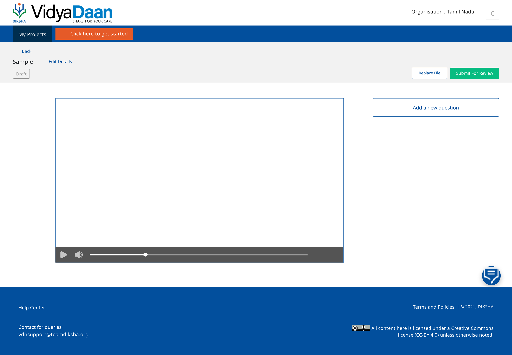
* On clicking <Add a new question>, the  _browse question dialog box_  will pop up from where the user can select a question/multiple questions from the existing questions created

* The question will be added at the same timestamp where the user had clicked on the <Add a new question> button. They can edit the timestamp in the bottom left corner of the dialog box

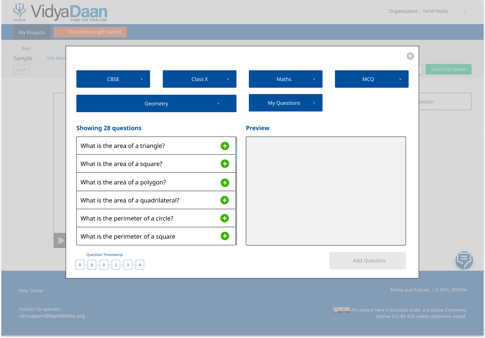
* Users can browse through the available questions to add to the video. By default system will show questions relevant to the context of Interactive video (video metadata). Users will also have the option to use multiple filters:

    * Board

    * Class

    * Subject

    * Question Type (MCQ/Subjective)

    * Chapter

    * All Questions / My Questions

    
* Once a user clicks on a question - they will see a preview of the question on the right side of the dialog box

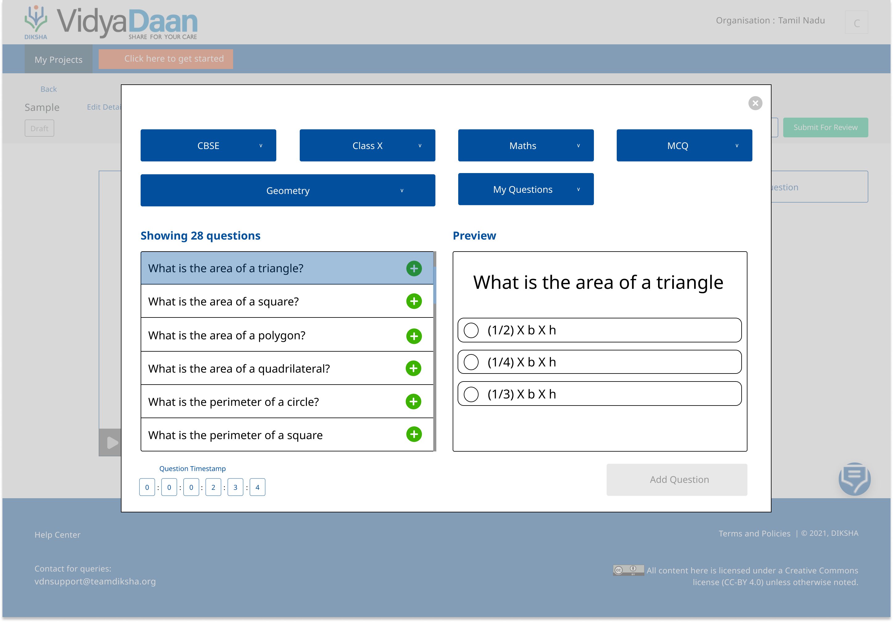
* To add a question, users will have to click on the green <Add> icon on the right side of the question list

* User can add a single question or multiple questions. If a user chooses to add multiple questions, the questions will clubbed into a  _question set_  by the system (and given a default name like custom_qs_1). Number of questions added will displayed in the bottom right, below the question box  

* The user can deselect/remove a question by clicking on the red <Remove> icon on the right side of the question list

* The user will also be given the option to configure the question set (only visible when user adds more than one question)

* The user can now choose to <Add Question Set> (which will keep the configuration of the question set as default, more details below), or <Configure Question Set>

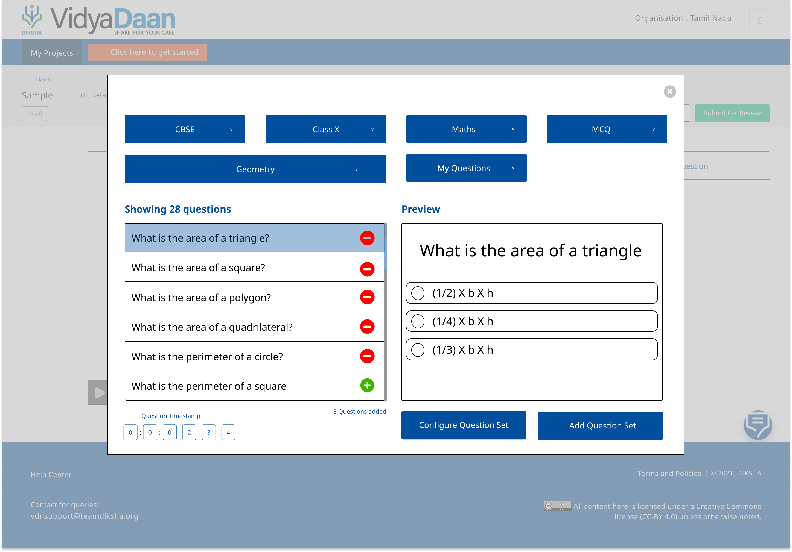
* If the user chooses to configuretheir question set, a new dialog box will open. The user have the option to:

    * Arrange the questions on the question set  _- they can drag and change positions of their questions in the box on the left side of the dialog box. Default arrangement will be the order in which the user added the questions_ 

    * Show Feedback - Configurable -  _This will show/not show the scorecard at the end of the question set. Default will be to show feedback_ 

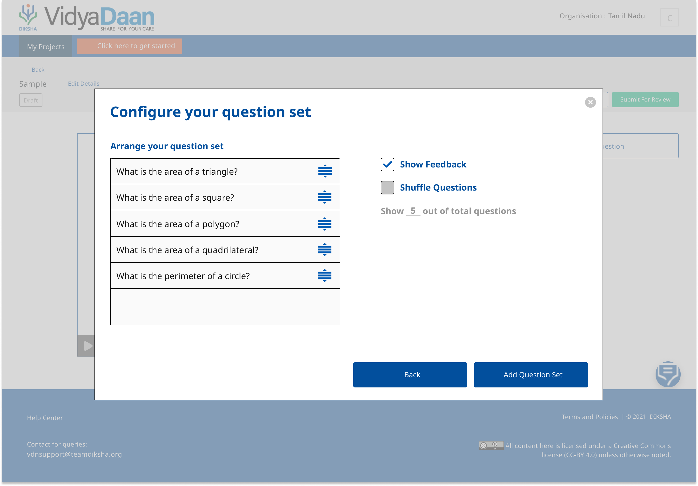
    * Shuffle Questions - Configurable -  _This will randomize the arrangement of the questions, and will render the arrangement on the left side box (we can grey it out). Default would be to not shuffle._ 

    * Show X out of total questions - Input -  _this option will only get active if the user select to shuffle the questions (otherwise it will mean the same X questions getting chosen every time to be displayed). Default would be for this to be disabled given default for Shuffle Questions is to not shuffle_ 

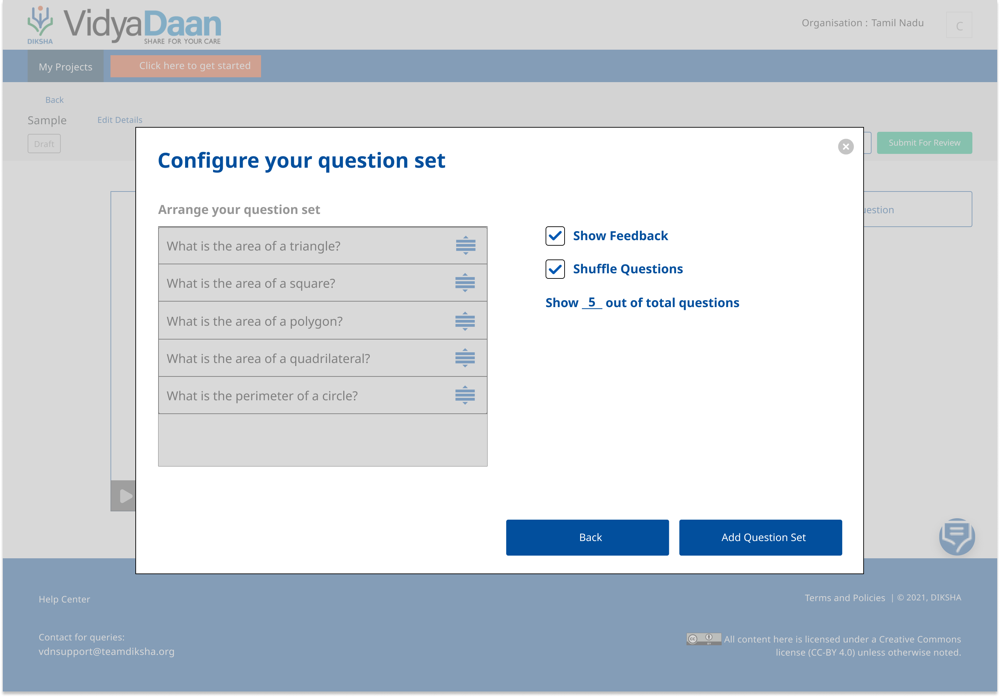

    
* User can now either go back to the previous dialog box or click on <Add Question Set>

* Once the user clicks <Add Question Set>, the added questions will appear on the right side of the player with the timestamp as a grouped  _question set_ . From here, user can edit the question set (if they have added more than one questions) or add more questions (if they have added only one question at that timestamp)

* A blue marker will be visible on the progress bar of the player at the timestamp where the question set (if they have added more than one question) is added

* User can also drag and move the marker on the progress bar to change the timestamp of the question/question set (if they have added more than one question)

* If the user adds two separate question sets at the same time stamps, it will be considered as one question set at the backend

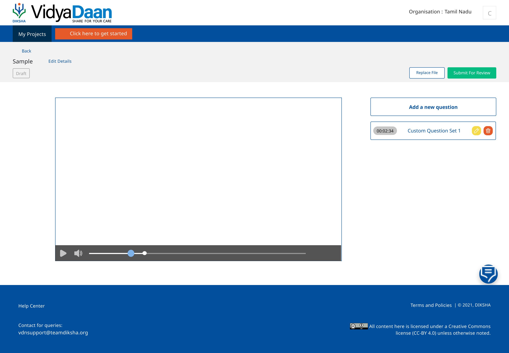
* On clicking the question on the right side of the player, a preview of the question will be visible to the user

* User can delete a question/entire grouped question set by clicking on the red icon on the right side of the question banner. To delete a specific question in a question set, user will have to click on edit (yellow icon) and then go on to de-select the required question through the dialog box pop-up

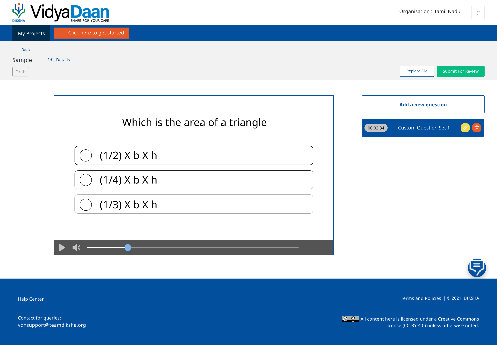
* User can submit the interactive video for review once they have added all desired questions

[Player Interface V1](https://www.figma.com/proto/P51RHSG0KbL5Oep9l51rXW/Untitled?node-id=1%3A161&scaling=min-zoom&page-id=0%3A1)

* Timestamps with questions overlayed will be bookmarked with a green marker

* The viewer will have the option to skip and revise a question set

    * <Skip> - This will allow you to bypass the question and proceed with the video

    * <Revise> - This will start playing the video from the last bookmarked timestamp. In case the first question is  _revised_ , the video will start from the beginning

    * If the user moves the play cursor beyond the question set marker, the question will be skipped

    

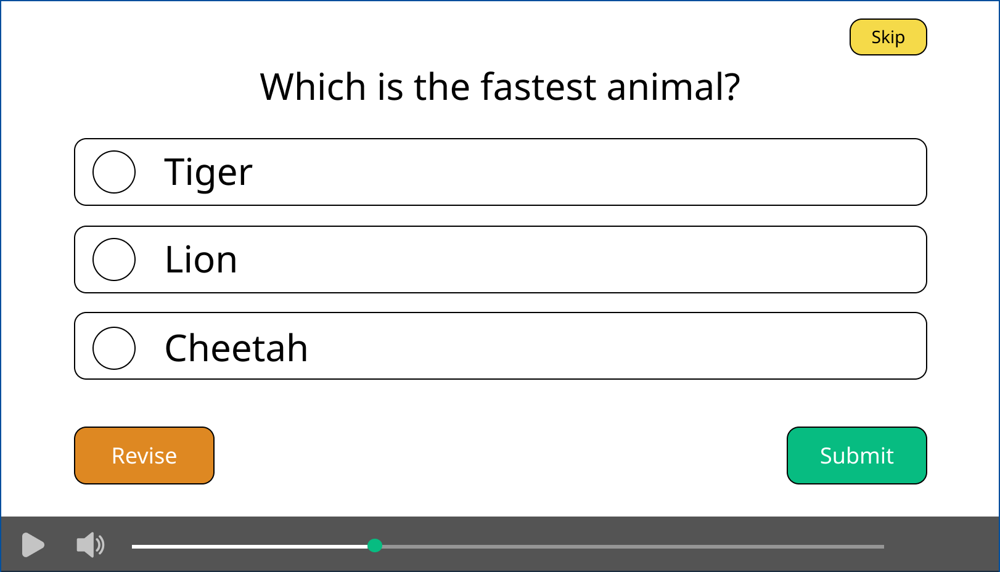
* On submitting the answer, the viewer will have to click on <Proceed> for continuing with the video

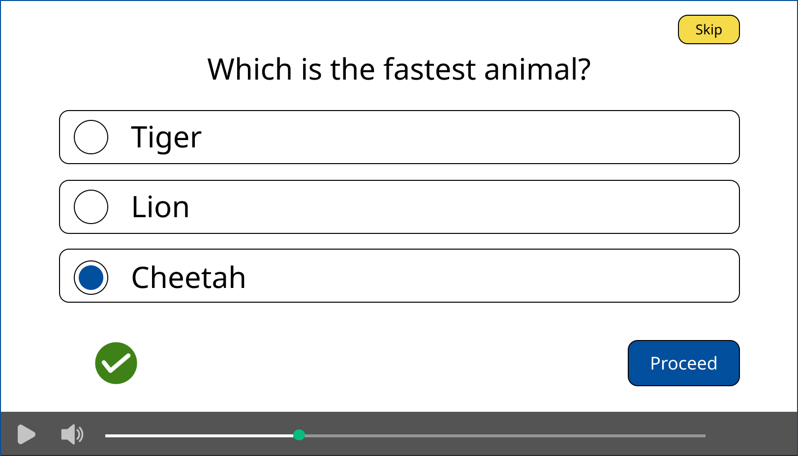

ScenariosScenario 1: Multiple question sets at the same timestamp.

Following ways in which different question sets can get attached to the same timestamp:

Given: Creator added only one question at timestamp x (assumption even this one question is stored as question set internally). 

When: Creator tries to ‘Add question’ at the same timestamp. 

Then: Show previously selected question and allow user to add more & configure settings.

Given: There is a question set (even if it’s singleton set) at timestamp x

When: Creator tries to ‘Add question’ at a different timestamp but modifies the time to a point where question set is already present

Then: As soon as user modifies the time, reload the page such that questions from question set already present at the timestamp are shown as selected + any additional questions user might have selected, in the current Add Question flow before modifying the time. will also show as selected. (Essentially merge selection - questions already present in the set + new ones selected this time when ‘Add Question’)

Alternative: Do not allow user to modify time from ‘Add Question’ flow. User should navigate the video to the desired timestamp and initiate Add question from there.

Given: There is a question set at timestamp x and y

When: User select the question set at y (blue dot in the player or from the right pane showing list of question sets) and modifies the position of the timestamp by dragging blue dot to x.

Then: Show merged question set - the one already present at x + the questions from the one at y. User can cancel this or Save the question set. Cancel will mean, user will have two question sets - one at x, one at y - from where s/he had started.

For Future Release
1. In future releases, we will aim to enhance all types of content with interactivity as outlined in the Proposal section above So instead of just an “interactive video”, we will have “interactive content”, which will be a very powerful learning tool for the user.

1. We will allow for users to add interactivity to a video in the uploading process itself.

1. We will allow for different question types: Match the Following, Multiple Answer Questions, and so on.

1. We will allow creators to make content interactive within a specific context (e.g.: collection). For example, add a question set interception in a video only within a specific course. The video will be a normal one when consumed as an independent resource.

Localization RequirementsThis task does not have any special localization requirements. The level of localization supported will be the same as the level of localization of the underlying tools: video player, QuML player, and Video Creation.

Telemetry RequirementsWe will collect click level interaction when an interactive video is played. Interactive Videos will emit all telemetry that is already emitted by the included components: the video player, and the QuML player. In addition to this, some custom events specific to the behaviour of interactive videos will be defined.

Key MetricsThe main metric to track here will be engagement with the interactive video. Some of the metrics we can use for this purpose are listed below

| Srl. No. | Metric | Purpose of Metric | 
|  --- |  --- |  --- | 
| 1 | Video watch duration | To know what percentage of the video is watched by a user, and on aggregate what percentage of users have watched different portions of the video | 
| 2  | Number of questions answered  |  To understand the questions in the video, to judge their difficulty, and so on. | 
| 3 | Score | On an aggregate level, this will help us understand users' performance, and also the level of the questions in the video. | 
| 4 | % of content that is interactive  |  | 
| 5 | Ratings of Interactive vs Non Interactive Videos |  | 
| 6 | Completion Rate of Interactive vs Non Interactive Videos |  | 

The goal will be to understand which interactive videos are working better, which are not doing so well, and in general, understand what makes for a good interactive video.  For example: 

1. What is the sweet spot of interception point for driving engagement, i.e. do questions work better in the first 1 minute or after 3 minutes or after 5 minutes?

1. How long should my video be: 3-5 minutes or 8-10 minutes? How does this change depending on subject, age group, class, etc?

For example, NROER / NCERT has many videos which are 45 minute long (recorded lectures). I want to know how many pieces should I make of them to make them of ideal length (available from 2) and where to put the questions (available from 1).

Scope for 4.3[https://project-sunbird.atlassian.net/browse/SB-26330](https://project-sunbird.atlassian.net/browse/SB-26330)

After enabling consumption in earlier sprints, for sprint 4.3 - we will be building the creator interface with the following features:

* A new content creation UI will be created to enable any user of Sunbird to create interactive videos. In the new video upload flow, the creator will have the ability to add  **_new_** questions to specific timestamps on the video. Ability to choose from existing question sets will be enabled in future sprints.

* We will use the existing Sunbird Question Set Editor components here while creating new questions

* A blue marker will be visible on the progress bar of the player at the timestamp where the question set (if they have added more than one question) is added

* User can also drag and move the marker on the progress bar to change the timestamp of the question/question set (if they have added more than one question)

* If the user adds two separate question sets at the same time stamps, it will be considered as one question set at the backend

* On clicking the question on the right side of the player, a preview of the question will be visible to the user

* User can delete a question/entire grouped question set by clicking on the red icon on the right side of the question banner. To delete a specific question in a question set, user will have to click on edit (yellow icon) and then go on to de-select the required question through the dialog box pop-up

* User can submit the interactive video for review once they have added all desired questions

* When the question set editor opens - the existing filters of Board, Chapter, Grade, Subject etc. should be pre-filled using the video meta-data

* When the user clicks on <Add a new question> → the system auto-decides the category (can be any of the existing categories or a new category by the name of  _Interactive Learning)_ 

Creator Interface Updates - 5th Oct’21 **Question Set Category** 

* Question Sets created inside the Interactive Video flow to not be discoverable

* Questions used inside Question Sets within Interactive Videos to be public/discoverable for reuse

*  _Question Reuse flow inside the Interactive Video Creation flow to be developed in later sprints but data classification (questions to be tagged as questions meant for Interactive Video) to be structured in a way that supports reuse flow_ 

*  _Every question to have an additional category which is equal to category of the parent question set_ 

 **Updated Review and Publish Flows** 

* Currently when reviewer approves, the platform publishes the interactive video content in the following manner:

    * It first calls an API to publish all the question sets present

    * It call another API to publish the video

    * Now, there is need for one more ECAR to package both these things together. Not packaging them together may lead to failure of individual question sets or the video in which case the final product being published will have components missing. 

    
* Once this change happens, the mobile app and portal will need to be enhanced to understand this packaged structure

 **Question Set Player Configuration** 

Question Set player within the interactive video flow to be configured in a manner that reduces number of steps for user

 **Question Set Details Screen** 

* Name - Set default from backend as  _Question Set 1/2/3/n_ and remove field

* Description - Remove or feed default description

* Instructions - Remove

* Type - Set default from backend as the new question set type created

* Additional Category - 

* BMCS - Basis meta data of video uploaded

* Topics - Remove

* Audience - Keep

* Max Time, Warning Time - Remove Fields

* Author Details - Keep inputs as default from backend and remove field

Creator DashboardJira Link: [https://project-sunbird.atlassian.net/browse/SB-26824](https://project-sunbird.atlassian.net/browse/SB-26824)

For sprint 4.4 we propose building the Creator Dashboard for Interactive Videos. This will help close the feedback loop for any creator using interactive videos for their teaching. It might also help us gain insights into the learning gains that can be achieved from an interactive video vs a passive video.

User Journey:
* User(Contributor) logs on to the Sunbird Vidyadaan platform

* User clicks on <My Projects> on the Nav Bar

* User sees basic stats that are available as part of the existing Sunbird data product (Views, Avg Rating)

* Against interactive videos, user sees option to check detailed analytics by clicking the button <Analytics> (This button is only enabled against interactive video content type and not any other content type)

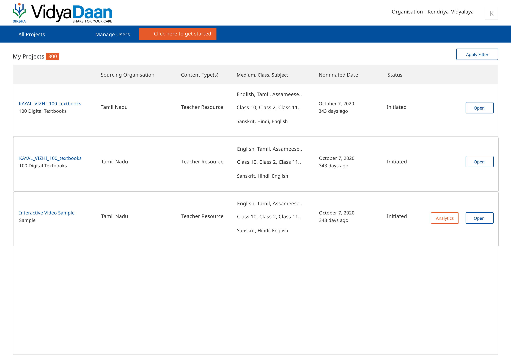
* When user clicks the <Analytics> button, the Interactive Video Creator Dashboard opens in a separate window.

* Below are some mockups inspired by the Plio Dashboard design which we can choose to integrate:

* 6 metrics that we track and display:

    * Completion Rate - % of viewers that answered all questions

    * Accuracy - Total Correct Ans / (Total Correct + Total Wrong Ans)

    * Retention at one minute (we can choose to skip this)

    * Avg. Questions Answered

    * Viewers

    * Average Watch Time

    
* Clicking the <Download Report> button leads to downloading of a zip file which contains the dump of all interactions (scrubbing behaviour like - play, pause, fast forward, question events - answering, skipping, etc, and score related data) for each session for each user.  _[This is something we can pick up in later sprints basis effort estimate and feasibility]_ 

* For the above to be possible it is also necessary as a part of the dev process to first ensure proper telemetry and requisite event recording during the viewer consumption journey.

## Offline Support for Interactive Videos

## Creator Interface - Reuse Question

### Overview
For 4.3, we are targeting to enable the creation interface for interactive videos with the capability to create new questions at the time of the new video upload flow.  _For future releases, we propose to enable the capability to add questions from the existing Sunbird question library. This will allow any creator to leverage the power of an open source question content library and turn their passive videos into an interactive lesson._  **(Not picked for 4.4)** 

### Detailed Work Flow

* On uploading video content on the Sunbird platform, the user will get an option to add questions to the video

* On clicking <Add a new question>, the  _browse question dialog box_  will pop up from where the user can select a question/multiple questions from the existing questions created

* The question will be added at the same timestamp where the user had clicked on the <Add a new question> button. They can edit the timestamp in the bottom left corner of the dialog box

* Users can browse through the available questions to add to the video. By default system will show questions relevant to the context of Interactive video (video metadata). Users will also have the option to use multiple filters:

    * Board

    * Class

    * Subject

    * Question Type (MCQ/Subjective)

    * Chapter

    * All Questions / My Questions

    
* Once a user clicks on a question - they will see a preview of the question on the right side of the dialog box

* To add a question, users will have to click on the green <Add> icon on the right side of the question list

* User can add a single question or multiple questions. If a user chooses to add multiple questions, the questions will clubbed into a  _question set_  by the system (and given a default name like custom_qs_1). Number of questions added will displayed in the bottom right, below the question box  

* The user can deselect/remove a question by clicking on the red <Remove> icon on the right side of the question list

* The user will also be given the option to configure the question set (only visible when user adds more than one question)

* The user can now choose to <Add Question Set> (which will keep the configuration of the question set as default, more details below), or <Configure Question Set>

* If the user chooses to configuretheir question set, a new dialog box will open. The user have the option to:

    * Arrange the questions on the question set  _- they can drag and change positions of their questions in the box on the left side of the dialog box. Default arrangement will be the order in which the user added the questions_ 

    * Show Feedback - Configurable -  _This will show/not show the scorecard at the end of the question set. Default will be to show feedback_ 

    * Shuffle Questions - Configurable -  _This will randomize the arrangement of the questions, and will render the arrangement on the left side box (we can grey it out). Default would be to not shuffle._ 

    * Show X out of total questions - Input -  _this option will only get active if the user select to shuffle the questions (otherwise it will mean the same X questions getting chosen every time to be displayed). Default would be for this to be disabled given default for Shuffle Questions is to not shuffle_ 

    
* User can now either go back to the previous dialog box or click on <Add Question Set>

* Once the user clicks <Add Question Set>, the added questions will appear on the right side of the player with the timestamp as a grouped  _question set_ . From here, user can edit the question set (if they have added more than one questions) or add more questions (if they have added only one question at that timestamp)

* A blue marker will be visible on the progress bar of the player at the timestamp where the question set (if they have added more than one question) is added

* User can also drag and move the marker on the progress bar to change the timestamp of the question/question set (if they have added more than one question)

* If the user adds two separate question sets at the same time stamps, it will be considered as one question set at the backend

* On clicking the question on the right side of the player, a preview of the question will be visible to the user

* User can delete a question/entire grouped question set by clicking on the red icon on the right side of the question banner. To delete a specific question in a question set, user will have to click on edit (yellow icon) and then go on to de-select the required question through the dialog box pop-up

* User can submit the interactive video for review once they have added all desired questions

[Player Interface V1](https://www.figma.com/proto/P51RHSG0KbL5Oep9l51rXW/Untitled?node-id=1%3A161&scaling=min-zoom&page-id=0%3A1)

* Timestamps with questions overlayed will be bookmarked with a green marker

* The viewer will have the option to skip and revise a question set

    * <Skip> - This will allow you to bypass the question and proceed with the video

    * <Revise> - This will start playing the video from the last bookmarked timestamp. In case the first question is  _revised_ , the video will start from the beginning

    * If the user moves the play cursor beyond the question set marker, the question will be skipped

    

* On submitting the answer, the viewer will have to click on <Proceed> for continuing with the video

*****

[[category.storage-team]] 
[[category.confluence]] 
