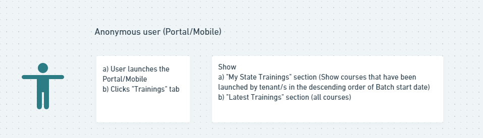
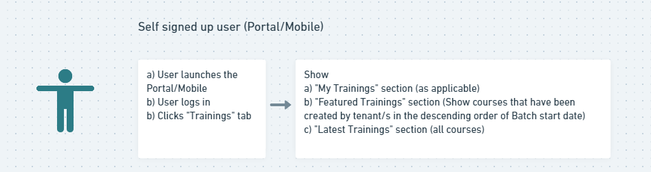
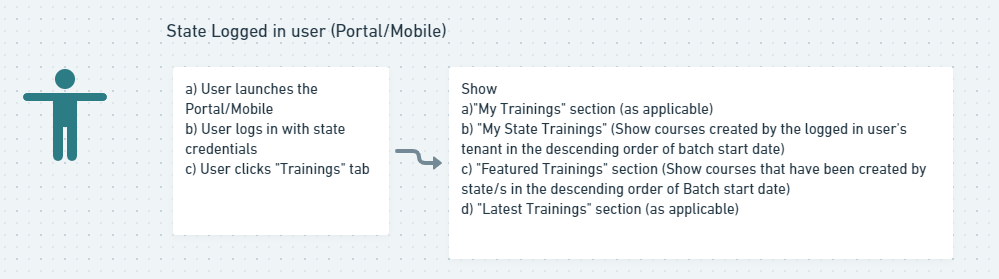

IntroductionThe open for enrolment section currently displays all courses that has has an open batch (on-going/Upcoming). Also, currently

1. All the courses are displayed in a random order for all types of users (State validated user, self signed up user, guest user)
1. There are no business rules to drive the order in which the courses are displayed

The intent is to add business rules so that courses relevant to the user are displayed which would help user to discover the courses published by their state board.

 JTBD

|  **Who is the user and what is the user trying to do which is currently a struggle**  |  **What is the context**  |  **Functional Goal**  | 
|  --- |  --- |  --- | 
| Teachers see all the courses launched by their tenant and other tenants in a random order | Course discovery & consumption |  _Ability for teachers to view courses launched by their state/tenant first, followed by other states/tenants_  | 

 **User Personas:** 

Teachers -  Users (SSO/Self signed up/Anonymous)  who have access to the 'Trainings' section in the platform

User Story 1 - Business rules to show Courses with open batch/es As a user, in the open for enrolment section, I would first want to see courses launched by my state/tenant, followed by other courses launched by other states, So that i get to see relevant courses easily and consume the same

 **JIRA:** 

 **System JIRAkey,summary,type,created,updated,due,assignee,reporter,priority,status,resolution2207a759-5bc8-39c5-9cd2-aa9ccc1f65ddSB-16743** 

 **Pre-conditions: ** 

User is logged in/Guest user

 **Acceptance criteria:** 

Verify that:

 **Main work flow** 

1. "Open for enrolment" section is replaced with the below two sections depending on the type of user
    1. "My State Trainings"- shown for state validated users only
    1. "Featured Trainings" - shown for state validated users, Anonymous and Self signed up users

    
1. The functionality to display "My Trainings" and "Latest Trainings" remains the same
1. Refer this sheet for various scenarios and examples - [https://docs.google.com/spreadsheets/d/1NDcC-nWThT5k2JP9oPLK9WJWomrOsuv0Dx3x0hp2G9U/edit#gid=0](https://docs.google.com/spreadsheets/d/1NDcC-nWThT5k2JP9oPLK9WJWomrOsuv0Dx3x0hp2G9U/edit#gid=0)
1. Note: "Batch start date", "Tenant of the user who created the batch for the course" and "Enrolment end date" should be included in the course metadata to allow for course search and show to the users in appropriate order 

 **Workflows for various types of users** 

 **Alternate work flow** 

None

 **Exceptional Workflow** 

If there are no batches created by the logged in state user's tenant, do not show "My State Trainings" section. Show only the other three sections as applicable

Localization Requirements

| UI Element | Description | Language(s)/ Locales Required | 
|  --- |  --- |  --- | 
| No UI changes. Hence N/A |  |  | 
|  |  |  | 

Telemetry Requirements

| Event Name | Description | Purpose | 
|  --- |  --- |  --- | 
| Click of a Course card from "My state Trainings" | The number of users who accessed a course from "My state Trainings" | To get insights on the usage of this section | 
| Click of a Course card from "Featured Trainings" | The number of users who accessed a course from "Featured Trainings" | To get insights on the usage of this section | 
| Click of a Course card from "My Trainings" | The number of users who accessed a course from "My Trainings" | To get insights on the usage of this section | 
| Click of a Course card from "Latest Trainings" | Click of a Course card from "Latest Trainings" | To get insights on the usage of this section | 

Non-Functional Requirements

| Performance / Responsiveness Requirements | Load/Volume Requirements | Security / Privacy Requirements | 
|  --- |  --- |  --- | 
| Provide the perfomance or the responsivenes required from the system to ensure that the Use Case is effective.  | Provide the load or volume required from the system to ensure that the Use Case is effective. | Provide security and privacy requirements for an effective Use Case  | 
|  |  |  | 
|  |  |  | 

Impact on other Products/Solutions

| Product/Solution Impacted | Impact Description | 
|  --- |  --- | 
| Specify the name of the product/solution on which this use case has an impact  | Explain how the product/solution will be impacted. | 
|  |  | 

Impact on Existing Users/Data 

| User/Data Impacted | Impact Description | 
|  --- |  --- | 
| NA |  | 
|  |  | 

Key Metrics

| Srl. No. | Metric | Purpose of Metric | 
|  --- |  --- |  --- | 
|  |  |  | 
|  |  |  | 
|  |  |  | 

*****

[[category.storage-team]] 
[[category.confluence]] 
