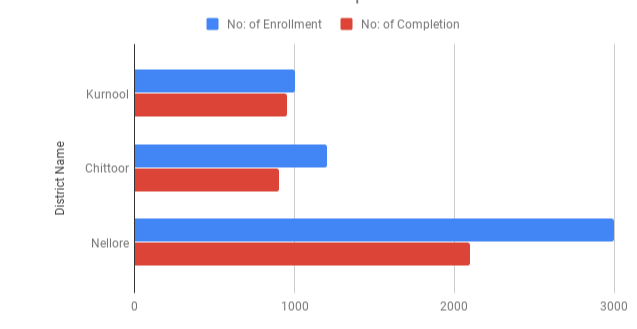
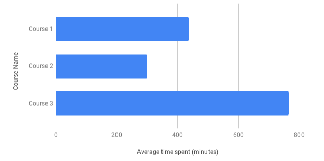
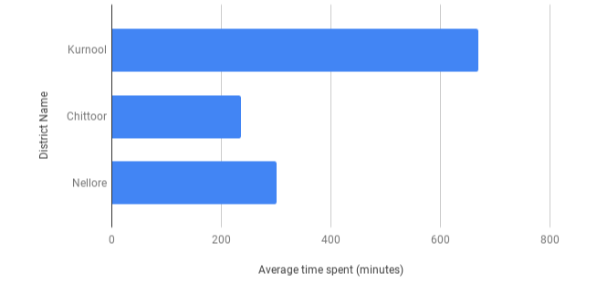

IntroductionWhen Courses are launched in a state, there should be a mechanism for the state to monitor the health of the courses. A State Admin should be able to generate daily dashboards and present it to his/her Superiors who in turn will be able to take appropriate actions to drive the courses to completion

 **Context ** Currently, "Course Enrollment" and "Course Completion" reports are available only for the three courses that was launched by AP in 01 May 2019. These reports are generated on a daily/weekly basis and displayed on the portal for the State Admin to view. However, AP is planning to launch around 20 more courses by September 19 and Gujarat will launch around 5 courses by August 19. As the course count is going to go higher, the task of Product/Program team sharing the list of courses and batches with the Implementation/Analytics team should be avoided and the dashboard should get automatically generated based on the courses launched in the state without any manual intervention. Hence, as part of version 2,

1. The current manual activities in report generation should be completely eliminated
1. Any State should be able to view the dashboard for the respective courses it has launched

 **Note: As Courses are going to be consumed by users from more than one state, instead of the adhoc analytic team, this will have to be taken up by the Engineering team ** 

 JTBD

|  **Who is the user and what is the user trying to do which is currently a struggle**  |  **What is the context**  |  **Functional Goal**  |  **Emotional/Social Goal**  | 
|  --- |  --- |  --- |  --- | 
| State Admin, who launches online training programs, does not know about the adoption and usage of it in the State & also in each district. Hence struggles to provide timely interventions to drive the adoption and usage metrics | Online Training |  _Ability for state to view the adoption, usage and completion of training programs for each course at the state and district level_  |  _Recognition for ensuring the success of online training programs across all districts_  | 

Use Case - OverviewState should be able to monitor the online course's progress at State and District level. The below metrics need to be captured and displayed as a dashboard for the course progress monitoring

1. Total number of enrollments in the state for all courses (This should include numbers only from the respective tenant)
1. Total number of enrollments per district for a course 
1. Total number of completions in the state for all courses (This should include numbers only from the respective tenant))
1. Total number of completions per district for a course
1. Average time spent by the users for a course in the state (This should be calculated, by including numbers only from the respective tenant)
1. Average time spent by the users for a course per district in the state

 **Epic JIRA Ticket ID:** 

[SB-13116 System JIRA](https:///browse/SB-13116)

User Story 1- Generate Course dashboard for a StateAs a State Admin, I would want to be able to view and monitor the course adoption, usage and progress through a dashboard so that, I could share these reports with my superiors to drive the courses to completion or derive insights to take meaningful decisions

 **Pre-conditions: ** 

1. The role of the logged in user is "Report viewer" 
1. User has clicked "Online courses" from the left nav

 **Acceptance criteria:** 

Verify that the user is able to

Main work flow

1. View the reports for his/her state
1. View the following reports one below the other (below order) 
    1. Enrollment and Completion Report (by Course)
    1. Enrollment and Completion Report (by District)
    1. Course usage Report (By Course)
    1. Course Usage Report (By District)

    
1. View the raw data in a table view. This will be common to all the four reports (Course Name, Batch Name, Batch type (ongoing,expired), District Name,Total number of Enrollments, Total number of Completion, Average time spent)
1. Download the report as a CSV
1. View the reports for teachers who belong to the state (self signed up or state login)
1. Note:1 Users from any tenant can enroll into an open course batch. In all the reports, include only teachers who belong to the same tenant ID as the report viewer’s tenant id.

 **Data Fields** Course Name: Name of the Course launched in the state 

Batch Name: Name of the batch. There could be more than one batch for a Course

Batch type: Ongoing, Expired

District Name : Name of the District within the State, to which the users belong. This can either be derived through the IP address of the user's device (or) user's location. During SSO, there is a provision to capture the School ID through which district name is made available. For self signed up users, district name is not available. Note: For AP, district information is available for SSO users. For those users who don't have district information, this will be blank 

Total number of Enrollments: Total number of users who have enrolled into the course   

Total number of Completions: Total number of users who have completed the course (Course progress is 100%)

Total time spent: Total time spent on the course by users in the state

 **Alternate work flow** 

None

 **Exceptional Workflow** 

None

 **JIRA Ticket ID** 

[SB-13117 System JIRA](https:///browse/SB-13117)

## User Story 2 - Enrollment and Completion Report (by Course)
As a State Admin, I would want to be able to view the total number of enrollments and completions for all the courses launched by the state through a dashboard, So that I could share these reports with my superiors to drive the courses to completion or derive insights to take meaningful decisions

 **Pre-conditions:** 

1. A course has one or more ongoing/expired batches (Open or Invite-only)
1. The role of the logged in user is "report viewer"
1. Logged in user has clicked "Online Courses" link from the left navigation menu

 **Acceptance criteria:** 

 **Main work flow** 

Verify that 

1. The total number of  enrollments and total number of completions for all the courses are displayed as a Bar graph
1. The title of the graph is "Enrollment and Completion (by Course) per day" 
1. The title of X-axis is "No: of Enrollment and Completion"
1. The title of Y-axis is "Course Name"
1. There is a facility to filter by "Batches" (Ongoing, Expired, All); 
    1. Ongoing - shows all enrollments and completions from all ongoing batches (Open + Invite-only); selected by default  
    1. Expired - shows all enrollments and completions from all expired batches (Open + Invite only)
    1. All - shows all enrollments and completions from Ongoing and expired batches

    
1. The total number of enrollments and total number of completions for a course is shown as a stacked bar(refer the screenshot for reference)
1. On mouse over, within each bar (that pertains to enrollment), the count of enrollments is displayed for that course
1. On mouse over, within each bar (that pertains to completion), the count of completions is displayed for that course
1. The raw information is displayed in a tabular format 
1. The raw information can be downloaded as a CSV
1. Note:1 This report should be updated on a daily basis
1. Note:2 Any user with course progress % as "100" is considered to have completed the course. 

 **Alternate Workflow** 

None

 **Exceptional Workflow** 

1.  If there are no courses launched in the state, display message "Currently no online courses have been launched in the state" 

Sample Report: <Please note the below image is just for visualization purpose> 

 **JIRA Ticket ID** 

[SB-13118 System JIRA](https:///browse/SB-13118)

User Story 3 - Enrollment and Completion Report (by District)As a State Admin, I would want to be able to view the total number of enrollments and completions for a Course per district, through a dashboard, so that, I could share these reports with my superiors to drive the courses to completion or derive insights to take meaningful decisions

 **Pre-conditions: ** 

1. A course has one or more ongoing/expired batches (Open or invite only)
1. The role of the logged in user is "Report viewer"
1. Logged in user has clicked "Online Courses" link from the left navigation menu

 **Acceptance criteria:** 

 **Main work flow** 

Verify that 

1. The total number of  enrollments and completions for the selected course and batch per district is displayed as a bar graph
1. The title of the dashboard is "Enrollment and Completion (by district) per day" 
1. The title of X-axis is "No: of Enrollment and Completion"
1. The title of Y-axis is "District Name"
1. The facility to select "Course" and "Batch" is available
    1. "Course" -  Show "All", "<Course name>"; Courses Course names are arranged in alphabetical order; "All" should be selected by default; "All" refers to all the courses
    1. "Batch"  - Show  "All", "Ongoing" and "Expired"; "Ongoing" should be selected by default; "All" refers to Ongoing (Open + Invite-only) + Expired (Open + Invite only) batches

    
1. The total number of enrollments and total number of completions for the selected course and batch is displayed as a stacked bar (refer the screenshot for reference)
1. On mouse over, within each bar, the total number of enrollments and completions count is displayed for each district
1. The raw information is displayed in a tabular format 
1. The raw information can be downloaded as a CSV
1. Note:1 This report should be updated on a daily basis
1. Note:2 Any user with course progress % as 100 is considered to have completed the course. 

 **Alternate workflow** 

None

 **Exceptional workflow** 

1. If there are no courses launched in the state, this section is not visible to the user
1. If a user does not have district information mapped, tag all of them to 'Undeclared' District. 

Sample Report: <Please note the below image is just for visualization purpose> 

 **JIRA Ticket ID:** 

[SB-13119 System JIRA](https:///browse/SB-13119)

User Story 4 - Course Usage Report (by Course)As a state admin, I would want to be able to view the total time spent by the enrolled teachers on the courses (for all districts) so that I can understand the usage of the courses

 **Pre-conditions:** 

1. A course has one or more ongoing/expired batches (open or invite only)
1. The role of the logged in user is "Report viewer"
1. Logged in user has clicked "Online courses" link from the left navigation menu

 **Acceptance criteria:** 

 **Main Workflow** 

Verify that the

1. The total time spent by users on each course in the state is displayed as a bar graph
1. The title of the report is "Course Usage (per day)"
1. The title of X-axis is "Total time Spent (Minutes)"

1. The title of Y-axis is "Course Name"
1. There is a facility to filter by "Batches" (Ongoing, Expired, All)
    1. Ongoing - shows all enrollments and completions from all ongoing batches (Open + Invite only)
    1. Expired - shows all enrollments and completions from all expired batches (Open + Invite only)
    1. All - shows all enrollments and completions from all ongoing and expired batches

    
1. The raw information is displayed in a tabular format 
1. The raw information can be downloaded as a CSV
1. Note:1 This report should be updated on a daily basis
1. Note:2 The total time spent by user on a course should include the contents from the same course only. When the same content is being used by multiple courses, and if the user consumes the same content from different course, the time spent by user should not be doubled for a course

 **Alternate flow** 

None

 **Exceptional flow** 

1.  If there are no courses launched in the state, display message "Currently no online courses have been launched in the state" 

Sample Report: <Please note the below image is just for visualization purpose>

JIRA Ticket ID:

[SB-13120 System JIRA](https:///browse/SB-13120)

User Story 5 - Course Usage Report (by District)As a state admin, I would want to be able to view the total time spent by the enrolled teachers on the courses, per district so that I can understand the usage of the courses in each district

 **Pre-conditions:** 

1. A course has one or more ongoing/expired batches (open or invite only)
1. The role of the logged in user is "Report viewer"
1. Logged in user has clicked "Online courses" link from the left navigation menu

 **Acceptance criteria:** 

Verify that the

1. The total time spent by users on each course, per district in the state is displayed as a bar graph
1. The title of the report is "Course Usage (by District) per day"
1. The title of X-axis is "Total time Spent (Mins)"
1. The title of Y-axis is "District Name"
1. The facility to select "Course" and "Batch" is available
    1. "Course" -  Show "All", "<Course name>"; Courses Course names are arranged in alphabetical order; "All" should be selected by default; "All" refers to all the courses
    1. "Batch"  - Show  "All", "Ongoing" and "Expired"; "Ongoing" should be selected by default; "All" refers to Ongoing (Open + Invite-only) + Expired (Open + Invite only) batches

    
1. The raw information is displayed in a tabular format 
1. The raw information can be downloaded as a CSV
1. Note:1 This report should be updated on a daily basis
1. Note:2 The total time spent by user on a course should include the contents from the same course only. When the same content is being used by multiple courses, and if the user consumes the same content from different course, the time spent by user should not be doubled for a course

 **Alternate flow** 

None

 **Exceptional flow** 

1. If there are no courses launched in the state, this section is not displayed 
1. If a user does not have district information mapped, tag all of them to 'UnDeclared' District

Sample Report: <Please note the below image is just for visualization purpose>

 **JIRA Ticket ID** 

[SB-13122 System JIRA](https:///browse/SB-13122)

Localization Requirements

| UI Element | Description | Language(s)/ Locales Required | 
|  --- |  --- |  --- | 
| None |  |  | 
|  |  |  | 

Telemetry Requirements

| Event Name | Description | Purpose | 
|  --- |  --- |  --- | 
| Click of 'Download CSV" event | Allows state admin to download the raw data in a CSV format. | By tracking this event we would like to track the usage of download CSV feature. | 
| Click of "Table view" | Allows the state admin to view the raw data in a table view | By tracking this event we would like to track the usage of table view | 
| Click of "Course" filter | Allows the user to view reports for All or specific courses | By tracking this event we would like to track the usage of Course filter | 
| Click of "Batch" filter | Allows the user to view reports for All or specific batches  | By tracking this event we would like to track the usage of Batch filter | 

Non-Functional Requirements

| Performance / Responsiveness Requirements | Load/Volume Requirements | Security / Privacy Requirements | 
|  --- |  --- |  --- | 
| Provide the perfomance or the responsivenes required from the system to ensure that the Use Case is effective.  | Provide the load or volume required from the system to ensure that the Use Case is effective. | Provide security and privacy requirements for an effective Use Case  | 
| These reports are rendered on portal and hence should be compatible with the browsers and devices that are compatible with the portal.  |  |  | 
| The data that is shown in this dashboards should match with the data on the Course dashboard published to the course mentors. |  |  | 

Impact on other Products/Solutions

| Product/Solution Impacted | Impact Description | 
|  --- |  --- | 
| Specify the name of the product/solution on which this use case has an impact  | Explain how the product/solution will be impacted. | 
|  |  | 

Impact on Existing Users/Data 

| User/Data Impacted | Impact Description | 
|  --- |  --- | 
| None |  | 
|  |  | 

Key Metrics

| Srl. No. | Metric | Purpose of Metric | 
|  --- |  --- |  --- | 
| 1 | Course enrollments | track course adoption | 
| 2 | Course completions | track course completion metric | 
| 3 | Time spent | track on an average the time spent on the course | 

*****

[[category.storage-team]] 
[[category.confluence]] 
