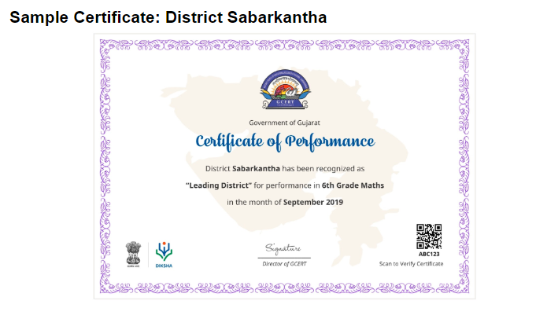
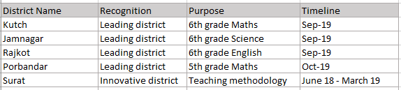

IntroductionAs part of e-creds experiment in 2.5.0, we've enabled issue of creds to non-registered platform entities like School and Student. But this eventually will need to be extended to any entity in the education system like District, Cluster, Block etc., Each entity/cred type could have a template of its own with a set of information (static + dynamic) to be displayed in the certificate.  The input CSV file currently takes only one dynamic field, which is the recipient name. This needs to be enhanced to take multiple fields depending on the cred type and these fields need to be shown on the certificate.

 JTBD

|  **Who is the user and what is the user trying to do which is currently a struggle**  |  **What is the context**  |  **Functional Goal**  | 
|  --- |  --- |  --- | 
| Currently states do not have a formal way of recognizing schools/students/teachers/clusters/block etc., | e-creds | To motivate the schools/students/teachers/clusters/block etc., | 

Use Case - OverviewEnabling states to recognize best Student/Teacher/Cluster/Block/Teacher etc. by awarding them digital credentials. The scope of current and future use cases built on DIKSHA generic credentialing service will be limited for usage in education domain. 

[SB-15451 System JIRA](https:///browse/SB-15451)

User Story 1 - Issue Certificate for non registered users based on the cred typeAs a State admin, I would want to be able to issue certificate to non registered users based on the cred type, So that they are motivated and perform better

 **Pre-conditions: ** 

1. User is logged into the Program portal
1. Cred type is identified and defined/set
1. Contents of the CSV file are identified and defined/set

 **Business Workflow: ** 

1. Program/Product team identifies the cred type to be issued in discussion with the State
1. Based on the cred type, Program/Product team identifies the Certificate template (static and dynamic contents) in discussion with the State 
1. Implementation team to set up the cred type on the Program portal. Below two things are executed as part of this activity
    1. Certificate template is created (static content with hard coded text + dynamic contents/fields)
    1. The identified dynamic fields are made available in the CSV file 

    
1. Issuer logs in to the program portal and issues the certificate
1. Issuer downloads the certificates, prints and distributes to the recipients

 **Acceptance criteria:** 

Verify that:

 **Main work flow** 

1. The existing certs workflow remains unaltered with the below exceptions
    1. The newly set cred type should be available in the "select cred type" drop down
    1. Preview of the corresponding certificate template is displayed on selecting the cred type
    1. While uploading, the CSV file should contain the identified dynamic fields in the same format (this should support more than one dynamic field) 

    
1. The above workflow for a State is explained with an example for reference
    1. State decides to recognize "Best district" in various disciplines for the year 2018-2019 and issue digital certificates.
    1. A new cred type called "Best District" is identified by the program team after discussing with the State
    1. State identifies the static and dynamic contents to be part of the template, in discussion with the program/product team
    1. Based on the agreed certificate template, Implementation team creates the new cred type called "Best District" and creates the CSV file format (District Name, recognition, purpose, Timeline). All the identified fields in the CSV are mandatory 
    1. Issuer logs in to the Program portal
    1. Issues selects the newly added cred type "Best District" from the "select cred type" drop down
    1. Issuer previews the new certificate template for "Best District" cred type (as attached below)
    1. Issuer generates the digital certificate by uploading the CSV file in the defined format for the "Best District" cred type
    1. The rest of the workflow remains the same

    

 

 **Alternate work flow** 

None

 **Exceptional Workflow** 

1. When uploading the CSV file, if one or more records fail to get uploaded, the entire file should not get uploaded. Display error message as "The CSV file was not uploaded due to issues with one or more records in the file"

 **JIRA Ticket ID** 

[SB-15380 System JIRA](https:///browse/SB-15380)

User Story 2 - Certificate template to support multiple languagesAs a State Admin, I would want to have the Certificate be available in a language that is local to my state, So that it is easy for the recipients to understand

 **Pre-conditions:** 

1. Implementation team has set the language based on the state's request as part of cred type creation
1. User is logged into the programs portal
1. User selects the cred type

 **Acceptance criteria:** 

Verify that:

 **Main work flow** 

1. The certificate template is displayed in the set language in preview mode. Both the static and dynamic contents are displayed in the set language (This means that the user should be able to enter in the set language in the CSV file as well)
1. The certificate issued to the user is displayed in the set language
1. On scanning the QR code, the first screen where the user enters the certificate code/QR code is retained in English. The second screen where the certificate details are displayed needs to be in the set language 
1. Steps 1 to 3 work for all the languages that are currently supported 

 **Alternate Workflow** 

None

 **Exceptional Workflow** 

None

 **UI design** 

None

     **JIRA Ticket ID** 

[SB-15445 System JIRA](https:///browse/SB-15445)

Localization Requirements

| UI Element | Description | Language(s)/ Locales Required | 
|  --- |  --- |  --- | 
| None |  |  | 
|  |  |  | 

Telemetry Requirements

| Event Name | Description | Purpose | 
|  --- |  --- |  --- | 
| Scans QR code from the certificate | Allows user to scan the QR code to view the certificate details and watch videoNote: Scan of QR code associated with a Certificate should be different from Course/course completion or textbook or resource | To track the usage of download QR code feature in the certificate. Also gives insights on the impact that the video has on the users | 
| Click of "Generate" | Lets the Issuer to generate the cred template  | To track the number of times the certificate template was generated for a tenant | 
| Click of "upload CSV" | Lets the Issuer to upload the CSV file | To track the number of times the CVS file was uploaded | 
| Click of "Issue" | Lets the Issuer to issue certificate to the users | This would give some insights around the number of times the Issuer clicked "Issue" versus the number of records in the dashboard. These two should ideally be the same, if not there is some issue that would need to be fixed | 

Non-Functional Requirements

| Performance / Responsiveness Requirements | Load/Volume Requirements | Security / Privacy Requirements | 
|  --- |  --- |  --- | 
| Provide the perfomance or the responsivenes required from the system to ensure that the Use Case is effective.  | Provide the load or volume required from the system to ensure that the Use Case is effective. | Provide security and privacy requirements for an effective Use Case  | 
| Maximum number of records that can be uploaded in a single CSV file | 200 |  | 
| Expected time to upload a CSV file | 4-5 seconds |  | 
|  |  |  | 

Impact on other Products/Solutions

| Product/Solution Impacted | Impact Description | 
|  --- |  --- | 
| Specify the name of the product/solution on which this use case has an impact  | Explain how the product/solution will be impacted. | 
| ETB Reports | It has to be ensured that the scan count resulting from Certificate QR code, does not get included in the ETB reports.  | 
| Course Reports | It has to be ensured that the scan count resulting from Certificate QR code, does not get included in the QR code scan of Course or Course completion certificate | 

Impact on Existing Users/Data 

| User/Data Impacted | Impact Description | 
|  --- |  --- | 
| NA |  | 
|  |  | 

Key Metrics

| Srl. No. | Metric | Purpose of Metric | 
|  --- |  --- |  --- | 
| 1 | Scan QR code in certificate | This metric will provide insights on the impact the video has on the user | 
| 2 | Click of Generate, issue, download, scan | These metrics could be analysed like a funnel to identify the drop outs/issues | 
|  |  |  | 

*****

[[category.storage-team]] 
[[category.confluence]] 
