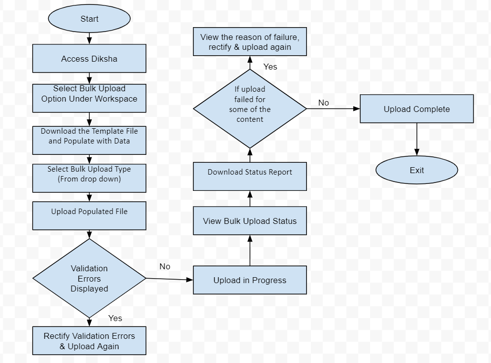

IntroductionMany of the states working on ETB program have a lot of exiting content in the form of videos or pdfs. They prefer to reuse it for linking to the QR codes in their textbooks. This greatly reduces effort and time required in finding content for ETB. It also enables reuse of existing curated and quality content for ETB. This story details enabling of bulk upload of existing content by states through online portal.

JTBDUse this section  to elaborate on:

*  **Jobs To Be Done: ** Uploading existing content one by one manually is an intensive effort and time taking. Hence they prefer bulk uploading of the content on to the system. Currently this is being supported by implementation team. However with 28 states on-boarding, and the bulk upload process happening in multiple iterations, it becomes a significant effort for implementation team to handle this. Hence there is a high value in enabling this process through online portal so that each state can do this through their resources. There is no requirement of a detailed review process for this content as it would have already happened. Hence review of this on system before publishing is only a formal verification.
*  **User Personas:**  State resources who own the process of content pooling for ETBs are the primary users of this system. These are typically an identified set of teachers who collate existing content and map them to the state textbooks. 
*  **System or Environment:**  Desktops with Chrome browser and possibly MS office for working with excel. Network connectivity can be assumed but with lower bandwidth (1 mbps)

Requirement SpecificationsBulk Upload of Content - OverviewIn order to ensure effective scale rollout of ETB and associated programs across states, it is critical to make states self-reliant to execute most of the ETB activities themselves. One of the major activity for which state is dependent on Diksha implementation team is bulk content upload. In this PRD we are going explain process, workflow and upload format for bulk data upload on Diksha by states.

 **Actor** : Only Content Reviewer can execute this use case flow

Bulk Upload of Content - Overall Process Workflow

Bulk Upload of Content  - User StoryMain Scenario: Upload and Publish Content and Link it to TextbookThis scenario is uploading content, publishing it as well as linking the content to relevant textbook sections based on the QR code. The pre-requisite for this:

1. The textbook to which content is linked should be in draft state and QR codes are mapped to relevant textbook sections
1. The Bulk Upload CSV has mapping of QR code and Textbook id for each content

 **Actions:** 

1. Content reviewer access Diksha link
1. Reach out to Workspace. There should be a new option called: " **Bulk Content Upload** ". Under this, there will be two options:
1. Download the sample upload file from the link below the upload option (refer screen). Format of the bulk upload sheet is as follows: [https://docs.google.com/spreadsheets/d/1zo_KVAU3y_RR3p4Gpgud-geROZYXv9Efpgwdflszemc/edit#gid=0](https://docs.google.com/spreadsheets/d/1zo_KVAU3y_RR3p4Gpgud-geROZYXv9Efpgwdflszemc/edit#gid=0)
1. User should be able to access user guide from the link below the upload option (Refer screens).
1. User populates the bulk upload sheet in the required format.
1. Select " **Upload csv file** ".
1. By default, " **Publish & Link to Textbook** " radio button would be selected as upload type. Upload options are:
1. Browse the populated bulk upload file. Click on " **Start Upload** ".
1. In case file contains validation errors, error dialogue should appear with listed validation errors (Refer wire frames). User should rectify and upload again.
1. In case there is no validation error, upload should start and user should be redirected to Work space screen.
1. While upload is in progress, " **Upload csv file** " should be disabled for next upload.
1. At the same time, clicking on " **View Report** ", should take user to bulk upload status dialogue box, where user should see following fields:
1. Status report would have following additional fields (apart from input bulk sheet fields) for each row (representing each content)
1. Once upload is complete,  " **Upload csv file** " button will be enabled. Now user can start a new upload.
1. There will be two complete status, would be rendered depending upon contents upload status:
    1.  **Completed**  : When there is no content failure in status report 

    1.  **Completed with errors**  : When there are content which got failed because of some error. In this case user to check the details and download status report.

    
1. Till the new upload is started, " **Last upload file** " will show the status of previous upload.
1. User would be required to rectify the reason of failure and upload the failed content again.

Alternate Scenario 1: Publish Content (no linking to textbook)This scenario is uploading content and publishing it only.

 **Actions:** 

In this scenario all the actions are similar as for the main scenario, just a difference that in step 7, while uploading bulk upload input sheet, user select bulk upload type as " **Publish** " from the radio button. In this case, content is created and published on Diksha.

Exception Scenarios **Prerequisite:** 

1. Before any validation/processing, space trimming should be done for preceding and trailing value of each cell.
1. Validation must be done before the content creation for each row. For example system should read the entire row, in case any mandatory cell value is missing, fail the content creation for that row and display with error message in status report.  

| Srl. No. | Error / Exception | Expected Handling | 
|  --- |  --- |  --- | 
|  |  **Validations at the time of bulk sheet upload (Results in Validation Errors)**  | 
|  | In case any mandatory column is missing, validation error should be thrown. Mandatory columns: Board, Grade, Medium and Subject, Name of the content, Resource Type, Audience, Author, Copyright, Icon, File Format, File path. | Error Message to Display:"Following mandatory columns are missing in input sheet: XXX, YYY, ZZZ." | 
|  | Although "QR code" & "Textbook id" fields are not mandatory but in case user selects upload type as "Publish & Link to Textbook", than these fields becomes mandatory and validation error should be thrown in case these columns are missing | Error Message to Display:"Following mandatory columns are missing in input sheet: QR Code, Textbook Id" | 
|  | Number of content in input sheet should not be more than 3000.  | Error Message to Display:Input sheet should not have more than 3000 content. | 
|  |  |  | 
|  |  **Validations while processing each row for creating each content (Results in Content Creation Failure)**  | 
|  | In case already successfully uploaded content is being uploaded again. Duplication of content shall be checked on the basis of following parameters:Board , Grade, Medium, Subject , Content Name | System should fail the upload of such content with following error message: "Duplicate Content"   | 
|  | Validation regarding mandatory fields should be checked while processing each row, in case cell value is missing fail that creation of that content | Error message should be displayed in cell of the column "Reason For Failure" as:"Following mandatory fields are missing: XXX, YYY." | 
|  | In case upload type selected as " **Publish & Link to Textbook** " and cell value is missing for column "QR Code" or "Textbook Id" for a particular row.  | System should not even create the content in such case. Refer the prerequisite 2. Error message should be displayed in cell of the column "Reason For Failure" as:"Following mandatory fields are missing: QR Code, Textbook Id." | 
|  | Videos should be in mp4 format only. | Error message should be displayed in cell of the column "Reason For Failure" as:"Invalid video format" | 
|  | Each content should not be more than 50 mb. | Error message should be displayed in cell of the column "Reason For Failure" as:"File size is more than 50 MB" | 
|  | Icons and files to be put in google drive and to share google drive links in the respective field. Please ensure Google Drive links are having view access to all permissions.  | Error message should be displayed in cell of the column "Reason For Failure" as:"Error while accessing file path google link" OR"Error while accessing icon google link" | 
|  | Input sheet should not have two content with same following values:Board, Medium , Grade, Subject, Content Name | In case already created content is found again in further rows of the same input sheet, treat it as duplicate and display following error as reason for failure:"Duplicate Content" | 
|  |  Multiple contents in one single row is strictly not allowed. Only one content must be shared in one row.  | Error message should be displayed in cell of the column "Reason For Failure" as:"Multiple content values in a single row" | 
|  | Board, Grade, Medium, Subject and Topic field values should follow the framework/taxonomy of the tenant. | Error message should be displayed in cell of the column "Reason For Failure" as:"Invalid Board, Grade, Medium, Subject, Topic" | 
|  |  |  | 
|  |  |  | 

WireframesInvision Screenshots: [https://projects.invisionapp.com/share/7QST139948N#/screens/374220905](https://projects.invisionapp.com/share/7QST139948N#/screens/374220905) 

For Future ReleaseNA

JIRA Ticket ID[SB-12164 System JIRA](https:///browse/SB-12164)

.  

Localization RequirementsNA

Telemetry RequirementsUse this section to provide requirements of the events for which telemetry should be captured. To add or remove rows in the table, use the table functionality from the toolbar.    

| Event Name | Description | Purpose | 
|  --- |  --- |  --- | 
| Mention the event that will generate telemetry and which needs to be captured.  | Provide event details. e.g. clicking upload for textbook taxonomy  | Provide a reason why the event telemetry should be captured.  | 
| Click on button "Start Bulk Upload" | Parameters to be captured for this events are: Time stamp, user details, event status (fail/success), Reason for failure if any |  | 
| Click on "Browse" input file | Parameters to be captured for this events are: Time stamp, user details, event status (fail/success), Reason for failure if any |  | 
| Click on "Upload" input file | Parameters to be captured for this events are: Time stamp, user details, event status (fail/success), Reason for failure if any |  | 
| Download of sample template file | Parameters to be captured for this events are: Time stamp, user details, event status (fail/success), Reason for failure if any |  | 
| Click on "Bulk Upload Status"  | Parameters to be captured for this events are: Time stamp, user details, event status (fail/success), Reason for failure if any |  | 
| Download of "Status Report" | Parameters to be captured for this events are: Time stamp, user details, event status (fail/success), Reason for failure if any |  | 
| Selection of bulk upload type | Parameters to be captured for this events are: Time stamp, user details, event status (fail/success), Reason for failure if any |  | 
| Download "User Guide" | Parameters to be captured for this events are: Time stamp, user details, event status (fail/success), Reason for failure if any |  | 
|  |  |  | 
|  |  |  | 

Non-Functional Requirements

| Performance / Responsiveness Requirements | Load/Volume Requirements | Security / Privacy Requirements | 
|  --- |  --- |  --- | 
|  | Every sheet can have maximum 3000 contents which should take approximately 8 hours for creation. 9.6 seconds per content. |  | 
|  | Further every content should take 3 sec for publishing, means 2.5 hours approximately for 8000 content to publish. |  | 
|  | Hence total in 11 hours, a sheet with 8000 content should be processed (creation + Publish). |  | 

Impact on other Products/SolutionsNA

Impact on Existing Users/Data NA

Key MetricsSpecify the key metrics that should be tracked to measure the effectiveness of this use case in the following table. To add or remove rows, use the table functionality from the toolbar 

| Srl. No. | Metric | Purpose of Metric | 
|  --- |  --- |  --- | 
|  | Specify the metric to be tracked  | Explain why this metric should be tracked. e.g. tracking this metric will show the scale at which the functionality is used, or tracing this metric will help measure learning effectiveness, etc.  | 
|  |  |  | 

*****

[[category.storage-team]] 
[[category.confluence]] 
