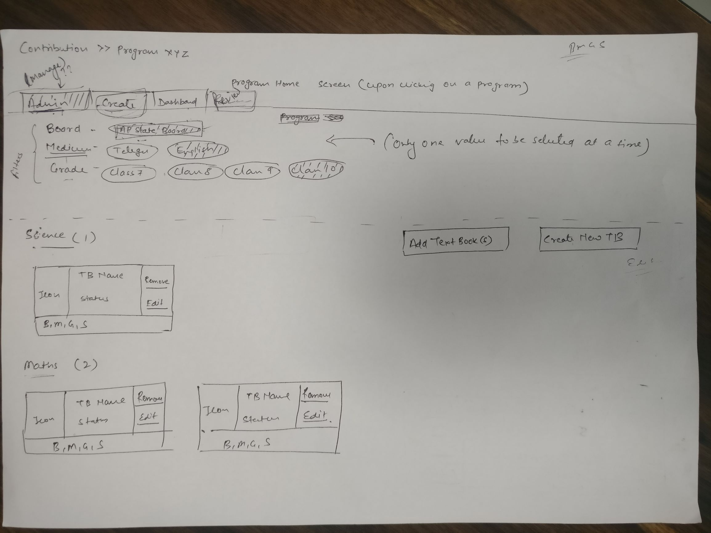

IntroductionThis document describes requirements for Managing Textbooks in a Program. This is one of the steps of "Programs driven Content sourcing". Following diagram depicts L1 and L2 flows of the overall program driven content sourcing flow.

[https://miro.com/app/board/o9J_ky31DBw=/?moveToWidget=3074457347130847117](https://miro.com/app/board/o9J_ky31DBw=/?moveToWidget=3074457347130847117)

Once "Create Contribution Program", and "Onboard Textbook Creators and Reviewers" are done, it is Textbook creator who shall be authorized to create or manage Textbooks under the defined scope. Currently this process happens through back-end configuration. This document details the requirements to enable this process to happen on the system (portal), so that Textbook creators can do it  without involving any support. This is required to support this at scale for use in ETB.

JTBD
*  **Jobs To Be Done: ** As a Textbook creator, I want to make Textbooks ready for contribution in the ETB Program as per the defined scope.
*  **User Personas:**  Textbook creator is typically a tech aware person assigned by state to work on creating and managing ETBs. They interact with subject matter experts and teachers to source content and link to the textbooks.

Requirement SpecificationsOverall Process WorkflowFollowing are prerequisites for this process:

* ETB Program is created for the given tenant.
* List of B, M, G, S that are in scope for this ETB program are defined
* Textbook creators are configured of the program

User StoriesView Textbooks in a ProgramThis user story describes the feature of Textbook creator opening a Program page and viewing all Textbooks already configured as part of that program, if any.

One or more Textbooks are present in the the Program for selected B, M, G, S scope

| Srl. No. | User Action | Expected Result | 
|  --- |  --- |  --- | 
| 1 | TB creator logins with valid credentials to Portal | Portal shows "Contributions" option | 
| 2 | User clicks "Contributions" option | System shows the list of Programs created for contribution | 
| 3 | User selects a Program | Program home page is opened. It displays the set of Board, Medium, Grade as filters and all the subjects on the page, that are defined as part of Program Scope.  **B,M,G filters can be selected by clicking a value - only one value in each category can be selected.**  | 
| 4 | User selects a combination of Board, Medium, Grade | Textbooks page is displayed,  It has the Textbooks for the selected B, M, G combination, segregated by Subject. Each Textbook has following details displayed: <ul></ul>Following options are displayed on the page:"Create New Textbook""Add Textbook(s)"Following options are present for each Textbook:"Edit""Remove from scope" **Note: Textbook creator should explicitly add or remove the textbooks for a Program. A Textbook creator can only add/remove/edit Textbooks that she has created. **  **A Textbook can be added only to one program at any given time.**  | 

No Textbooks are present in the Program for the selected B, M, G Scope

| Srl. No. | User Action | Expected Result | 
|  --- |  --- |  --- | 
| 1, 2, 3 | Same as first three steps in above flow |  | 
| 4 | User selects a combination of Board, Medium, Grade. | Following options are displayed on the page:"Create New Textbook"Following message is displayed: "No Textbooks are available. You can create new Textbook using create option" | 

Program doesn't have any B, M, G, S defined in its Scope

| Srl. No. | User Action | Expected Result | 
|  --- |  --- |  --- | 
| 1, 2 | Same as first two steps in the above flow |  | 
| 3 | User selects a Program | Program home page is opened. It displays following message:"No Board, Medium, Grade, Subject is yet configured for this Program. Please contact your Program Administrator"  | 

Add Textbooks to a ProgramThis user story describes the feature of Textbook creator adding existing Textbooks to a program scope.

Prerequisite: Textbook creator logs in and goes to program page. 

One or more Textbooks exist in the system for the selected B, M, G, S for adding it to Program scope

| Srl. No. | User Action | Expected Result | 
|  --- |  --- |  --- | 
| 1 | User selects a combination of Board, Medium, Grade | The Textbooks page for the selected B, M, G combination is displayed. It has an option to Add Textbook(s). | 
| 2 | User clicks on "Add Textbook(s)" option | A dialog with list of available Textbooks opens up. It will have the following details for each textbook:B, M, G, S, Textbook NameFollowing is the criteria for the textbooks to be shown in this dialog:<ul><li>The textbook is created in the current channel by this Textbook Creator (who is currently logged in) and the Textbook is in Draft State</li><li>The textbook is tagged to the B, M, G combination selected in previous step.</li><li>The textbook is not already added to the current program scope (any version of the textbook - either Draft, Review or Live).</li><li>The textbook is not part of any other program that is open.</li></ul>The list is sorted based on Subject.User can select one or more textbooks in the list. There is an option to select all textbooks at once.There is an option to Add the selected textbooks. Add option is only enabled if at least one textbook is selected.There is a "Cancel" option. | 
| 3 | User selects one or more Textbooks to be added to the program and clicks "Add" option in Add Textbook(s) dialog | The selected textbooks are added to the current program scope.Add Textbook(s) dialog is closed.The Textbooks Page is refreshed and shows newly added textbooks along with already existing textbooks int he program scope. | 

No Textbooks exist in the system for the selected B, M, G, S for adding it to Program scope

| Srl. No. | User Action | Expected Result | 
|  --- |  --- |  --- | 
| 1 | User selects a combination of Board, Medium, Grade | The Textbooks page for the selected B, M, G combination is displayed. It has an option to Add Textbook(s). | 
| 2 | User clicks on "Add Textbook(s)" option | A dialog with list of available Textbooks opens up. If there are no textbooks available (as per the criteria defined in previous flow), a message is displayed "There are no textbooks available to add to the program"."Add" option is disabled. "Cancel" is enabled. | 

Cancel "Add Textbook" process

| Srl. No. | User Action | Expected Result | 
|  --- |  --- |  --- | 
| 1 | User selects a combination of Board, Medium, Grade | The Textbooks page for the selected B, M, G combination is displayed. It has an option to Add Textbook(s). | 
| 2 | User clicks "Add Textbook(s)" option | A dialog with list of available Textbooks opens up. Either textbooks are displayed, if available, or a message that no textbooks present is displayed. (refer to above two flows) | 
| 3 | User clicks "Cancel" option | Add Textbook(s) dialog is closed and the control is back to Textbooks page. | 

Create New TextbookThis user story describes the feature of Textbook creator creating a new Textbook for a B, M, G, S combination in the Program scope.

Prerequisite: Textbook creator logs in and goes to program page. 

Create a New Textbook

| Srl. No. | User Action | Expected Result | 
|  --- |  --- |  --- | 
| 1 | User selects a combination of Board, Medium, Grade | The Textbooks page for the selected B, M, G combination is displayed. It has an option to Create New Textbook | 
| 2 | User clicks on "Create New Textbook" option | <ul><li>"Create Textbook" dialog opens up (same popup that is opened when a user clicks Create Book option from Workspace page in portal)</li><li>B, M, G drop downs in the "Create Textbook" dialog are pre-filled with the B, M, G values selected in the previous step.</li></ul> | 
| 3 | User clicks "Start Creating" option in "Create Textbook" dialog | <ul><li>Textbook Editor is opened and user can Upload ToC or Create ToC using Editor.</li><li>All operations as possible in current Textbook Editor will be possible</li></ul> | 
| 4 | User creates ToC and clicks on Save | <ul><li>TB is saved and added to the Program</li></ul> | 
| 5 | User closes Textbook Editor | <ul><li>System closes Textbook Editor and goes back to the Textbooks page of the program</li><li>Newly created Textbook appears in the Textbooks page</li></ul> | 

Remove a Textbook from ProgramThis user story describes the feature of Textbook creator removing a new Textbook from the Program.

Prerequisite: Textbook creator logs in and goes to program page. There is at least one Textbook in a B, M, G, S combination.

Remove a Textbook from Program

| Srl. No. | User Action | Expected Result | 
|  --- |  --- |  --- | 
| 1 | User selects a combination of Board, Medium, Grade | The Textbooks page for the selected B, M, G combination is displayed. There is a "Remove from Program" option for each Textbook. | 
| 2 | User clicks on "Remove from Program" option of a Textbook | System shows a confirmation dialog "Do you want to remove the Textbook from Program?" with a "Yes" and "No" options | 
| 3 | User clicks "Yes" | <ul><li>The Textbook is removed from the Program</li><li>Textbooks page is automatically updated and the removed Textbook no longer shows.</li></ul> | 

Cancel Removal of Textbook

| Srl. No. | User Action | Expected Result | 
|  --- |  --- |  --- | 
| 1 | User selects a combination of Board, Medium, Grade | The Textbooks page for the selected B, M, G combination is displayed. There is a "Remove from Program" option for each Textbook. | 
| 2 | User clicks on "Remove from Program" option of a Textbook | System shows a confirmation dialog "Do you want to remove the Textbook from Program?" with a "Yes" and "No" options | 
| 3 | User clicks "No" | <ul><li>Confirmation dialog is closed.</li><li>The Textbook is NOT removed from the Program</li></ul> | 

Edit TextbookThis user story describes the feature of Textbook creator editing an existing Textbook

Prerequisite: Textbook creator logs in and goes to program page. There is at least one Textbook in a B, M, G, S combination..

Edit Textbook

| Srl. No. | User Action | Expected Result | 
|  --- |  --- |  --- | 
| 1 | User selects a combination of Board, Medium, Grade | The Textbooks page for the selected B, M, G combination is displayed. It displays list of Textbooks with the given B, M, G. There is an option "Edit" for each Textbook. | 
| 2 | User clicks on "Edit" option of a Textbook | Textbook Editor is launched and Textbook creator can edit the textbook as in the usual Edit Textbook flow from Workspace. | 

Access of Textbooks for ContributionOnly Textbooks in Draft state can be added to a Program scopeIf a Textbook added to a Program is sent to Review or Published (Live state) it will continue to show in Textbooks Page (for Textbook Creator), but they are not open for contribution.If a Textbook added to a Program is published (Live state) and then Edited again, a draft version is created. But the draft version doesn't get automatically added to the Program. If user wants to use the new draft version in the program. she has to explicitly remove the Live version from the Program using "Remove Textbook" option, and add the draft version to the Program using "Add Textbook(s)" option.Close and Open a ProgramSystem should enable closing and opening of a program through a back-end API. 

When the close program API is called with a program id, the corresponding program will change to "Closed" state, if not already closed.

When the open program API is called with a program id, the corresponding program will change to "Open" state, if not already open. A program when created is by default is in "Open" state.

Only programs in a channel that are in "Open" state are shown in the Contributions option in portal.

A textbook can be added to only one "Open" program at any given time. A textbook can be present in multiple "Closed" programs.

Wire-frames

Upon clicking on "Add Textbook(s)", dialogue box opens:

Localization RequirementsNA (since this is a supply side use case)

Telemetry Requirements

| Event Name | Description | 
|  --- |  --- | 
| Open Textbooks Page of a Program | This event is generated when Textbook creator opens the Textbooks Page of a Program. Apart from common set of details like User Id, Session etc, specific data for this event to be captured is:<ul><li>Program Id</li><li>B, M, G information of the Textbooks Page</li><li>Number of Textbooks in the page</li></ul> | 
| Initiate "Add Textbook(s)" | This event is generated when Textbook creator clicks "Add Textbook(s)" option in Textbooks Page of a Program.Apart from common set of details like User Id, Session etc, specific data for this event to be captured is:<ul><li>Program Id</li><li>B, M, G information of the Textbooks Page</li></ul> | 
| Launch "Add Textbooks(s)" | This event is generated when system displays "Add Textbook(s)" dialog.Apart from common set of details like User Id, Session etc, specific data for this event to be captured is:<ul><li>Program Id</li><li>B, M, G information of the Textbooks Page</li><li>Number of Textbooks listed in the dialog</li></ul> | 
| Confirm "Add Textbooks(s)" | This event is generated when user confirms adding of Textbooks to the program by clicking on Add in "Add Textbook(s)" dialog.Apart from common set of details like User Id, Session etc, specific data for this event to be captured is:<ul><li>Program Id</li><li>B, M, G information of the Textbooks Page</li><li>Textbook Ids of the selected textbooks for adding</li></ul> | 
| Cancel "Add Textbooks(s)" | This event is generated when user cancels adding of Textbooks to the program by clicking on Cancel in "Add Textbook(s)" dialog.Apart from common set of details like User Id, Session etc, specific data for this event to be captured is:<ul><li>Program Id</li><li>B, M, G information of the Textbooks Page</li></ul> | 
| Initiate "Create New Textbook" | This event is generated when Textbook creator clicks "Create New Textbook" option in Textbooks Page of a Program.Apart from common set of details like User Id, Session etc, specific data for this event to be captured is:<ul><li>Program Id</li><li>B, M, G information of the Textbooks Page</li></ul> | 
| Initiate "Remove from Program" | This event is generated when Textbook creator clicks "Remove from Program" option of a Textbook in Textbooks Page of a Program.Apart from common set of details like User Id, Session etc, specific data for this event to be captured is:<ul><li>Program Id</li><li>B, M, G Information of the Textbooks Page</li><li>Textbook Id</li></ul> | 
| Confirm "Remove from Program" | This event is generated when Textbook creator confirms removal of textbook by clicking Ok in the confirmation dialog of "Remove from Program" option of a Textbook.Apart from common set of details like User Id, Session etc, specific data for this event to be captured is:<ul><li>Program Id</li><li>B, M, G Information of the Textbooks Page</li><li>Textbook Id</li></ul> | 
| Cancel "Remove from Program" | This event is generated when Textbook creator cancels removal of textbook by clicking Cancel in the confirmation dialog of "Remove from Program" option of a Textbook.Apart from common set of details like User Id, Session etc, specific data for this event to be captured is:<ul><li>Program Id</li><li>B, M, G Information of the Textbooks Page</li><li>Textbook Id</li></ul> | 
| Initiate "Edit" Textbook from Program | This event is generated when Textbook creator clicks "Edit" option of a Textbook in Textbooks Page of a Program.Apart from common set of details like User Id, Session etc, specific data for this event to be captured is:<ul><li>Program Id</li><li>B, M, G Information of the Textbooks Page</li><li>Textbook Id</li></ul> | 

Non-Functional Requirements

| Performance / Responsiveness Requirements | Load/Volume Requirements | Security / Privacy Requirements | 
|  --- |  --- |  --- | 
| All pages should load in less than 2 secs.Textbook Editor should load in less than 5 secs. | Should work with same Textbook size as defined for ETB load testing | NA | 

Jira Ticket [SB-16761 System JIRA](https:///browse/SB-16761)

Impact on other Products/Solutions

| Product/Solution Impacted | Impact Description | 
|  --- |  --- | 
| Create and Edit of Textbooks through Workspace | Textbooks created through Program should be editable through Workspace as in the current process. | 
| Create and Edit of Textbooks through Workspace | All Telemetry events generated for Create and Edit operations should start capturing Program Id, if the editor is launched from a Program. | 
| Edit Textbooks (either through Workspace or Program)

 | In the Program flow, there is a possibility that a content in draft or review state is linked to a textbook. If a textbook has a linked content that is in draft or review state - "Send for Review" option in the textbook editor has to be disabled.API of sending TB to Review or sending TB to Publish operations should be successful only if all the content linked to the TB is in Live state. | 

Impact on Existing Users/Data NA

Key Metrics

| Srl. No. | Metric | Purpose of Metric | 
|  --- |  --- |  --- | 
| 1 | Number of Users using each of the features in this use case | To understand the effectiveness of the features | 

*****

[[category.storage-team]] 
[[category.confluence]] 
