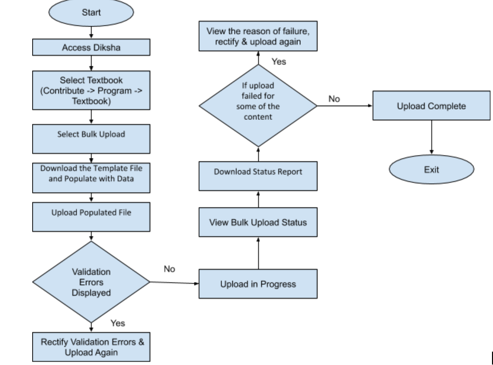

IntroductionContent Sourcing of ETB is the step of ETB process where states pool existing content from various sources or create new content relevant to the textbooks that are part of their ETB program scope. 

Following are the different ways content is sourced for ETB:

1. Upload existing content (pdfs, videos or html)
1. Reuse existing DIKSHA content
1. Create new content

However this content sourcing process is not textbook driven. The content is uploaded/created, reviewed and published outside the scope of ETB. Once published, they are linked to the relevant textbooks. This results in multiple issues:

1. Content contributors  do not have the right context when they create or upload content, resulting in content that may not be very relevant.
1. Content contributors have to explicitly tag the content with relevant board, medium, class,  subjects and topics based on the textbook for which the content is created.
1. ETB program administrators cannot track the progress of ETB - number of contents that are getting created, reviewed for each textbook.

To solve the above problems, the solution is to enable content contributors to contribute content (upload existing or create new) based on Textbooks under program scope. This process has been enabled as an experiment for CBSE. The same has to be enabled for all the states.

JTBDUse this section  to elaborate on:

*  **Jobs To Be Done: ** 
    1. As a content contributor I want to contribute relevant content for the textbooks under program scope. 
    1. As a content reviewer I want to review the content contributed for textbook under program scope.
    1. As a program admin I want to see the over all content dashboard for monitoring.

    
*  **User Personas:**  This story is relevant for Content contributor, content reviewer, program admin.

Requirement Specifications **Pre-requisites:** 

1. A state sets up an ETB program and defines the scope from back-end (same as existing functionality for CBSE).
1. The state configures textbook creators, textbook reviewers, content contributors and content reviewers for the program through back-end.
1. Textbook creators create or add ETBs to the program scope (as defined in the story: [SB-16761 System JIRA](https:///browse/SB-16761)). As long as mentioned story is not implemented, it will be done form back-end.

Contribution can be done either by contributing content to respective node of the textbook or through bulk upload.

Use Case 1: Content contribution for a textbook through bulk upload.Bulk upload option shall be available for a textbook under program. Bulk upload will be done only for a textbook at a time. A new role "Bulk content publisher" will be created in the system and a user with that role can only do Bulk upload and publishing of content. Textbook for which the bulk upload is being done must be in draft state. Multiple bulk upload can be done for a textbook, but not at the same time. Upon successful upload, content would be created, published and linked to relevant section of the textbook as mentioned in bulk upload file.

Overall Process Workflow

User Story: A new role "Bulk Content Publisher" is enabled in the system and a set of users are configured with this role for ETB ProgramSystem will enable a new role called "Bulk Content Publisher". A user with this role can perform the following actions:

1. Bulk upload content - This will create all content that is bulk uploaded and as well as publish it
1. Link content to a given Textbook - Link bulk uploaded content to Textbook sections

User Story: User accesses DIKSHA & selects required textbook under program for which bulk upload has to be doneMain Scenario: Valid user having content contributor and reviewer rights for a program access relevant textbook under program for which bulk upload has to be done.

| Srl. No. | User Action | Expected Result | 
|  --- |  --- |  --- | 
| 1 | User enters Diksha URL | Diksha page opens with sign in option. | 
| 2 | User enters valid credentials | User sign in and land on tenant home page | 
| 3 | User clicks on "Contribute" | Program list page opens which has all the programs created for the state. | 
| 4 | User selects required program | User lands on the textbook page. Page has all the books displayed under program scope. | 
| 5 | User selects the required textbook | Textbook TOC page opens which has contribution options both either to contribute at each node. There is also "Bulk Upload Content" option. | 

Exception Scenarios

| Srl. No. | Error / Exception | Expected Handling | 
|  --- |  --- |  --- | 
| 1 | User does not have any role assigned in the program | The program is not displayed in the list of Programs in the Program list page | 

User Story: User selects bulk upload optionMain Scenario: User selects bulk upload option for the first time for the textbook

| Srl. No. | User Action | Expected Result | 
|  --- |  --- |  --- | 
| 1 | In Textbook detail page, user clicks on "Bulk Upload Content" | Dialog box opens with following options"Upload File" - The option is enabled for user to upload file"Download Sample File" - The option is enabled for user to download sample file"Start Bulk Upload" - This option will be disabled by default. It will be enabled only once a bulk csv file is uploaded."Close" - The option is enabled for user close the bulk upload dialog | 

Alternate Scenario: User selects bulk upload option, after completing a previous bulk upload

| Srl. No. | User Action | Expected Result | 
|  --- |  --- |  --- | 
| 1 | In Textbook detail page, user clicks on "Bulk Upload Content" | Dialog box opens with following options"Upload File" - The option is enabled for user to upload bulk csv file"Download Sample File" - The option is enabled for user to download sample file"Last Upload Status" - Shows status of previous bulk upload process with following fields:
1.  **Status** 
1.  **Start Time** 

1.  **End Time** 

1.  **Total number of content** 

1.  **Content published and linked** 

1.  **Content failed** 

1.  **Content In progress (will be 0 as the bulk upload process is complete)** 

1. Link to download status report " **Download Report** "

"Start Bulk Upload" - This option will be disabled by default. It will be enabled only once a bulk csv file is uploaded."Close" - The option is enabled for user close the bulk upload dialog | 

Alternate Scenario: User selects bulk upload option, while a bulk upload process is in progress

| Srl. No. | User Action | Expected Result | 
|  --- |  --- |  --- | 
| 1 | In Textbook detail page, user clicks on "Bulk Upload Content" | Dialog box opens with following options"Upload File" - The option is disabled, and user cannot upload file"Download Sample File" - The option is enabled for user to download sample file"Last Upload Status" - Shows status of previous bulk upload process with following fields:
1.  **Status** 
1.  **Start Time** 

1.  **End Time** 

1.  **Total number of content** 

1.  **Content published and linked** 

1.  **Content failed** 

1.  **Content In progress (will be 0 as the bulk upload process is complete)** 

1. Link to download status report " **Download Report** "

"Start Bulk Upload" - This option will be disabled by default. It will be enabled only once a bulk csv file is uploaded."Close" - The option is enabled for user close the bulk upload dialog | 

Exception Scenarios

| Srl. No. | Error / Exception | Expected Handling | 
|  --- |  --- |  --- | 
| 1 | If user has only contribution rights but does not have "Bulk Content Publisher" role in the program. | Bulk upload option shall not be available for such users on textbook level. They can only contribute content one by one for respective node. | 

User Story 3: Populate Bulk Upload csv file and start upload Main Scenario: User uploads Bulk Upload CSV and upload process starts successfully

| Srl. No. | User Action | Expected Result | 
|  --- |  --- |  --- | 
| 1 | User selects "Upload File" option | File browser dialog opens for user to browse and select and bulk csv from her local system | 
| 2 | User browses selects bulk upload file from local system  | ."Start Bulk Upload" button is enabled | 
| 3 | User clicks on "Start Bulk Upload" | System validates the bulk csv is required format and upload process is started Last Upload Status will show the status as In Progress and other fields are updated.Once Bulk Upload is completed successfully, all the contents are published and linked to the textbook for the respective sections as given in the bulk csv file. | 

Alternate Scenario: User selects "Download Sample File" option

| Srl. No. | User Action | Expected Result | 
|  --- |  --- |  --- | 
| 1 | In Textbook detail page, user clicks on "Bulk Upload Content" | Dialogue box opens with option "Download Sample File" | 
| 2 | User clicks on "Download Sample File" option in dialogue box | Sample file gets downloadedLink to sample file: [https://docs.google.com/spreadsheets/d/1zo_KVAU3y_RR3p4Gpgud-geROZYXv9Efpgwdflszemc/edit#gid=0](https://docs.google.com/spreadsheets/d/1zo_KVAU3y_RR3p4Gpgud-geROZYXv9Efpgwdflszemc/edit#gid=0) | 

Exception Scenarios

| Srl. No. | Error / Exception | Expected Handling | 
|  --- |  --- |  --- | 
| 1 | In case file format contains errors that are detected before starting of upload process | Bulk Upload dialogue shows the list of validation errors (Refer validation error section in the last of this PRD for detail).The process is not started. User corrects the errors in the bulk csv file and click on the "Upload File" option again. User browses and selects the correct bulk csv.The main flow of this story executes.  | 

User Story 4: User views "Last Upload Status" sectionMain Scenario: User views "Last Upload Status" section of an ongoing bulk upload process

| Srl. No. | User Action | Expected Result | 
|  --- |  --- |  --- | 
| 1 | User upload correct bulk upload csv and starts Bulk Upload process. | Bulk upload process starts | 
| 2 | While upload is in progress user views the details in "Last Upload Status" section. | 
1. User sees the following fields:

The above status has to be refreshed every 60 secs. | 

Alternative Scenario: User views "Last Upload Status" section of a completed bulk upload process

| Srl. No. | User Action | Expected Result | 
|  --- |  --- |  --- | 
| 1 | User clicks on "Download Report" option in Last Upload Status section of Bulk Upload Dialog | 1. Once upload is complete,  " **Upload csv file** " button will be enabled. Now user can start a new upload.2. **Status** : There will be two types of complete status

3.Till the new upload is started, " **Last Upload Status** " will show the status of previous upload. **Note** : If the bulk csv contains a content that was already created previously, it will be considered as an error with reason as "Duplicate Content".  Hence in such scenario, the status will show "Completed with errors". | 

Alternative Scenario: User downloads Bulk Upload Status Report

| Srl. No. | User Action | Expected Result | 
|  --- |  --- |  --- | 
| 1 | User opens Bulk Upload Dialog where the last bulk upload process is complete | 
1. Status report (in csv file format) is downloaded to users local system
1. Status report would have the same set of columns as bulk csv along with following additional fields, for each row (representing each content)

    1.  **Upload Status** : Success, Fail, Yet to be processed

    1.  **Content Do_Id** : If success, than do id of the created content

    1.  **Reason of Failure** :  If the status is "Fail", then reason of failure. In case there are multiple reasons for failure, display each of them by numbering them in the same cell for each row.

    

 | 

Exception Scenarios: Bulk upload Process is "Aborted"

| Srl. No. | Error / Exception | Expected Handling | 
|  --- |  --- |  --- | 
| 1 | Bulk Upload process takes more than 24 hours to complete | The upload process is aborted. Last Upload Status section will have following values
1.  **Status ** - This shows the status as "Aborted"
1.  **Start Time** - The time when the upload process is started

1.  **End Time -** The time when the process is aborted

1.  **Total number of contents ** - Total number of content in bulk csv file

1.  **Number of contents processed successfully**  - Contents that have been successfully published and linked to the textbook

1.  **Number of contents failed**  - Contents that had errors while processing

1.  **Number of contents yet to be processed ** - Content that are yet to be processed (in this case they are not processed)

 | 

Wire framesWire frame link: [https://projects.invisionapp.com/share/7QST139948N#/screens/374220905](https://projects.invisionapp.com/share/7QST139948N#/screens/374220905) 

Localization RequirementsThere are no localization requirements for UI. UI is only in English.

However, the Bulk Upload CSV should support values in Indian languages for fields like - Content Name, Description, Textbook Level names, Topics, Keywords etc - where the fields can be in Indian languages. The values are expected to be in Unicode.

Telemetry Requirements

| Event Name | Description | 
|  --- |  --- | 
| Click on button "Bulk Upload" option in Textbook ToC page | Parameters to be captured for this events are: Time stamp, user id, tenant id, textbook id, program id | 
| Click on "Start Upload" option in Bulk Upload dialog | Parameters to be captured for this events are: Time stamp, user id, tenant id, textbook id, program id | 
| Download of sample template file option in Bulk Upload dialog | Parameters to be captured for this events are: Time stamp, user id, tenant id, textbook id, program id | 
| Click on "Close" button in Bulk Upload dialog | Parameters to be captured for this events are: Time stamp, user id, tenant id, textbook id, program id | 
| Download of "Status Report" button in Bulk Upload dialog | Parameters to be captured for this events are: Time stamp, user id, tenant id, textbook id, program id | 
| Click on "Last Uploaded File" | Parameters to be captured for this events are: Time stamp, user id, tenant id, textbook id, program id | 
| Start of Bulk Upload Process in the back-end | Parameters to be captured for this events are: Time stamp, user id, tenant id, textbook id, program id, number of contents, unique process id | 
| End of Bulk Upload Process in the back-end | Parameters to be captured for this events are: Time stamp, user id, tenant id, textbook id, program id, number of contents, unique process id, status (completed successfully, completed with errors, aborted) | 

Non-Functional Requirements

| Performance / Responsiveness Requirements | Load/Volume Requirements | Security / Privacy Requirements | 
|  --- |  --- |  --- | 
| Maximum expected time for bulk upload process to complete - 8 hours. 9.6 seconds per content. | A bulk csv file can have maximum 1000 contents  | N/A | 
| Time to complete creation, publish and linking one content:Average 13 secs Maximum: 30 secs | Concurrency: System should support up to 100 concurrent bulk uploads. Beyond that, it should be scalable by scaling infra |  | 

Impact on other Products/SolutionsN/A

| Product/Solution Impacted | Impact Description | 
|  --- |  --- | 
|  |  | 

Impact on Existing Users/Data N/A

| User/Data Impacted | Impact Description | 
|  --- |  --- | 
|  |  | 

Key Metrics

| Srl. No. | Metric | Purpose of Metric | 
|  --- |  --- |  --- | 
|  | <ul><li>Total number of bulk upload content requests in given a time period (overall and per tenant)</li><li>Total number contents that are published through bulk upload in given a time period (overall and per tenant)</li><li>Total number bulk upload contents for a Grade (can have multiple subject and multiple textbook)</li><li>Average, Medium, Min and Max time taken for - entire bulk upload process, per content upload</li><li>% of Bulk upload processes - successfully completed, completed with errors, aborted</li><li>Average number of times users download status report per bulk upload process</li></ul> | To have clear view and understanding about the content being uploaded for a textbook and subsequently for a program. It would help to achieve target driven contribution objectives. | 

Validations **General Rules:** 

1. Textbook for which the bulk upload is being done must be in draft state. 
1. Before any validation/processing, space trimming should be done for preceding and trailing value of each cell.
1. Validation must be done before the content creation for each row. For example system should read the entire row, in case any mandatory cell value is missing, fail the content creation for that row and display with error message in status report.  

| Error / Exception | Expected Handling | 
|  --- |  --- | 
|  **Validations at the time of bulk sheet upload (Results in Validation Errors)**  | 
| In case any mandatory column is missing, validation error should be thrown. Mandatory columns: Name of the content,  Audience, Author, Copyright, Icon, File Format, File path, content type, Level 1 Textbook Unit | Error Message to Display:"Following mandatory columns are missing in input sheet: XXX, YYY, ZZZ." | 
| Number of content in input sheet should not be more than 1000.  | Error Message to Display:Input sheet should not have more than 1000 content. | 
|  |  | 
|  **Validations while processing each row for creating each content (Results in Content Creation Failure)**  | 
| In case already successfully uploaded content is being uploaded again. Duplication of content shall be checked on the basis of following parameters:Combination of Channel, Board, Medium, Grade, Subject Content Name should be unique.(Note: Channel, Board, Medium, Grade, Subject values are adopted from the values of Textbook) | System should fail the upload of such content with following error message: "Duplicate Content"   | 
| Validation regarding mandatory fields should be checked while processing each row, in case cell value is missing fail that creation of that content | Error message should be displayed in cell of the column "Reason For Failure" as:"Following mandatory fields are missing: XXX, YYY." | 
| File format: Validate the given file is in one of the supported formats by the system (all formats supported through "Upload Content" option of individual content) | Error message should be displayed in cell of the column "Reason For Failure" as:"Invalid file format" | 
| Validate given file format matches with format specified in File Format field. If it doesn't match give error | Error message should be displayed in cell of the column "Reason For Failure" as:"File doesn't match with the mentioned format" | 
| File Size: Each content should not be more than 50 MB. | Error message should be displayed in cell of the column "Reason For Failure" as:"File size is more than 50 MB" | 
| Icons and files to be put in google drive and to share google drive links in the respective field. Please ensure Google Drive links are correct and having view access to all permissions. Else give error | Error message should be displayed in cell of the column "Reason For Failure" as:"Unable to access file at google link" OR"Unable to access file at google link" | 
| Bulk csv sheet should not have two contents with same following values:Content Name | In case already created content is found again in further rows of the same input sheet, treat it as duplicate and display following error as reason for failure:"Duplicate Content" | 
| Multiple contents in one single row is strictly not allowed. Only one content must be shared in one row. | Error message should be displayed in cell of the column "Reason For Failure" as:"Multiple content values in a single row" | 
| Topic field values should follow the framework/taxonomy of the tenant. | Error message should be displayed in cell of the column "Reason For Failure" as:"Invalid Topic" | 
| Image icon should not be more than 1 MB and must be in png, jpg/jpeg format | Error message should be displayed in cell of the column "Reason For Failure" as:for icon image size: "Image icon size is more than 1 MB"for icon image format: "Icon image is not of png, jpg or jpeg format" | 
| Check Textbook hierarchy as given in "Level" columns exist in the given textbook. If not, give error | Error message should be displayed in cell of the column "Reason For Failure" as:"Incorrect values in Textbook Levels" | 
| Content Type: Value in Content type field should be one of the values configured in the current program. If not, give error | Error message should be displayed in cell of the column "Reason For Failure" as:"Incorrect Content Type" | 
| System Error | This is not a validation error. But, if any system error occurs while processing the content, error message should be displayed in cell of the column "Reason For Failure" as:"System error: <<the error message thrown by the system>>" | 

Assumptions
1. :Level columns in bulk csv file contain textbook unit names.
1. Textbook unit names - There are NO two textbook units with same name and with same hierarchy (levels). In case they are present, system takes the first one to link
1. Topics and Keywords - More than one topics or keywords are separated by commas. They do not contain commas within them

1. Through bulk upload process, the content is always linked to the given textbook. NO content is removed from textbook through this process
1. It is assumed that the textbook for which bulk upload happens is not simultaneously edited using textbook editor during the process. Parallel editing of textbook might delete the linked content through bulk upload
1. In case a row in bulk csv has more than one validation errors, only the first error detected will be given in the error message field
1. Bulk upload process does NOT stop if an error occurs in validation of a specific row or during processing of a specific row. It proceeds with other rows.
1. Board, Medium, Grade, Subject values are taken from corresponding values of Textbook and populated in all the uploaded content.

Use Case 2: Creation of interactive practice questions and linking to ETBs under program scopeCurrently interactive practice questions (MCQs, FTB etc) can be created and published by content editor through work space. We are heading towards program driven content contribution approach where we look forward to create such interactive content under program scope. This use case defines creation, review and linking of interactive contents to textbook under program. User having contribution role for a program can create such content. User having review role for a program can review such content. Upon successful review and acceptance, content shall be published and linked to respective section of textbook. 

 **Prerequisites** :

1. User with contributor role can contribute to program. She must be given contributor role explicitly within the program.
1. User with reviewer role can review the content for a program. She must be given contributor role explicitly within the program.
1. Program, scope of the program, Textbooks set up for contribution & valid user creation for contribution and review should have done prior to contribution.
1. Textbook for which contribution is happening must be in draft state. 

Overall Process WorkflowThe over all workflow process could be broadly viewed in two parts 'contribution' and 'review'. 

User Story: Contributor logs in to DIKSHA & select the textbook for contributionMain Scenario: User to select the designated textbook for which the contribution has to be made

| Srl. No. | User Action | Expected Result | 
|  --- |  --- |  --- | 
|  | Authorized user access Diksha portal  | Diksha portal opens | 
|  |  User enters valid credentials  | sign in to Diksha portal state tenant page | 
|  | User clicks on "Contribute" | Program list page opens which has all the programs created for the state. | 
|  | User selects required program | User lands on the textbook page. Page has all the books displayed under program scope. | 
|  | User selects the required textbook | Textbook structure (TOC) page opens which has contribution (Add/contribute) option for each node | 

Exception Scenarios

| Srl. No. | Error / Exception | Expected Handling | 
|  --- |  --- |  --- | 
|  | In case user does not have contributor right for one or more programs | The programs list only displays programs in which the user has a role (contributor or reviewer) configured in it.If the user doesn't have a role in any of the programs, it will display a message "No Programs available" | 

User Story: Select interactive content type from content platter to contributeMain Scenario: User to select which type of content she wants to contribute. In this case it is interactive content. 

| Srl. No. | User Action | Expected Result | 
|  --- |  --- |  --- | 
|  | Upon reaching on textbook level. Option available for each node to "Contribute". User clicks on it. | A dialogue box opens to select which type of content user willing to contribute. This platter has only those type of content types which are defined for this program scope.The content types are:

 | 
|  | User selects "Practice Content (Interactive)" | Content Editor opens to allow user to create content. This is mapped to ECML mime type.  | 

User Story : User creates content and savesMain Scenario: Contributor creates content in editor, saves it

| Srl. No. | User Action | Expected Result | 
|  --- |  --- |  --- | 
|  | When user clicks on "Practice Content (Interactive)" option from the content platter | Content is created and linked to the textbook. The content will have following attributes:
1. Name - Untitled
1. B, M, G, S - As taken from the textbook
1. Content Type - Practice Content (Interactive)

Content Editor is opened. User can edit the content through (all functionality as supported by current content editor)."Edit Details" page will show the above values auto-populated and the following fields have to be disabled for edit (user cannot change these values):
1. B, M, G, S - As taken from the textbook
1. Content Type - Practice Content (Interactive)

Note:  Practice Content (Interactive) is the display label for the content type: "PracticeContent" defined in the current system. | 
|  | User clicks on 'Save'  | Content is saved.  | 
|  | User closes the content editor | User returns to the Textbook ToC page of the program from which the content editor is launched.User sees the content row added to the corresponding section in the textbook and is in "Draft" state. There is an "Edit" option (same UI as in the current Program flow) | 

User Story : User edits content, saves and send for reviewMain Scenario: Contributor edits an existing content in editor, saves it and sends for review

| Srl. No. | User Action | Expected Result | 
|  --- |  --- |  --- | 
|  | User opens the Textbook ToC page. | User sees the content row added to the corresponding section in the textbook and is in "Draft" state. There is an "Edit" option (same UI as in the current Program flow). | 
|  | User clicks on "Edit" option | Content Editor is opened. User can edit the content through (all functionality as supported by current content editor)."Edit Details" page will show the above values auto-populated and the following fields have to be disabled for edit (user cannot change these values):
1. B, M, G, S - As taken from the textbook
1. Content Type - Practice Content (Interactive)

Note:  Practice Content (Interactive) is the display label for the content type: "PracticeContent" defined in the current system. | 
|  | User clicks on 'Save'  | Content is saved.  | 
|  | User clicks on "Send for review" | Saved content is sent for review"Details page" of send for review will show the following fields auto-populated and are disabled for edit (user cannot change these values):
1. B, M, G, S - As taken from the textbook
1. Content Type - Practice Content  (Interactive)

 | 
|  | User closes the content editor | User returns to the Textbook ToC page of the program from which the content editor is launched.User sees the content row updated with "Review in Progress" state. There is an "Preview" option (same UI as in the current Program flow). | 

User Story 4: Reviewer logs in to DIKSHA & select the textbook for review.Main Scenario: User to select the designated textbook for which the review has to be done.

| Srl. No. | User Action | Expected Result | 
|  --- |  --- |  --- | 
|  |  User with Review role in the program signs into DIKSHA portal. | User sees "Contribute" option in the portal page. | 
|  | User selects the Contribute option | List of available programs are displayed | 
|  | User selects required program | User lands on the Review page. Page has all the books displayed under program scope. | 
|  | User selects the required textbook | Textbook structure (TOC) page opens which has all the contents contributed for each node | 

Exception Scenarios

| Srl. No. | Error / Exception | Expected Handling | 
|  --- |  --- |  --- | 
|  | In case user does not have reviewer right for one or more programs | The programs list only displays programs in which the user has a role (contributor or reviewer) configured in it.If the user doesn't have a role in any of the programs, it will display a message "No Programs available" | 

User Story 5: Review of contributed contentThe functionality of this user story is exactly same as that of the Review flow in current Program

Main Scenario: Reviewer accepts/rejects the content and provide remarks for rejection only

| Srl. No. | User Action | Expected Result | 
|  --- |  --- |  --- | 
|  | On textbook level, reviewer can filter the contents to be reviewed by selecting chapter from drop down. | Upon selecting the chapter in drop down, only those contents should be displayed which are contributed to that chapter. | 
|  | Reviewer selects content to be reviewed | Content detail page opens | 
|  | Reviewer clicks on preview | Content preview opens | 
|  | Reviewer accepts the content | Content is published. In the Textbook ToC page of the program user sees the content row updated with "Published" state. There is an "Preview" option (same UI as in the current Program flow). | 

Alternate Scenario

| Srl. No. | User Action | Expected Result | 
|  --- |  --- |  --- | 
|  | Reviewer rejects the content | Dialogue box opens to capture the reviewer's remark | 
|  | Reviewer enters the remarks and submit | Content rejected and remark sent to contributor.In the Textbook ToC page of the program user sees the content row updated with "Rejected" state. There is an "Edit" option (same UI as in the current Program flow). | 

Exception Scenarios

| Srl. No. | Error / Exception | Expected Handling | 
|  --- |  --- |  --- | 
|  | Reviewer rejects the content without remarks | Error message displayed that providing remark for rejecting the content is mandatory. | 

Localization RequirementsNA

Telemetry Requirements

| Event Name | Description | 
|  --- |  --- | 
|  |  | 
| Content type selection from content platter  | Parameters to be captured for this events are: Time stamp, user id, program id, textbook id, content type | 
| Open Content Editor | Parameters to be captured for this events are: Time stamp, user id, program id, textbook id, content type | 
| User click on 'save', 'send for review' button in editor | Parameters to be captured for this events are: Time stamp, user id, program id, textbook id, content type | 
| Reviewer click on content to review it | Parameters to be captured for this events are: Time stamp, user id, program id, textbook id, content id, content type | 
| Reviewer click on 'preview' button | Parameters to be captured for this events are: Time stamp, user id, program id, textbook id, content id, content type | 
| Reviewer click on Accept/Publish button | Parameters to be captured for this events are: Time stamp, user id, program id, textbook id, content id, content type | 
| Reviewer click on Reject/Request Change button | Parameters to be captured for this events are: Time stamp, user id, program id, textbook id, content id, content type | 

Non-Functional RequirementsUse this section to capture non-functional requirements in the following table. To add or remove rows in the table, use the table functionality from the toolbar.    

| Performance / Responsiveness Requirements | Load/Volume Requirements | Security / Privacy Requirements | 
|  --- |  --- |  --- | 
| Follow the DIKSHA standards for performance and responsiveness in terms of event response and page load. |  | N/A | 
|  |  |  | 
|  |  |  | 

Impact on other Products/Solutions

| Product/Solution Impacted | Impact Description | 
|  --- |  --- | 
| View of a textbook under work space which is open for contribution in a program | Only textbook owner/creator can view the textbook under work space.Textbook displays all the contents which have been published and linked to textbook node.In case a Textbook has draft content linked to the textbook through Program:<ul><li>When user clicks on "Send for Review" button, display an error message: "This textbook has some contents linked that are not yet published. Please go to "Programs" view and check"</li></ul> | 

Key Metrics

| Srl. No. | Metric | Purpose of Metric | 
|  --- |  --- |  --- | 
|  | Number of Interactive Practice Content created, reviewed and published through Programs | To have clear view and understanding about the content being uploaded for a textbook and subsequently for a program. It would help to achieve target driven contribution objectives. | 
|  |  |  | 

### Validations

| . | Error / Exception | Expected Handling | 
|  --- |  --- |  --- | 
|  | In case textbook is in publish state and is in scope for state program. | Textbook instance shall not be available under program for contribution. | 
|  | Content sent for review, user wants to make changes in it. | Content which are in draft state, can only be edited. Once sent for review or published can not be edited. | 
|  |  |  | 

*****

[[category.storage-team]] 
[[category.confluence]] 
