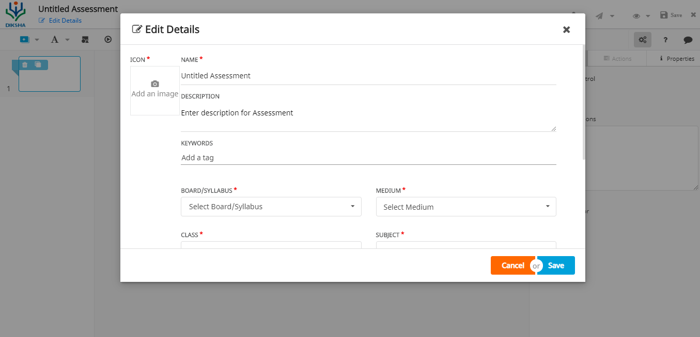
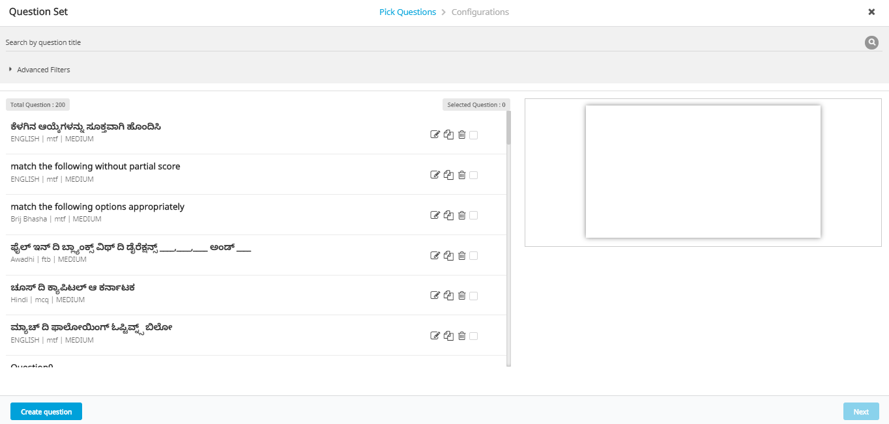
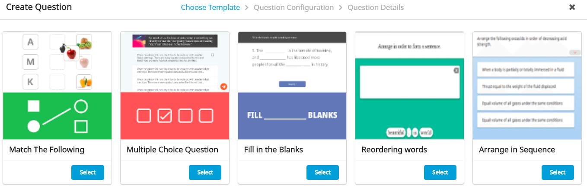

IntroductionThe current platform capability enables creators to create practice questions, add them into courses and enable users to learn and practice. There has been an increasing number of asks from states to enable them to judge competency levels of teachers after completing an unit or all units in the course so that they can reward the teachers who have met the criteria set by the state.

To address these problems, in the next couple of releases, we are proposing changes to the platform to provide an opportunity for the course creators & stakeholders to a) gauze the content quality and b) validate teacher's learning.

At a high level, the objective of this work stream is to integrate assessments as a key TPD course component thereby enabling:

* course creators to design courses which include evaluation of learners’ understanding
* course creators to configure course assessments per their pedagogical needs 
* users to consume the course assessments per the defined configurations
* course mentors to view learners’ assessment performance and provide interventions

Creation of course assessments - User Story 1 OverviewAs a content creator, I should be able to create and publish question sets within a course which are consumed as self-assessments by users enrolled in courses.

 **Prerequisites:** 

1. Should have creation rights

 **Workflow:**   

 **Creation of self-assessments** 

Step1: Course assessments will be created and published as practice question set:

1. Creator to include a instruction slide manually
1. Creator to include the summary plugin the last slide

Step2: Tag the practice question sets as content type 'Self Assess'

1. Backend script is run to change the content type to 'Self Assess'

Step3: Course creator adds the assessment to course ToC page

1. New type called 'Self Assessment' will be displayed when the creator clicks on 'Add Resource'

 **Editing the published self-assessments** 

Editing the questions will follow the current process

 **Note:** 

1. Content type ‘Self Assess’ should not be discoverable under resources/library for content consumers

DesignsExisting program portal will be customized per the above workflow

[https://projects.invisionapp.com/share/69TXKXJ54DW#/screens/384055667](https://projects.invisionapp.com/share/69TXKXJ54DW#/screens/384055667)

JIRA Ticket ID[SB-14832 System JIRA](https:///browse/SB-14832)

Creation of Self Assessment from Workspace - User Story 2 OverviewJIRA Ticket ID[SB-15838 System JIRA](https:///browse/SB-15838)

 **Context** 

Currently an Assessment is created as a two step process and most of the activities are done in the back end. A content is created with type as "Resource" which is reviewed and published and later the content type is changed to "Self-Assess” and made available to the user. Instead, the whole creation and publishing process should happen from the portal, without back end team's support 

 **As a Content creator, I should be able to create and publish a Course-Assessment, So that it can be used in a Course for consumption** 

 **Acceptance criteria** 

 **Pre-conditions** 

1. Logged in user has access to create content

 **Workflow to enable 'Self Assess' in the workspace** 

1. The option to create 'Self Assess' content type questions is not enabled by default to all tenants.
1. This content type has to be enabled on request basis
1. This option will be enabled by the implementation team 

 **Main Workflow** 

Verify that

1. User is able to see an option ("Course Assessment") in the work space to create "Self - Assess" content

1. Self Assess creation process is similar to the resource creation process (Refer UI design)

1. The Summary plug in automatically gets created. This should be displayed for the user in preview, review mode and also after it gets published. There is no need for the creator to manually add it in the third slide during creation
1. The below gets displayed in the preview mode
    1. Instructions (if it exists)
    1. Questions
    1. Summary details
    1. Score details

    
1. The "Self - Assess" content goes through the existing Save, Review, Preview and Publish workflows - Draft, All my content, Submitted for Review, Published, Up for Review. Note: The existing table/card structure display (as applicable) will be retained for these views with the content type name shown as "Course Assessment"
1. The "Self-Assess" content can be updated and re-published similar to Resources
1. The "Self-Assess" content is not available under Library/Resources for content consumers

 **Exceptional workflow** 

The older Self Assess content will retain the existing behavior

 **Flow diagram** 

 **UI Design** 

[https://projects.invisionapp.com/share/69TXKXJ54DW#/screens/384055667](https://projects.invisionapp.com/share/69TXKXJ54DW#/screens/384055667)

Edit details page for Assessment is not included in the invision link. Hence calling this out separately

Ability for the Content creator to search & add Self-Assess content during course creation - User Story 3 OverviewJIRA Ticket ID[SB-16723 System JIRA](https:///browse/SB-16723)

 **Context** 

As a Content Creator, I should be able to search for a Course Assessment during course creation, So that the same can be linked/added to a Course

 **Acceptance criteria** 

 **Pre-conditions** 

a) Logged in user has access to create content

b) Course Assessments are published

c) User clicks "Add resource"

 **Main Workflow**  **Verify that** 

1. The user is able to search a “Self-Assess” content with the Assessment do-id or Assessment title
1. The user is able to select the “Self-Assess” content and add to a Course 

 **Flow diagram** 

 **UI Design** 

[https://projects.invisionapp.com/share/69TXKXJ54DW#/screens/384055667](https://projects.invisionapp.com/share/69TXKXJ54DW#/screens/384055667)

## Make Course Assessment creation completely self serviceable - User story 4 Overview
JIRA Ticket ID[SB-17589 System JIRA](https:///browse/SB-17589)

 **Context:** 

This is in continuation to SB-15838. Course Assessments currently support only MCQ template. This should be extended to the remaining templates as well - Match the following, Fill in the blanks, Reordering words, Arrange in sequence. 

 **As a Content creator, I want to be able to select and use multiple templates (in addition to MCQ), So that Course Assessment gets more user friendly and interesting for consumption** 

 **Pre-conditions** 

1. Logged in user has access to create content

1. Logged in user has clicked "Question set" icon to create Course Assessment

 **Acceptance criteria** 

When creating new Questions/selecting questions from the existing list:

When editing Question set:

 **Verify that:** 

1. When selecting questions from the existing list,
    1. User is able to select any type of Question/s from the list (Multiple Choice Questions, Match the following, Fill in the blanks, Reordering words, Arrange in sequence) and add to the Question set

    
1. When creating new Question/s,
    1. User is able to select any of the five templates (Multiple Choice Questions, Match the following, Fill in the blanks, Reordering words, Arrange in sequence) and create Question/s

    
1. Before Adding the Questions to the Course Assessment,
    1. "Shuffle Questions" option is disabled by default. However the user can choose to enable, if required
    1. "Show Immediate Feedback" is disabled by default, However the user can choose to enable, if required
    1. "Display" option should be disabled/removed

    
1. Note: The created Course Assessment (content type "Self-Assess") should be available in All my content, Draft, Submitted for Review, Up for Review, Published sections as it exists today. There are no changes to the current behavior
1. The above (Sl.no:1-3) criteria holds good even while editing the Assessment
1. Every question with a right or wrong answer is considered as "attempted". Anything left blank or answered and later removed/left blank is considered as "skipped"

 **Refer the below screen shots for reference** . 

 **When selecting Question/s from the existing list:** 

 **When creating a new Question:** 

Localization RequirementsUse this section to provide requirements to localize static content and/or design elements that are part of the UI in the following table. Localization of either the framework, content or search elements should be elaborated as a user story. To add or remove rows in the table, use the table functionality from the toolbar.    

| UI Element | Description | Language(s)/ Locales Required | 
|  --- |  --- |  --- | 
| Mention the UI Element that requires localization. e.g. Label, Button, Message, etc.  | Provide the exact details of the element that requires localization. e.g. User ID, Submit, 'The content is currently unavailable'  | Mention all the languages or locales for which localization is required  | 
| Assessment (under create tab in workspace) | Assessments is mapped to content type 'Self-assess'. Creators who want to include course assessments in their courses will create 'Assessments'. Hence the need to translate this to all supported languages | All languages supported in the platform | 
|  |  |  | 
|  |  |  | 

Telemetry RequirementsUse this section to provide requirements of the events for which telemetry should be captured. To add or remove rows in the table, use the table functionality from the toolbar.    

| Event Name | Description | Purpose | 
|  --- |  --- |  --- | 
| Mention the event that will generate telemetry and which needs to be captured.  | Provide event details. e.g. clicking upload for textbook taxonomy  | Provide a reason why the event telemetry should be captured.  | 
| Click on 'Create Course Worksheet (portal) |  | Track how many times and when (during the day) users are clicking on 'Course Worksheet' so that we can get insights into: a) the usage of this feature and b) time of usage (is it used in the morning, afternoon or late evening post school hours etc)Track worksheets by their status (draft, live, pending review and rejected) so that we know - a) the elapsed time before creator sends the worksheet for review or the time taken to publish a worksheet | 
| Note - this content type reuses existing 'Create Resource'. Hence the existing telemetry events should be retained as is.  |  |  | 
| Click on 'Assessment' |  | Track how many times and when (during the day) users are clicking on 'Course Assessment' so that we can get insights into: a) the usage of this feature and b) time of usage (is it used in the morning, afternoon or late evening post school hours etc)Track Assessment by their status (draft, live, pending review and rejected) so that we know - a) the elapsed time before creator sends the assessment for review or the time taken to publish a assessment | 
| When "shuffle questions" option is turned ON during Assessment creation |  | Track how many Assessments are created with this option turned ON, to get insights on the usage of this feature | 
| "Show Immediate Feedback" option is turned ON during Assessment creation |  | Track how many Assessments are created with this option turned ON, to get insights on the usage of this feature | 

Non-Functional RequirementsUse this section to capture non-functional requirements in the following table. To add or remove rows in the table, use the table functionality from the toolbar.    

| Performance / Responsiveness Requirements | Load/Volume Requirements | Security / Privacy Requirements | 
|  --- |  --- |  --- | 
| Provide the perfomance or the responsivenes required from the system to ensure that the Use Case is effective.  | Provide the load or volume required from the system to ensure that the Use Case is effective. | Provide security and privacy requirements for an effective Use Case  | 
| A course can have, on an avg, 5 assessments with each assessment having approx. 10 questions.  |  |  | 

Impact on other Products/SolutionsUse this section to capture the impact of this use case on other products, solutions. To add or remove rows in the table, use the table functionality from the toolbar.    

| Product/Solution Impacted | Impact Description | 
|  --- |  --- | 
| Specify the name of the product/solution on which this use case has an impact  | Explain how the product/solution will be impacted. | 
|  |  | 

Impact on Existing Users/Data Use this section to capture the impact of this use case on existing users or data. To add or remove rows in the table, use the table functionality from the toolbar.    

| User/Data Impacted | Impact Description | 
|  --- |  --- | 
| Specify whether existing users or data is impacted by this use case  | Explain how the users/data will be impacted. | 
|  |  | 

Key MetricsSpecify the key metrics that should be tracked to measure the effectiveness of this use case in the following table. To add or remove rows, use the table functionality from the toolbar 

| Srl. No. | Metric | Purpose of Metric | 
|  --- |  --- |  --- | 
|  | Specify the metric to be tracked  | Explain why this metric should be tracked. e.g. tracking this metric will show the scale at which the functionality is used, or tracing this metric will help measure learning effectiveness, etc.  | 
|  |  |  | 

*****

[[category.storage-team]] 
[[category.confluence]] 
