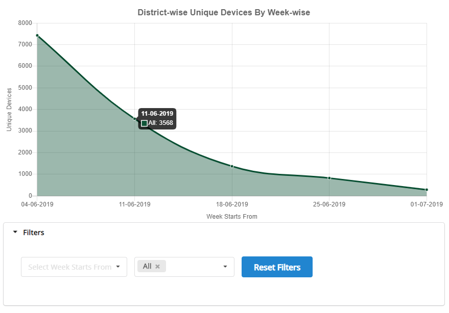

IntroductionThis report provides details of Diksha usage in terms of QR code Scans, Unique devices, and Content play for each district of a state. Usage status will be displayed in the graphs with a weekly basis and monthly basis. This report is updated on date 1st of every month for a monthly basis graph and every 1st day (Monday) of the week for weekly basis graph.  **_The data and dashboards are state-specific._** 

JTBDUse this section  to elaborate on:


*  **Jobs To Be Done: ** As a state admin, the performance of each district of the state such as consumption, failures in ETB on a monthly basis should be monitored.
*  **User Personas:**  The logged-in users who have State Admin role, report viewer role can access this report.
*  **System or Environment:**  works on for desktops with Chrome browser only.

 **District-wise Weekly Report over time**  **Description:** This graph provides overall consumption data on a weekly basis (i.e; from Monday to Sunday ) over a period of one year and should be generated every Monday  for that state.

 **Details:**  In this report, we will be displaying the total QR scans data (portal + app) on a weekly for that state. This data is calculated by the district wise. 


* This report provides 3 consumption datasets
    * Total no of QR Code Scans
    * Unique devices in that district for that state. 
    * Total no of content plays

    
* For each dataset, the Graph should be created and it should have a district-wise filter option.
* This report should be calculated over a period of time.
* If no district is selected in the filter, Overall data should be displayed.
* This data is calculated based on the user location

 **Definition of User Location** :

System should use the following data in the given order of priority to get the location data. This applies to both Mobile App and Portal:


1. If user is an anonymous user: Use the state, district information explicitly provided by the user


1. If usage is by a logged in user: Use the state, district information in user profile


1. In either of the above two cases, if there is no state, district information: Use IP based state/town information from MaxMind + (City to District Mapping given by States)


 **Graph:** 



   **Graph description:** 


* The x-axis should represent the last date (Sunday) of the week and in Y-axis should represent a total count.
* Whenever the users go on to the graph, they will be able to see overall data of the state. District wise filter should be enabled and the user should be able to get the data by filtering the district name whenever needed. 
* All the district values should be shown in the dropdown.

 **Table:** 


|  |  **Total unique devices that used Diksha App**  |  **Total unique devices that used Diksha Portal**  |  **Total unique devices that used Diksha on (APP + Portal)**  |  **Total no of QR codes scans on APP**  |  **Total no of QR code access via Portal **  |  **Total no of QR codes scans (APP + Portal)**  |  **To no of  content Plays on App**  |  **To no of  content Plays on Portal**  |  **Total no of  content plays on both (APP+ Portal)**  |  **Data as on Last day (Sunday) of the week**  | 
| District 1 | 1000 | 47 | 1047 | 678 | 10 | 688 | 10000 | 500 | 10500 |   | 
| Unknown | 1678 | 67 | 1742 | 589 | 40 | 629 | 20000 | 5000 | 25000 |   | 
| ALL | 2678 | 114 | 2789 | 1267 | 50 | 1317 | 30000 | 5500 | 35500 |   | 
| District 1 | 1000 | 47 | 1047 | 678 | 10 | 688 | 10000 | 500 | 10500 |   | 
| Unknown | 1678 | 67 | 1742 | 589 | 40 | 629 | 20000 | 5000 | 25000 |   | 
| ALL | 2678 | 114 | 2789 | 1267 | 50 | 1317 | 30000 | 5500 | 35500 |   | 

 **Table description:** 

 **District Name:** All the districts in the state should be shown.

 **Unique Devices:** Total no of unique devices opened Diksha in that district from that state   

Logic


* APP: Total no of unique devices used Diksha APP in that week from that district in that state.
* Portal: Total no of unique devices used Diksha portal on the web (i.e; in Desktop and mobile web) in that week from that district in that state. 
* Total: APP + Portal

 **Total no of QR code scans:** Total no of QR code scans which include both APP and portal.

Logic


* APP: Total no of  QR code scans (from Diksha or different app) from those unique devices of that week from that district in that state.
* Portal: Total no of  QR code scans from those devices in GET page (i.e; in Desktop and mobile web) in that week from that district in that state. 
* Total: APP + Portal

 **NOTE: Total scans include both Successful scans and Failed scans.** 

 **Total no of content plays:** Total no of content plays which include both APP and portal.

Logic


* APP: Total no of content plays of both (Online and Download play) from those unique devices in that week from that district in that state.
* Portal: Total no of  content plays from those unique devices  (i.e; in Desktop and mobile web) in that week from that district in that state. 
* Total: APP + Portal

 **Updated on:** The date when the data got updated 


 **Points to be considered** 


* In this table, each week data should be added next to the previous week data and so on.
* In case, If there is no mapping available for any of the city to the district, the district cell will display as "Unknown". However corresponding data will be shown in week cell.


LogicData Source: Druid

Start Date, End Date and State Name are programmatically replaced in the script.


```js
{
  "queryType": "groupBy",
  "dataSource": {
    "type": "table",
    "name": "telemetry-events"
  },
  "intervals": {
    "type": "intervals",
    "intervals": [
      "start_date/end_date"
    ]
  },
  "filter": {
    "type": "and",
    "fields": [
      {
        "type": "selector",
        "dimension": "actor_type",
        "value": "User",
        "extractionFn": null
      },
      {
        "type": "in",
        "dimension": "context_pdata_id",
        "values": [
          "prod.diksha.app",
          "prod.diksha.portal"
        ],
        "extractionFn": null
      },
      {
        "type": "selector",
        "dimension": "device_loc_state",
        "value": "state_name",
        "extractionFn": null
      }
    ]
  },
  "granularity": {
    "type": "all"
  },
  "dimensions": [
    {
      "type": "default",
      "dimension": "device_loc_district",
      "outputName": "District",
      "outputType": "STRING"
    },
    {
      "type": "default",
      "dimension": "context_pdata_id",
      "outputName": "Platform",
      "outputType": "STRING"
    }
  ],
  "aggregations": [
    {
      "fieldName": "context_did",
      "type": "distinctCount",
      "name": "Unique Devices"
    }
  ],
  "postAggregations": [],
  "having": null,
  "limitSpec": {
    "type": "NoopLimitSpec"
  },
  "context": {},
  "descending": false
}
```


```js
{
  "queryType": "groupBy",
  "dataSource": {
    "type": "table",
    "name": "telemetry-events"
  },
  "intervals": {
    "type": "intervals",
    "intervals": [
      "start_date/end_date"
    ]
  },
  "filter": {
    "type": "and",
    "fields": [
      {
        "type": "selector",
        "dimension": "eid",
        "value": "SEARCH",
        "extractionFn": null
      },
      {
        "type": "not",
        "field": {
          "type": "selector",
          "dimension": "edata_filters_dialcodes",
          "value": null
        }
      },
      {
        "type": "in",
        "dimension": "context_pdata_id",
        "values": [
          "prod.diksha.app",
          "prod.diksha.portal"
        ],
        "extractionFn": null
      },
      {
        "type": "selector",
        "dimension": "device_loc_state",
        "value": "state_name",
        "extractionFn": null
      }
    ]
  },
  "granularity": {
    "type": "all"
  },
  "dimensions": [
    {
      "type": "default",
      "dimension": "device_loc_district",
      "outputName": "District",
      "outputType": "STRING"
    },
    {
      "type": "default",
      "dimension": "context_pdata_id",
      "outputName": "Platform",
      "outputType": "STRING"
    }
  ],
  "aggregations": [
    {
      "type": "count",
      "name": "Number of QR Scans"
    }
  ],
  "postAggregations": [],
  "having": null,
  "limitSpec": {
    "type": "NoopLimitSpec"
  },
  "context": {},
  "descending": false
}
```


```js
{
  "queryType": "groupBy",
  "dataSource": {
    "type": "table",
    "name": "summary-events"
  },
  "intervals": {
    "type": "intervals",
    "intervals": [
      "start_date/end_date"
    ]
  },
  "filter": {
    "type": "and",
    "fields": [
      {
        "type": "in",
        "dimension": "dimensions_pdata_id",
        "values": [
          "prod.diksha.app",
          "prod.diksha.portal"
        ],
        "extractionFn": null
      },
      {
        "type": "selector",
        "dimension": "dimensions_mode",
        "value": "play"
      },
      {
        "type": "selector",
        "dimension": "dimensions_type",
        "value": "content"
      },
      {
        "type": "selector",
        "dimension": "device_loc_state",
        "value": "state_name"
      }
    ]
  },
  "granularity": {
    "type": "all"
  },
  "dimensions": [
    {
      "type": "default",
      "dimension": "device_loc_district",
      "outputName": "District",
      "outputType": "STRING"
    },
    {
      "type": "default",
      "dimension": "dimensions_pdata_id",
      "outputName": "Platform",
      "outputType": "STRING"
    }
  ],
  "aggregations": [
    {
      "type": "count",
      "name": "Number of Content Plays"
    }
  ],
  "postAggregations": [],
  "having": null,
  "limitSpec": {
    "type": "NoopLimitSpec"
  },
  "context": {},
  "descending": false
}
```


JIRA Ticket ID

[SB-13069 System JIRA](https:///browse/SB-13069)

Localization RequirementsN/A


Telemetry RequirementsN/A


Non-Functional RequirementsN/A


Impact on other Products/SolutionsN/A


Impact on Existing Users/Data N/A


Key Metrics


*****

[[category.storage-team]] 
[[category.confluence]] 
