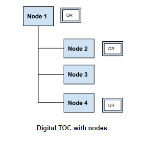
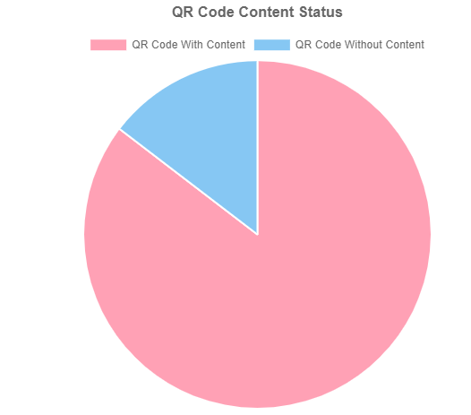
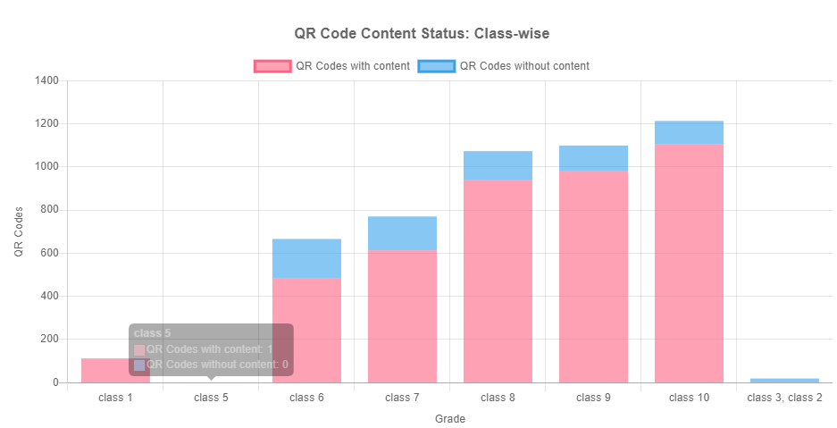
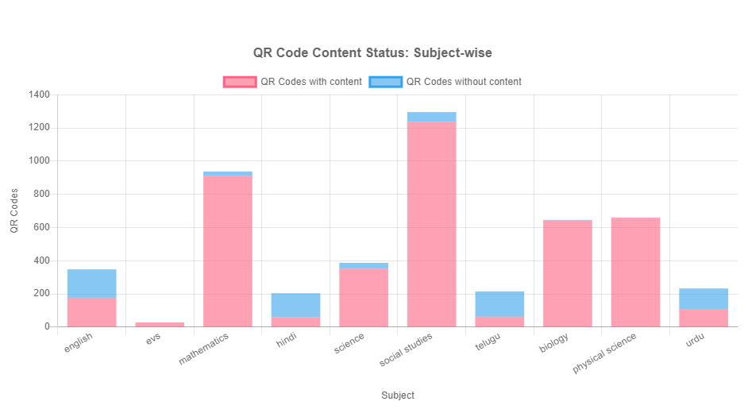

 _Instructions to use this template:_ 

1.  _Use this template to write the Product Requirements Document (PRD) for a single User JTBD or Initiative. _ 
1.  _Each workflow within the PRD will correspond to an Epic in JIRA. Each User Story will correspond to a Story in JIRA that will be part of the Epic._ 
1.  _Each section in the template has instructions, with examples explaining the type of content to be written in that section. _ 
1.  _You may start typing into the section by eliminating the instructional text, or delete the instructional text after you have entered all content for the section._ 
1.  _Repeat from section <Use Case 1> Overview for every use case in the User JTBD or Initiative_ 

Introduction _The state needs to track its data for necessary actions_ 

JTBDUse this section  to elaborate on:

*  **Jobs To Be Done: ** As a state admin, I want to have a look at various aspects of ETB such as creation failures, etc.
*  **User Personas:**  The logged-in users who have State Admin role, Report Viewer role can access this report.
*  **System or Environment:**  Works on for desktops with Chrome browser only.

Requirement SpecificationsThis section consists of requirement specifications for specific use cases in the User JTBD. The requirements for each use case are elaborated in detail through sub-sections for:

* Dial Code Exception Report
* ETB Creation Status Report

 **Dial Code Exception Report** This report provides the details of QR codes present in the live textbooks that have content linked and content not linked to them. Detailed data table also provides specific QR codes that do not have linked content along with the total number of scans.

QR codes without any content linked to them result in bad user experience. This report helps in identifying such QR codes and take immediate action by linking content to them. 

 **Purpose-** In order to reduce the drop off rate in Diksha app and Portal arising due to failed scans and to thereby improve the customer experience, the States have requested for a report to accurately identify the QR codes without linked content pieces in the textbooks.

 **Situation-** Currently, different states are following a different structure to define the digital TOC for their textbooks. Given below is an example of Rajasthan textbook structure. There is a Level 1 node, which is at the Chapter level followed by Topics or Sections within the chapter denoted by Node 2, 3 and 4.

Similarly, Tamil Nadu and Maharashtra follow different structures to define their digital TOC. The purpose of this report is to provide a list of QR codes within a Textbook which have missing content irrespective of the structure being followed by the State.

 **Proposed Report Format** 

One of the primary objectives is to identify the Section within the Textbook (with QR codes) which do not have any content piece against them. For this purpose, we are proposing a structure to capture the information in a 2 level Report: 

* Textbook Level
* Section/Node Level

1.  **Report 1:** The First report will be at the Textbook level. The report needs to be shared separately for each State. State administrator will need this report to identify which Books have a QR code with no content to play on being scanned. 

 **Goal:** This Report will show ALL Live textbooks of the State with the Total number of QR codes and No of QR Codes with no linked content in each.

 **Report 1: Textbook Level** 

|  **State**  |  **Board**  |  **Medium**  |  **Grade**  |  **Subject**  |  **Textbook Name**  | Created on | Last updated on |  **Textbook ID**  |  **Total QR Codes**  |  **Number of QR Codes with No linked content**  | Number of QR codes with no linked content - Term 1 | Number of QR codes with no linked content - Term 2 | 
|  --- |  --- |  --- |  --- |  --- |  --- |  --- |  --- |  --- |  --- |  --- |  --- |  --- | 
|  **TN**  |  **TN**  |  **English**  |  **Class 4**  |  **English**  |  **Eng_Term1**  |   |   |  **abc123**  |  **30**  |  **8**  |  |  | 

 **Note:**  This will have all the textbooks sorted by Board, Medium, Grade, Subject.

 **Report 2:**  The second report will be at the QR level. This will list all the QR codes sorted by Textbook and Chapter with the Number of contents linked to this node and number of contents linked to branch nodes under the main node.

 **Goal:** This will help state admin to identify the exact placement of the QR code with no content linked to them.  **Report 2: QR Code Level** 

| Text book id | Medium |  **Grade**  |  **Subject**  |  **Textbook Name**  |  **Level 1 Name**  |  **Level 2 Name**  |  **Level 3 Name**  |  **Level 4 Name**  |  **Level 5 Name**  |  **QR Code **  |  **Total QR Scans as on May 31st, 2019**  | Total QR Scans for the Academic year 2019-2020 | Term | 
|  --- |  --- |  --- |  --- |  --- |  --- |  --- |  --- |  --- |  --- |  --- |  --- |  --- |  --- | 
|  |  |  **Class 4**  |  **English**  |  **abc123**  |  **Rules of Grammar**  |  **ch123**  |  |  |  |  **abcdf1**  |  **100**  |  |  | 

 **NOTE :**  ** ** There can be a textbook level QR code (NODE 0) at the beginning of each textbook which does NOT link to a particular chapter or node but could link to the entire TOC of the book or have a pdf version of the book. This Level 0 QR code has to be captured in Report 2 with the following fileTextbook Name- Title of the TextbookChapter Name- Null

Section Name- Same as Textbook Name

No of QR- Sum of all QR in that textbook

* This will have all the textbooks sorted by Board, Medium, Grade, Subject, Textbook name, Textbook chapter index level.

 **Total QR Scans as on May 31st, 2019:** Here we will be showing the total number of scans happened to that QR Code as on 2019 May 31st.

 **Total QR Scans for the Academic year 2019-2020:** Here we will be showing the total no of scans happened to that QR Code from 1st Jun 2019 to till date.

 **The definition for an EMPTY QR Code is-** 

If   **‘No. of contents linked to the QR code node plus No. of contents linked to any sub-nodes below it’ is ZERO, it is said to be an Empty QR.** 

 **##Link for the Scanned Report Formats is below-** [ **QR Code -Content Linkage Report** ](https://drive.google.com/drive/folders/1fkwxU2TSutUG9J0bNnOcg55caCOaUOhf)

 **Keynotes:** 

Each record is a node in the textbook

Each record is associated with a  **Node with a QR code**  attached to it. All the nodes without QR are not being captured at the moment.

Only Live Textbooks are captured

 **Frequency of updating the Data Product structure used to create the three reports-** The node-level details in data product should be updated on a daily basis to ascertain that update in real-time. 

 **Intended Audience for these Reports-** 

These reports will be used by the State Admins or State ETB Co-ordinators or CSF State PMU to have a Textbook, Chapter and Section-wise analysis of the QR codes and corresponding content linked to them. 

 **GRAPH**  **In this report, there will be 3 graphs, All the graphs will show the total count of the QR Codes.** 

 ** 1. QR Code Content Status** 

 ** 2. QR Code Content Status: Class - Wise** 

 ** 3. QR Code Content Status: Subject - Wise** 

* QR Code with Content
* QR Code without Content
    * QR Code With Content: Total no of QR codes have at least one content linked
    * QR code without Content: Total no of QR codes not having at least one content linked

    

1.  **QR Code Content Status** 

  **2. QR Code Content Status: Class -Wise** 

 

 **3. QR Code Content Status: Subject - Wise** 

 **ETB Creation Status Report** This report provides details about the creation status of all textbooks. Note that the numbers shown in the graphs are absolute numbers and not percentages.

This report helps administrators to track the ETB creation process, identify textbooks that are incomplete and take actions to complete the process.

 **Purpose** 

Enable States to manage ETB creation process effectively by providing relevant reports/data solutions to track the progress of related entities in Diksha

 **Context** 

1. State set a specific target for books to be energized. For each target textbook, they define number of QR codes and the total number of content to be linked. The target information is not stored in Diksha and is assumed to be available to State outside the system
1. As part of ETB creation process, the State needs to engage in following key activities:

1. ETB creation process involves multiple users where specific officials are given the task of coordination and managing the delivery of ETB. The ETB work might be distributed among users by grade and subject. 
1. Given the size and distributed nature of work, State requires reports to track the progress and ability to drive a specific task which might need attention. 
1. Records to be shown under a state should be identified based on the tenant of the creator

 **Data Solution Needs** 

The reports defined below will need to be created for each state separately.

 **Textbook Progress Reports** 

Three reports defined below will help the state to track the progress of the Textbook creation, prioritize the work and identify specific components of the textbook to work on. The reports allow State to track progress on the following aspects:

1. Total number of textbooks published or work in progress
1. For each textbook, progress on

 **Key Points applicable to all reports below:** 

* Reports will include information about all the textbooks in Draft, Review or Live status
* Provide the ‘ **As On** ’ status with aggregated information on specific attributes
* A textbook may have two versions - one live and one in draft/review stage. This can happen when a published textbook is revised and the revised version is still not published. The reports will need to show both versions.
* Same QR code can be linked to multiple nodes within the same textbook and current textbooks in Diksha are using this capability. Number of QR codes should be counted based on how many times QR codes are linked in the textbook irrespective of same QR code repeating itself at multiple places. These QRs are to be counted separately, i.e the count of total QRs should NOT be for unique QRs but for every occurrence of that QR.
* In the situation where same QR code is linked at multiple places (within or different textbooks), “Total Scans” field in the reports below will reflect total scans across the places QR is linked. The system cannot distinguish the specific location of the scan in this scenario.
* Please show all the contents which don’t have metadata in the bottom.

 **Report 1: Textbook Level Report**  **Purpose:** State administrators and ETB co-ordinators will use the report to understand the status of all of their textbooks (as compared to the target). It helps to identify which textbooks they need to prioritize.  

|  **BOARD**  |  **MEDIUM**  |  **GRADE**  |  **SUBJECT**  |  **TEXTBOOK**  **ID**  |  **TEXTBOOK NAME**  | Created on | Last updated on |  **CURRENT STATUS**  |  **TOTAL CONTENT LINKED**  |  **TOTAL number of QR CODES linked**  |  **NO. OF QR CODES NOT LINKED TO CONTENT***  |  **TOTAL LEAF NODES****  |  **NO. OF LEAF NODE NOT LINKED TO CONTENT*****  | 
|  --- |  --- |  --- |  --- |  --- |  --- |  --- |  --- |  --- |  --- |  --- |  --- |  --- |  --- | 
|  |  |  |  |  |  |  |  |  |  |  |  |  |  | 

 **Key Points:** 

* It can be used to see the status of ALL the textbooks for a particular State and the total number of available QR codes & total content linked to them.
* The report will include all the textbooks in Draft, Review or Live status. Each row will correspond to a textbook
* States typically add content in a sequential manner to the textbook prioritizing initial chapters first as they will be taught in the classroom. Diksha allows user to edit a published book resulting in creation of two records for the same textbook object in the system. Report needs to show both the records live textbook record first followed by draft/review version. 
* QR Code can be linked at textbook level. When the user scans the QR code at textbook level, all the content linked to any node/subnode in the ToC of the textbook will show up. The report needs to count the QR linked at textbook. 
* This will have all the textbooks sorted by Board, Medium, Grade, Subject.  

 **Report 2-  QR/Leaf node Report**  **Purpose-** ETB Creators or Teachers responsible for creating textbooks or linking contents to textbooks will be able to identify the exact section or node within the chapter which has a missing content.

|  **Textbook ID**  |  **Board**  |  **Medium**  |  **Grade**  |  **Subject**  |  **Textbook Name**  |  **Textbook Status**  | Type of Node |  **LEVEL 1 NAME**  **(CHAPTER)**  | Level 2 Name | Level 3 Name | Level 4 Name | Level 5 Name | QR Code | Total no of Contents linked   | Total QR Scans as on 31st May 2019 | Total QR Scans in the academic year 2019-2020 | 
|  --- |  --- |  --- |  --- |  --- |  --- |  --- |  --- |  --- |  --- |  --- |  --- |  --- |  --- |  --- |  --- |  --- | 
|  |  |  |  |  |  |  |  |  |  |  |  |  |  |  |  |  | 
|  |  |  |  |  |  |  |  |  |  |  |  |  |  |  |  |  | 

 **Key Points :** 

* The report will include all the textbooks
* For each textbook, In the report will have one record for each child which is either it is a Leaf node or a QR Code. We will be showing all the nodes of the textbook except contents in the report. 
* A node can be of three types- QR linked node, Leaf node and Node which is both QR linked and a Leaf Node. 
* If the node ToC structure has more than 5 Levels, in that case we should show the nodes details till 5th level and the Index should show exact ToC structure value. (Eg:- 1.2.6.4.5.8)
* If node has QR code linked then QR code and total scans for that QR code should be displayed
* \[Dial Code]: It is a 6 digit code to be displayed
* This will have all the textbooks sorted by Board, Medium, Grade, Subject, Textbook name, Textbook chapter index level.
*  **Total QR Scans as on May 31st, 2019:** Here we will be showing the total number of scans happened to that QR Code as on 2019 May 31st.

 **Total QR Scans for the Academic year 2019-2020:** Here we will be showing the total no of scans happened to that QR Code from 1st Jun 2019 to till date.

 **Future enhancements** 
* The might be a need to filter data by certain time period as user might want to focus on work targeted in a specific time period. The use case is not clear at this moment; thus it will taken up later once use case clarity is there

 **GRAPH** In this report, we will be having 7 graphs

1.TextBook Status

2. ETB Creation Status: Class - Wise

3. ETB Creation Status: Subject - Wise

4.Textbook With or WithOut QR Codes

5. QR Code - Content Linkage

6. QR Code Linkage Summary: Class - Wise

7. QR Code Linkage Summary: Subject - Wise  

Logic for MetricsList of all textbooks present in DIKSHA is is fetched through Content V1 Search API along with Board, Medium, Grade, Subject, Status, CreatedOn and CreatedFor.

For each textbook, depending upon it's status, we get it's hierarchy/spine using:

* For Live textbooks: Course V1 Hierarchy API
* For Draft/Review textbooks: Content V3 Hierarchy with mode=edit

The JSON response is parsed into a tree structure object for quick querying.

 **Dial Code Exception Report** Only Live textbooks are considered.

Term value is assigned to each node in textbook based on Level 1 Node(TextbookUnit/chapter) positioning. If Level 1 Node index is less than or equal to half the count of Level 1 Node then Term is T1 else T2. Textbook node is assigned T1.

 **Report 1: Textbook Level** 

* Textbook ID, Medium, Grade, Subject, Textbook Name, Created On, Last Updated On:
    * Present from Content V1 Search API

    
* Total number of QR codes:
    * Parse Textbook tree and with filters:
    * node.dialcodes IS NOT NULL

    

    
* Number of QR codes with atleast 1 linked content:
    * Parse Textbook tree and with filters:
    * node.dialcodes IS NOT NULL
    * node.leafNodesCount > 0

    

    
* Number of QR codes with no linked content:
    * Parse Textbook tree and with filters:
    * node.dialcodes IS NOT NULL
    * node.leafNodesCount == 0

    

    
* Term 1 QR Codes with no linked content:
    * Parse Textbook tree and with filters:
    * node.dialcodes IS NOT NULL
    * node.leafNodesCount == 0
    * node.Term = T1

    

    
* Term 2 QR Codes with no linked content:
    * Parse Textbook tree and with filters:
    * node.dialcodes IS NOT NULL
    * node.leafNodesCount == 0
    * node.Term = T2

    

    

 **Report 2: QR Code Level** 

* Textbook ID, Medium, Grade, Subject, Textbook Name:
    * Present from Content V1 Search API

    
* Level 1 Name, Level 2 Name, Level 3 Name, Level 4 Name, Level 5 Name:
    * Path to node from root.

    
* QR Code:
    * node.dialcodes

    
* Total Scans:
    * From Consumption Metrics

    
* Term:
    * T1 or T2 depending on Level 1 node positioning

    

 **Aggregate Reports/Charts:** 

From Textbook report

* Number of QR codes with linked content :
    * Sum of  "Number of QR codes with atleast 1 linked content"

    
* Number of QR codes with no linked content:
    * Sum of "Number of QR codes with no linked content"

    
* Number of QR codes with linked content by Grade:
    * Group by "Grade" and sum "Number of QR codes with atleast 1 linked content"

    
* Number of QR codes with no linked content by Grade:
    * Group by "Grade" and sum of "Number of QR codes with no linked content"

    
* Number of QR codes with linked content by Subject:
    * Group by "Subject" and sum "Number of QR codes with atleast 1 linked content"

    
* Number of QR codes with no linked content by Subject:
    * Group by "Subject" and sum of "Number of QR codes with no linked content"

    

 **ETB Creation Status Report** Live, Draft and Review Textbooks are considered.

 **Report 1: Textbook Level Report** 

* Textbook ID, Medium, Grade, Subject, Textbook Name, Textbook Status, Created On, Last Updated On:
    * Present in Content V1 Search API

    
* Total content linked:
    * leafNodesCount value of root node(textbook)

    
* Total QR codes linked to content:
    * parse tree with filters:
    * dial codes NOT NULL
    * leafNodesCount > 0

    

    
* Total number of QR codes with no linked content:
    * parse tree with filters:
    * dial codes NOT NULL
    * leafNodesCount == 0

    

    
* Total number of leaf nodes:
    * count of leaf nodes

    
* Number of leaf nodes with no content:
    * parse tree with filters:
    * is_leaf TRUE
    * leafNodesCount == 0

    

    

 **Report 2-  QR/Leaf node Report** 

* Textbook ID, Medium, Grade, Subject, Textbook Name, Textbook Status:
    * Present in Content V1 Search API

    
* Type of Node:
    * "Leaf Node & QR Linked" IF
    * node.dialcodes IS NOT NULL
    * node.is_leaf IS TRUE

    
    * "QR Linked" IF
    * node.dialcodes IS NOT NULL

    
    * "Leaf Node" IF
    * node.is_leaf IS TRUE

    

    
* Level 1 Name, Level 2 Name, Level 3 Name, Level 4 Name, Level 5 Name:
    * Path to node from root

    
* QR Code:
    * dialcodes

    
* Number_of_Scans:
    * Mapped from Consumption report

    
* Number of contents:
    * leafNodesCount value

    

 **Aggregate Reports:** 

From Textbook Level:

* Textbook Status:
    * Group by "Textbook Status" and count

    
* Textbook Status by Grade:
    * Group by "Grade" and "Textbook Status" and count

    
* Textbook Status by Subject:
    * Group by "Subject" and "Textbook Status" and count

    
* TB with QR Codes:
    * Parse TB and count node.dialcodes. IF count > 0 THEN "With QR Code" ELSE "Without QR Code"
    * Count of TB with attribute "With QR Code"

    
* Number of QR codes with Linked Content:
    * Sum of "Total QR codes linked to content"

    
* Number of QR Codes without Linked Content:
    * Sum of "Total number of QR codes with no linked content"

    
* Number of QR codes by Grade with Linked Content:
    * Group by "Grade" and Sum of "Total QR codes linked to content"

    
* Number of QR Codes by Grade without Linked Content:
    * Group by "Grade" and Sum of "Total number of QR codes with no linked content"

    
* Number of QR codes by Subject with Linked Content:
    * Group by "Subject" and Sum of "Total QR codes linked to content"

    
* Number of QR Codes by Subject without Linked Content:
    * Group by "Subject" and Sum of "Total number of QR codes with no linked content"

    

Localization RequirementsN/A

Telemetry RequirementsN/A

Non-Functional RequirementsN/A

Impact on other Products/SolutionsN/A

Impact on Existing Users/Data 

N/A

Key Metrics

*****

[[category.storage-team]] 
[[category.confluence]] 
