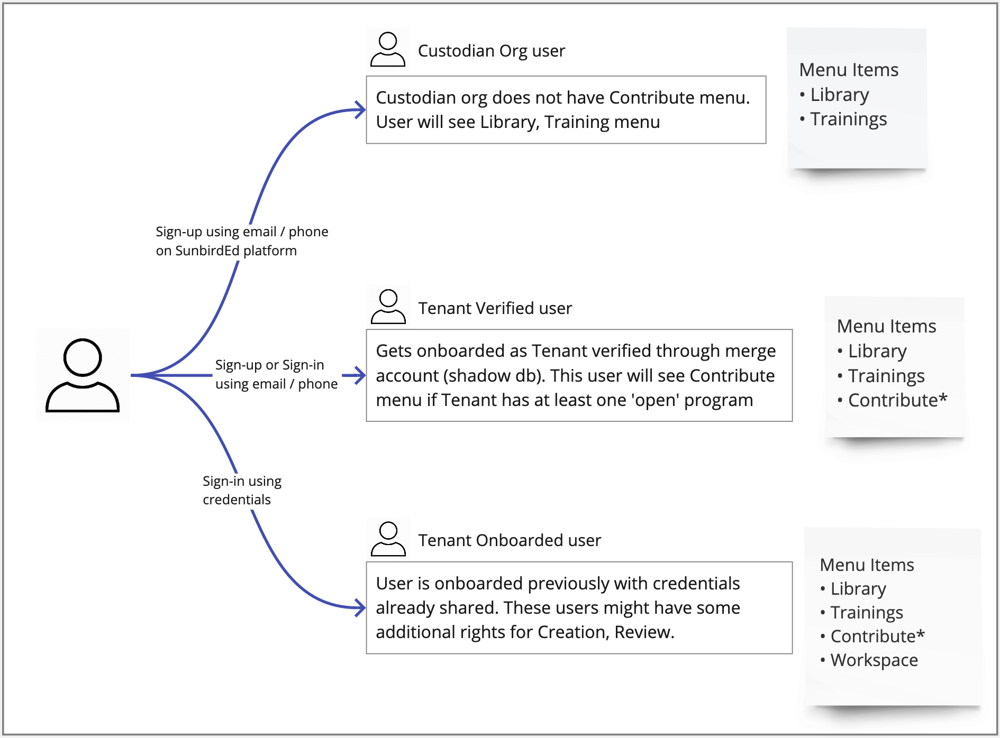

[https://project-sunbird.atlassian.net/browse/SB-15591](https://project-sunbird.atlassian.net/browse/SB-15591)

We will require contribution programs portal to be ready to scale up to multiple instances, each one supporting 100 or more users. In order to do this, we will merge the contribution program portal fork with SunbirdEd. Below are the list of changes required

* SunbirdEd will get a new high level menu - Contribution (in the same line as Library, Trainings, etc). Any logged in user will see Contribute menu. Tenant can configure if they do not wish to open-up Contribution to any signed in user.

    * Custodian org will not show Contribute menu

    * Only tenant verified users will see Contribute menu. They will see list of programs for their tenant, open to enrolment / contribution by any user.

    
* Menu items : Library, Trainings, Workspace (if user has rights), Contribute (State verified users)

    * Contribute for all State verified users (so not anyone who signs up on SunbirdEd). Workspace for State verified users who have creation / review etc rights

    * Contribute will open list of programs and then respective programs workflow. Workspace will be as-is what we have today

    
* On Contribute tab, users will see list of programs they can contribute towards. List of programs will be filtered and sorted based on logged-in user’s profile (channel, enrolment in programs)

    * Program list will show program cards (program name, tenant, framework, 

    
* After selecting a program from the list, the program would lead the user workflow as per configuration. See Contribution Program as an example [[SunbirdEd Programs Portal for Content Contribution|SunbirdEd-Programs-Portal-for-Content-Contribution]]

User flow

## Contribute page
Show contribute page only to Tenant verified users and if only one program exists.

• List of programs open to enrolment

• Show programs specific to content contribution only, other programs such as credentialing can go under Admin's profile menu

• Contribute page will not have sub-header with Search bar. Sub-header space will have 'Create' and 'Review' tab for Contribution programs

Wireframe / Design link : [InVision design link](https://invis.io/ZMU48UESHCF)

*****

[[category.storage-team]] 
[[category.confluence]] 
