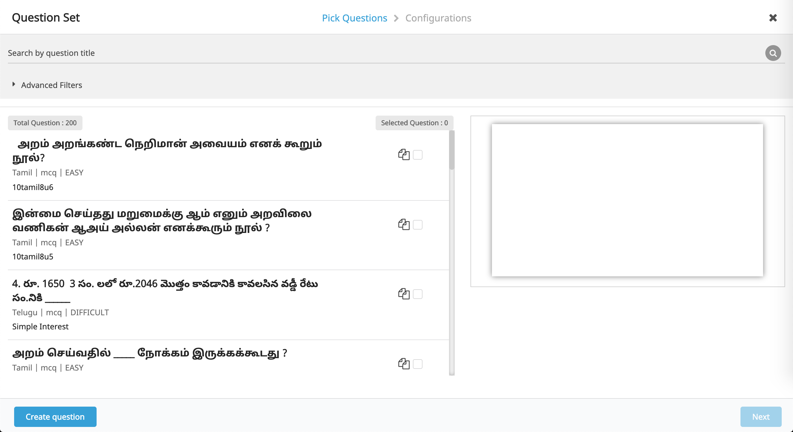
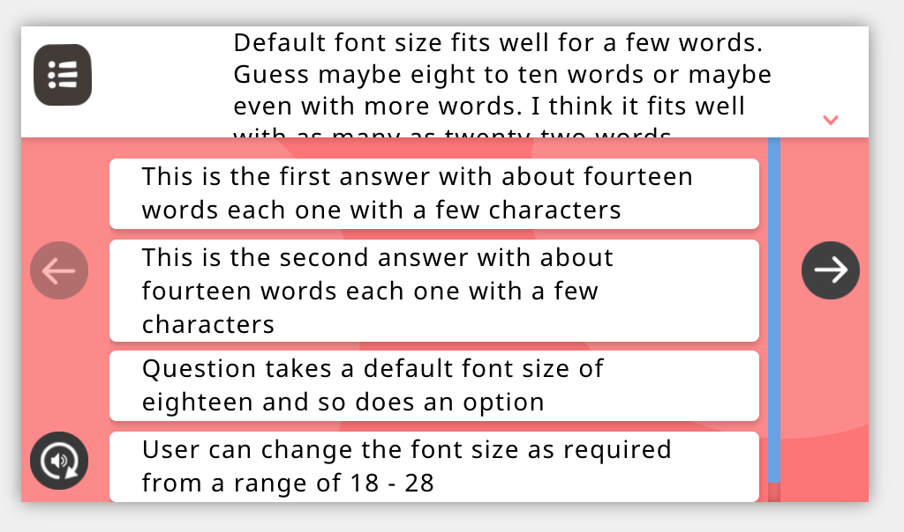
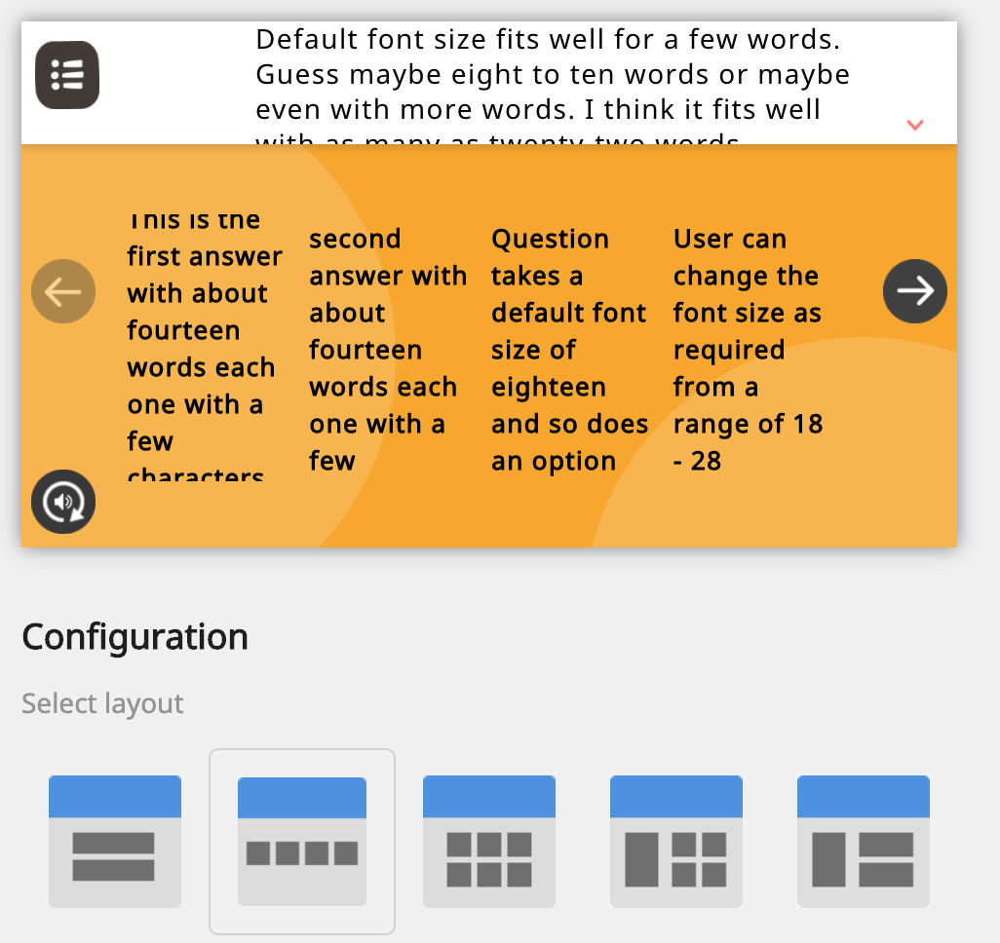
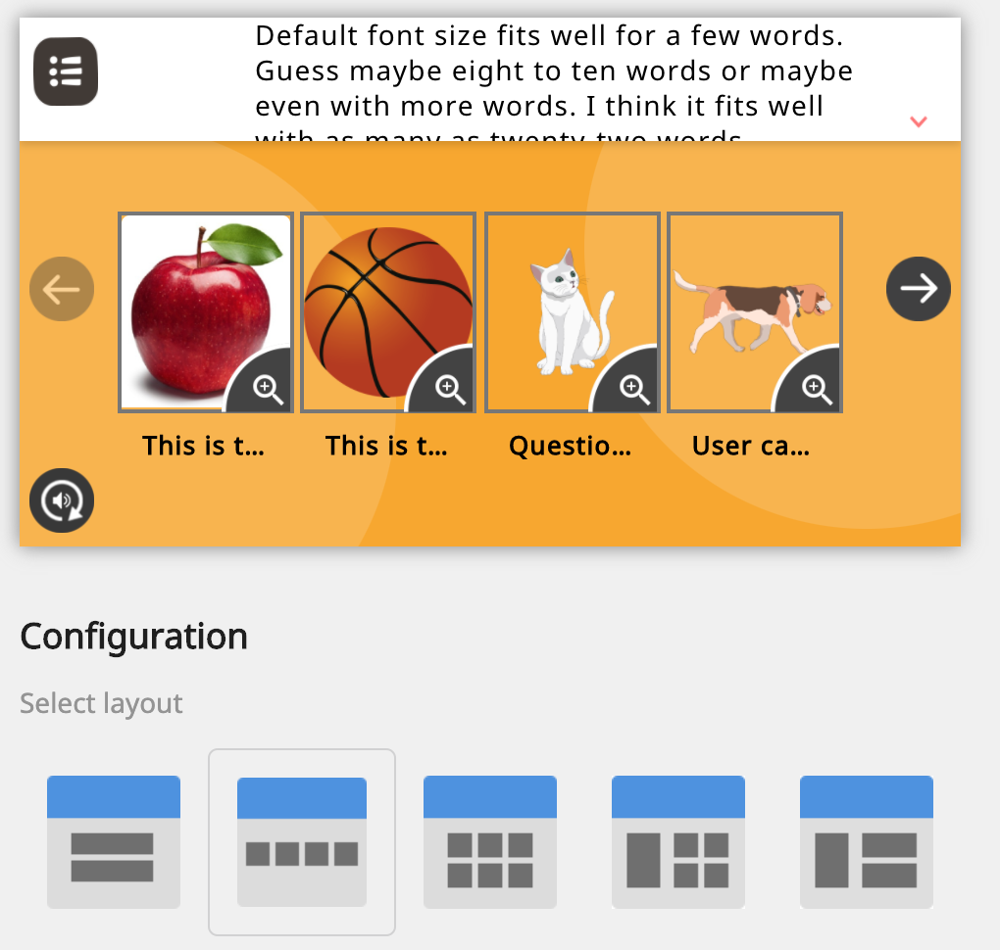
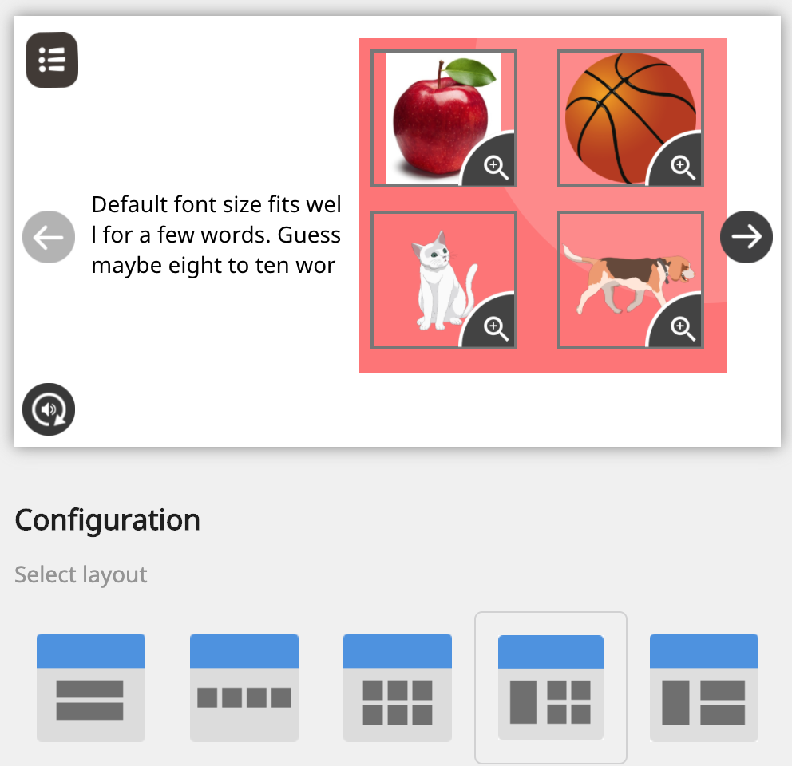

Today Multiple Choice Question (MCQ) has 7 layouts to  support various question creation needs. Here are a few refinements to the layouts

    * [Optimise page load time of Question Search & Preview (Add Question Set) page](#optimise-page-load-time-of-question-search-&-preview-(add-question-set)-page)
    * [MCQ Layout 1, 2 & 3 - Question without image doesn’t use space optimally  ](#mcq-layout-1,-2-&-3---question-without-image-doesn’t-use-space-optimally--)
    * [MCQ Layout 1 - Option creation & player experience](#mcq-layout-1---option-creation-&-player-experience)
    * [MCQ Layout 2 - Option creation & player experience](#mcq-layout-2---option-creation-&-player-experience)
    * [MCQ Layout 4 - Option creation & consumption experience](#mcq-layout-4---option-creation-&-consumption-experience)
    * [Functional Design Challenges](#functional-design-challenges)
  * [Sample or Reference Questions](#sample-or-reference-questions)
[https://project-sunbird.atlassian.net/browse/SB-19481](https://project-sunbird.atlassian.net/browse/SB-19481)

### Optimise page load time of Question Search & Preview (Add Question Set) page

1. Optimise player load time - 

1. Optimise filter / form loading time[SB-19612 System JIRA](https:///browse/SB-19612)

1. Use lazy loading for question list[SB-19613 System JIRA](https:///browse/SB-19613)

1. Improve response time for clicks[SB-19615 System JIRA](https:///browse/SB-19615) - selecting question for preview, selecting question to add to question set, and filter pane interactions

Refer to the image: 

[https://project-sunbird.atlassian.net/browse/SB-19482](https://project-sunbird.atlassian.net/browse/SB-19482)

### MCQ Layout 1, 2 & 3 - Question without image doesn’t use space optimally  

1. Question should centre align (vertically) & left align (horizontally) 

1. Question should not reserve space for image unless provided by user

[SB-19697 System JIRA](https:///browse/SB-19697)

### MCQ Layout 1 - Option creation & player experience

1. Justify the option text when there is no image added by the user

1. If image is added, make text left aligned

<Insert Jira ticket here>

### MCQ Layout 2 - Option creation & player experience

1. When user doesn’t provide image (if option contains only text), it should show options with white background

1. Should display overflowing text on scroll of the page. Preview should reflect most accurate WYSIWYG for a regular 16:9 or 18:9 screen aspect ratio

1. 

### MCQ Layout 4 - Option creation & consumption experience

1. Should disable adding text as this only support image options

1. If user has already entered text and is trying out different layouts - on selecting this layout the text should be preserved (but hidden or disabled from editing)

### Functional Design Challenges

1. Image is supported but user doesn’t provide..

1. Text length overflow in case of : 

    1. English text (with styling & formatting), 

    1. Indic language text (with styling & formatting),

    1. Math & Scientific text

    
1. Text length overflow when used with image

Here’s a list of all MCQ related tickets. Total [ System JIRA](https:///browse/)

EPICs that contain issues related to MCQ Creation are

[https://project-sunbird.atlassian.net/browse/SB-9298](https://project-sunbird.atlassian.net/browse/SB-9298)

[https://project-sunbird.atlassian.net/browse/SB-9871](https://project-sunbird.atlassian.net/browse/SB-9871)

[https://project-sunbird.atlassian.net/browse/SB-8851](https://project-sunbird.atlassian.net/browse/SB-8851)

[https://project-sunbird.atlassian.net/browse/SB-3235](https://project-sunbird.atlassian.net/browse/SB-3235)

[ System JIRA](https:///browse/)
## Sample or Reference Questions
MCQTestJune2020

Default font size fits well for a few words. Guess maybe eight to ten words or maybe even with more words. I think it fits well with as many as twenty-two words

This is the first answer with about fourteen words each one with a few characters

This is the second answer with about fourteen words each one with a few characters

Question takes a default font size of eighteen and so does an option

User can change the font size as required from a range of 18 - 28

*****

[[category.storage-team]] 
[[category.confluence]] 
