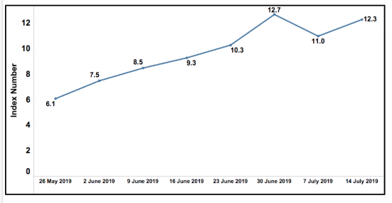

 _Instructions to use this template:_ 

1.  _Use this template to write the Product Requirements Document (PRD) for a single User JTBD or Initiative. _ 
1.  _Each workflow within the PRD will correspond to an Epic in JIRA. Each User Story will correspond to a Story in JIRA that will be part of the Epic._ 
1.  _Each section in the template has instructions, with examples explaining the type of content to be written in that section. _ 
1.  _You may start typing into the section by eliminating the instructional text, or delete the instructional text after you have entered all content for the section._ 
1.  _Repeat from section <Use Case 1> Overview for every use case in the User JTBD or Initiative_ 

IntroductionProvide a brief description of the context and overview of the User JTBD or Initiative.  

JTBD
*  **Jobs To Be Done:**  As a State CM or the PMO and MHRD, I want to have a look at various aspects of ETB such as consumption matrices, etc.
*  **User Personas:**  The logged-in users who have State Admin role, Report Viewer role can access this report.
*  **System or Environment:**  Works on for desktops with Chrome browser only.

Requirement Specifications **State CM Dashboards:**  All dashboards that need to be accessed by States will be configured under the dashboards page of the respective state. It can be accessed by users of respective states using Report Viewer role. In future versions, there will be a role-specific dashboard configuration.

 ** ** 

 **ECG of Learning** 

This shows TPS across a week. It is updated on an hourly basis. This graph will be configured in the dashboard page of MHRD. TPS data is currently being pushed into DB used by Graphene. It will have to be pushed into Druid from which it will be pulled, to show it on the Dashboard.

Following dashboard need to be enabled in State Dashboards page:

 **  ** 

 **Learning Opportunities**  

Daily content use (Nationwide): This shows the overall content plays. This graph will be configured in dashboards pages of MHRD and in all the States. This graph is updated on a weekly basis. It will roll over for every 30 days..

 **Per Capita daily content consumption by state** 

This shows the number of plays against DISE data for government school teachers and students for grades and subjects using energized textbooks. This graph will be configured in dashboards pages of MHRD and in all the States. It is updated on a weekly basis. It will have the last 30 days data.

 **Learning Opportunities - daily content use (per state):** 

This shows the overall content plays in that specific state. A separate graph is configured in the State Dashboards page of that specific state. it will be updated on a weekly basis and will have last 30 days data.

 **GPS of Learning** 

GPS of Learning (per state): This shows overall percentage completion of all energized textbooks used in the state. It is updated on a weekly basis.

This report will have current academic year data

Following dashboard need to be enabled in State Dashboards page:

 **Weekly unique devices by district** 

Weekly unique devices by district (Per state): This shows unique devices count how used Diksha in that district from that state. This should get updated on a weekly basis. 

Following dashboard need to be enabled in State Dashboards page:

 **Weekly content plays by district** 

Weekly content plays by district (Per state): This shows total content plays happened in that district from that state. This should get updated on a weekly basis.

Following dashboard need to be enabled in State Dashboards page:

Refer to following deck for all the dashboards:

[https://docs.google.com/presentation/d/1JfSzlRdoaEYhgUOthfJMFT3la71IaPjW-L3Zc8IPd4w/](https://docs.google.com/presentation/d/1JfSzlRdoaEYhgUOthfJMFT3la71IaPjW-L3Zc8IPd4w/)

 **Descriptions and Lables** 

 **       1. Digital Learning Experience Nationwide** 

 **Description: ** This report provides the total number of content played on DIKSHA portal and app. This report is refreshed every week and provides details for a period of 30 days.

 **       2. Digital Learning Experience Statewide ** 

 **Description: ** The 'Digital Learning Experience Statewide' report provides details of DIKSHA usage in terms of total content plays on App and Portal. The analysis provides total content plays for the last 30 days at a daily level.Data is refreshed every week

 **      3. Digital Learning per Capita ** 

 **Description: ** This report provides the total number of content played per 1000 expected users over a period of 30 days.

The expected user for each state is calculated using the DISE data for the appropriate grade. In this analysis, only government school teachers and students are considered as expected users.

      **4.ECG of Learning** 

 ** Title: Pulse of the Nation Learning** 

 **Description: ** The graph provides DIKSHA platform activity and level of usage over a week across all states. The graph is updated every hour   

Wireframes

For Future ReleaseN/A

JIRA Ticket ID[SB-14804 System JIRA](https:///browse/SB-14804) [SB-14720 System JIRA](https:///browse/SB-14720) [SB-14719 System JIRA](https:///browse/SB-14719)

Localization RequirementsN/A

Telemetry RequirementsN/A

Non-Functional RequirementsN/A

Impact on other Products/SolutionsN/A

Impact on Existing Users/Data N/A

Key MetricsSpecify the key metrics that should be tracked to measure the effectiveness of this use case in the following table. To add or remove rows, use the table functionality from the toolbar 

| Srl. No. | Metric | Purpose of Metric | 
|  --- |  --- |  --- | 
|  | Specify the metric to be tracked  | Explain why this metric should be tracked. e.g. tracking this metric will show the scale at which the functionality is used, or tracing this metric will help measure learning effectiveness, etc.  | 
|  |  |  | 

*****

[[category.storage-team]] 
[[category.confluence]] 
