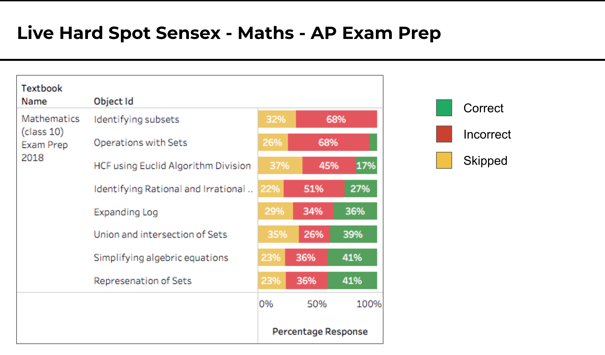

[SB-14888 System JIRA](https:///browse/SB-14888)

[ System JIRA](https:///browse/)
# Test Prep Creation

# Test Prep Consumption
Print Practice QuestionsHow print is initiated from consumption clients: [SB-15397 System JIRA](https:///browse/SB-15397)

Report cardWhen students play questions, they would like to know the summary & detailed report of their performance. Summary should include score, and time taken. Report should show question-by-question which ones were answered correctly / incorrectly, and also provide links to solution.

This Report should be available at the end of Practice Set content

# Test Prep Data Driven Decision Making (Reports & Dashboards)
Question AnalysisQuestions are tagged to various categories of the framework. For example, in case of K-12 school education, categories such as Board, Medium, Class, Subject, Topic, and Learning Outcome. It is important to denormalise these details for each question. By providing following analysis for each question, we can enable administrators to analyse learner performance for each question.

Also it is important to maintain roll-up of Questions to Content to Textbook in order to filter by textbooks specific to a program.

For each question, we should have

Question Summary _In simpler words_ :  _How many people saw the question_ ?  _How many attempted it_ ?  _How much time did they spend on it_ ? Find below more details

* Number of times question was seen

* Number of times question was attempted

* Time spent on the question

This will help in overall gross number of times question was seen / attempted. Every time a content is played, session ID is not regenerated.

* Number of sessions in which question was seen

* Number of sessions in which question was attempted

* Time spent on the question

This will help in getting an average number of times a question is played within an app session

* Number of people (unique users) seen the question

* Number of people (unique users) attempted the question

* Time spent on the question

This will help in finding an average number of time a user opens / attempts a question, and if there are any repeat users.

* Number of devices opening the question

* Number of devices attempting the question

* Time spent on the question

This will help in finding if devices are used as shared device or single user device.

Answer / Solution Summary _In simpler words_ :  _How many people saw the solution_ ?  _How many played video in the solution (if available)_ ?  _How much time did they spend on Answer altogether_ ?  _How many people saw questions with video solution but did / did not view video_ ?

* Number of times / sessions / people / devices seeing or going to Answer? (This applies to MCQ & Subjective questions as these are the only question types on QuML)

* Number of times / sessions / people / devices seeing Answer which has Video?

* Number of times / sessions / people / devices going to or watching Video?

* Time spent on Answer + Time spent on Video (if available)

Performance / Response Summary _In simpler words_ :  _How many people saw the question_ ?  _How many people attempted it_ ?  _How many people got it correct_ ?  _How many people got it incorrect_ ?  _What are the most common incorrect responses_ ?  _What is the time taken by those who got it correct vs those who got it wrong_ ? 

### Learning Outcome report
Here is a sample

This report summarises performance of all users across learning objectives covered in the test prep content

### Content Usage report
Here is a sample 

Report sample 1Report 1 [https://docs.google.com/spreadsheets/d/1Z8RJBZfjpHKHKGu4c8AyZR2ixLQUUDtg4brDilmYEzM/edit#gid=1388493961](https://docs.google.com/spreadsheets/d/1Z8RJBZfjpHKHKGu4c8AyZR2ixLQUUDtg4brDilmYEzM/edit#gid=1388493961)

1. Choose QR Scans or Content Plays as the KRA for your discussions (preferably Scans as numbers are higher)

1. Leverage Chart, Organised table and TB wise  **V2**  sheets for the decided KRA- Only 3 sheets for the KRA to be converted to excel before sharing with State.

1. Share the two key observations

1. Use low usage for Maths as reason to say more "practice" content is needed for Maths. (Am assuming almost all content linked in ETBs are videos)

1. Use overall usage of Diksha for exams as reason to increase scope for next year amongst more grades.

*****

[[category.storage-team]] 
[[category.confluence]] 
