The new certificate Schema definition for the rc core setup.

Configurations for [registry](https://github.com/project-sunbird/sunbird-devops/tree/release-5.1.0/kubernetes/helm_charts/sunbird-RC/registry), [certificatesign](https://github.com/project-sunbird/sunbird-devops/tree/release-5.1.0/kubernetes/helm_charts/sunbird-RC/certificatesign), [certificateapi](https://github.com/project-sunbird/sunbird-devops/tree/release-5.1.0/kubernetes/helm_charts/sunbird-RC/certificateapi) in Github : 

[https://github.com/project-sunbird/sunbird-devops/tree/release-5.1.0/kubernetes/helm_charts/sunbird-RC](https://github.com/project-sunbird/sunbird-devops/tree/release-5.1.0/kubernetes/helm_charts/sunbird-RC)

[TrainingCertificate.json](https://github.com/project-sunbird/sunbird-devops/blob/release-5.1.0/kubernetes/helm_charts/sunbird-RC/registry/schemas/TrainingCertificate.json)

[Signatory.json](https://github.com/project-sunbird/sunbird-devops/blob/release-5.1.0/kubernetes/helm_charts/sunbird-RC/registry/schemas/Signatory.json)

[Recipient.json](https://github.com/project-sunbird/sunbird-devops/blob/release-5.1.0/kubernetes/helm_charts/sunbird-RC/registry/schemas/Recipient.json)

[Issuer.json](https://github.com/project-sunbird/sunbird-devops/blob/release-5.1.0/kubernetes/helm_charts/sunbird-RC/registry/schemas/Issuer.json)

[PublicKey.json](https://github.com/project-sunbird/sunbird-devops/blob/release-5.1.0/kubernetes/helm_charts/sunbird-RC/registry/schemas/PublicKey.json)

[credential_template.json](https://github.com/project-sunbird/sunbird-devops/blob/release-5.1.0/utils/sunbird-RC/schema/credential_template.json)

[sunbird_context.json](https://github.com/project-sunbird/sunbird-devops/blob/release-5.1.0/utils/sunbird-RC/schema/sunbird_context.json)

[v1_context.json](https://github.com/project-sunbird/sunbird-devops/blob/release-5.1.0/utils/sunbird-RC/schema/v1_context.json)

TrainingCertificate.json


```json
{
	"$schema": "http://json-schema.org/draft-07/schema",
	"type": "object",
	"properties": {
		"TrainingCertificate": {
			"$ref": "#/definitions/TrainingCertificate"
		}
	},
	"required": [
		"TrainingCertificate"
	],
	"title": "TrainingCertificate",
	"definitions": {
		"TrainingCertificate": {
			"$id": "#/properties/TrainingCertificate",
			"type": "object",
			"title": "The TrainingCertificate Schema",
			"required": [
				"recipient",
				"training"
			],
			"properties": {
				
				"status": {
					"type": "string",
					"enum": ["ACTIVE", "REVOKED", "DELETED"]
				},
				"jsonUrl": {
					"type": "string"
				},
				"recipient":{
					"$id": "#/properties/recipient",
         			"$ref": "Recipient.json#/definitions/Recipient"
				},
				"templateUrl": {
          			"type": "string"
                },
                "training":{
                  "$id": "#/properties/training",
         		  "$ref": "Training.json#/definitions/Training"
                },
                "issuer":{
                  "$id": "#/properties/issuer",
         		  "$ref": "Issuer.json#/definitions/Issuer"                
                },
                 "signatory":{
                  "$id": "#/properties/signatory",
                  "type":"array",
                   "items":{
		             "$ref": "Signatory.json#/definitions/Signatory"
		            }
		                       
                },
                "certificateLabel":{
                   "type": "string"                
                }				

			}
		}
	},
	"_osConfig": {
		"uniqueIndexFields": [
		],
		"ownershipAttributes": [],
		"roles": [
		],
		"inviteRoles": [
			"anonymous"
		], 
		"systemFields": ["osCreatedAt", "osUpdatedAt", "osCreatedBy", "osUpdatedBy"],
		"enableLogin": false,
		"credentialTemplate": "https://raw.githubusercontent.com/project-sunbird/sunbird-devops/release-4.8.0/kubernetes/helm_charts/sunbird-RC/registry/templates/credential_template.json"
	}
}
```
https://raw.githubusercontent.com/project-sunbird/sunbird-devops/release-4.8.0/kubernetes/helm_charts/sunbird-RC/registry/templates/credential_template.json contains the credential Template json contains below values.


```json
{
    "@context": [
    "https://gist.githubusercontent.com/reshmi-nair/386ef6d832236014b7d1037ad4de3da7/raw/8288d9739f3e7946740b4119d0f5f1991695c2a5/v1_context.json",			
    "https://gist.githubusercontent.com/reshmi-nair/d4043c6f74bf98e9fa60232ebf8a6af4/raw/6d17f5bfd48daca5281e5dbef9b384f7cc9d301f/sunbird_context.json"
 ],
    "type": [
        "VerifiableCredential"
    ],
    "id":"did:sunbird:{{osid}}",
    "issuanceDate": "{{osCreatedAt}}",
    "credentialSubject": {
        "type":"{{certificateLabel}}",
        "recipientName": "{{recipient.name}}",
        "trainingName": "{{training.name}}",
        "trainingId":"{{training.id}}"	
     },
   "issuer":{			         
        "id":"https://raw.githubusercontent.com/project-sunbird/sunbird-devops/release-4.8.0/kubernetes/helm_charts/sunbird-RC/registry/templates/READ.md#Issuer",
         "type":[
            "Issuer"
         ],
         "name":"{{issuer.name}}",
         "url":"{{issuer.url}}",
         "publicKey":["{{issuer.kid}}"]
  } 
 }
```
The  context schema value in 


```
https://gist.githubusercontent.com/reshmi-nair/d4043c6f74bf98e9fa60232ebf8a6af4/raw/6d17f5bfd48daca5281e5dbef9b384f7cc9d301f/sunbird_context.json
```
is 


```
{
    "@context": {
      "@version": 1.1,
      "@protected": true,
      "TrainingCertificate": {
        "@id": "https://raw.githubusercontent.com/project-sunbird/sunbird-devops/release-4.8.0/kubernetes/helm_charts/sunbird-RC/registry/templates/READ.md#TrainingCertificate",
        "@context": {
          "id": "@id",
          "@version": 1.1,
          "@protected": true,
          "TrainingCertificate": "schema:Text"
        }
      },
      "trainingName":{
        "@id":"https://raw.githubusercontent.com/project-sunbird/sunbird-devops/release-4.8.0/kubernetes/helm_charts/sunbird-RC/registry/templates/READ.md#trainingName",
        "@context": {
          "name":"schema:Text"
        }
      },
      "recipientName":{
        "@id":"https://raw.githubusercontent.com/project-sunbird/sunbird-devops/release-4.8.0/kubernetes/helm_charts/sunbird-RC/registry/templates/READ.md#recipientName",
        "@context": {
          "name":"schema:Text"
        }
      },
    "trainingId":{
        "@id":"https://raw.githubusercontent.com/project-sunbird/sunbird-devops/release-4.8.0/kubernetes/helm_charts/sunbird-RC/registry/templates/READ.md#trainingId",
        "@context": {
          "name":"schema:Text"
        }
      },
      "name":{
        "@id":"https://raw.githubusercontent.com/project-sunbird/sunbird-devops/release-4.8.0/kubernetes/helm_charts/sunbird-RC/registry/templates/READ.md#name",
        "@context": {
          "name":"schema:Text"
        }
      },
      "publicKey":{
        "@id":"https://raw.githubusercontent.com/project-sunbird/sunbird-devops/release-4.8.0/kubernetes/helm_charts/sunbird-RC/registry/templates/READ.md#publicKey",
        "@context": {
          "name":"schema:Text"
        }
      },
      "url":{
        "@id":"https://raw.githubusercontent.com/project-sunbird/sunbird-devops/release-4.8.0/kubernetes/helm_charts/sunbird-RC/registry/templates/READ.md#url",
        "@context": {
          "name":"schema:Text"
        }
      },
      "designation":{
        "@id":"https://raw.githubusercontent.com/project-sunbird/sunbird-devops/release-4.8.0/kubernetes/helm_charts/sunbird-RC/registry/templates/READ.md#designation",
        "@context": {
          "name":"schema:Text"
        }
      },
      "image":{
        "@id":"https://raw.githubusercontent.com/project-sunbird/sunbird-devops/release-4.8.0/kubernetes/helm_charts/sunbird-RC/registry/templates/READ.md#image",
        "@context": {
          "name":"schema:Text"
        }
      },
      "identity":{
        "@id":"https://raw.githubusercontent.com/project-sunbird/sunbird-devops/release-4.8.0/kubernetes/helm_charts/sunbird-RC/registry/templates/READ.md#identity",
        "@context": {
          "name":"schema:Text"
        }
      },
      "signatory": {
        "@id":"https://github.com/sunbird-specs/vc-specs#signatory",
        "@container": "@list"		
      }
    }
}
```
Training.json


```json
{
	"$schema": "http://json-schema.org/draft-07/schema",
	"type": "object",
	"properties": {
		"Training": {
			"$ref": "#/definitions/Training"
		}
	},
	"required": [
		"Training"
	],
	"title": "Training",
	"definitions": {
		"Training": {
			"$id": "#/properties/Training",
			"type": "object",
			"title": "The Training Schema",
			"required": [
				"id",
				"type"
			],
			"properties": {
				"id": {
					"type": "string"
				},
				"batchId": {
					"type": "string"
				},
				"type": {
					"type": "string"
				},						
                "name":{
                  "type":"string"
                }
			}
		}
	}
	
}
```
Recipient.json


```json
{
	"$schema": "http://json-schema.org/draft-07/schema",
	"type": "object",
	"properties": {
		"Recipient": {
			"$ref": "#/definitions/Recipient"
		}
	},
	"required": [
		"Recipient"
	],
	"title": "Recipient",
	"definitions": {
		"Recipient": {
			"$id": "#/properties/Recipient",
			"type": "object",
			"title": "The Recipient Schema",
			"required": [
				"id"
			],
			"properties": {
				"id": {
					"type": "string"
				},
				"type": {
					"type": "string"
				},
				"name": {
					"type": "string"
				}							

			}
		}
	}
	
}
```
Issuer.json


```json
{
	"$schema": "http://json-schema.org/draft-07/schema",
	"type": "object",
	"properties": {
		"Issuer": {
			"$ref": "#/definitions/Issuer"
		}
	},
	"required": [
		"Issuer"
	],
	"title": "Issuer",
	"definitions": {
		"Issuer": {
			"$id": "#/properties/Issuer",
			"type": "object",
			"title": "The Issuer Schema",
			"required": [
				"name"
			],
			"properties": {
				"name": {
					"type": "string"
				},
				"url": {
					"type": "string"
				},
				"kid": {
					"type": "string"
				}							

			}
		}
	}
	
}
```
Signatory.json


```json
{
	"$schema": "http://json-schema.org/draft-07/schema",
	"type": "object",
	"properties": {
		"Signatory": {
			"$ref": "#/definitions/Signatory"
		}
	},
	"required": [
		"Signatory"
	],
	"title": "Signatory",
	"definitions": {
		"Signatory": {
			"$id": "#/properties/Signatory",
			"type": "object",
			"title": "The Signatory Schema",
			"required": [
				
			],
			"properties": {
				"identity": {
					"type": "string"
				},
				"designation": {
					"type": "string"
				},
				"image": {
					"type": "string"
				},						
                "name":{
                  "type":"string"
                }
			}
		}
	}
	
}
```
 **Evidence.json** 

Not Needed currently in the current release


```json
{
	"$schema": "http://json-schema.org/draft-07/schema",
	"type": "object",
	"properties": {
		"Evidence": {
			"$ref": "#/definitions/Evidence"
		}
	},
	"required": [
		"Evidence"
	],
	"title": "Evidence",
	"definitions": {
		"Evidence": {
			"$id": "#/properties/Evidence",
			"type": "object",
			"title": "The Evidence Schema",
			"required": [
				"name"
			],
			"properties": {
				"name": {
					"type": "string"
				}					

			}
		}
	}
	
}
```
Certificate Create Request : 


```
curl --location --request POST 'http://localhost:8081/api/v1/TrainingCertificate' \
--header 'Content-Type: application/json' \
--data-raw '{
    "recipient":{
           "id":"do_1232",
           "name":"Mohan",
           "type":"user"
       },
       "training":{
           "id":"123213e122",
           "type":"Course",
           "name":"SUnbird Learner Module",
           "batchId":"131232"
       },
       "issuer":{
           "name":"Gujarat Council of Educational Research and Training",
           "url":"http://gcert.gujarat.gov.in",
           "kid":"1-d50937e1-9359-4451-a66a-ebee45d1d605"
       },
       "certificateLabel":"Merit Certificate",
       "status":"ACTIVE"
}'
```


Read Certificate Info


```
curl --location --request GET 'http://localhost:8081/api/v1/TrainingCertificate/1-0966724f-55e9-484f-a076-92c4d7a034bb'
```
Response : 


```json
{
    "osUpdatedAt": "2022-03-08T07:07:59.537Z",
    "osUpdatedBy": "anonymous",
    "signatory": [
        {
            "image": "data:image",
            "osUpdatedAt": "2022-03-08T07:07:59.537Z",
            "osCreatedAt": "2022-03-08T07:07:59.398Z",
            "osUpdatedBy": "anonymous",
            "identity": "ASD",
            "name": "CEO",
            "osCreatedBy": "anonymous",
            "osid": "1-60569297-b90a-4ea5-acdb-01ca58daf4fb",
            "designation": "CEO"
        },
        {
            "image": "data:image",
            "osUpdatedAt": "2022-03-08T07:07:59.537Z",
            "osCreatedAt": "2022-03-08T07:07:59.398Z",
            "osUpdatedBy": "anonymous",
            "identity": "MD",
            "name": "MD",
            "osCreatedBy": "anonymous",
            "osid": "1-997b0e64-f592-4a55-8f70-edc3c9b418ea",
            "designation": "MD"
        }
    ],
    "recipient": {
        "osid": "1-aaed83c3-ba56-4a8e-9aaf-1f1748d8a65e",
        "osUpdatedAt": "2022-03-08T07:07:59.537Z",
        "osCreatedAt": "2022-03-08T07:07:59.398Z",
        "osUpdatedBy": "anonymous",
        "osCreatedBy": "anonymous",
        "name": "Mohan",
        "id": "do_1232"
    },
    "training": {
        "osid": "1-d7237d4a-bc12-47a3-8036-ec03bd7c5652",
        "osUpdatedAt": "2022-03-08T07:07:59.537Z",
        "courseName": "SUnbird Learner Module",
        "osCreatedAt": "2022-03-08T07:07:59.398Z",
        "osUpdatedBy": "anonymous",
        "osCreatedBy": "anonymous",
        "type": "Course",
        "id": "123213e122"
    },
    "osid": "1-43ed032f-ed2f-4bd0-be4b-2140673bba6a",
    "_osSignedData": "{\"@context\":[\"https://www.w3.org/2018/credentials/v1\",{\"@context\":{\"@version\":1.1,\"@protected\":true,\"TrainingCertificate\":{\"@id\":\"https://github.com/sunbird-specs/vc-specs#TrainingCertificate\",\"@context\":{\"id\":\"@id\",\"@version\":1.1,\"@protected\":true,\"TrainingCertificate\":\"schema:Text\"}},\"trainedOn\":{\"@id\":\"https://github.com/sunbird-specs/vc-specs#trainedOn\",\"@context\":{\"name\":\"schema:Text\"}},\"name\":{\"@id\":\"https://github.com/sunbird-specs/vc-specs#name\",\"@context\":{\"name\":\"schema:Text\"}},\"publicKey\":{\"@id\":\"https://github.com/sunbird-specs/vc-specs#publicKey\",\"@context\":{\"name\":\"schema:Text\"}},\"url\":{\"@id\":\"https://github.com/sunbird-specs/vc-specs#url\",\"@context\":{\"name\":\"schema:Text\"}},\"designation\":{\"@id\":\"https://github.com/sunbird-specs/vc-specs#designation\",\"@context\":{\"name\":\"schema:Text\"}},\"image\":{\"@id\":\"https://github.com/sunbird-specs/vc-specs#image\",\"@context\":{\"name\":\"schema:Text\"}},\"identity\":{\"@id\":\"https://github.com/sunbird-specs/vc-specs#identity\",\"@context\":{\"name\":\"schema:Text\"}},\"signatory\":{\"@id\":\"https://github.com/sunbird-specs/vc-specs#signatory\",\"@container\":\"@list\"}}}],\"type\":[\"VerifiableCredential\"],\"issuanceDate\":\"2022-03-08T07:07:59.398Z\",\"credentialSubject\":{\"type\":\"user\",\"name\":\"Mohan\",\"trainedOn\":\"SUnbird Learner Module\",\"trainingId\":\"do_1231e321ew1w\",\"signatory\":[{\"identity\":\"ASD\",\"type\":[\"Extension\",\"extensions:SignatoryExtension\"],\"designation\":\"CEO\",\"image\":\"data:image\",\"name\":\"CEO\"},{\"identity\":\"MD\",\"type\":[\"Extension\",\"extensions:SignatoryExtension\"],\"designation\":\"MD\",\"image\":\"data:image\",\"name\":\"MD\"},{}]},\"issuer\":{\"id\":\"https://staging.sunbirded.org/certs/Issuer.json\",\"type\":[\"Issuer\"],\"name\":\"Gujarat Council of Educational Research and Training\",\"url\":\"http:&#x2F;&#x2F;gcert.gujarat.gov.in\",\"publicKey\":[\"\"]},\"proof\":{\"type\":\"Ed25519Signature2018\",\"created\":\"2022-03-08T07:07:59Z\",\"verificationMethod\":\"did:india\",\"proofPurpose\":\"assertionMethod\",\"jws\":\"eyJhbGciOiJFZERTQSIsImI2NCI6ZmFsc2UsImNyaXQiOlsiYjY0Il19..I3YIZDKWTBYyKUhW92JrG9Pvu22AbweclMs7u47r3zOqPsPxCTDYnZW-7wOHwNr_YUqH9hIP-qhksExJuJpODA\"}}",
    "osOwner": [
        "anonymous"
    ],
    "osCreatedAt": "2022-03-08T07:07:59.398Z",
    "osCreatedBy": "anonymous",
    "issuer": {
        "osid": "1-2473f877-b3b6-4df2-a2b4-ed0ed1100198",
        "osUpdatedAt": "2022-03-08T07:07:59.537Z",
        "osCreatedAt": "2022-03-08T07:07:59.398Z",
        "osUpdatedBy": "anonymous",
        "name": "Gujarat Council of Educational Research and Training",
        "osCreatedBy": "anonymous",
        "url": "http://gcert.gujarat.gov.in"
    },
     "certificateLabel":"Merit Certificate",
    "status": "ACTIVE"
}
```


Signed Document Credential Template : 


```json
{
	"@context": ["https://www.w3.org/2018/credentials/v1", {
		"@context": {
			"@version": 1.1,
			"@protected": true,
			"TrainingCertificate": {
				"@id": "https://github.com/sunbird-specs/vc-specs#TrainingCertificate",
				"@context": {
					"id": "@id",
					"@version": 1.1,
					"@protected": true,
					"TrainingCertificate": "schema:Text"
				}
			},
			"trainingName": {
				"@id": "https://github.com/sunbird-specs/vc-specs#trainedName",
				"@context": {
					"name": "schema:Text"
				}
			},
			"trainingOn": {
				"@id": "https://github.com/sunbird-specs/vc-specs#trainedOn",
				"@context": {
					"name": "schema:Text"
				}
			},
			"trainingId": {
				"@id": "https://github.com/sunbird-specs/vc-specs#trainingId",
				"@context": {
					"name": "schema:Text"
				}
			},
			"name": {
				"@id": "https://github.com/sunbird-specs/vc-specs#name",
				"@context": {
					"name": "schema:Text"
				}
			},
			"publicKey": {
				"@id": "https://github.com/sunbird-specs/vc-specs#publicKey",
				"@context": {
					"name": "schema:Text"
				}
			},
			"url": {
				"@id": "https://github.com/sunbird-specs/vc-specs#url",
				"@context": {
					"name": "schema:Text"
				}
			},
			"designation": {
				"@id": "https://github.com/sunbird-specs/vc-specs#designation",
				"@context": {
					"name": "schema:Text"
				}
			},
			"image": {
				"@id": "https://github.com/sunbird-specs/vc-specs#image",
				"@context": {
					"name": "schema:Text"
				}
			},
			"identity": {
				"@id": "https://github.com/sunbird-specs/vc-specs#identity",
				"@context": {
					"name": "schema:Text"
				}
			},
			"signatory": {
				"@id": "https://github.com/sunbird-specs/vc-specs#signatory",
				"@container": "@list"
			}
		}
	}],
	"type": ["VerifiableCredential"],
	"issuanceDate": "2022-03-09T05:43:26.650Z",
	"credentialSubject": {
		"type": "Merit Certificate",
		"name": "Mohan",
		"trainingName": "SUnbird Learner Module",
		"trainingId": "123213e122",
		"signatory": [{
			"identity": "ASD",
			"type": ["Extension", "extensions:SignatoryExtension"],
			"designation": "CEO",
			"image": "data:image",
			"name": "CEO"
		}, {
			"identity": "MD",
			"type": ["Extension", "extensions:SignatoryExtension"],
			"designation": "MD",
			"image": "data:image",
			"name": "MD"
		}, {}]
	},
	"issuer": {
		"type": ["Issuer"],
		"name": "Gujarat Council of Educational Research and Training",
		"url": "http:&#x2F;&#x2F;gcert.gujarat.gov.in",
		"publicKey": [""]
	},
	"proof": {
		"type": "Ed25519Signature2018",
		"created": "2022-03-09T05:43:27Z",
		"verificationMethod": "did:india",
		"proofPurpose": "assertionMethod",
		"jws": "eyJhbGciOiJFZERTQSIsImI2NCI6ZmFsc2UsImNyaXQiOlsiYjY0Il19..T5u5BgpsxpVUN7OhJq9BZl8e30FhYPIBNAG4cXipDyoek4y4cJWqTj0FRLkUAQdcdTsXM6S31d6lYnva2XJOAQ"
	}
}
```

### Template SAmple



### Proposed Schema for if heirarchy level Search doesn’t support
Currently, there is an issue of searching through  level 1 hierarchy elements. RC currently supports parent level search.

Example : Parent level fields  _status_ 


```
curl --location --request POST 'http://localhost:8081/api/v1/TrainingCertificate/search' \
--header 'Content-Type: application/json' \
--data-raw '{
      "filters":{
          "status":{
              "eq":"ACTIVE"
          }
      }
    
  
}'
```
but as per our requirement we need to support with recipient name and training details , hence to support we might have to update the schema and put those fields at parent level schema.

Example Schema : 


```
{
	"$schema": "http://json-schema.org/draft-07/schema",
	"type": "object",
	"properties": {
		"TrainingCertificate": {
			"$ref": "#/definitions/TrainingCertificate"
		}
	},
	"required": [
		"TrainingCertificate"
	],
	"title": "TrainingCertificate",
	"definitions": {
		"TrainingCertificate": {
			"$id": "#/properties/TrainingCertificate",
			"type": "object",
			"title": "The TrainingCertificate Schema",
			"required": [
				"recipient",
				"training"
			],
			"properties": {
				
				"status": {
					"type": "string",
					"enum": ["ACTIVE", "REVOKED", "DELETED"]
				},
				"jsonurl": {
					"type": "string"
				},
				"recipientId":{
					"type":"string"
				},
				"recipient":{
					"$id": "#/properties/recipient",
         			"$ref": "Recipient.json#/definitions/Recipient"
				},
				"templateUrl": {
          			"type": "string"
                },
                "trainingId":{
                  "type":"string"
                },
                "training":{
                  "$id": "#/properties/training",
         		  "$ref": "Training.json#/definitions/Training"
                },
                "issuer":{
                  "$id": "#/properties/issuer",
         		  "$ref": "Issuer.json#/definitions/Issuer"                
                },
                 "signatory":{
                  "$id": "#/properties/signatory",
                  "type":"array",
                   "items":{
		             "$ref": "Signatory.json#/definitions/Signatory"
		            }
		                       
                },
                "certificateLabel":{
                   "type": "string"                
                }				

			}
		}
	},
	"_osConfig": {
		"uniqueIndexFields": [
		],
		"ownershipAttributes": [],
		"roles": [
		],
		"inviteRoles": [
			"anonymous"
		], 
		"systemFields": ["osCreatedAt", "osUpdatedAt", "osCreatedBy", "osUpdatedBy"],
		"enableLogin": false,
		"credentialTemplate": "https://raw.githubusercontent.com/sknirmalkar89/sunbird-rc-core/main/t9.json"
	}
}
```
Credential Template Json


```
{
			"@context": [
			"https://www.w3.org/2018/credentials/v1",			
			{
		      "@context": {
		        "@version": 1.1,
		        "@protected": true,
		        "TrainingCertificate": {
		          "@id": "https://github.com/sunbird-specs/vc-specs#TrainingCertificate",
		          "@context": {
		            "id": "@id",
		            "@version": 1.1,
		            "@protected": true,
		            "TrainingCertificate": "schema:Text"
		          }
		        },
		        "trainingName":{
		          "@id":"https://github.com/sunbird-specs/vc-specs#trainedName",
		          "@context": {
		            "name":"schema:Text"
		          }
		        },
             "trainingId":{
		          "@id":"https://github.com/sunbird-specs/vc-specs#trainingId",
		          "@context": {
		            "name":"schema:Text"
		          }
		        },
		        "name":{
		          "@id":"https://github.com/sunbird-specs/vc-specs#name",
		          "@context": {
		            "name":"schema:Text"
		          }
		        },
		        "publicKey":{
		          "@id":"https://github.com/sunbird-specs/vc-specs#publicKey",
		          "@context": {
		            "name":"schema:Text"
		          }
		        },
		        "url":{
		          "@id":"https://github.com/sunbird-specs/vc-specs#url",
		          "@context": {
		            "name":"schema:Text"
		          }
		        },
		        "designation":{
		          "@id":"https://github.com/sunbird-specs/vc-specs#designation",
		          "@context": {
		            "name":"schema:Text"
		          }
		        },
		        "image":{
		          "@id":"https://github.com/sunbird-specs/vc-specs#image",
		          "@context": {
		            "name":"schema:Text"
		          }
		        },
		        "identity":{
		          "@id":"https://github.com/sunbird-specs/vc-specs#identity",
		          "@context": {
		            "name":"schema:Text"
		          }
		        },
		        "signatory": {
		          "@id":"https://github.com/sunbird-specs/vc-specs#signatory",
		          "@container": "@list"
		        }
		      }
		    }
		 ],
			"type": [
				"VerifiableCredential"
			],
			"issuanceDate": "{{osCreatedAt}}",
			"credentialSubject": {
                "type":"{{certificateLabel}}",
				"name": "{{recipient.name}}",
				"trainingName": "{{training.name}}",
				"trainingId":"{{training.id}}",				
				"signatory":[
				      {{#signatory}}
				      {
				         "identity":"{{identity}}",
				         "type":[
				            "Extension",
				            "extensions:SignatoryExtension"
				         ],
				         "designation":"{{designation}}",
				         "image":"{{image}}",
				         "name":"{{name}}"
			          },
				       {{/signatory}}
               {}
				      
    			  ]
			 },

       "issuer":{			         
                 "id":"https://staging.sunbirded.org/certs/Issuer.json",
                 "type":[
                    "Issuer"
                 ],
                 "name":"{{issuer.name}}",
                 "url":"{{issuer.url}}",
                 "publicKey":["{{issuer.kid}}"]
          }
			
     	}

```


### Reference Urls:


Note: Default V1 Credentials :[https://www.w3.org/2018/credentials/v1](https://www.w3.org/2018/credentials/v1)

Caching to own service the base v1 context file to avoid any issue with respect to change in the global structure in future.

[https://gist.githubusercontent.com/reshmi-nair/386ef6d832236014b7d1037ad4de3da7/raw/8288d9739f3e7946740b4119d0f5f1991695c2a5/v1_context.json](https://gist.githubusercontent.com/reshmi-nair/386ef6d832236014b7d1037ad4de3da7/raw/8288d9739f3e7946740b4119d0f5f1991695c2a5/v1_context.json)


*****

[[category.storage-team]] 
[[category.confluence]] 
