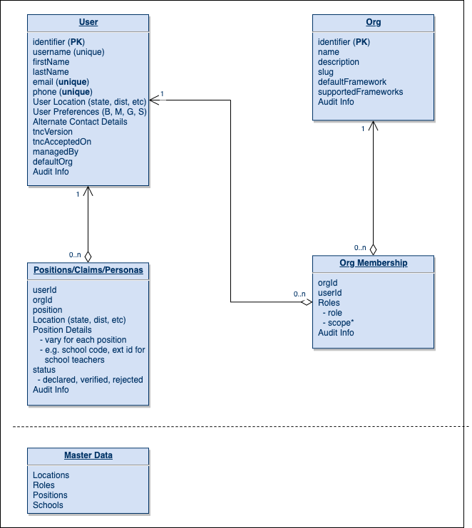

 _Data model (not the actual database & column design)_ 

 **Org & Org Membership** 

* Org is a tenant in Sunbird - used to tag content, courses & telemetry.

* Org membership will be used for assigning system roles for users. These system roles are used to determine what a user can/cannot do in the system.

* Self signed up users will not be part of any org and will not have any role by default.

* A user can have membership and different roles in multiple orgs.

* Access Scope of a role: E.g.: CONTENT_CREATOR with scope as "subject=Maths" and PROFILE_VALIDATOR with scope as "position=Teacher & school_code=S123". Scope attributes vary for each role. This will enable orgs to manage roles at a more granular level without the need for creating sub-orgs.

* Scope management at a user & role level can be simplified by rule based auto role assignment. e.g: all users with validated profile as "principal" in a school will get PROFILE_VALIDATOR role for "teacher" positions in the same school.

 **User Profile - Positions** 

* User can self declare information of what he/she does outside the system, i.e. positions held by the user in one or more orgs. The list of positions are limited to a master list of positions defined in the system.

* Each position info comprises of the org, location details and position specific details (like school udise code, teacher id for a teacher position).

* User positions will get validated by users of the org who have the appropriate system role & scope to do the validation.

* This information is mainly used for reporting purposes. In future, they can be used for attestation/validation of user profile (by other systems).

* Key Decision Point - separation of user declared positions and system roles as different entities.

 **Sub-Orgs or Multiple orgs in each tenant** 

* Use cases of sub-orgs:

    * A state has different subject departments (maths, science, etc) and wants to have separate set content creators & reviewers for each department.

    * A school principal wants to run a course batch only for teachers of his/her school.

    
* First use case can be handled by specifying access scope for the roles (CONTENT_CREATOR & CONTENT_REVIEWER).

* Second use case can be addressed by creating a group of users and creating a invite-only batch for that group.

* User association to a school will only be via User Profile - Positions and not via org membership. Any activities that need to be done for a specific school will be enabled via groups & group activities.

 **Telemetry & Reports** 

* Consumption attribution?

* Reports by multiple dimensions - org, location, positions (school, etc)…

*****

[[category.storage-team]] 
[[category.confluence]] 
