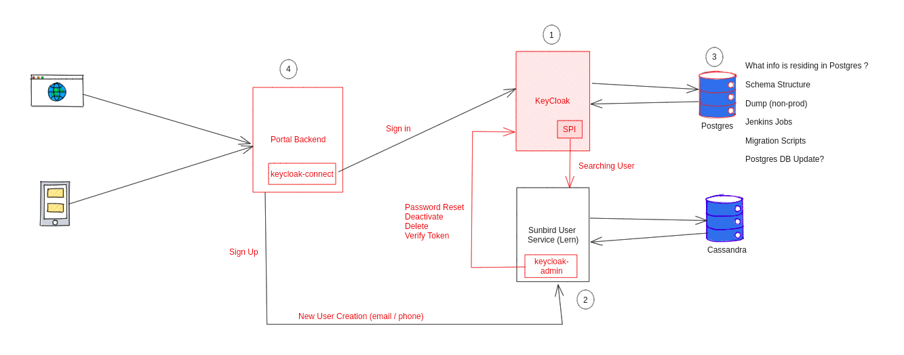

## Overview
The version of keycloak that is being used in Sunbird is outdated and needs to be upgraded. The current version being used is 7.0.1 and the new version available is 22.x. The latest upgrade will bring in new features, bug fixes and enhancements that is available in the recent versions.


## Some of the significant advantages that comes with the upgrade

* Quarkus distribution instead of WildFly, which is faster, leaner, and a lot easier to configure.


* Support for password-less authentication, multi-factor authentication and multiple credentials per user


* Enhanced security with the Keycloak Container Image


* New and improved Admin console


* New Account console for end-users to manage their account is now available by default


* Client Secret Rotation through customer policies for confidential clients, permitting two secrets simultaneously.


* Support to revoke refresh tokens through the token revocation endpoint


* Supports limits on the number of sessions a user can have


* The Keycloak storage change brings better support for cloud-native storages, no-downtime abilities, and better support for implementing custom storages


* Keycloak provides an optional a metrics endpoint which exports metrics in the Prometheus format


* Various other improvements and bug fixes


The detailed list of [release features](https://www.keycloak.org/docs/22.0.5/release_notes/) from version 7.0.1 and 21.x is available here: 


## Migrating from 7.0.1 to 21.x
At the time of writing this design, the new version available was 22.x. 

Consideration that was done to go with 21.x instead of 22.x are as follows.


* The components of Sunbird that interacts with KeyCloak is dependent on Java version 11. 


* From version 22.x of Keycloak Java 11 support is removed.


* Going with 22.x will need rewrites to the components of Sunbird to upgrade to Java 17 or later


## Approach for upgrading
In order to migrate Keycloak from 7.1 to 21.x we have to migrate the following


1. Migrate Keycloak postgress tables data


1. Do modifications to themes and templates so that i can support latest Keycloak version


1. Upgrade the sunbird-auth, user-org, lms(batch) services repo with latest dependency keycloak jars.


Earlier our system undergone Keycloak migration from 3.2.0 to 7.0.1, our plan is follow the same steps if everything works ok, or we need to find solution if anything comes. Please check previous migration script for more details.

[[Keycloak Upgrade from 3.2.0 to 7.0.1|Keycloak-Upgrade-from-3.2.0-to-7.0.1]]

 **High-Level approach** 

As specified in the upgrading guide of Keycloak [here](https://www.keycloak.org/docs/latest/upgrading/index.html), below will be the high level approach. 


* Upgrade the Keycloak server first


* Upgrade the Keycloak adapters second


The steps will be automated through custom scripts as how it was done for migrating from 3.x to 7.x

All user sessions will be lost during the upgrade. After the upgrade, all users will have to log in again.

 **Upgrade the Keycloak** 

After a clean instance of latest Keycloak release is installed, the below files needs to be copied from the previous installation to the new installation.


```
conf/, providers/ and themes/
```
 **Database migration** 

Keycloak can automatically migrate the database schema, or you can choose to do it manually. By default the database is automatically migrated when you start the new installation for the first time.

Creating an index on huge tables with millions of records can easily take a huge amount of time and potentially cause major service disruption on upgrades. There is a threshold (the number of records) for automated index creation. Default threshold is 300000 records. When the number of records is higher than the threshold, the index is not created automatically, and there will be a warning message in server logs including SQL commands which can be applied later manually.


 **Migrate Themes and Templates :** 

Engage DevOps / portal team for migrating to latest templates and themes changes.

 **Upgrade Keycloak related jars :** 

Keycloak dependency jars are used in,


* sunbird-auth


* user-org


* lms services


In order to support the migration we need to update the dependency jars, reason is keycloak server does not start with Keycloak 7 version of sunbird-auth jar,  that is added in the providers folder of Keycloak-server.

sunbird-auth repo code modifications expected with following dependency jars:


```xml
<!-- https://mvnrepository.com/artifact/org.keycloak/keycloak-server-spi-private  -->
<dependency>
    <groupId>org.keycloak</groupId>
    <artifactId>keycloak-server-spi-private</artifactId>
    <version>21.1.2</version>
    <scope>provided</scope>
</dependency>

<!-- https://mvnrepository.com/artifact/org.keycloak/keycloak-server-spi  -->
<dependency>
    <groupId>org.keycloak</groupId>
    <artifactId>keycloak-server-spi</artifactId>
    <version>21.1.2</version>
    <scope>provided</scope>
</dependency>

<!-- https://mvnrepository.com/artifact/org.keycloak/keycloak-core  -->
<dependency>
    <groupId>org.keycloak</groupId>
    <artifactId>keycloak-core</artifactId>
    <version>21.1.2</version>
</dependency>

<!-- https://mvnrepository.com/artifact/org.keycloak/keycloak-services -->
<dependency>
	<groupId>org.keycloak</groupId>
	<artifactId>keycloak-services</artifactId>
	<version>22.1.2</version>
	<scope>provided</scope>
</dependency>
```


The UserStorageProvider is now available in a new dependent module, keycloak-model-legacy-private,  hence this new dependency is needed.


```
<!-- https://mvnrepository.com/artifact/org.keycloak/keycloak-model-legacy-private -->
<dependency>
	<groupId>org.keycloak</groupId>
	<artifactId>keycloak-model-legacy-private</artifactId>
	<version>22.0.1</version>
</dependency>
```


user-org, lms services related keycloak-admin-cleint 21.1.1 dependency jar inside the pom.


```
<!-- https://mvnrepository.com/artifact/org.keycloak/keycloak-admin-client  -->
<dependency>
    <groupId>org.keycloak</groupId>
    <artifactId>keycloak-admin-client</artifactId>
    <version>21.1.2</version>
</dependency>

<dependency>
    <groupId>org.jboss.resteasy</groupId>
    <artifactId>jaxrs-api</artifactId>
    <version>3.0.12.Final</version>
</dependency>
<dependency>
    <groupId>org.jboss.resteasy</groupId>
    <artifactId>resteasy-client</artifactId>
    <version>4.7.9.Final</version>
</dependency>
<dependency>
    <groupId>org.jboss.resteasy</groupId>
    <artifactId>resteasy-jackson2-provider</artifactId>
    <version>4.7.9.Final</version>
</dependency>
```

## Steps performed locally for the migration as part of POC
 **High Level Diagram** 

Migrating Keycloak sever in local:


1. Install keycloak-7.0.1 server in local


1. keycloak-7.0.1 connected to postgres server and postgres is loaded with dev data.


1. Installed keycloak-21.1.2 through docker/ standalone.


1. Through standalone following command is used for starting keycloak-server

    ./kc.sh start-dev --import-realm --spi-connections-jpa-legacy-migration-strategy=update


1. Postgres tables migration taken care by keycloak with the following command through docker start:


```
docker run --name kc_local_v21 -p 8080:8080 \
        -e KEYCLOAK_USER=admin -e KEYCLOAK_PASSWORD=sunbird \
        -v $sunbird_dbs_path/keycloak/tmp:/tmp \
        -v $sunbird_dbs_path/keycloak/realm:/opt/keycloak/data/imports \
        -v $sunbird_dbs_path/keycloak/themes/sunbird:/opt/keycloak/themes/sunbird \
        -v $sunbird_dbs_path/keycloak/configuration/keycloak_v21.conf:/opt/keycloak/conf/keycloak.conf \
        --net keycloak-postgres-network \
        -e sunbird_user_service_base_url="http://localhost:9000" \
        -d keycloak/keycloak:21.1.2 start-dev --import-realm --spi-connections-jpa-legacy-migration-strategy=update --transaction-xa-enabled=true
```
--spi-connections-jpa-legacy-migration-strategy=update helps in migrating the tables by default.

source: [https://www.keycloak.org/docs/21.1.2/upgrading/#automatic-relational-database-migration](https://www.keycloak.org/docs/21.1.2/upgrading/#automatic-relational-database-migration)

The same migration activity can be carried out with  **manual**  mode option too, with manual mode while  starting the keycloak we need to specify the path for loading the migration scripts into a sql file and manually we need to execute on the postgres schema.

config example:


```
--spi-connections-jpa-legacy-migration-strategy=manual --spi-connections-jpa-legacy-migration-export=/opt/keycloak-21.1.2/data/sqllogs/migration.sql
```

```
psql -U {{username}} -d keycloak_3017_21_2 -h {{IP}} -p 5432 -W -f migration.sql
```
Manual migration is done on the lern-dev keycloak:


 **High Level changes observed** 


* Database schema changes


* SPI changes


* The /auth end point changes


 **Database level changes observed** 

Below are the details of the tables with respect to the keycloak-21.1.2 and keycloak-7.0.1, there are many table, index changes observed from the below attachments.

Command to get tables structures from postgres:


```
\o keycloak22_postgres_tables.txt
\d public.*
\o
```


The key tables where user data is captured are as follows: federated_user, federated_user_required_action, user_entity


 **Steps for Validating the Keycloak data before and after migration:** 


* Run \dt in psql


* Copy the results to a text editor.


* Then run a regex search and replace like this:


```
^[^|]*\|\s+([^|]*?)\s+\| table \|.*$
to
select '\1', count(*) from \1 union/g
```

* Run it in psql and you're done(You'll need to remove the last union and add the semicolon at the end manually)


* Do the same procedure before and after the keycloak migration.


Keycloak-21 tables listselect 'admin_event_entity', count( _) from admin_event_entity union_ 

 _select 'associated_policy', count(_ ) from associated_policy union

select 'authentication_execution', count( _) from authentication_execution union_ 

 _select 'authentication_flow', count(_ ) from authentication_flow union

select 'authenticator_config', count( _) from authenticator_config union_ 

 _select 'authenticator_config_entry', count(_ ) from authenticator_config_entry union

select 'broker_link', count( _) from broker_link union_ 

 _select 'client', count(_ ) from client union

select 'client_attributes', count( _) from client_attributes union_ 

 _select 'client_auth_flow_bindings', count(_ ) from client_auth_flow_bindings union

select 'client_initial_access', count( _) from client_initial_access union_ 

 _select 'client_node_registrations', count(_ ) from client_node_registrations union

select 'client_scope', count( _) from client_scope union_ 

 _select 'client_scope_attributes', count(_ ) from client_scope_attributes union

select 'client_scope_client', count( _) from client_scope_client union_ 

 _select 'client_scope_role_mapping', count(_ ) from client_scope_role_mapping union

select 'client_session', count( _) from client_session union_ 

 _select 'client_session_auth_status', count(_ ) from client_session_auth_status union

select 'client_session_note', count( _) from client_session_note union_ 

 _select 'client_session_prot_mapper', count(_ ) from client_session_prot_mapper union

select 'client_session_role', count( _) from client_session_role union_ 

 _select 'client_user_session_note', count(_ ) from client_user_session_note union

select 'component', count( _) from component union_ 

 _select 'component_config', count(_ ) from component_config union

select 'composite_role', count( _) from composite_role union_ 

 _select 'credential', count(_ ) from credential union

select 'databasechangelog', count( _) from databasechangelog union_ 

 _select 'databasechangeloglock', count(_ ) from databasechangeloglock union

select 'default_client_scope', count( _) from default_client_scope union_ 

 _select 'event_entity', count(_ ) from event_entity union

select 'fed_user_attribute', count( _) from fed_user_attribute union_ 

 _select 'fed_user_consent', count(_ ) from fed_user_consent union

select 'fed_user_consent_cl_scope', count( _) from fed_user_consent_cl_scope union_ 

 _select 'fed_user_credential', count(_ ) from fed_user_credential union

select 'fed_user_group_membership', count( _) from fed_user_group_membership union_ 

 _select 'fed_user_required_action', count(_ ) from fed_user_required_action union

select 'fed_user_role_mapping', count( _) from fed_user_role_mapping union_ 

 _select 'federated_identity', count(_ ) from federated_identity union

select 'federated_user', count( _) from federated_user union_ 

 _select 'group_attribute', count(_ ) from group_attribute union

select 'group_role_mapping', count( _) from group_role_mapping union_ 

 _select 'identity_provider', count(_ ) from identity_provider union

select 'identity_provider_config', count( _) from identity_provider_config union_ 

 _select 'identity_provider_mapper', count(_ ) from identity_provider_mapper union

select 'idp_mapper_config', count( _) from idp_mapper_config union_ 

 _select 'jgroupsping', count(_ ) from jgroupsping union

select 'keycloak_group', count( _) from keycloak_group union_ 

 _select 'keycloak_role', count(_ ) from keycloak_role union

select 'migration_model', count( _) from migration_model union_ 

 _select 'offline_client_session', count(_ ) from offline_client_session union

select 'offline_user_session', count( _) from offline_user_session union_ 

 _select 'policy_config', count(_ ) from policy_config union

select 'protocol_mapper', count( _) from protocol_mapper union_ 

 _select 'protocol_mapper_config', count(_ ) from protocol_mapper_config union

select 'realm', count( _) from realm union_ 

 _select 'realm_attribute', count(_ ) from realm_attribute union

select 'realm_default_groups', count( _) from realm_default_groups union_ 

 _select 'realm_enabled_event_types', count(_ ) from realm_enabled_event_types union

select 'realm_events_listeners', count( _) from realm_events_listeners union_ 

 _select 'realm_localizations', count(_ ) from realm_localizations union

select 'realm_required_credential', count( _) from realm_required_credential union_ 

 _select 'realm_smtp_config', count(_ ) from realm_smtp_config union

select 'realm_supported_locales', count( _) from realm_supported_locales union_ 

 _select 'redirect_uris', count(_ ) from redirect_uris union

select 'required_action_config', count( _) from required_action_config union_ 

 _select 'required_action_provider', count(_ ) from required_action_provider union

select 'resource_attribute', count( _) from resource_attribute union_ 

 _select 'resource_policy', count(_ ) from resource_policy union

select 'resource_scope', count( _) from resource_scope union_ 

 _select 'resource_server', count(_ ) from resource_server union

select 'resource_server_perm_ticket', count( _) from resource_server_perm_ticket union_ 

 _select 'resource_server_policy', count(_ ) from resource_server_policy union

select 'resource_server_resource', count( _) from resource_server_resource union_ 

 _select 'resource_server_scope', count(_ ) from resource_server_scope union

select 'resource_uris', count( _) from resource_uris union_ 

 _select 'role_attribute', count(_ ) from role_attribute union

select 'scope_mapping', count( _) from scope_mapping union_ 

 _select 'scope_policy', count(_ ) from scope_policy union

select 'user_attribute', count( _) from user_attribute union_ 

 _select 'user_consent', count(_ ) from user_consent union

select 'user_consent_client_scope', count( _) from user_consent_client_scope union_ 

 _select 'user_entity', count(_ ) from user_entity union

select 'user_federation_config', count( _) from user_federation_config union_ 

 _select 'user_federation_mapper', count(_ ) from user_federation_mapper union

select 'user_federation_mapper_config', count( _) from user_federation_mapper_config union_ 

 _select 'user_federation_provider', count(_ ) from user_federation_provider union

select 'user_group_membership', count( _) from user_group_membership union_ 

 _select 'user_required_action', count(_ ) from user_required_action union

select 'user_role_mapping', count( _) from user_role_mapping union_ 

 _select 'user_session', count(_ ) from user_session union

select 'user_session_note', count( _) from user_session_note union_ 

 _select 'username_login_failure', count(_ ) from username_login_failure union

select 'web_origins', count(\*) from web_origins;

 **Changes identified in the keycloak deployment:** 


* Curl for auth-token generation is 


```
curl --location --request POST 'http://localhost:8080/realms/sunbird/protocol/openid-connect/token' \
--header 'Cache-Control: no-cache' \
--header 'Content-Type: application/x-www-form-urlencoded' \
--data-urlencode 'client_id=lms' \
--data-urlencode 'username=localkeycloakuserdocker' \
--data-urlencode 'password=Password@1' \
--data-urlencode 'grant_type=client_credentials' \
--data-urlencode 'client_secret=**********'
```

* During keycloak 7 release, we are running the keycloak from the ./standalone.xml, now in keycloak.21.1.2 configuration file path is : keycloak/conf/keycloak.conf


* Sample keycloak.conf   


 **The /auth end point changes** 

Keycloak auth token generation url has a breaking changes; the “/auth” is removed from the apis. 

Example:


```
keycloak 7 version uri for user search: /auth/admin/realms/sunbird/users/f:03a14f73-54bf-4749-be16-8e91f775bb35:4c0cd618-00d1-4a8e-a22c-e1abb03de46c

keycloak 21 version for user search: /admin/realms/sunbird/users/f:03a14f73-54bf-4749-be16-8e91f775bb35:4c0cd618-00d1-4a8e-a22c-e1abb03de46c
```
As this is a breaking change in the applications, a work around was detected to bring the /auth prefix back by passing the below argument in startup 


```
--http-relative-path /auth
```
source: [https://www.keycloak.org/migration/migrating-to-quarkus](https://www.keycloak.org/migration/migrating-to-quarkus) please check content with heading “Default context path changed”

 **Technical testing conducted locally** 


* User-search is tested from Keycloak.


* Creation of new users


* Password-reset while new user got created


* Limited testing could be done for the existing users locally


 **Migrating Keycloak sever in Dev environment:** 


1. Download Keycloak-21.1.2 from [https://www.keycloak.org/archive/downloads-21.1.2.html](https://www.keycloak.org/archive/downloads-21.1.2.html)  and untar with tar -xvf $keycloak-path


1. Take backup of existing keycloak db and create new instance for latest keycloak.


1. copy-paste themes/ providers/ conf/ and realms to latest respective folders


1. Navigate to keycloak bin folder and execute below command


1. start-keycloak: 

    ./kc.sh --verbose start-dev --spi-connections-jpa-legacy-migration-strategy=update --proxy edge --spi-login-protocol-openid-connect-legacy-logout-redirect-uri=true --quarkus.transaction-manager.enable-recovery=true


1. The above will migrate the database in order to support 21.1.2


1. After user-login in keycloak admin page, user-search in sunbird realm didn’t worked, showing java-script error. There is a work around for this, Please disable and enable the existing user-fedaration.


## Open Items / Next Steps
1incompleteDetail out the changes required in the  **portal backend** 13incompleteReset password issue (nginix config). Engage DevOps14completePost migrating to 21.x, 15completeSome changes to be done in the Keycloak-connect2completeDetail out the changes needed in the login templates - TBC16incompleteDetail out the changes required in the  **mobile application** 17completeOnly for testing, enable mobile application to point to Lern Dev22incompleteA mobile build pointing to Dev environment for carrying out the tests -  / 18incomplete **FYI**  - 5.1.x version of mobile application has a custom login page, which talks to portal backend API19incomplete< 5.1.x uses login templates delivered through the portal3incompleteCreate scripts that can help in one click migration26complete[https://raw.githubusercontent.com/project-sunbird/sunbird-devops/d0ed8f38294978a6f31ba1a65f5fe4595b537b32/deploy/migrate-to-keycloak21.sh](https://raw.githubusercontent.com/project-sunbird/sunbird-devops/d0ed8f38294978a6f31ba1a65f5fe4595b537b32/deploy/migrate-to-keycloak21.sh)21incompleteValidate - Clear the DB of duplicate values20incompleteList out the jenkins jobs related to Keycloak and if it requires changes11completeAdd the Pull Request links for the SPI changes to call out the changes24completeSunbird-auth service pr: [https://github.com/Sunbird-Lern/sunbird-auth/pull/110](https://github.com/Sunbird-Lern/sunbird-auth/pull/110)25completeUser-org service pr: [https://github.com/Sunbird-Lern/userorg-service/pull/1225](https://github.com/Sunbird-Lern/userorg-service/pull/1225)27completeDevops pr: [https://github.com/project-sunbird/sunbird-devops/pull/3916](https://github.com/project-sunbird/sunbird-devops/pull/3916)12incompleteGet the test cases from Lern and ED (Portal + Mobile) which uses Keycloak - 7incompleteCheck with the various grant types and making sure that the behaviour is consistent between KC 7 and KC 2123incompleteUpgradation testing in Dev8incompletePost upgrading Dev, test the below user journey against the KC 219incompletePortal & Mobile login of Existing User10incompletePortal & Mobile login of New User


## 06/11/2023: Comments from review with Rayulu
 /  / 

28incompleteCapture the Keycloak major features between 7 and 21, which can possibly add value to Sunbird30incompleteTesting the migration at scale - Plan and approach (Data migration, Index creations etc)31incompleteDocument the Impact to existing users (lost session, relogin etc). Portal & Mobile32incompleteTesting for State SSO, Google SSO33incompleteDocument the things needed for migration34incompleteOperational steps35incompleteBackup strategy (which all DBs to be backed up36incompleteTest strategy post migration (DB cross checking, Functional testing)37incompleteEstimation for migration

 **Dev-Ed Issues:** 


1. Auth-token generation api throwing the error 

Token-generation request:


```
curl --location --request POST 'https://dev.sunbirded.org/auth/realms/sunbird/protocol/openid-connect/token' \
--header 'Cache-Control: no-cache' \
--header 'Content-Type: application/x-www-form-urlencoded' \
--data-urlencode 'client_id=project-sunbird-dev-client' \
--data-urlencode 'username=contentcreator' \
--data-urlencode 'password=Test@123' \
--data-urlencode 'grant_type=password' \
--data-urlencode 'client_secret=xxxxxx-46b9-yyyy-97cf-zzzzzzzzz'
```


Response:

The response is showing as below with server error details are mentioned.


```
{
    "error": "unknown_error"
}
```
Error stack details:


```
2024-05-02 06:40:23,359 ERROR [org.keycloak.services.error.KeycloakErrorHandler] (executor-thread-23) Uncaught server error: org.keycloak.authentication.AuthenticationFlowException: Unknown flow provider type
 at org.keycloak.authentication.AuthenticationProcessor.createFlowExecution(AuthenticationProcessor.java:883)
 at org.keycloak.authentication.AuthenticationProcessor.authenticateOnly(AuthenticationProcessor.java:1025)
 at org.keycloak.protocol.oidc.endpoints.TokenEndpoint.resourceOwnerPasswordCredentialsGrant(TokenEndpoint.java:639)
 at org.keycloak.protocol.oidc.endpoints.TokenEndpoint.processGrantRequestInternal(TokenEndpoint.java:223)
 at org.keycloak.protocol.oidc.endpoints.TokenEndpoint.access$100(TokenEndpoint.java:131)
 at org.keycloak.protocol.oidc.endpoints.TokenEndpoint$1.runInternal(TokenEndpoint.java:185)
 at org.keycloak.common.util.ResponseSessionTask.run(ResponseSessionTask.java:67)
 at org.keycloak.common.util.ResponseSessionTask.run(ResponseSessionTask.java:44)
 at org.keycloak.models.utils.KeycloakModelUtils.runJobInRetriableTransaction(KeycloakModelUtils.java:299)
 at org.keycloak.protocol.oidc.endpoints.TokenEndpoint.processGrantRequest(TokenEndpoint.java:178)
 at jdk.internal.reflect.GeneratedMethodAccessor156.invoke(Unknown Source)
 at java.base/jdk.internal.reflect.DelegatingMethodAccessorImpl.invoke(DelegatingMethodAccessorImpl.java:43)
 at java.base/java.lang.reflect.Method.invoke(Method.java:568)
 at org.jboss.resteasy.core.MethodInjectorImpl.invoke(MethodInjectorImpl.java:170)
 at org.jboss.resteasy.core.MethodInjectorImpl.invoke(MethodInjectorImpl.java:130)
 at org.jboss.resteasy.core.ResourceMethodInvoker.internalInvokeOnTarget(ResourceMethodInvoker.java:660)
 at org.jboss.resteasy.core.ResourceMethodInvoker.invokeOnTargetAfterFilter(ResourceMethodInvoker.java:524)
 at org.jboss.resteasy.core.ResourceMethodInvoker.lambda$invokeOnTarget$2(ResourceMethodInvoker.java:474)
 at org.jboss.resteasy.core.interception.jaxrs.PreMatchContainerRequestContext.filter(PreMatchContainerRequestContext.java:364)
 at org.jboss.resteasy.core.ResourceMethodInvoker.invokeOnTarget(ResourceMethodInvoker.java:476)
 at org.jboss.resteasy.core.ResourceMethodInvoker.invoke(ResourceMethodInvoker.java:434)
 at org.jboss.resteasy.core.ResourceLocatorInvoker.invokeOnTargetObject(ResourceLocatorInvoker.java:192)
 at org.jboss.resteasy.core.ResourceLocatorInvoker.invoke(ResourceLocatorInvoker.java:152)
 at org.jboss.resteasy.core.ResourceLocatorInvoker.invokeOnTargetObject(ResourceLocatorInvoker.java:183)
 at org.jboss.resteasy.core.ResourceLocatorInvoker.invoke(ResourceLocatorInvoker.java:141)
 at org.jboss.resteasy.core.ResourceLocatorInvoker.invoke(ResourceLocatorInvoker.java:32)
 at org.jboss.resteasy.core.SynchronousDispatcher.invoke(SynchronousDispatcher.java:492)
 at org.jboss.resteasy.core.SynchronousDispatcher.lambda$invoke$4(SynchronousDispatcher.java:261)
 at org.jboss.resteasy.core.SynchronousDispatcher.lambda$preprocess$0(SynchronousDispatcher.java:161)
 at org.jboss.resteasy.core.interception.jaxrs.PreMatchContainerRequestContext.filter(PreMatchContainerRequestContext.java:364)
 at org.jboss.resteasy.core.SynchronousDispatcher.preprocess(SynchronousDispatcher.java:164)
 at org.jboss.resteasy.core.SynchronousDispatcher.invoke(SynchronousDispatcher.java:247)
 at io.quarkus.resteasy.runtime.standalone.RequestDispatcher.service(RequestDispatcher.java:73)
 at io.quarkus.resteasy.runtime.standalone.VertxRequestHandler.dispatch(VertxRequestHandler.java:151)
 at io.quarkus.resteasy.runtime.standalone.VertxRequestHandler.handle(VertxRequestHandler.java:82)
 at io.quarkus.resteasy.runtime.standalone.VertxRequestHandler.handle(VertxRequestHandler.java:42)
 at io.vertx.ext.web.impl.RouteState.handleContext(RouteState.java:1284)
 at io.vertx.ext.web.impl.RoutingContextImplBase.iterateNext(RoutingContextImplBase.java:173)
 at io.vertx.ext.web.impl.RoutingContextWrapper.next(RoutingContextWrapper.java:200)
 at io.quarkus.vertx.http.runtime.StaticResourcesRecorder$2.handle(StaticResourcesRecorder.java:84)
 at io.quarkus.vertx.http.runtime.StaticResourcesRecorder$2.handle(StaticResourcesRecorder.java:71)
 at io.vertx.ext.web.impl.RouteState.handleContext(RouteState.java:1284)
 at io.vertx.ext.web.impl.RoutingContextImplBase.iterateNext(RoutingContextImplBase.java:173)
 at io.vertx.ext.web.impl.RoutingContextWrapper.next(RoutingContextWrapper.java:200)
 at io.quarkus.vertx.http.runtime.VertxHttpRecorder$6.handle(VertxHttpRecorder.java:430)
 at io.quarkus.vertx.http.runtime.VertxHttpRecorder$6.handle(VertxHttpRecorder.java:408)
 at io.vertx.ext.web.impl.RouteState.handleContext(RouteState.java:1284)
 at io.vertx.ext.web.impl.RoutingContextImplBase.iterateNext(RoutingContextImplBase.java:173)
 at io.vertx.ext.web.impl.RoutingContextWrapper.next(RoutingContextWrapper.java:200)
 at org.keycloak.quarkus.runtime.integration.web.QuarkusRequestFilter.lambda$createBlockingHandler$0(QuarkusRequestFilter.java:82)
 at io.quarkus.vertx.core.runtime.VertxCoreRecorder$14.runWith(VertxCoreRecorder.java:576)
 at org.jboss.threads.EnhancedQueueExecutor$Task.run(EnhancedQueueExecutor.java:2449)
 at org.jboss.threads.EnhancedQueueExecutor$ThreadBody.run(EnhancedQueueExecutor.java:1478)
 at org.jboss.threads.DelegatingRunnable.run(DelegatingRunnable.java:29)
 at org.jboss.threads.ThreadLocalResettingRunnable.run(ThreadLocalResettingRunnable.java:29)
 at io.netty.util.concurrent.FastThreadLocalRunnable.run(FastThreadLocalRunnable.java:30)
 at java.base/java.lang.Thread.run(Thread.java:833)
```
Resolution: 

In Authentication flow for  Direct grant flow should be configured with “Direct Grant 2” rather than anyother.  After migration it is set to “TEMPORARY_CREATED_AUTH_FLOW”.

Path : Authentication → Flows → set Direct Grant 2 for “Direct grant flow”.


*****

[[category.storage-team]] 
[[category.confluence]] 
