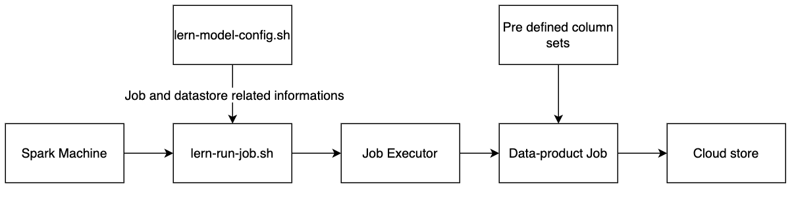
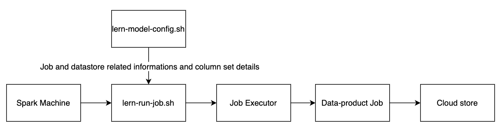

##  Introduction :
This document describes the design strategy for removing the framework (BMGS) related hardcoding and  enabling configurability.


##  Background & Problem Statement:

* Within LERN, every service and Flink job features configurable BMGS levels, hence there is no tight coupling of BMGS framework in any workflow. However, data products are closely linked to BMGS information, as it is extracting BMGS information from user data for reporting purposes.


* In userorg-service, the user’s data is indexed into Elasticsearch with BMGS values for search purpose.


##  Key design problems:

* Data-product is processing jobs with BMGS information which is extracted from user’s data.


* BMGS column names are hardcoded in the data-product script


* User data is indexed in Elasticsearch with BMGS values.


##  Design for Data-products:
The data-products are implemented as the scala scripts and triggered in the spark environment using shell scripts. For Reference.

Currently, the jobs are extracting the data from the data store from the predefined set of columns in te script. Using lern-model-config, the column set can be configured as what all needs to be loaded from datastore.


###  Current Design:

###  Proposed Design:

##  **Solution for data-products:** 
The BMGS related informations for the reports are extracted only from user cache or user table in cassandra. Currently the column set which has to be extracted from datastore are predefined in the scala scripts as follows. 

 **Sample script for current flow:** 


```
override def getUserCacheColumns(): Seq[String] = {
  Seq("userid", "state", "district", "cluster", "orgname", "schooludisecode", "schoolname", "block", "board", "rootorgid", "usertype", "usersubtype")
}
```
above is the function in a progressexhaust job which is used to extract the user data from user redis.

For Reference: [Code Link](https://github.com/Sunbird-Lern/data-products/blob/release-5.4.0/lern-data-products/src/main/scala/org/sunbird/lms/exhaust/collection/ProgressExhaustJob.scala#L31-L33)

Since the LERN data-products have report related column config in lern-model-config, the BMGS related column config also can be added. This column list can be added to the config JSON object as userCacheCols

 **Sample config for proposed design:** 


```
"progress-exhaust")
echo '{"search":{"type":"none"},"model":"org.sunbird.lms.exhaust.collection.ProgressExhaustJob","modelParams":{"cassandraReadConsistency":"{{core_cassandra_read_consistency}}","cassandraWriteConsistency":"{{core_cassandra_write_consistency}}","store":"{{dp_object_store_type}}","storageKeyConfig":"storage.key.config","storageSecretConfig":"storage.secret.config","storageContainer":"{{reports_container}}","storageEndpoint":"{{dp_storage_endpoint_config}}","mode":"OnDemand","batchFilters":["TPD"],"searchFilter":{},"sparkElasticsearchConnectionHost":"{{ sunbird_es_host }}","sparkRedisConnectionHost":"{{ metadata2_redis_host }}","sparkUserDbRedisIndex":"12","sparkUserDbRedisPort":"{{ user_port }}","sparkCassandraConnectionHost":"{{ core_cassandra_host }}","fromDate":"$(date --date yesterday '+%Y-%m-%d')","toDate":"$(date --date yesterday '+%Y-%m-%d')","csvColumns":["courseid", "collectionName", "batchid", "batchName", "userid",  "state", "district", "orgname", "schooludisecode", "schoolname", "board", "block", "cluster", "usertype", "usersubtype", "enrolleddate", "completedon", "certificatestatus", "completionPercentage"],"userCacheCols":["board","medium"]},"parallelization":8,"appName":"Progress Exhaust"}'
;;
```
Reference Link for where the config to be added: [https://github.com/Sunbird-Lern/data-products/blob/release-5.4.0/ansible/roles/lern-data-products-deploy/templates/lern-model-config.j2#L66-L68](https://github.com/Sunbird-Lern/data-products/blob/release-5.4.0/ansible/roles/lern-data-products-deploy/templates/lern-model-config.j2#L66-L68)

 **Solution for userorg-service:** BMGS data is available in framework object in user record. In userorg-service, user’s data is indexed with predefined mapping schema. Schema is currently indexing framework related informations with predefined BMGS set. By updating the index mapping to accept all the fields which is coming in the framework by using the below alteration into the mapping object.


```
"dynamic": "true",
"dynamic_templates": [
    {
        "framework_fields": {
            "path_match": "framework.*",
            "mapping": {
                "fields": {
                    "raw": {
                        "type": "text",
                        "analyzer": "keylower"
                    }
                },
                "analyzer": "cs_search_analyzer",
                "search_analyzer": "cs_search_analyzer"
            }
        }
    },
    {
        "non_indexable_fields": {
            "path_match":"*",
            "path_unmatch": "framework.*",
            "mapping": {
                "index": false
            }
        }
    }
]] ]></ac:plain-text-body></ac:structured-macro><p><strong>Analysis for elasticsearch mapping updation:</strong></p><ul><li><p>Mapping schema needs both indexable and non indexable fields specification, otherwise it indexes all fields. so performance and space issue will be raised</p></li><li><p>dynamic template will be an issue only when the field type varies. performance will be an issue only if it’s a dynamic field, on write and if it’s a runtime field, it’s on read. the current dynamic templates are are on write not runtime.</p></li></ul><p><u>Benchmarking results</u></p><p>Benchmarking results for indexing the record and query response while searching with existing non-dynamic mapping and after updating the dynamic mapping.</p><ac:structured-macro ac:name="code" ac:schema-version="1" ac:macro-id="50d0eeb2-0459-4a29-a6e5-50c08fa5833f"><ac:plain-text-body><![CDATA[Before updating the mapping schema(current mapping)
  1st Try:
    Index 10000 user records: 44.4 seconds
    10000 Search queries: 29.4 seconds
  2nd Try:
    Index 10000 user records: 42.8 seconds
    10000 Search queries: 29.2 seconds
  3rd Try:
    Index 10000 user records: 41.3 seconds
    10000 Search queries: 29.0 seconds

After updating the mapping schema
  1st Try:
    Index 10000 user records: 42.1 seconds
    10000 Search queries: 29.2 seconds
  2nd Try:
    Index 10000 user records: 41.4 seconds
    10000 Search queries: 28.8 seconds
  3rd Try:
    Index 10000 user records: 44.5 seconds
    10000 Search queries: 29.9 seconds
```
Based on the benchmarking result, the performance is not affected since the dynamic mapping is not on runtime.


*****

[[category.storage-team]] 
[[category.confluence]] 
