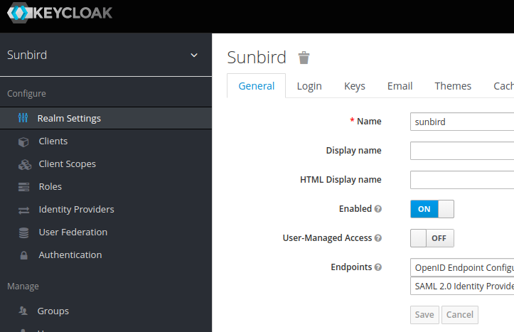
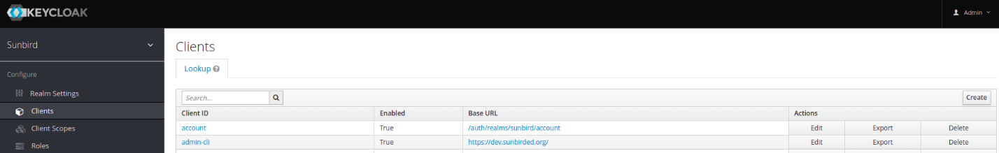
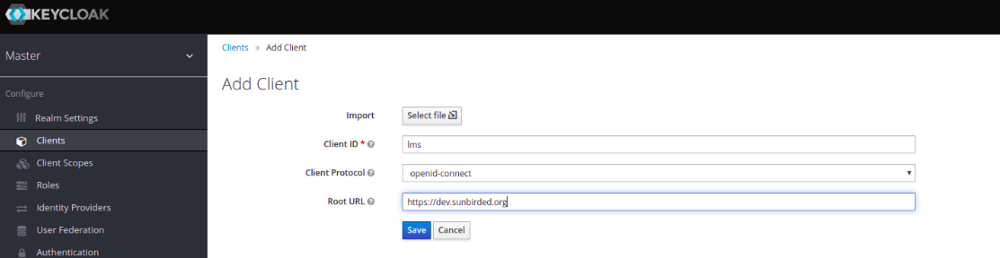
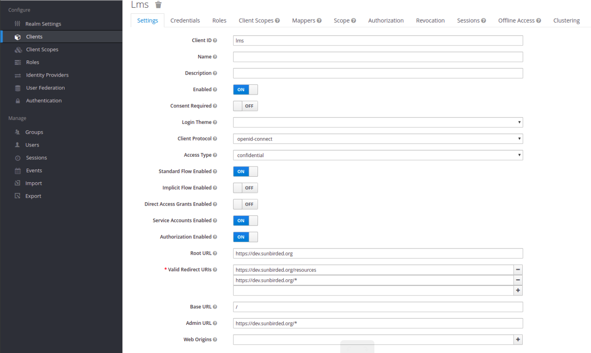
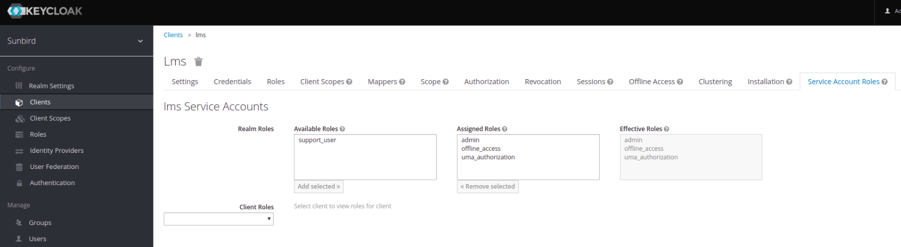
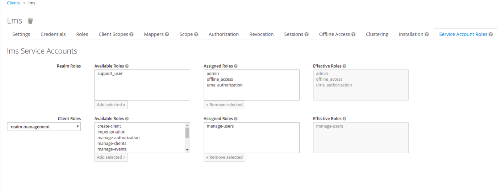

## About
To create a new client in keycloak : lms.

## Steps for creating lms client in keycloak

|  |  **Steps**  |  **Screen**  | 
|  --- |  --- |  --- | 
| 1 | Login to admin console |  | 
| 2 | Select the Realm |  | 
| 3 | Go to Clients tab on left side of admin console  |  | 
| 4 | Click create button on left hand side of screen |  | 
| 5 | Fill the given details eg: client id and root url and save |  | 
| 6 | Fill the given details As shown in screen |  | 
| 7 | Go to service Account Roles tab  and add admin role in Realm Role Box as shown  |  | 
| 8 | In client role drop down , select realm-management and add manage-users role as shown |  | 

*****

[[category.storage-team]] 
[[category.confluence]] 
