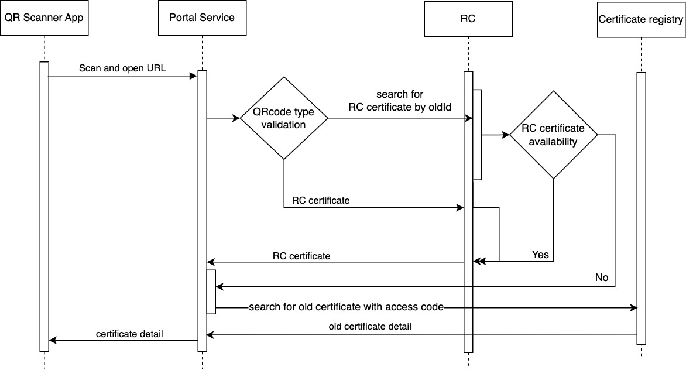

## Introduction:
Sunbird Lern BB is using Sunbird RC for generating & issuing e-credentials in its use cases (e.g.: course completion certificate) for all the latest completed courses (post March-2022). All the old certificates were custom generated and stored in Cassandra and cloud storage.


## Background & Problem Statement:
Sunbird Lern BB stored all the old certificates in Cassandra database for specific user accounts based on different environments. Once we migrate these certificates then we no longer need to store certificates in Cassandra and all the certificates will be using Sunbird RC going forward.


## Key design problems:
Sunbird Lern BB has to maintain the old and new flows for supporting the certificates generated using both the RC and custom-generated. In order to support old certificates there is dependency with the Cassandra for certificate data and cloud service provider for certificate json and template. So when there is any change in the Cloud Service Providers then Lern BB has to make necessary configuration changes and test whether the old certificates were being downloaded properly or not. 


## Design:
To make the Sunbird Lern BB certificates with RC specification and remove Cassandra and cloud storage dependency for storing certificate data, migrate all the old certificates as one-time activity. Post this certificate migration all the certificates can be accessible using Sunbird RC services and LERN does not have to maintain the old flow for getting custom-generated certificates anymore.

Sample New Certificate:

Sample Old Certificate:

Sample Old QR Data:


```
https://staging.sunbirded.org/certs/8e57723e-4541-11eb-b378-0242ac130002
```
Sample RC QR Data:


```
https://staging.sunbirded.org/certs/f2e35747-c366-4b21-a95f-b99ce8b42a10?t=URL&entity=TrainingCertificate
```

## Solution:
Certificate Re-Issue will be one option where all the old certificates can be re-issued by a background process without any user intervention.

As certificate-generator flink job, reissues certificate, we can clone from certificate-generator flink job and with migration changes added, it can issue the certificate with old certificate detail. In the certificate migration process, old certificate generated time will be passed as issued date and old ID will be passed for identification of old certificate.

 **** To support old QR Codes** 

Due to moving the certificates to RC, old QR code for the certificate verification will become invalid. To make old QR code scans identify RC, the changes can be added to portal service by  **Sunbird ED building block** 


## Implementation
For migrating the old certificates into RC, spark job will be implemented to generate the events and push to kafka and flink job will be implemented to get the event and make API call to RC registry to create the certificate.

Flink job will be running in a new pod under the  **LERN Flink jobs**  k8s cluster. Since this is running in the background, each certificate can be migrated without any downtime for the application. 


1.  **OldCertificateMigrationJob [Spark Job]** 


    1. Fetch all the valid records from the Cassandra Database (sunbird.cert_registry) table


    1. Using the spark and cert_registry record, create the event JSON and push to the kafka topic


    
1.  **LegacyCertificateMigrator [Flink job]** 


    1. Get the event in Flink job and prepare the RC certificate object using along with issued date which is extracted from the certificate data and current certificate id as oldID.


    * 
```
RC Create Certificate Request payload:

Map(
      "certificateLabel" -> certModel.certificateName,
      "status" -> "ACTIVE",
      "templateUrl" -> certModel.svgTemplate,
      "training" -> Training(event.related.getOrElse(config.COURSE_ID, "").asInstanceOf[String], event.courseName, "Course", event.related.getOrElse(config.BATCH_ID, "").asInstanceOf[String]),
      "recipient" -> Recipient(event.recipient.id, event.recipient.name, null),
      "issuer" -> Issuer(certModel.issuer.url, certModel.issuer.name, publicKeyId),
      "signatory" -> event.signatoryList,
      "oldId" -> event.id,
      "issuedDate" -> event.createdAt
)
```
 **Note:** OldId is required to maintain the relation between old certificate and new RC certificate


    
    1. Get the RC certificate id from the API call response and update certificate id in issued_certificates column from the user_enrolments table


    1. Soft delete the old certificate from the Cassandra table based on the id by changing the isrevoked value to true


    1. Delete the record from the ElasticSearch based on the id


    

 **Changes in the cloned flink job:** 

1. Since 35 million certificates has to be migrated, a new kafka topic will be created for creating RC certificates without impacting the current certificate generation process.

2. Notification and feed creation is not required.

3. Audit event edata.type will be updated as certificateMigrated

 **Handling Failure Scenarios in Flink job:** 

To identify the place when it got failed in flink job’s process, we can maintain status In reason column cert_registry cassandra table. So, whenever the failure happens, the flink job can resume from the particular stage in the process rather than executing all the stages.


 **Note:**  If there are any valid certificate records present in sunbird.cert_registry which are not revoked, post successful completion of the batch, re-run the job again.

 **3. Sunbird-RC-Core:** 

We have to modify the below json files with the details provided below to update the Sunbird-rc-core schema. Currently when a certificate is generated, as per the schema configuration system date is taken as issued date. After doing this schema change, old certificates issuedDate can be passed in RC certificate create request as certificate issued date instead of using system date.

1.java/registry/src/main/resources/public/_schemas/templates/credTemplate.json


```
"issuedDate": "{{issuedDate}}",
```
2.java/registry/src/main/resources/public/_schemas/TrainingCertificate.json


```
"issuedDate":{ "type": "string" }
```
 **4. Cert-registry:** 

/search API changes

Old registry Search API is used to display the certificates in Leaner passbook in user profile page in Sunbird Ed - portal and mobile. To exclude the migrated certificate from search results, API need to check whether the “isRevoked” flag is false for each certificate, before returning it in response.


### →Sunbird-Ed - Portal certificate validation changes:
During certificate QR code scan, if its an RC generated certificate, the url has QRCode type **(t=URL)** ([reference link](https://project-sunbird.atlassian.net/wiki/spaces/SBDES/pages/3094839311/Sunbird+RC+QR+code+backward+compatibility+support+for+SunbirdEd#Sunbird-RC---QR-Code-generation%3A)) parameter. Portal checks the ' **t'** parameter in the URL and decides whether to get the certificate details from old cert-registry or from RC.  

If the old registry certificate QR code is scanned, then access code page is prompted to the user and portal calls the cert-registry service to validate the access code provided by the user in the UI. If RC certificate QR code is scanned, then portal calls directly RC and fetch the data.

While migrating all old registry certificates to RC, old certificate ID is stored as one more field along wih the RC certificate details.

So after migration, 


* Introduce a new migration_completed flag in portal, set default value as “no”.


* Portal has to call the RC service /download/ API without checking the qr code type from URL. If certificate is present in response, the details have to be displayed to user.


* If there is no certificate in download response, then RC /search/ API call has to be done with oldId as parameter. If certificate is present in response, the details have to be displayed to user.


* If there is no certificate in search response, check the migration_completed flag.


* If  migration_completed flag is set as “yes”, then display to the user that the certificate is invalid.


* If  migration_completed flag is set as “no”, then portal has to ask the user for access code.


* With the given user access code, cert-registry /validate/ API call has to be made to fetch the certificate details.


* If that also returns no response, then display to the user that the certificate is invalid.


### → Font url Migrator Job:
All the templates are having dev urls configured for Fonts in all the environments as per our observation. All these font urls have to be migrated to the new cname URL

https://sunbirddev.blob.core.windows.net/e-credentials

 https://obj.dev.sunbirded.org/e-credentials

NOTE: We have to take the cname url from the arguments as it will be environment specific and the same have to be replaced with respect to all the urls specified for the Fonts in all the template files


# Insights

```
Cassandra Cert Registry table
    Total           : 34919913
    notrevoked      : 34,919,913 -- 3,49,19,913
    table size      : 16 GB   (16818487494 bytes)
    Avg. Cert. size : 481.6 bytes
    
RC Postgres
    registry DB size       : 133 GB 
    no.of certs in RC      : 1,36,39,488
    certificate table size : 27.5 GB (27559043072 bytes)
    Avg cert. size         : 2020 bytes
```
 **Note:** Since RC Postgres is currently with Azure postgres service and service is with k8s, it will automatically scale as per consumption.


# Verification steps for the certificate migration process
Data product and flink job execution can be verified by checking how many messages are pushed to kafka topic by using below command.


```
$ bin/kafka-consumer-groups.sh  --bootstrap-server localhost:9092 --group "sunbirdstaging-certificate-migrator-group" --describe

GROUP                                     TOPIC                                PARTITION  CURRENT-OFFSET  LOG-END-OFFSET  LAG             CONSUMER-ID     HOST            CLIENT-ID
sunbirdstaging-certificate-migrator-group sunbirdstaging.certificate.migration 0          2               2               0               -               -               -
```
From the output, the value of LOG-END-OFFSET tells us how many of the events are pushed to Kafka topic. We can verify the data product execution by comparing this value to Cassandra certificates count.

Also, the value of LAG indicates, how many of the events are in the queue to be processed from Kafka topic by Flink job.

 **Note:** This certificate migration process will be verified in loadtest environment before pushing to production.

 **Getting insights of the migration process:** 

We can use the spark-shell to load the cert_registry cassandra data and get insights out of it.

Step 1 Open spark-shell with Cassandra connector


```
bin/spark-shell --packages 'com.datastax.spark:spark-cassandra-connector_2.11:2.4.3' --conf spark.cassandra.connection.host=cassandra_host
```
Step 2 Please run below statements to get respective metrics.


```
# Create Base Dataframe
val certRegistryDBSettings = Map("table" -> "cert_registry", "keyspace" -> "sunbird", "cluster" -> "UserCluster")
val courseBatchDBSettings = Map("table" -> "course_batch", "keyspace" -> "sunbird_courses", "cluster" -> "UserCluster")
val df = spark.read.format("org.apache.spark.sql.cassandra").options(certRegistryDBSettings).load()
var crDf = df.withColumn("related_json", from_json(col("related"), MapType(StringType,StringType))).drop("related").withColumnRenamed("related_json", "related")

# Filter certificates based on batchid
filteredDF = crDf.filter(col("related.batchId") === "batchid")

## In the below statements,
   please use '.show()' instead of '.count()' to view the certificates

# Get total certificates count
filteredDF.count()

# Get migrated certificates count
filteredDF.filter(col("reason") === "revoked").count()

# Get certificates count which is in process
filteredDF.filter(col("reason") =!= "revoked" && col("reason").isNotNull).count()

# Get certificates count which aren't started yet
filteredDF.filter(col("reason").isNull).count()
```
 **Identify the counts related to certificates which will be processed:** 


```
val cbDf = spark.read.format("org.apache.spark.sql.cassandra").options(courseBatchDBSettings).load()

# Count of certificates which is having batchid
df.filter(col("related").isNotNull && col("related").contains("batchId") && col("related").contains("{")).count()

# Count of batches which is having templates
cbDf.filter(size(col("cert_templates")) > 0).count()

# Total certificates which is having valid batchid(batchid which is present in coursebatch table)
crDf.join(cbDf, crDf("related.batchId") === cbDf("batchid") && crDf("related.courseId") === cbDf("courseid"), "inner").select("id").count()
```
Notes:The migration script will not migrate for the following certificate records.


* Template_url is not there for some batch cert_templates data. This also could be HTML templated certificates. But as part of html template to svg template migration all those certificate templates would have been migrated to svg file.


    * So template_url is not there for the certificate template, it could be data inconsistency. those types of certificate records will be excluded from the migration process


    
* Some of the certificates are not having batchid in the related data of cert_registry table. those certificate records will not be processed.


*****

[[category.storage-team]] 
[[category.confluence]] 
