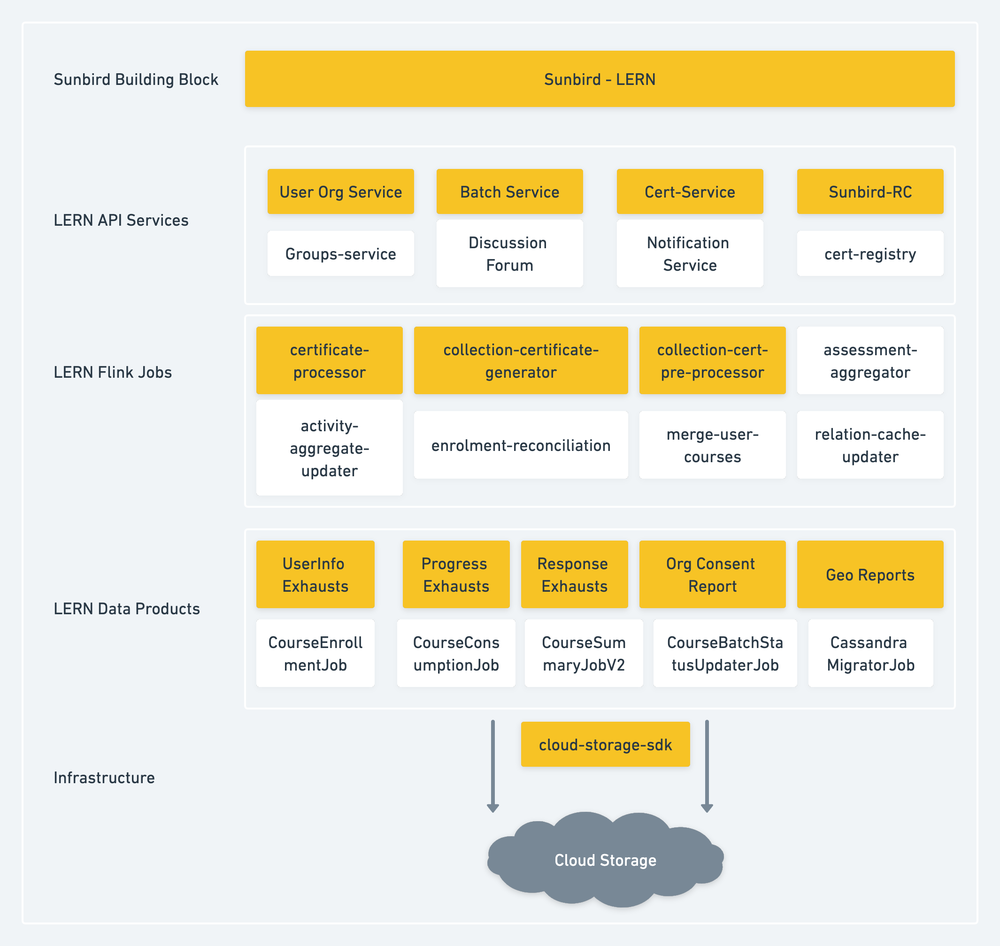

## Background
This document details how to integrate a new CSP provider with the Sunbird-Lern platform. (release-5.0.1)

Below diagram depicts the LERN components using cloud services

* Sunbird-Lern supports some of most of the popular CSPs, including  _Amazon S3_ ,  _Azure Blob Storage and Google cloud_ .

* Lern has below flink jobs which interact with cloud storage for upload/download operation ([GitHub - Sunbird-Lern/data-pipeline](https://github.com/Sunbird-Lern/data-pipeline) ):

    * certificate-processor

    * collection-certificate-generator

    * collection-cert-pre-processor

    
* Below micro-services in Lern use the cloud support to consume and persistently store data

    * UserOrg Service 

    * Batch Service 

    * Cert-service 

    * Sunbird-RC

    
* Some of the data products in Lern also use the cloud support to store and retrieve reports ([GitHub - Sunbird-Lern/data-products](https://github.com/Sunbird-Lern/data-products))

    * UserInfo Exhausts 

    * Progress Exhausts 

    * Response Exhausts

    * Org Consent Report

    * Geo Reports

    
* Lern components uses sunbird-cloud-storage-sdk in order to add support for CSP. So for any other cloud storage (e.g: OCI) support, below steps need to be followed:

    * Sunbird cloud-storage-sdk need a code change to have support for new cloud storage provider (e.g: OCI).

    * Sunbird cloud-storage-sdk is a utility which provides methods for cloud upload/download operations.

    * Link to cloud-storage-sdk git repo: [GitHub - project-sunbird/sunbird-cloud-storage-sdk at scala-2.12-with-latest](https://github.com/project-sunbird/sunbird-cloud-storage-sdk/tree/scala-2.12-with-latest)

    * Once the cloud-storage-sdk new version is published in maven central, we need to update the version in all component pom files

    * Currently Lern components are using the cloud-storage-sdk version 1.4.3

    

1.  **Flink Jobs**  ([GitHub - Sunbird-Lern/data-pipeline](https://github.com/Sunbird-Lern/data-pipeline) )

    1. Changes in certificate-processor, collection-certificate-generator, collection-cert-pre-processor jobs because Certificate template cloud url is stored in DB as relative path. This should be resolved to actual URL before sending the generate certificate request to Sunbird RC.

    1. Flink jobs uses cloud-storage-sdk for cloud storage operations and also for check-pointing. 

    1. Once the cloud-storage-sdk new version is published in maven central, we need to update the version in below pom files

    1. module lms-jobs/credential-generator/certificate-processor/pom.xml

    1. jobs-core/pom.xml

    

    

Configuration Changes:

Override value for below variables under private devops repo (file path:  **ansible/inventory/<env_name>/Knowledge-Platform/common.yml** ) for new storage account:

|  **Variable Name**  |  **Description**  |  **Example Value**  | 
|  --- |  --- |  --- | 
| cloud_public_storage_accountname | unique key to identify the storage account | sunbirddevbbpublic | 
| cloud_public_storage_endpoint | endpoint of a cloud storage account. | ““ | 
| cloud_public_storage_secret | secret key to access the storage account. | NA | 
| cloud_service_provider | storage provider name | azure | 
| cloud_storage_content_bucketname | bucket/container name where data will be stored or read from. | sunbird-content-dev | 
| cloudstorage_base_path | this variable will have either CNAME or base url of cloud storage account | "https://sunbirddevbbpublic.blob.core.windows.net" | 
| cloudstorage.metadata.list | this variable will have list of metadata which has cloud storage url | '\["appIcon", "artifactUrl", "posterImage", "previewUrl", "thumbnail", "assetsMap", "certTemplate", "itemSetPreviewUrl", "grayScaleAppIcon", "sourceURL", "variants", "downloadUrl", "streamingUrl", "toc_url", "data", "question", "solutions", "editorState", "media", "pdfUrl", "transcripts"]' | 

Configuration File Reference:

[https://github.com/Sunbird-Lern/data-pipeline/blob/master/kubernetes/helm_charts/datapipeline_jobs/values.j2](https://github.com/Sunbird-Lern/data-pipeline/blob/master/kubernetes/helm_charts/datapipeline_jobs/values.j2)

Deployment:

* Build & Deploy the specific Jobs

Testing:

* Test Assign certificate to batch, certificate generation and download and reissue Workflow.

    * Certificate should be assigned successfully to a Batch.

    * Certificate should be generated after course consumption

    * Certificate should be downloadable

    * Reissue of certificate should happen successfully

    

 **2. Microservices** 

 **a. UserOrg Service** ([GitHub - Sunbird-Lern/sunbird-lms-service: API services for Learning management system of sunbird](https://github.com/Sunbird-Lern/sunbird-lms-service) ):

This service need configuration change to the storage account details. Also upgrade of cloud-sdk version in core/platform-common/pom.xml

Config Changes:

Override value for below variables under private devops repo (file path: ansible/inventory/<env_name>/Core/secrets.yml) for new storage account:

cloud_service_providercloud_public_storage_accountnamecloud_public_storage_secretcloud_public_storage_endpointcloud_public_storage_region

cloud_private_storage_accountnamecloud_private_storage_secretcloud_private_storage_endpointcloud_private_storage_region

cloud_storage_{datatype}_bucketname

Configuration File Reference: 

[https://github.com/project-sunbird/sunbird-devops/blob/release-5.1.0/ansible/inventory/env/group_vars/all.yml](https://github.com/project-sunbird/sunbird-devops/blob/release-5.1.0/ansible/inventory/env/group_vars/all.yml)

[https://github.com/project-sunbird/sunbird-devops/blob/b61a35fad0362ea7eb0bb688ff0bc12ffc811571/ansible/roles/stack-sunbird/templates/sunbird_learner-service.env](https://github.com/project-sunbird/sunbird-devops/blob/b61a35fad0362ea7eb0bb688ff0bc12ffc811571/ansible/roles/stack-sunbird/templates/sunbird_learner-service.env)

Deployment:

After Configuration Change, Deploy the user-org service (Learner)

Testing:

Test File upload API with some file to upload

 **b. Batch Service (** [GitHub - Sunbird-Lern/sunbird-course-service: API services for course management](https://github.com/Sunbird-Lern/sunbird-course-service) **)** 

This service needs configuration change to maintain relative path in database while write operation and return the absolute path for cloud related metadata while read operation. Certificate template assigned to a course batch have many blob URLs like template, stateImgUrl, previewUrl, url etc. These URLs are  saved to ES and also to course_batch table in sunbird_courses keyspace in Cassandra. Textbook upload and download APIs use cloud to store and retrieve the files. QRCode list download API fetches a list of qr code image blob URLs from dialcode DB.

Needs to upgrade cloud-sdk version in course-mw/sunbird-util/sunbird-platform-core/common-util/pom.xml 

Config Changes:

Override value for below variables under private devops repo (file path: ansible/inventory/<env_name>/Core/secrets.yml) for new storage account:

cloudstorage_base_path

cloud_service_providercloud_public_storage_accountnamecloud_public_storage_secretcloud_public_storage_endpointcloud_public_storage_region

cloud_private_storage_accountnamecloud_private_storage_secretcloud_private_storage_endpointcloud_private_storage_region

cloud_storage_{datatype}_bucketname

upstreamurl

Configuration File Reference: 

[https://github.com/project-sunbird/sunbird-devops/blob/release-5.1.0/ansible/inventory/env/group_vars/all.yml](https://github.com/project-sunbird/sunbird-devops/blob/release-5.1.0/ansible/inventory/env/group_vars/all.yml)

[https://github.com/project-sunbird/sunbird-devops/blob/b61a35fad0362ea7eb0bb688ff0bc12ffc811571/ansible/roles/stack-sunbird/templates/sunbird_lms-service.env](https://github.com/project-sunbird/sunbird-devops/blob/b61a35fad0362ea7eb0bb688ff0bc12ffc811571/ansible/roles/stack-sunbird/templates/sunbird_lms-service.env)

Deployment:

After Configuration Change, Deploy the batch service (LMS)

Testing:

Test below APIs

Template add API

Template remove API

QR code download API

Textbook upload API

Textbook Download API

 **c. Cert-service (** [GitHub - Sunbird-Lern/cert-service](https://github.com/Sunbird-Lern/cert-service/) **)** 

This service needs configuration change to get the signed url of stored certificates. Also needs upgrade of cloud-sdk version in core/platform-common/pom.xml. 

cloudstorage_base_path

cloud_service_providercloud_public_storage_accountnamecloud_public_storage_secretcloud_public_storage_endpointcloud_public_storage_region

cloud_private_storage_accountnamecloud_private_storage_secretcloud_private_storage_endpointcloud_private_storage_region

cloud_storage_{datatype}_bucketname

Configuration File Reference: 

[https://github.com/project-sunbird/sunbird-devops/blob/release-5.1.0/ansible/inventory/env/group_vars/all.yml](https://github.com/project-sunbird/sunbird-devops/blob/release-5.1.0/ansible/inventory/env/group_vars/all.yml)

[https://github.com/project-sunbird/sunbird-devops/blob/b61a35fad0362ea7eb0bb688ff0bc12ffc811571/ansible/roles/stack-sunbird/templates/sunbird_cert-service.env](https://github.com/project-sunbird/sunbird-devops/blob/b61a35fad0362ea7eb0bb688ff0bc12ffc811571/ansible/roles/stack-sunbird/templates/sunbird_cert-service.env)

Deployment:

After Configuration Change, Deploy the cert service (cert)

Testing:

Test Certificate download API to check Certificates created prior to release 4.10.0(certificates stored in blob and downloaded using signed url) is getting downloaded or not.

d.  **Sunbird-RC Deployment** 

New certificate generation and download uses certificate template blob url. The certificate object stored in RC registry DB(postgres) has these template urls. Also the same data is stored to ES.

Helm Charts uses cloud storage to upload the RC schema and credential template and injects the cloud url into RC schema. 

Config Changes:

Override value for below variable under private devops repo (file path: ansible/inventory/<env_name>/Core/secrets.yml) for new storage account:

upstreamurl

Configuration File Reference: 

[https://github.com/project-sunbird/sunbird-devops/blob/release-5.1.0/ansible/inventory/env/group_vars/all.yml](https://github.com/project-sunbird/sunbird-devops/blob/release-5.1.0/ansible/inventory/env/group_vars/all.yml)

[https://github.com/project-sunbird/sunbird-devops/blob/b61a35fad0362ea7eb0bb688ff0bc12ffc811571/ansible/roles/stack-sunbird/templates/sunbird_lms-service.env](https://github.com/project-sunbird/sunbird-devops/blob/b61a35fad0362ea7eb0bb688ff0bc12ffc811571/ansible/roles/stack-sunbird/templates/sunbird_lms-service.env)

Deployment:

After configuration change, deploy the Sunbird-RC.

 **3. Data-products**  ([GitHub - Sunbird-Lern/data-products](https://github.com/Sunbird-Lern/data-products))

Exhaust Reports - UserInfo, Progress and Response Exhausts is generated and uploaded to blob. Also Org Consent Report and Geo Reports is saved to blob container.  Spark session creation needs cloud support.

Data products is cloud agnostic with the help of sunbird-cloud-storage-sdk, sunbird-analytics-service and sunbird-analytics-core. So upgrade these dependencies to the correct version which supports the respective CSP.

Configuration Changes:

Override value for below variables under private devops repo (file path: ansible/inventory/<env_name>/data-pipeline/common.yml) for new storage account:

cloudstorage_base_path

cloud_service_providercloud_public_storage_accountnamecloud_public_storage_secretcloud_public_storage_endpointcloud_public_storage_region

cloud_private_storage_accountnamecloud_private_storage_secretcloud_private_storage_endpointcloud_private_storage_region

cloud_storage_{datatype}_bucketname

Configuration File Reference:

[https://github.com/Sunbird-Lern/data-products/blob/release-5.0.1/lern-data-products/src/main/resources/application.conf](https://github.com/Sunbird-Lern/data-products/blob/release-5.0.1/lern-data-products/src/main/resources/application.conf)

[https://github.com/Sunbird-Lern/data-products/blob/release-5.0.1/ansible/roles/lern-data-products-deploy/templates/common.conf.j2](https://github.com/Sunbird-Lern/data-products/blob/release-5.0.1/ansible/roles/lern-data-products-deploy/templates/common.conf.j2)

Deployment:

Build & Deploy the specific Jobs mentioned above

Testing:

Test UserInfo , progress and response exhaust reports

Test Org Consent Report and Geo Reports

 **Data Migrations to support new CSP** 

Below scripts have to be used to update new CSP blob URL or CNAME URL in ES ad RC DB.

[Training certificate migration](https://project-sunbird.atlassian.net/wiki/spaces/UM/pages/3256877067)

[CSP Changes for Course Batch ES and RC ES](https://project-sunbird.atlassian.net/wiki/spaces/UM/pages/3231449089)

*****

[[category.storage-team]] 
[[category.confluence]] 
