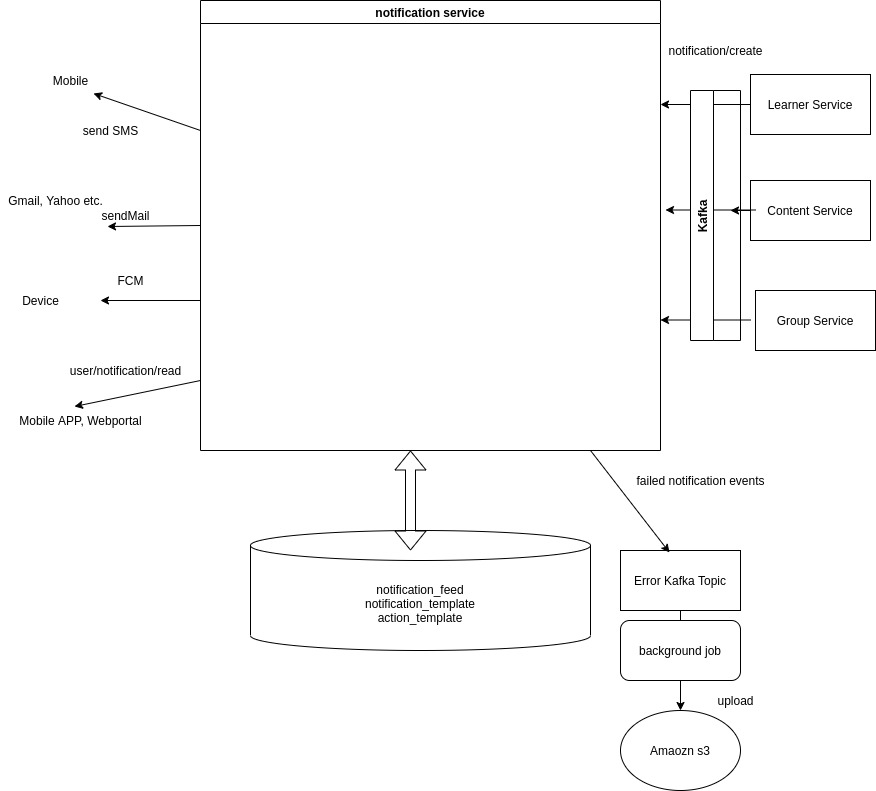
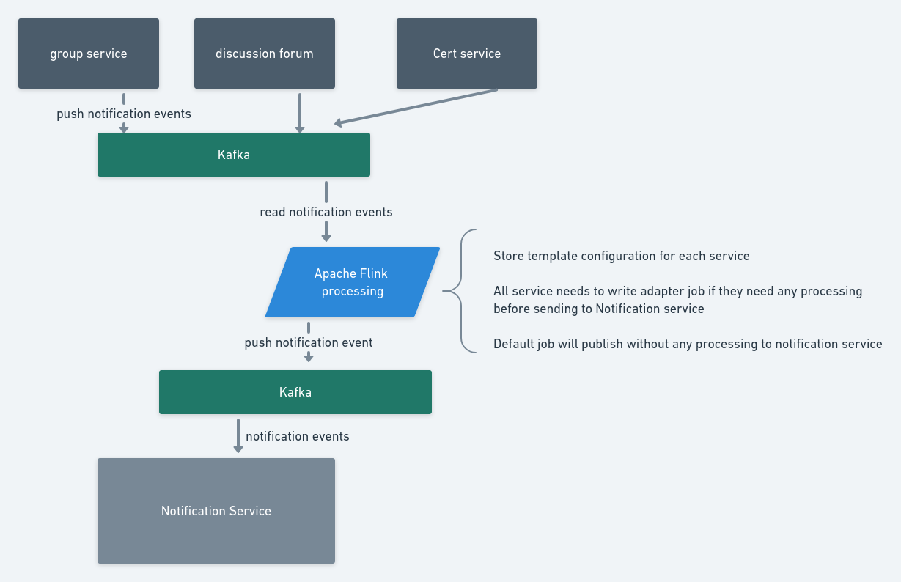

  * [Introduction](#introduction)
  * [Background](#background)
  * [Problem Statement:](#problem-statement:)
    * [Key Design Problem](#key-design-problem)
    * [PROPOSED SOLUTION :](#proposed-solution-:)
    * [Failed Notification Events  ](#failed-notification-events--)
    * [Schema Definition](#schema-definition)
    * [/notification/create](#/notification/create)
    * [Multi-Language Support](#multi-language-support)
    * [Backward Compatibility Read and Write Older Mobiles](#backward-compatibility-read-and-write-older-mobiles)
    * [Clarification Needed:](#clarification-needed:)
    * [Challenges:](#challenges:)
  * [Async Notification Design : ](#async-notification-design-:-)
    * [Proposed ASYNC Notification Support](#proposed-async-notification-support)
    * [LoadTest Analysis :  ](#loadtest-analysis-:--)
    * [Remove: ](#remove:-)

## Introduction
This document will help us to achieve the implementation of the notification feature for any specific activity on groups workflow.


## Background
As per ticket [SB-24321 System JIRA](https:///browse/SB-24321)  ,  we are implementing the notification features to notify the member of the groups whenever there is an important group related events.


As discussed with the design and user platform team, we will use the feed API to store the group related notifications in the feed table. Client will use the Feed API to create the notification needed for group related events. Currently the existing feed is available which can be use to create, read, update and delete feeds.

Existing Create Feed:Currently, the feed can be create by providing the mandatory parameters userId for which notification feed is getting added, category of the feed, priority and data.  _data_ field is a map object can contain any Key and object pair.

Request
```
 curl --location --request POST 'https://dev.sunbirded.org/api/user/feed/v1/create' \
--header 'Content-Type: text/plain' \
--data-raw '{
  "request": {
    "userId": "37634e84-70db-421e-898e-06e6554c4483",       //Mandatory
    "category": "group-feed",                               //Mandatory
    "priority":1,                                           //Mandatory
    "data":{
        "actionData": {
          "actionType": "groupNotify",
          "title": "Title for Notification",
          "description": "Description which will be displayed in Notification",
          "contentURL": "my-groups/group-details/c59cca34-c574-49ad-953b-c1cfc7ad50a3", 
          "identifier": //
      }
    }
  }
}'
```
Response:
```
{
    "id": "api.user.feed.create",
    "ver": "v1",
    "ts": "2021-05-07 06:08:30:954+0000",
    "params": {
        "resmsgid": null,
        "msgid": "9238f58b985ff0903692475346dc2cee",
        "err": null,
        "status": "success",
        "errmsg": null
    },
    "responseCode": "OK",
    "result": {
        "response": "SUCCESS"
    }
}

```

## Problem Statement:

1. System/Global based notification


1. Target/User specific Notification


1. Group(groups of users by state,school) Specific notification


1. Sending notifications to users who are interested or in watchlist.


### Key Design Problem
The following are key design problems for the implementation.


* Template based notifications


* Support Internationalization


* Backward compatibility for existing certification notification


### PROPOSED SOLUTION :


Architecture

Database DesignThe following are the database design needed to support the notification service.

 _notification_template_ 

This table will store the notification template which will be used by different notifications event to generate notifications.


```
CREATE TABLE IF NOT EXISTS sunbird_notifications.notification_template(
templateId text,
type text,                      
ver text,                   
data text,
template_schema text,
createdOn timestamp,
lastUpdatedOn timestamp,
createdBy text,
lastUpdatedBy text,
config map<text,text>,
PRIMARY KEY(templateId);
```
 **Details**  : 


*  **_templateId_**  :   identifier for the template .


*  **_type :_** Type will define the format of the template. EX: JSON, XML, HTML, TEXT.


*  **_ver :_** Version of the template.


*  **_data :_** Contains the template.


*  **_template_schema :_** Contains the schema definition for the parameter required in the template.


*  **createdOn :** Contains the timestamp of the template creation.


*  **lastUpatedOn :** Last updated timestamp


*  **createdBy :** Contains the user information of the 


*  **lastUpdateBy :** Contains the user information who updated the last.


*  **config :** Contains the config specific to the template.


|  **templateId**  |  **type**  |  **ver**  |  **data**  |  **template_schema**  |  **config**  | 
|  --- |  --- |  --- |  --- |  --- |  --- | 
| something_is_added |     JSON |   4.2.0 | {‘title':'${param1} has been added' } | {   "$schema": "#/definition/params",   "title": "params context",   "description": "properties Data",   "type": "object",  "properties": {      "param1": {          "description": "property 1 value",          "type": "string"       }   },  "required": \["param1"] } |  | 
| verifyPhoneOtpTemplateWard |  TEXT |  4.2.0  | Your ward has requested for registration on $installationName using this phone number. Use OTP $otp to agree and create the account. This is valid for $otpExpiryInMinutes minutes only. | { "$schema": "#/definition/params", "title": "params data", "description": "property Data", "type": "object", "properties": {    "installationName": {      "description": "Installation Name",       "type": "string"     },   "otpExpiryInMinutes": {      "description": "Otp Expires Time",      "type": "number"     } }, "required": \["installationName", "otpExpiryInMinutes"] } | {“sender”:”sender@sunbird.com”“subject”:”Hello from sunbird”} | 

Other template examples :


```
templateid |  type | ver | createdby | createdon | lastupdatedby | lastupdatedon | template                        | template_schema
------------+-----------+-----------+---------------+---------------+-----------------------------------------------------------------------------------------------------------------------------------------------------------------------------------------------------------------------------------------------------------------------------------------------------------------------------------------------------
 something_is_added | JSON | 4.2.0  |   null |      null |   null | null | {'title':'${param1} has been added }                  |  { "$schema": "#/definition/cdata", "title": "cdata", "description": "correlation Data", "type": "object", "properties": { "param1": { "description": "Template property 1", "type": "string" }},"required": [ "param1" ] }  
 something_is_added |  JSON | 4.2.0   | null   |      null |   null | null | {'title':'आपको ${param1} में जोड़ दिया गया है'}           |   { "$schema": "#/definition/cdata", "title": "cdata", "description": "correlation Data", "type": "object", "properties": { "param1": { "description": "Template property 1", "type": "string" }}, "required": [ "param1" ] }
 something_is_removed  |   JSON | 4.2.0  |  null  |      null |   null | null |  {'title':'${param1} has been removed from ${param2}'} | { "$schema": "#/definition/cdata", "title": "cdata", "description": "correlation Data", "type": "object", "properties": { "param1": { "description": "Template property 1", "type": "string" }, "param2": { "description": "Template property2 2", "type": "string" } }, "required": [ "param1","param2" ] }  

 forgotPasswordWithOTP|  HTML | 4.2.0    | null   |  null    |    null| null  |<html><head><meta name="viewport" content="width=device-width"><meta http-equiv="Content-Type" content="text/html; charset=UTF-8"><title></title><style>@media only screen and (max-width: 620px){table[class=body] h1{font-size:28px !important;margin-bottom:10px !important}table[class=body] p, table[class=body] ul, table[class=body] ol, table[class=body] td, table[class=body] span, table[class=body] a{font-size:16px !important}table[class=body] .wrapper, table[class=body] .article{padding:10px !important}table[class=body] .content{padding:0 !important}table[class=body] .container{padding:0 !important;width:100% !important}table[class=body] .main{border-left-width:0 !important;border-radius:0 !important;border-right-width:0 !important}table[class=body] .btn table{width:100% !important}table[class=body] .btn a{width:100% !important}table[class=body] .img-responsive{height:auto !important;max-width:100% !important;width:auto !important}}@media all{.ExternalClass{width:100%}.ExternalClass, .ExternalClass p, .ExternalClass span, .ExternalClass font, .ExternalClass td, .ExternalClass div{line-height:100%}.apple-link a{color:inherit !important;font-family:inherit !important;font-size:inherit !important;font-weight:inherit !important;line-height:inherit !important;text-decoration:none !important}}</style></head><body class="" style="color:#000 !important;background-color: #f6f6f6; font-family: sans-serif; -webkit-font-smoothing: antialiased; font-size: 14px; line-height: 1.4; margin: 0; padding: 0; -ms-text-size-adjust: 100%; -webkit-text-size-adjust: 100%;"><table border="0" cellpadding="0" cellspacing="0" class="body" style="border-collapse: separate; mso-table-lspace: 0pt; mso-table-rspace: 0pt; width: 100%; background-color: #f6f6f6;"><tbody><tr><td style="font-family: sans-serif; font-size: 14px; vertical-align: top;">&nbsp;</td><td class="container" style="font-family: sans-serif; font-size: 14px; vertical-align: top; display: block; Margin: 0 auto; max-width: 580px; padding: 10px; width: 580px;"><div class="content" style="box-sizing: border-box; display: block; Margin: 0 auto; max-width: 580px; padding: 10px;"> <span class="preheader" style="color: transparent; display: none; height: 0; max-height: 0; max-width: 0; opacity: 0; overflow: hidden; mso-hide: all; visibility: hidden; width: 0;"></span><table class="main" style="border-collapse: separate; mso-table-lspace: 0pt; mso-table-rspace: 0pt; width: 100%; background: #ffffff; border-radius: 3px;"><tbody><tr><td class="wrapper" style="font-family: sans-serif; font-size: 14px; vertical-align: top; box-sizing: border-box; padding: 20px;"><table border="0" cellpadding="0" cellspacing="0" style="border-collapse: separate; mso-table-lspace: 0pt; mso-table-rspace: 0pt; width: 100%;"><tbody><tr><td style="font-family: sans-serif; font-size: 14px; vertical-align: top;"><table border="0" cellpadding="0" cellspacing="0" class="btn btn-primary" style="border-collapse: separate; mso-table-lspace: 0pt; mso-table-rspace: 0pt; width: 100%; box-sizing: border-box;"><tbody><tr><td align="left" style="font-family: sans-serif; font-size: 14px; vertical-align: top;"><p style="font-family: sans-serif; font-size: 14px; font-weight: normal; margin: 0; Margin-bottom: 15px;">You have requested to reset your password. Here is the OTP</p><p style="font-family: sans-serif; font-size: 14px; font-weight: normal; margin: 0; Margin-bottom: 15px;">$otp</p><p style="font-family: sans-serif; font-size: 14px; font-weight: normal; margin: 0; Margin-bottom: 15px;">This OTP will expire in $ttl minutes.</p><p style="font-family: sans-serif; font-size: 14px; font-weight: normal; margin: 0; Margin-bottom: 15px;">Please ignore this message is you don&#39;t want to change anything.</p></td></tr></tbody></table></td></tr></tbody></table></td></tr></tbody></table></div></td><td style="font-family: sans-serif; font-size: 14px; vertical-align: top;">&nbsp;</td></tr></tbody></table></body></html> |  {"$schema": "#/definition/cdata", "title": "cdata", "description": "correlation Data", "type": "object", "properties": { "ttl": { "description": "Time to expire", "type": "number" }}, "required": [ "ttl" ] }  


 verifyPhoneOtpTemplateWard|   TEXT | 4.2.0  |  null |     null|  null |null |Your ward has requested for registration on $installationName using this phone number. Use OTP $otp to agree and create the account. This is valid for $otpExpiryInMinutes minutes only. |  {"$schema": "#/definition/cdata", "title": "cdata", "description": "correlation Data", "type": "object", "properties": { "installationName": { "description": "Installation Name", "type": "string" },"otpExpiryInMinutes": { "description": "Otp Expires Time", "type": "number" }}, "required": [ "installationName", "otpExpiryInMinutes" ] }
```
 _notification_feed_ 

This will store the user notification feed generated for the users.


```
CREATE TABLE sunbird_notifications.notification_feed (
    id text ,
    createdby text,
    createdon timestamp,
    action text,                  //contains only params, additionalInfo, action type, createdBy
    expireon timestamp,
    priority int,
    status text,
    updatedby text,
    updatedon timestamp,
    userid text,
    version text,
    primary key(userid,id)
)
```
 **Details :** 


*  **_id :_** identifier of the notification feed


*  **_createdBy :_** Contains the userId information who generated this event.


*  **_createdOn : C_** ontains the timestamp when notification is generated.


*  **_action :_** Contains the action information about the notification. action contains infromation such  _type_  of action, user information who created the event,  _template_  information, additional information.


*  **expireon**  : Contains the expire time information of the notification.


*  **_priority :_** Contains the priority information which can used to define different priorities of the notification.


*  **_status :_** Give the status of the notification such read,unread.


*  **_updatedBy :_** UserId  Information who updated the notification.


*  **_updatedOn :_** Last Updated timestamp.


*  **_userId :_** User Id information for whom the notification is generated.


*  **version :** To identify the old or new version of feed data for backward compatibility.


```
id                                   | action                                                                                                                                                                                                                                                                                       | category          | createdby | createdon                       | expireon | priority | status | updatedby | updatedon | userid | version
--------------------------------------+----------------------------------------------------------------------------------------------------------------------------------------------------------------------------------------------------------------------------------------------------------------------------------------------+-------------------+-----------+---------------------------------+----------+----------+--------+-----------+-----------+--------+---------
 d4011830-d9e2-4013-9f92-c3d9cd43364f |                                                                                                                                                                  {"actionData":{"identifier":"12323123","title":"MESTSTSTSTSTS","description":"13213213312321","actionType":"certificates"}} | certificateUpload |    123456 | 2021-11-16 08:51:01.797000+0000 |     null |        1 | unread |      null |      null | 123456 |      v1
 5f1923ac-e3c7-4465-bf32-e7226ada0c04 | {"template":{"ver":"4.4.0","data":"{\"description\":\"13213213312321\",\"title\":\"MESTSTSTSTSTS\"}","type":"JSON"},"createdBy":{"id":"123456","type":"system"},"additionalInfo":{"identifier":"12323123","actionType":"certificates"},"type":"certificates","category":"certificateUpload"} | certificateUpload |    123456 | 2021-11-16 08:51:01.807000+0000 |     null |        1 | unread |      null |      null | 123456 |    null
```
 _action_template_ 

This table will store the mapping of the template with the action. 


```
CREATE TABLE IF NOT EXISTS sunbird_notifications.action_template(
action text,
type text,
templateId text,
PRIMARY KEY(action,type);
```

```
action  |        templateId                | type
--------+----------------------------------------------------------
member-added-to |  something_is_added_to    | FEED
member-removed  |  something_is_removed                  | FEED
forgotPasswordWithOTP |  forgotPasswordWithOTP           | EMAIL
verifyPhoneOtpTemplateWard | verifyPhoneOtpTemplateWard | SMS
```
 **Details :** 


*  **_action :_** Contains the action information. Needs to be configured by each service before using any template. Ex: add-member, add-member-to


*  **_type :_** Contains the information about the notification type for which this action template will be used. Ex: email, phone, device, feed.


*  **_templateId :_** Template Identifier.


 _feed_version_map_ 

Contains the mapping of v1 and v2 feedids.


```
CREATE TABLE sunbird_notifications.feed_version_map (
    id text PRIMARY KEY,
    feedid text
)
```

### Failed Notification Events  
Failed notification event will be push to new topic in kafka which can be extended with retrying mechanism and then if it fails can be stored in s3 for reporting purpose.


### Schema Definition
Contains the notification standard schema definition. Any notification event creation request should follow the same specs to create any notifications.


### /notification/create

```
{
  "$schema": "http://json-schema.org/draft-07/schema#",
  "title" : "request",
  "type": "object",
  "required":["notifications"],
  "properties":{
     "notifications":{
       "$id":"#root/notifications",
       "title": "notifications",
       "type":"array",
       "items":{
           "$ref":"#/notification"
        }
     }
   }
}
```

```
{
  "$schema": "http://json-schema.org/draft-07/notification#", 
  "title": "notification", 
  "type": "object",
  "required": [
    "priority",
    "type",
    "action"
  ],
  "properties": {
    "ids": {
      "$id": "#root/ids", 
      "title": "ids", 
      "type": "array",
      "default": [],
      "items":{
        "$id": "#root/ids/items", 
        "title": "Items", 
        "type": "string"        
      }
    },
    "priority": {
      "$id": "#root/priority", 
      "title": "Priority", 
      "type": "integer"
    },
    "type": {
      "$id": "#root/type", 
      "title": "Type", 
      "type": "string",
      "enum": ["EMAIL", "SMS", "FCM", "FEED"]
    },
    "action": {
      "$id": "#root/action", 
      "title": "Action", 
      "type": "object",
      "required": [
        "type",
        "category",
        "createdBy"
      ],
      "properties": {
        "type": {
          "$id": "#root/action/type", 
          "title": "Type", 
          "type": "string"
        },
        "category": {
          "$id": "#root/action/category", 
          "title": "Category", 
          "type": "string"
        },
        "template": {
          "$id": "#root/action/template", 
          "title": "Template", 
          "type": "object",
          "required": [
            "params"
          ],
          "properties": {
            "id": {
              "$id": "#root/action/template/id", 
              "title": "Id", 
              "type": "string"
            },
            "type": {
              "$id": "#root/action/template/type", 
              "title": "Type", 
              "type": "string"
            },
            "data": {
              "$id": "#root/action/template/data", 
              "title": "Data", 
              "type": "string"
            },
            "ver": {
              "$id": "#root/action/template/ver", 
              "title": "Ver", 
              "type": "string"
            },
            "params": {
              "$ref": "#/definitions/mapString"
              "definitions": {
              "mapString": {
                 "type": "object",
                 "additionalProperties": {"type": "string"}
              }
             }            
           }
          }
        },
        "createdBy": {
          "$id": "#root/action/createdBy", 
          "title": "Createdby", 
          "type": "object",
          "required": [
            "id",
            "type"
          ],
          "properties": {
            "id": {
              "$id": "#root/action/createdBy/id", 
              "title": "Id", 
              "type": "string"
            },
            "name": {
              "$id": "#root/action/createdBy/name", 
              "title": "Name", 
              "type": "string"
            },
            "type": {
              "$id": "#root/action/createdBy/type", 
              "title": "Type", 
              "type": "string"
            }
          }
        },
        "additionalInfo": {
          "$id": "#root/action/additionalInfo", 
          "title": "Additionalinfo", 
          "type": "object",
          "properties": {
            
          {
    "id": "api.notification.feed.read.e79ee6a4-d79c-4236-9e05-f754010932d6",
    "ver": "v1",
    "ts": "2021-05-10 05:54:35:649+0000",
    "params": {
        "resmsgid": null,
        "msgid": "8470ecb7fa05d7d22313a30c9a16927d",
        "err": null,
        "status": "success",
        "errmsg": null
    },
    "responseCode": "OK",
    "result": {
        "response": {
            "userFeed": [
                {
                    "id": "ddab7b78-5978-4a11-b7f8-6594c7a6e7b8",
                    "userId": "e79ee6a4-d79c-4236-9e05-f754010932d6",                    
                    "priority": 1,
                    "createdBy": "e79ee6a4-d79c-4236-9e05-f754010932d6",
                    "status": "unread",  
                    "createdOn": 1620626043127,                                      
                    "action": {
                            "type": "add-member",
                            "category": "groups",
                            "template": {
                              "data": "{"title": "आपको Test group में जोड़ दिया गया है"}",
                              "type": "JSON",
                               "ver":  "4.2.0"
                            }, 
                            "createdBy":{
							    "id":"e79ee6a4-d79c-4236-9e05-f754010932d6",
							    "name":"John",
							    "type": "User"
			    				 },
                           "additionalInfo":{
                              
                    
                            }
                   ]
               }
         }
}
 },           
        }
      }
    }
  }
}

```
notification request Ex:


```
 curl --location --request POST 'https://dev.sunbirded.org/api/notification/v2/send' \
--header 'Content-Type: text/plain' \
--data-raw '{
  "request": {
   "notifications":[
    { 
     "ids": ["37634e84-70db-421e-898e-06e6554c4483"],    //userId, emailId, phone, deviceId 
     "priority":1,                                        
     "type":"feed",     
     "action": {                                         
          "type": "add-member",                        
          "category": "group-feed",                    
          "template":{
              "data: "<value>" // dynamic template passed (not pre-registered), 
              "type":"JSON",                      //HTML, TEXT, XML or JSON
              "params":{
                  "param1":"Math's Activity",
                  "param2": "Test"
                }
           }
          "createdBy":{
				"id":"f10d5216-6b96-404c-8d1c-cc1f720d910d",
				"name":"John",
				"type": "User"				 //User or System
	     },    
          "additionalInfo":{
                "group":{
                    "id":"123434"
                     "name":"Test"
	   	 },
		"groupRole":"ADMIN",
	  	"activity":{
                     "id":"do_12443",
                     "type": "Course",
                     "name":"Math's Activity"  
	    	}		     
           }
       }
     }
     ]
   }
}'
```
 **Example**  : 

 **Notification Type : feed :** 

 **User Type** 


```
{
  "request": {   
   "notifications":[
     {
      "ids": ["37634e84-70db-421e-898e-06e6554c4483"],      //contains userIds
      "priority":1,                                        
      "type":"feed",       
      "action": {                                       
          "type": "add-member",                       
          "category": "groups",                    
          "template":{
              "data: "<value>" // dynamic template passed (not pre-registered),
              "type": "JSON",
              "params":{
                  "param1":"Math's Activity",
                  "param2": "Test"
              }
          },
          "createdBy":{
		    "id":"f10d5216-6b96-404c-8d1c-cc1f720d910d",
		    "name":"John",
		    "type": "User"				 
          },    
        "additionalInfo":{
              "group":{
                  "id":"123434"
                  "name":"Test"
		     },
		    "groupRole":"MEMBER",
		    "activity":{
                  "id":"do_12443",
                  "type": "Course",
                  "name":"Math's Activity"  
		    }		     
        }
      }
      }
      ]
   }
}
```
 **Notification Type : feed** 

 **System Type** 


```
{
  "request": {   
    "notifications":[
     {
     ids": ["37634e84-70db-421e-898e-06e6554c4483"],      //contains userIds //Mandatory
    "priority":1,                                        
    "type":"feed",       
    "action": {                                       
        "type": "version_upgrade",                       
        "category": "system-feed",                    
        "template":{
            "data: "<value>" // dynamic template passed (not pre-registered),
            "type": "TEXT",
            "params":{
                "param1":"4.0"             
             },
             
        },
        "createdBy":{
	    "id":"content-service",
	    "type": "System"				 
        },    
       "additionalInfo":{
            	     
       }
     }
     }
     ]
   }
}
```
 **Notification Type: email** 


```
{
  "request": {
    "notifications":[
    {
     ids": ["test@gmail.com"],            //Contains emailIds
    "priority":1,                                         
    "type":"email",       
    "action": {                                        
          "type": "forgotPasswordWithOTP",           
          "category": "user-email",                     
          "template":{
              "data: "<value>" // dynamic template passed (not pre-registered), 
              "type": "TEXT",
              "params":{
                  "ttl": 2300
                }
           }
          "createdBy":{
		       "id":"user-platform",
	           "type": "System"				 
	      },    
          "additionalInfo":{
              "sender":"sender@sunbird.com",                // optional, defaults to app config
              "subject": "User EMAIL"                       //Mandatory              
           }
      }
     }
     ]
   }
}
```
 **Notification Type: phone : Normal Message** 


```
{
  "request": {
    "notifications":[
      {
       "ids": ["78349092021"],           //contains phone
        "priority":1,                                        
        "type":"phone",      
        "action": {                                        
              "type": "verifyPhoneOtpTemplateWard",             
              "category": "user-sms",                     
              "template":{
                  "data: "<value>" // dynamic template passed (not pre-registered),
                  "type": "TEXT",
                  "params":{
                      "installationName": "System1" 
                      "otpExpiryInMinutes": 4
                  }
              }
              "createdBy":{
				"id":"user-platform",		
				"type": "System"				 
			  },    
              "additionalInfo":{
                   "sender":"sender@sunbird.com",                // optional, defaults to app config
                   "subject": "Hello from Sunbird",                       //Mandatory       
                   
              }
         }
        }
        ]
   }
}
```
 **Notification Type: phone : OTP Message** 


```
{
  "request": {
    "notifications":[
      {
       "ids": ["78349092021"],           //contains phone
        "priority":1,                                        
        "type":"phone",      
        "action": {                                        
              "type": "verifyPhoneOtpTemplateWard",             
              "category": "user-sms",                     
              "template":{
                  "data: "<value>" // dynamic template passed (not pre-registered),
                  "type": "TEXT",
                  "params":{
                      "installationName": "System1" 
                      "otpExpiryInMinutes": 4
                  }
              }
              "createdBy":{
				"id":"user-platform",		
				"type": "System"				 
			  },    
              "additionalInfo":{
                   "sender":"sender@sunbird.com",                // optional, defaults to app config
                   "subject": "Hello from Sunbird",                       //Mandatory       
                   "otp": {                                              //Mandatory
                        "length": 4, // number as allowed by the provider; defaulted by service if out-of-bounds,
                        "expiryInMinute": 10 // expected value in minutes
                },
              }
           }
         }
        ]
   }
}
```
 **Notification Type: device for multiple devices** 


```
{
  "request": {
    "notifications":[
      {
        "ids": ["fcmToken1", "fcmToken2"],           //device ids
        "priority":1,                                        
        "type":"device",      
        "action": {                                        
              "type": "verifyPhoneOtpTemplateWard",             
              "category": "user-sms",                                 
              "createdBy":{
				"id":"user-platform",		
				"type": "System"				 
			  },    
              "additionalInfo":{                                 
                   "rawData": {              // Raw property bag for device notifications is mandatroy.
                        "key": "value",
                        "key2": "value2"
                        "id": 123,
                        "type": 1,
                        "displayTime": "1560250228", // this will help to identify when exactly notification sent.
                        "expiry": "1560663930", // after this time notification should not show
                          "actionData": { // Mandatory for push notification
                                "actionType": "courseUpdate",
                                "title": "Update App and Enjoy Exiting New Features", // this message will be display as notification
                                "description": "Notfication description", // on click of notification below details will be shown
                                "richText": "Blah Blah Blah",
                                "ctaText": "Update App",
                                "identifier": "do_212295896062394368144",
                                "deepLink": "https://google-play",
                                "deploymentKey": "6Xhfs4-WVwwVds8dhYN9U5OkZw6PukglrykIsJ8-B"
                    }
                }
              }
           }
         }
        ]
   }
}
```
 **Notification Type: device to broadcast all through topic** 


```
{
  "request": {
    "notifications":[
      {
        "ids": [],           //device ids
        "priority":1,                                        
        "type":"device",      
        "action": {                                        
              "type": "verifyPhoneOtpTemplateWard",             
              "category": "user-sms",                                 
              "createdBy":{
				"id":"user-platform",		
				"type": "System"				 
			  },    
              "additionalInfo":{ 
                   "topic":"device-topic",                                
                   "rawData": {              // Raw property bag for device notifications is mandatroy.
                        "key": "value",
                        "key2": "value2"
                        "id": 123,
                        "type": 1,
                        "displayTime": "1560250228", // this will help to identify when exactly notification sent.
                        "expiry": "1560663930", // after this time notification should not show
                          "actionData": { // Mandatory for push notification
                                "actionType": "courseUpdate",
                                "title": "Update App and Enjoy Exiting New Features", // this message will be display as notification
                                "description": "Notfication description", // on click of notification below details will be shown
                                "richText": "Blah Blah Blah",
                                "ctaText": "Update App",
                                "identifier": "do_212295896062394368144",
                                "deepLink": "https://google-play",
                                "deploymentKey": "6Xhfs4-WVwwVds8dhYN9U5OkZw6PukglrykIsJ8-B"
                    }
                }
              }
           }
         }
        ]
   }
}
```

### Multi-Language Support
Multi Language can be solved at API level by storing the template for all the available languages and then during read, client will pass the userId and language which client needs to show in the UI.

Language Support Template:


User Notifcation Read(/user/notification/read)To get the template or user feed, the Client should call user notification api by passing the language of which template needs to be shown to user. 


```
curl --location --request GET 'https://dev.sunbirded.org/api/notification/v1/feed/read/f10d5216-6b96-404c-8d1c-cc1f720d910d' 

```


Update Notification FeedThis api will update the status of the notification feed of the user. It can only be use to update the status of the feed


```
curl --location -g --request PATCH '{{baseUrl}}/notification/v1/feed/update' \
--header 'Content-Type: application/json' \
--data-raw '{
    "request":{
        "ids":["64ef2ccd-2ec7-4759-b500-590d4a6eccf3"],
        "userId":"12345",        
        "status":"read"
    }
}'
```


 **Challenges** :

Need to add update template whenever new language support is added.

default lang will be english language.


```
CREATE TABLE IF NOT EXISTS sunbird.notification_template(
templateId text,
lang text,
type text,                      //JSON,STRING, HTML, XML
ver text,                   
template text,
template_schema text,
createdOn timestamp,
lastUpdatedOn timestamp,
createdBy text,
lastUpdatedBy text,
PRIMARY KEY((templateId,language));
      
```

```
templateid | lang | type | ver | createdby | createdon | lastupdatedby | lastupdatedon | template                        | template_schema
------------+-----------+-----------+---------------+---------------+-----------------------------------------------------------------------------------------------------------------------------------------------------------------------------------------------------------------------------------------------------------------------------------------------------------------------------------------------------
 something_is_added | en |   JSON | 4.2.0  |   null |      null |          null |          null | {'title':'${param1} has been added }   |{ "$schema": "#/definition/cdata", "title": "cdata", "description": "correlation Data", "type": "object", "properties": { "param1": { "description": "Template property 1", "type": "string" }},"required": [ "param1" ] }  
 something_is_added | hindi |  JSON | 4.2.0  | null |      null |          null |          null | {'title':'आपको ${param1} में जोड़ दिया गया है'}   |{ "$schema": "#/definition/cdata", "title": "cdata", "description": "correlation Data", "type": "object", "properties": { "param1": { "description": "Template property 1", "type": "string" }}, "required": [ "param1" ] }
 something_is_removed  |en |   JSON | 4.2.0  |  null  |      null |        null   |          null |  {'title':'${param1} has been removed from ${param2}'} | { "$schema": "#/definition/cdata", "title": "cdata", "description": "correlation Data", "type": "object", "properties": { "param1": { "description": "Template property 1", "type": "string" }, "param2": { "description": "Template property2 2", "type": "string" } }, "required": [ "param1","param2" ] }  

 forgotPasswordWithOTP| en | HTML | 4.2.0  | null|  null|     null| <html><head><meta name="viewport" content="width=device-width"><meta http-equiv="Content-Type" content="text/html; charset=UTF-8"><title></title><style>@media only screen and (max-width: 620px){table[class=body] h1{font-size:28px !important;margin-bottom:10px !important}table[class=body] p, table[class=body] ul, table[class=body] ol, table[class=body] td, table[class=body] span, table[class=body] a{font-size:16px !important}table[class=body] .wrapper, table[class=body] .article{padding:10px !important}table[class=body] .content{padding:0 !important}table[class=body] .container{padding:0 !important;width:100% !important}table[class=body] .main{border-left-width:0 !important;border-radius:0 !important;border-right-width:0 !important}table[class=body] .btn table{width:100% !important}table[class=body] .btn a{width:100% !important}table[class=body] .img-responsive{height:auto !important;max-width:100% !important;width:auto !important}}@media all{.ExternalClass{width:100%}.ExternalClass, .ExternalClass p, .ExternalClass span, .ExternalClass font, .ExternalClass td, .ExternalClass div{line-height:100%}.apple-link a{color:inherit !important;font-family:inherit !important;font-size:inherit !important;font-weight:inherit !important;line-height:inherit !important;text-decoration:none !important}}</style></head><body class="" style="color:#000 !important;background-color: #f6f6f6; font-family: sans-serif; -webkit-font-smoothing: antialiased; font-size: 14px; line-height: 1.4; margin: 0; padding: 0; -ms-text-size-adjust: 100%; -webkit-text-size-adjust: 100%;"><table border="0" cellpadding="0" cellspacing="0" class="body" style="border-collapse: separate; mso-table-lspace: 0pt; mso-table-rspace: 0pt; width: 100%; background-color: #f6f6f6;"><tbody><tr><td style="font-family: sans-serif; font-size: 14px; vertical-align: top;">&nbsp;</td><td class="container" style="font-family: sans-serif; font-size: 14px; vertical-align: top; display: block; Margin: 0 auto; max-width: 580px; padding: 10px; width: 580px;"><div class="content" style="box-sizing: border-box; display: block; Margin: 0 auto; max-width: 580px; padding: 10px;"> <span class="preheader" style="color: transparent; display: none; height: 0; max-height: 0; max-width: 0; opacity: 0; overflow: hidden; mso-hide: all; visibility: hidden; width: 0;"></span><table class="main" style="border-collapse: separate; mso-table-lspace: 0pt; mso-table-rspace: 0pt; width: 100%; background: #ffffff; border-radius: 3px;"><tbody><tr><td class="wrapper" style="font-family: sans-serif; font-size: 14px; vertical-align: top; box-sizing: border-box; padding: 20px;"><table border="0" cellpadding="0" cellspacing="0" style="border-collapse: separate; mso-table-lspace: 0pt; mso-table-rspace: 0pt; width: 100%;"><tbody><tr><td style="font-family: sans-serif; font-size: 14px; vertical-align: top;"><table border="0" cellpadding="0" cellspacing="0" class="btn btn-primary" style="border-collapse: separate; mso-table-lspace: 0pt; mso-table-rspace: 0pt; width: 100%; box-sizing: border-box;"><tbody><tr><td align="left" style="font-family: sans-serif; font-size: 14px; vertical-align: top;"><p style="font-family: sans-serif; font-size: 14px; font-weight: normal; margin: 0; Margin-bottom: 15px;">You have requested to reset your password. Here is the OTP</p><p style="font-family: sans-serif; font-size: 14px; font-weight: normal; margin: 0; Margin-bottom: 15px;">$otp</p><p style="font-family: sans-serif; font-size: 14px; font-weight: normal; margin: 0; Margin-bottom: 15px;">This OTP will expire in $ttl minutes.</p><p style="font-family: sans-serif; font-size: 14px; font-weight: normal; margin: 0; Margin-bottom: 15px;">Please ignore this message is you don&#39;t want to change anything.</p></td></tr></tbody></table></td></tr></tbody></table></td></tr></tbody></table></div></td><td style="font-family: sans-serif; font-size: 14px; vertical-align: top;">&nbsp;</td></tr></tbody></table></body></html> |  {"$schema": "#/definition/cdata", "title": "cdata", "description": "correlation Data", "type": "object", "properties": { "ttl": { "description": "Time to expire", "type": "number" }}, "required": [ "ttl" ] }  


 verifyPhoneOtpTemplateWard| en |  STRING | 4.2.0  |  null |     null|       null | Your ward has requested for registration on $installationName using this phone number. Use OTP $otp to agree and create the account. This is valid for $otpExpiryInMinutes minutes only. |  {"$schema": "#/definition/cdata", "title": "cdata", "description": "correlation Data", "type": "object", "properties": { "installationName": { "description": "Installation Name", "type": "string" },"otpExpiryInMinutes": { "description": "Otp Expires Time", "type": "number" }}, "required": [ "installationName", "otpExpiryInMinutes" ] }
```


 **Read API:** 

Based on  _template.Id_  and  _Lang_  will get the respective language template. Template dynamic value will be replaced with  _params_  values store in the  _action_  dynamically.


```
{
    "id": "api.notification.feed.read.e79ee6a4-d79c-4236-9e05-f754010932d6",
    "ver": "v1",
    "ts": "2021-05-10 05:54:35:649+0000",
    "params": {
        "resmsgid": null,
        "msgid": "8470ecb7fa05d7d22313a30c9a16927d",
        "err": null,
        "status": "success",
        "errmsg": null
    },
    "responseCode": "OK",
    "result": {
        "response": {
            "userFeed": [
                {
                    "id": "ddab7b78-5978-4a11-b7f8-6594c7a6e7b8",
                    "userId": "e79ee6a4-d79c-4236-9e05-f754010932d6",                    
                    "priority": 1,
                    "createdBy": "e79ee6a4-d79c-4236-9e05-f754010932d6",
                    "status": "unread",                                        
                    "action": {
                            "type": "add-member",
                            "category": "group-feed",
                            "template": {
                              "data": "{"title": "आपको Test group में जोड़ दिया गया है"}",
                              "type": "JSON",
                              "ver":  "4.2.0"
                            }, 
                            "createdBy":{
				    "id":"e79ee6a4-d79c-4236-9e05-f754010932d6",
				    "name":"John",
				    "type": "User"
			     },
                           "additionalInfo":{
                               "group":{
                                   "id":"123434"
                                   "name":"Test"
				},
				"groupRole":"ADMIN",
			       "activity":{
                                   "id":"do_12443",
                                   "type": "Course",
                                   "name":"Math's Activity"  
				}
		   	 }
                            
                    },
                    "createdOn": 1620626043127
                }
            ]
        }
    }
}       
```


 **Configuration Restriction** :  **Max Batch limit :** MAX_BATCH_LIMIT is need to be configured that will be the max  ids can be passed in a single notification object.


### Backward Compatibility Read and Write Older Mobiles
The architecture to support backward compatibility.


.jpg)


* As a part of this change ,   **_/user/feed/v1/create_**  will internally call the new notifications  **_v2/notification/send_** and the  **v1** feed format will be stored in both  **v1**  and  **v2** format.


* The  **_/user/v1/feed_** will get the data all the  **v1**  formatted data from the new notification table by using the new end points.


* The new end points /v1/notification/feed/read/ will read the  **v2**  formatted data from the new table.


* The new feed create endpoints  /v2/notification/send will store the new notification features such as groups in v2 format only as there is no need to show older mobiles the new notifications releasing post 4.3 version.


* The older notifications needs to be stored in both  **v1** and  **v2** format even after migration to new end points by the services as to support older mobile apps.


*  **Purging**  : User feed can be purged once migration is done,


*  **Old Api Depreciation :** 


    *  **_/user/feed/v1/create :_** The create feed api will be depreciated when all service will move to new notification feed create api.


    *  **_/user/v1/feed /{userid}_**  :  The read feed api will be depreciated once all old mobile apps version are >=4.3.


    

Note\* :  **v1 : old format v2: new format.** 


 **OLD Format**  : 


```
{
    "id": "api.user.feed.e79ee6a4-d79c-4236-9e05-f754010932d6",
    "ver": "v1",
    "ts": "2021-05-10 05:54:35:649+0000",
    "params": {
        "resmsgid": null,
        "msgid": "8470ecb7fa05d7d22313a30c9a16927d",
        "err": null,
        "status": "success",
        "errmsg": null
    },
    "responseCode": "OK",
    "result": {
        "response": {
            "userFeed": [
                {
                    "id": "ddab7b78-5978-4a11-b7f8-6594c7a6e7b8",
                    "userId": "e79ee6a4-d79c-4236-9e05-f754010932d6",
                    "category": "groups",
                    "priority": 1,
                    "createdBy": "e79ee6a4-d79c-4236-9e05-f754010932d6",
                    "status": "unread",
                    "data": {
                        "actionData": {
                            "actionType": "add-member",
                            "title": "Title for Notification",
                            "description": "Description which will be displayed in Notification",
                            "contentURL": "my-groups/group-details/c59cca34-c574-49ad-953b-c1cfc7ad50a3",
                            "identifier": ""
                        }
                    },
                    "createdOn": 1620626043127
                }
            ]
        }
    }
}
```
 **Mapping of Old to New Format**  **Fields** : 

Fields Mapping :  


*  **_category_** to  **_action.category_** 


*  **actionType** to  **_action.type_** 


*  **_title and description to action.template.data as json string._** 


* other fields such as  **contentUrl** ,  **identifier**  etc. will be moved to  **additionalInfo** .


*  **createdBy** will contains id as  **createdBy**  and Type as  **System**  as we do not know the name of the users in the old format.


*  **templateType** will be default to JSON as all the old feed contains title and description which will be parsed as json.


```
{
    "id": "api.notification.feed.read.e79ee6a4-d79c-4236-9e05-f754010932d6",
    "ver": "v1",
    "ts": "2021-05-10 05:54:35:649+0000",
    "params": {
        "resmsgid": null,
        "msgid": "8470ecb7fa05d7d22313a30c9a16927d",
        "err": null,
        "status": "success",
        "errmsg": null
    },
    "responseCode": "OK",
    "result": {
        "response": {
            "userFeed": [
                {
                    "id": "ddab7b78-5978-4a11-b7f8-6594c7a6e7b8",
                    "userId": "e79ee6a4-d79c-4236-9e05-f754010932d6",                    
                    "priority": 1,
                    "createdBy": "e79ee6a4-d79c-4236-9e05-f754010932d6",
                    "status": "unread",  
                    "createdOn": 1620626043127,                                      
                    "action": {
                            "type": "add-member",
                            "category": "groups",
                            "template": {
                              "data": "{"title": ""Title for Notification","description":"Description which will be displayed in Notification"}",
                              "type": "JSON",
                               "ver":  "4.2.0"
                            }, 
                            "createdBy":{
							    "id":"e79ee6a4-d79c-4236-9e05-f754010932d6",							    
							    "type": "System"
			    			},
                           "additionalInfo":{
                              "contentURL": "my-groups/group-details/c59cca34-c574-49ad-953b-c1cfc7ad50a3",
                              "identifier": ""                    
                            }
                   ]
               }
         }
}
```


|  **Review**  |  |  | 
|  --- |  --- |  --- | 
| 1st Discussion Review | Use Notification feed api from  learner service to  store group related notification for a user with categories as group-feed in the feed table. | Attendees: Mathew,Rayulu,Vinu, Satish | 
| 2nd Discussion Review  | Notification feed api to be called from backend as calling from front expose security vulnerability | Attendees: Mathew,Vinu, Satish | 
| 3rd Review | Notification will self destruct post 30 notifications irrespective whether user has read or not. | Mani,Krishna (Product Team) | 
| 4th Review | Templatization needed to reuse the template and validation | Rayulu,Mathew, Vinu,Satish,Reshmi,Mani | 
| 5th review | 
1. data will be removed in the new spec and actionData will move to parent hierarachy.


1. Template will be maintained at sunbird key space.


1. Need design to identify the operation based on request


 | Mathew,Vinu,Satish,Reshmi, Rayulu | 
| 6th review | Unified notification, Follow similar to telemetry specs design, multilanguage support | Vinu,Satish, Rayulu | 


### Clarification Needed:


|  **Issues**  |  **Resolution**  |  **Review Comments**  | 
|  --- |  --- |  --- | 
| Once notifications is send about member aditions and if group name changes ,will old notification should show the old group name or new group name..  _if new group name needs to be shown how notification will show or get the new group name._  | Challenges as it is an async process and it will be difficult to update old notification from both front end and backend |  | 
| Template will be stored in group service DB, then do we need validation work at lms service feed api. | Only actionData validation will happen at feed api level. |  | 
| Notifications feeds needs to self destruct post 30 notifications: Should all feeds needs to be deleted or the oldest one to accommodate news ones. _if oldest ones then do we need to delete all feeds after some ttl or not_  | Oldest will be deleted and rest of feed will remain same. functionality is already in place. No change required | Reviewed | 


### Challenges:


|  **challenges**  |  **Solution**  | 
|  --- |  --- | 
| Supports Backward Compatibility | old mobile will keep using the v1/read  | 
| how transformer will map the old feed to current feed spec | v1/feed data will be converted into v2 read | 
| global notification is possible but have challenges to implement at channel or state level. |  | 
| Support global or channel (state) level notifications  |  | 
| support for notifications watchlists | can be solved by creating mapping of contextId to userId in redis cache or mysqldb | 


## Async Notification Design : 


 **Kafka Topic** : ${ENV_NAME}.notification.events

Json Structure to be pushed as events to Kafka.


### Proposed ASYNC Notification Support
Events structure:The events can be send in two format : - 


*  Complete information in the events with notification specified schema which will be processed by default job


* Events information with context which will be processed by specific flink job written to process it.


Type 1 format: If the parent service have actual notification data along with action data, then we have to send the below formate. And flink job will take this object and process it.


```
{
  service: "discussion-forum",     // Service Name
  headers: {                       //request tracebility
    sid:  "X-Session-id"           // from headers
    traceID: "X-Request-id"        // from headers
  },
  notifcationData: {               // Actual Notification request payload
    ids: ["sunbird-user-identifiers"], // sunbird identifiers (To which user need to send notification)
    createdBy: {                   // Which User is doing the action
        id: "sunbird-user-identifier",
        name: "sunbird-username",
        type: "User"
    }
    action: {
      category: "discussion-forum" // Service name
      type: "",                    //action type
      template: {
         type: "JSON",
         params: {                 // Based on params notification service will form the notification message
           param1: "",
           param2: "",
           param3: "",
        }
      }
    }
    additionalInfo: {                  // specific to the service & common for all API's of the service. Flink job will parse the object & construct specific to Notfi API
        context: {                     // this is mainly used to know on what context this notification was created.
            cid: "",                   // category id
            sbItendifier: "",          // sunbird Group/Course/Batch identifiers
            sbType: ""                 // type is Group/Course/Batch ... etc
        },
        // based on resp derive the below fields
        category: {
            cid: "",                  // caregory (Under which category this notification created)
            title: "",                // category title
            pid: ""                   // what is parent category id for cid
        }  // Flink job has to call API;s to get names of these below (cid, tid, pid etc)
        topic: {
            tid: "",                    // topic ID
            title: ""                   // Topic title
        }
        post: {
            pid: "",                    // Post id
            title: ""                   // Post tile
        }
    }
}
```
Example : 
```
{
    service: "discussion-forum",
    headers: {
      sid:  "bvDfBPexQFvNA2oyZ2A2slhUJH-H9PIw",
      traceID: "bca07081-f0ca-3f0d-424c-a1a77a0215fd"
    },
    notifcationData: { 
      ids: ["55154dfc-007e-4fdf-be7f-c2660a6be4ad", "55154dfc-007e-4fdf-be7f-c2660a6beedfrt"],
      createdBy: { 
          id: "55154dfc-007e-4fdf-be7f-c2660a6bevvcd",
          name: "venkatkadiveti",
          type: "User"
      },
      action: {
        category: "discussion-forum",
        type: "member-replied",
        template: {
           type: "JSON",
           params: {
             param1: "VenkatKadiveti",
             param2: "replied",
             param3: "topic",
          }
        }
      },
      additionalInfo: { 
          context: {
              cid: "4",
              sbItendifier: "3033827f-b90c-42a8-8e81-7e2b3eca68e5",
              sbType: "Group" 
          },
          category: {
              cid: 4,
              title: "General Discussion",
              pid: "2"
          },
          topic: {
              tid: "12",
              title: "How to register slot for Covid vaccine?"
          },
          post: {
              pid: "14",
              title: "you can register for Co-WIN portal"
          }
      }
  }
```

* Publish topic in kafka with the above data.


* Flink job will trigger and receive the kafka topic data(Notification Objcet).


* With notification object, Flink job will trigger notification service.


Type 2 Format:Upstream service will use type2 structure, when they do not have information on template . Flink Job will process the data and generate notification api structure and then trigger the notification service. Flink job may call apis or information should be given on the  **_additionalInfo_** .


```
{
  "service":  "groups" // Mandatory service name (use this as "action.category") 
  "url": "end-point"  // Mandatory (flink jobs will use this to add "action.type"
  "headers": {  //req tracebility
    "sid": // from headers
    "traceID": // from headers
  },
  "*notifcationData": {
    "*ids": [],       //Ids of the user may contains userid,email,phone,device id
    "createdBy": {    //Mandatory
        "id":
        "name":
        "type":
    },
    "action": {       
      // "category": flink job will device based on 'service'
      // type: service needs to be passed
      // template: flink job will decide based on 'type/url' and additionalInfo
    }
  "*additionalInfo": {  // specific to the service & common for all API's of the service. Flink job will parse the object & construct specific to Notfi API
    "context": { 
        cid: "",
        sbItendifier: "",
        sbType: ""
      }
   }
}
```
Example :  **Step 1:** Group service will push the notification event like below


```
{
  "service":  "groups" 
  "url": "/v1/group/update" 
  "headers": {  //req tracebility
    "sid": "13ad-32d3-daew4-131w" // from headers
    "traceId": 43ad-3dd3-da23-133w" // from headers
  },
  "notifcationData": {
    "ids": ["de43-fsw3-aqw2-rty4","de43-fsw3-aqw2-rty4"],
    "createdBy": {
       "id":"1kd1-d1e1-4rf3-daw2",
       "name":"John",
        "type":"User"
    }
    "action": {
       "type":"ACTIVITY_ADD"      
    }
  "*additionalInfo": {  // specific to the service & common for all API's of the service. Flink job will parse the object & construct specific to Notfi API
    "context": { 
        cid: "1d1d-r343-fgh5-1sdr",
        sbIdentifier: "Test Group",
        sbType: "Group"
      },
     role:"member",
     "activity":{
        "activityId":"111d-r343-fgh5-1sdr",
        "activityName":"Math's Course"
     } 
   }
}
```

*  **Step 2:** Flink job will receive the data from Kafka and group processor job will take the based on the value at  **service** field.


*  **Step 3:** Processor job create the necessary template for the group operation  **_action.type and create_** a notification api request object and call notification service api for processing.


### LoadTest Analysis :  
Cassandra usage is high during load test so currently in the production the feed apis uses secondary index.


Proposed Solution :  


### Remove: 
CREATE INDEX idx_notification_userid ON sunbird_notifications.notification_feed (userid);

Update table notification_feed partition key as userid


*****

[[category.storage-team]] 
[[category.confluence]] 
