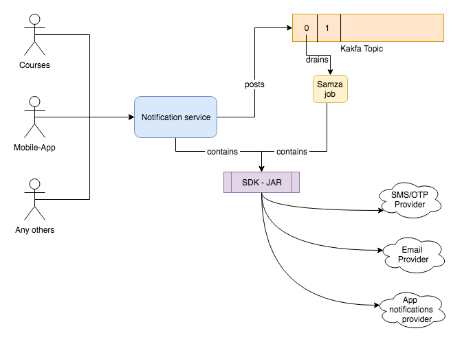

##   * [true](#true)
  * [About](#about)
  * [Design choices and constraints](#design-choices-and-constraints)
  * [Architecture diagram](#architecture-diagram)
  * [Release plan](#release-plan)
    * [Existing endpoints and proposed](#existing-endpoints-and-proposed)
  * [Payload schema](#payload-schema)
    * [Send sms, OTP, email, notification](#send-sms,-otp,-email,-notification)
  * [Example payloads](#example-payloads)
    * [Broadcast email to 2 users using template - no personalisation](#broadcast-email-to-2-users-using-template---no-personalisation)
    * [Send email to 2 users using template with personalisation](#send-email-to-2-users-using-template-with-personalisation)
    * [Send SMS to 2 users](#send-sms-to-2-users)
  * [Providers ](#providers )
  * [Solution](#solution)
    * [Implementation details](#implementation-details)
  * [points:](#points:)
  * [Source](#source)
  * [References](#references)
 Document status: released/live - SB v2.3.5

## About
Sunbird Notification service is a micro-service, responsible for reaching out to the end-users. 


## Design choices and constraints

1. Sends notifications to specified users identified by phone number or email or device id/topic.
1. Has NO understanding of the executing workflow or action involved.
1. Only the structural integrity of the payload is verified. If invalid phone number/email is passed, the service will not validate; the end result will just be a failure.
1. Sends a telemetry event upon successful completion of action (toggled via configuration).
1. The URLs do not carry PII data (the payload does).

     _The following are to be considered as known limitations for v1 of the notification _  _(coming out in SB 2.4)._ 
1. The API operation is generally asynchronous in nature. If the callers want to know status, there is no way through the notification-service. The same API turns into synchronous, for the OTP message type.


## Architecture diagram



## Release plan


| Notification-service version | Sunbird version | Payload | 
|  --- |  --- |  --- | 
| 1.0.0 | 2.4.0 | Google firebase communications enabled for device token based notification (targeted)  | 
|  |  |  _TODO_  items  - Consolidation of code (from learner-service) to allow sms, email, topic (broadcast)  - Handle failures on retries | 


### Existing endpoints and proposed


| Existing | Proposed | Comments | 
|  --- |  --- |  --- | 
| /v1/notification/send | /v1/notification/send |  | 
| /v1/notification/email | /v1/notification/send |  | 
| /v1/notification/email (with mode) | /v1/notification/send |  | 
| /v1/otp/generate | /v1/notification/otp/generate | Accepts email, phone and sends both. | 
| /v1/otp/verify | /v1/notification/otp/verify |  | 


## Payload schema

### Send sms, OTP, email, notification

```js
{
    "id": "notification.message.send",
    "ver": "1.0",
    "ets": "11234",
    "params": {
        "did": "",
        "key": "",
        "msgid": ""
    },
    "request": {
        "notifications": [{ // required, one or many types of notification object as relevant.
			"mode": "email|phone|device", // Mode in which the notification is sent
			"deliveryType": "message"|"otp"|"whatsapp"|"call", // required, only one value supported 
			"config": { // Optional, configuration data needed for the notification
				"sender": "sender@sunbird.com",  // optional, defaults to app config
				"otp": {
					"length": 4, // number as allowed by the provider; defaulted by service if out-of-bounds,
			    	"expiryInMinute": 10 // expected value in minutes
				},
				"topic": "<topicName>", // optional if device is not given
			},
            "ids": ["emailAddress","phoneNumber","deviceId"], // Depending on the mode, ids will either be an email address or phone numbers
           	"template": {  // template will be mandatory for email and sms notification , for device base notification rawData is mandatroy
				"id": "<id>", // if pre-registered (Eg. filename). Overrides dynamic data, if provided.
				"data: "<value>" // dynamic template passed (not pre-registered)
	            "params": {
				    "keyXReferredInTemplate": "value",
					"key1ReferredInTemplate": "value",
					"key2ReferredInTemplate": "value"
                 }
			 },
			 "rawData": {  // Raw property bag for device notifications is mandatroy.
				 "key": "value",
				 "key2": "value2"
                 "id": 123,
                 "type": 1,
                 "displayTime": "1560250228", // this will help to identify when exactly notification sent.
                 "expiry": "1560663930", // after this time notification should not show
                  "actionData": { // Mandatory for push notification
                        "actionType": "courseUpdate",
                        "title": "Update App and Enjoy Exiting New Features", // this message will be display as notification 
                        "description": "Notfication description", // on click of notification below details will be shown
                        "richText": "Blah Blah Blah",
                        "ctaText": "Update App",
                        "identifier": "do_212295896062394368144",
                        "deepLink": "https://google-play",
                        "deploymentKey": "6Xhfs4-WVV8dhYN9U5OkZw6PukglrykIsJ8-B"
                    }
			 }
		 }]
     }
}
```
OTP verification
```js
{
    "id": "notification.message.verify",
    "ver": "1.0",
    "ets": "11234",
    "params": {
        "did": "",
        "key": "",
        "msgid": ""
    },
    "request": {
       "key":"email or phone", 
       "value":"OTP sent"
    }
}

```

## Example payloads

### Broadcast email to 2 users using template - no personalisation

```js
{
    "id": "notification.message.send",
    "ver": "1.0",
    "ets": "11234",
    "params": {
        "did": "",
        "key": "",
        "msgid": ""
    },
    "request": {
		"notifications": [{ 
			"mode": "email", 
			"deliveryType": "message",
			"config": { 
				"sender": "sender@sunbird.com",  
				"subject": "Hello from Sunbird"
			},
            "ids": ["abc@def.com","xyz@ghi.com"],  // if ids size is more than one then email will always sent to BCC. 
           	"template": { 
				"data": "Hello, thanks for completing $courseName",
	            "params": {
				    "courseName": "Sunbird training"
                 }
			 }
		 }]
	}    
}


Data push to kafka:
{"actor":{"id":"BroadCast Topic Notification","type":"System"},"eid":"BE_JOB_REQUEST","iteration":1,"mid":"NS.1570345844397.7d8efed9-6b4e-4df9-ba63-39fe6fa423e2","ets":1570345844397,"edata":{"action":"broadcast-topic-notification-all","request":{"notification":{"mode":"email","deliveryType":"message","config":{"sender":"sender@sunbird.com","topic":null,"otp":null,"subject":"Hello from Sunbird"},"ids":["abc@def.com","xyz@ghi.com"],"template":{"id":null,"data":"Hello, thanks for completing Sunbird training","params":{"courseName":"Sunbird training"}},"rawData":null}}},"context":{"pdata":{"ver":"1.0","id":"org.sunbird.platform"}},"object":{"id":"326e9ddd9e8bb0f6f352eb07e4ff3f302f196cc0de9da0165ba125542a36280a","type":"TopicNotifyAll"}}


```

### Send email to 2 users using template with personalisation

```js
{
    "id": "notification.message.send",
    "ver": "1.0",
    "ets": "11234",
    "params": {
        "did": "",
        "key": "",
        "msgid": ""
    },
    "request": {
		"notifications": [{ 
			"mode": "email", 
			"deliveryType": "message",
			"config": { 
				"sender": "sender@sunbird.com",  
				"subject": "Hello from Sunbird"
			},
            "ids": ["abc@def.com"], 
           	"template": { 
				"data: "Hello $fn, thanks for completing $courseName",
	            "params": {
				    "courseName": "Sunbird training",
					"fn": "John"
                 }
			 }
		 },
		 { 
			"mode": "email", 
			"deliveryType": "message",
			"config": { 
				"sender": "sender@sunbird.com",  
				"subject": "Hello from Sunbird"
			},
            "ids": ["def@kjl.com"], 
           	"template": { 
				"data": "Hello $fn, thanks for completing $courseName",
	            "params": {
				    "courseName": "Sunbird training",
					"fn": "Hogwarts"
                 }
			 }
		}]
	}    
}

Data inside Kafka :
{"actor":{"id":"BroadCast Topic Notification","type":"System"},"eid":"BE_JOB_REQUEST","iteration":1,"mid":"NS.1570346032010.7822d7df-fb1a-48d0-bd28-659f19558b7e","ets":1570346032010,"edata":{"action":"broadcast-topic-notification-all","request":{"notification":{"mode":"email","deliveryType":"message","config":{"sender":"sender@sunbird.com","topic":null,"otp":null,"subject":"Hello from Sunbird"},"ids":["abc@def.com"],"template":{"id":null,"data":"Hello John, thanks for completing Sunbird training","params":{"courseName":"Sunbird training","fn":"John"}},"rawData":null}}},"context":{"pdata":{"ver":"1.0","id":"org.sunbird.platform"}},"object":{"id":"e16c7b757b98c01dc19826dbdebbbf2a0889510d0614451be0a6409f730b8a85","type":"TopicNotifyAll"}}
{"actor":{"id":"BroadCast Topic Notification","type":"System"},"eid":"BE_JOB_REQUEST","iteration":1,"mid":"NS.1570346032112.3d7559f3-07ed-4191-9f74-76011182d3c6","ets":1570346032112,"edata":{"action":"broadcast-topic-notification-all","request":{"notification":{"mode":"email","deliveryType":"message","config":{"sender":"sender@sunbird.com","topic":null,"otp":null,"subject":"Hello from Sunbird"},"ids":["def@kjl.com"],"template":{"id":null,"data":"Hello Hogwarts, thanks for completing Sunbird training","params":{"courseName":"Sunbird training","fn":"Hogwarts"}},"rawData":null}}},"context":{"pdata":{"ver":"1.0","id":"org.sunbird.platform"}},"object":{"id":"a8a4269270cf7ec81da9d376564844634ac54af234b4f78b30d2358a0267454c","type":"TopicNotifyAll"}}


```

### Send SMS to 2 users

```js
{
  "id": "notification.message.send",
  "ver": "1.0",
  "ets": "11234",
  "params": {
    "did": "",
    "key": "",
    "msgid": ""
  },
  "request": {
	"notifications": [{ 
			"mode": "phone", 
			"deliveryType": "message",
			"config": { 
				"sender": "sender@sunbird.com",  
				"subject": "Hello from Sunbird"
			},
            "ids": [9887694567, 9887694568], 
           	"template": { 
				"data": "You have successfully completed $courseName.",
	            "params": {
				    "courseName": "Sunbird training"
                 }
			 }
		}]
    }
}
```


 **Broadcast notifications to all users:**  **Bulk-Topic-Notification-Api (/notification/v1/device/broadcast) : ** 


* This api helps in broadcasting the notifications to multiple device id's based on the topic name.
* The request is an array of different topics

Request format :


```js
{
  "id": "notification.message.send",
  "ver": "1.0",
  "ets": "11234",
  "params": {
    "did": "",
    "key": "",
    "msgid": ""
  },
  "request": {
		"notifications": [{ 
			"mode": "device", 
			"deliveryType": "message",
			"config": { 
				"topic": "publicTopic"
			},
            "ids": [], 
           	"rawData": {  // Raw property bag for device notifications is mandatroy.
				 "key": "value",
				 "key2": "value2"
                 "id": 123,
                 "type": 1,
                 "displayTime": "1560250228", // this will help to identify when exactly notification sent.
                 "expiry": "1560663930", // after this time notification should not show
                  "actionData": { // Mandatory for push notification
                        "actionType": "courseUpdate",
                        "title": "Update App and Enjoy Exiting New Features", // this message will be display as notification 
                        "description": "Notfication description", // on click of notification below details will be shown
                        "richText": "Blah Blah Blah",
                        "ctaText": "Update App",
                        "identifier": "do_212295896062394368144",
                        "deepLink": "https://google-play",
                        "deploymentKey": "6Xhfs4-WVV8dhYN9U5OkZw6PukglrykIsJ8-B"
                    }
			 }
		}]
	}
}

-- for sending device based notification we need to always pass rawData and actionData . Device has there own business logic based on provided keys.


```

* From the request notification array picks each notification topic and it is validated, i.e, topic is present in the system
* Produces a kafka-message for topic name "__env__.lms.notification" in async mode for each topic
* Kafka topic format :


```js
{
  "actor": {
    "id": "Broadcast topic notification",    //id of the actor
    "type": "System"
  },
  "eid": "BE_JOB_REQUEST",
  "edata": {
    "action": "broadcast-topic-notification-all",  //action name to check (Mandatory field)
    "request": {
        "notification": { 
            "mode": "device", 
            "deliveryType": "message",
            "config": { 
                "topic": "publicTopic"
            },
            "ids": [], 
            "template": { 
                "data: "You have successfully enrolled for $courseName.",
                "params": {
                    "courseName": "Sunbird training"
                 }
             }
        }
    }          
    "iteration": 1
  },
  "ets": 1564144562948,             //system time-stamp
  "context": {
    "pdata": {
      "ver": "1.0",
      "id": "org.sunbird.platform"
    }
  },
  "mid": "LP.1564144562948.0deae013-378e-4d3b-ac16-237e3fc6149a",           //producer.system-time-stamp.uuid
  "object": {
    "id": "hash(request)",              
    "type": "TopicNotifyAll"
  }
}
```

* For the samza job for each kafka-topic message, api call will be triggered to FCM.
* FCM process the notifications related device id's of the topic in async way.

 **Send notifications to selective users - Targeted audience:**  **System JIRA2207a759-5bc8-39c5-9cd2-aa9ccc1f65ddSB-10685** 

 **Device-Token-Notification-Api (/notification/v1/device) : ** 


* This Api push notifications to the selected user devices. 
* The Request contains array of user device tokens.

Request format :


```js
{
  "id": "notification.message.send",
  "ver": "1.0",
  "ets": "11234",
  "params": {
    "did": "",
    "key": "",
    "msgid": ""
  },
  "request": {
		"notifications": [{ 
			"mode": "device", 
			"deliveryType": "message",
			"config": { 
			},
            "ids": ["fcmToken1", "fcmToken2"], 
           	"rawData": { 
				"key": "value"
			 }
		}]
	}
}
```

* Picks each notification event from ids array and produces a message to kafka-topic "__env__.lms.notification" in async mode.
* Kafka Topic format:


```js
{
  "actor": {
    "id": "Device token notification",    //id of the actor
    "type": "System"
  },
  "eid": "BE_JOB_REQUEST",
  "edata": {
    "action": "notification-device-token",  //action name to check (Mandatory field)
    "request": {
		"mode": "device", 
		"deliveryType": "message",
		"config": { 
		},
        "ids": ["fcmToken1", "fcmToken2"], 
      	"rawData": { 
			"key": "value"
		}
    }          
    "iteration": 1
  },
  "ets": 1564144562948,             //system time-stamp
  "context": {
    "pdata": {
      "ver": "1.0",
      "id": "org.sunbird.platform"
    }
  },
  "mid": "LP.1564144562948.0deae013-378e-4d3b-ac16-237e3fc6149a",           //producer.system-time-stamp.uuid
  "object": {
    "id": "hash(fcmToken)",              
    "type": "NotifyDeviceToken"
  }
}
```

* Samza job triggers api call to FCM for each message
* FCM process the notification related device id of each message in async way.
* Response from the FCM will be shared later


## Providers 


| What | Who | Pros/Cons | Current Plan of subscription | Comments | 
|  --- |  --- |  --- |  --- |  --- | 
| Device | FCM [(Google Firebase Cloud Messaging)](https://firebase.google.com/docs/cloud-messaging/?gclid=EAIaIQobChMItbmy-sGJ4wIVTouPCh27Hg6PEAAYASAAEgK9bvD_BwE) | Can target single devices, to groups of devices, or to devices subscribed to topics. | TBD - Devops | We use it against only topics.<TBD> | 
| Email | SendGrid (Twilio [SendGrid](https://sendgrid.com))  | Template based emails <TBD to fill in> | TBD - Devops |  | 
| SMS/OTP | Msg91 (Walkover [msg91](https://msg91.com/)) | Send message (SMS) Send, Verify OTP Send OTP in email, Verify absent - expects valid phone always. | TBD - Devops | We use only messaging service and generate OTP, verify OTP ourselves. This means we are not using this provider for its capabilities.OTP delivered in email cant be verified without a phone. | 


## Solution

### Implementation details
Release 2.4


## points:
 For sending OTP with Msg91 we found following points:


* sender: It will always be 6 character. if caller is providing in request they need to make sure it should be 6 character. If caller is not providing this value then  it will be picked form ENV/properties file. env attribute "sunbird_notification_msg_default_sender".
* lenght : minium supported length is 4 and  max length is 6. Default is set in system as 4 that can be overrid either in api call by passing length attribute or using env "sunbird_notification_otp_length"
* expiryInMinute : this will come as minute only.
* message (template.data) :  in case of OTP user is passing message then it should be in "your message ##OTP##" in this format. it must contains ##OTP## in message body. Default message can be set using env : "sunbird_notification_otp_default_message"
*  For sending OTP assuming request.notifications\[0].Ids attribute will have only one phone number without country code. Country code will be default added by system as 91, it can be override using env: sunbird_notification_default_country_code
* For sending SMS or push at a time request can have 1000 ids. 
* Notification object will be broken down as follow 
*  case "ids > 100" : in that case notification object will be splited into batch of 100 and push to kafka topic. Samza job will read one event and call notification-sdk to send notification
* case "ids <=100" : in that case same notification object will be written to kafka and handle by samza job.
* By default all notification execpt OTP generate and verify will be Async call. 
* for sending sync notification user this end point  **/v1/notification/send/sync** 


Release 2.5Implemented Re-Try mechanism in notification samza job:


* Samza job reads one message from kafka and process it for sending as notification, as of now we didn't supported retry the notification when it fails to send
* Now retry mechanism is added. Kafka notification-message contains iteration field, default value will be 1.
* Samza job will be configured with the number of iterations.
* When ever the notification is failed to sent, It will be pushed to the same kafka topic with increasing the "iteration" filed value with +1.
* Retry's will be performed with the number of configured attempts, if still the notification message is failed to sent then the notification is sub-merged as of now.
* Not pushing to failed kafka topic when notification is completely failed to sent in all attempts.


## Source
[https://github.com/project-sunbird/sunbird-notification-service](https://github.com/project-sunbird/sunbird-notification-service) → Play based notification micro-service.


## References

1. Do not use PII data in URLs - Google source in the context of AdSense - [https://support.google.com/adsense/answer/6156630?hl=en](https://support.google.com/adsense/answer/6156630?hl=en)


*****

[[category.storage-team]] 
[[category.confluence]] 
