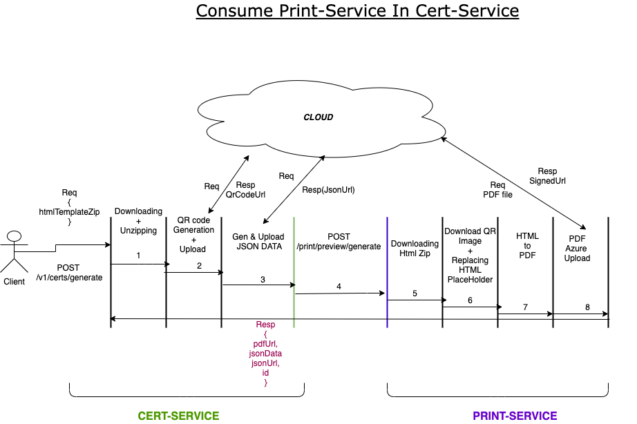

  * [Problem](#problem)
  * [Consumption Diagram](#consumption-diagram)
  * [Solution/Capabilities](#solution/capabilities)
  * [Cert-Service Workflow](#cert-service-workflow)
  * [Challenges to consume print-service in cert-service](#challenges-to-consume-print-service-in-cert-service)
  * [Investigation](#investigation)
  * [References](#references)
    * [Dependencies](#dependencies)
    * [R2.8.0 - APIs](#r2.8.0---apis)
    * [Further Explorations](#further-explorations)

## Problem

1. Cert-Service is using chromium (headless chrome) for generating pdf, which is platform-dependent, requires different commands to run on different platforms.

1. Cert-Service is generating as well as uploading the .pdf file to azure in addition to creating the certificate raw JSON, according to the inCredible spec. We like this to do only generation, validation and not manage storage.

## Consumption Diagram

## Solution/Capabilities
Print-Service has a solution to the first problem stated above.

1. Print-Service is using Puppeteer(platform-independent) which is a light-weight Node library that provides high-level APIs to control chromium.

1. Print-Service is an async nodejs-based service that is light-weight. It has the capability to run in a cluster mode.

1. Since this browser-based and that the noto-sans library of fonts is installed, it is likely to support multi-language.

## Cert-Service Workflow
Currently, Cert-Service is doing the following tasks in sequence:

1. Downloading and unzipping the zipped HTML template.

1. Replacing the value to the placeholders(present in index.html)

1. Generating the QR code.

1. Generating the Certificate Raw/JSON data.

1. Converting the HTML to PDF.

1. Uploading the PDF to azure.

 _It is proposed to shift 2, 5, 6 steps to be done by print-service. This still requires QR code to be uploaded to Azure or bundled with a certificate-specific zip._ 

## Challenges to consume print-service in cert-service

1. Multiple Upload/Download will increase latency

    Requesting print-service with updated HTML template i.e with QR code image, placeholder value replacement requires to re-upload HTML template with certificate data.

    1. Code written for QR, Velocity templates needs movement from JAVA to nodejs.

    
1. Retesting required

    Since the PDF generation libraries have changed, we need to retest with existing certificate templates and ensure they render the certificates as before.

## Investigation
This section details the things we have tried out.

1. Tested with local HTML templates and found that CSS, images are displayed with some sample certificate templates.

1. Multi-lang support - we used public websites to notice that Hindi characters are rendered in PDF correctly.

1. We notice some styling like spaces between elements, but hopeful they are minor.

## References

### Dependencies

1. Azure-Storage, for uploading pdf file to azure and get signed URL public in nature.

1. [Puppeteer](https://developers.google.com/web/tools/puppeteer) which can be installed as an npm package easily.

1. VelocityJs which is used to replace the placeholder values.

1. superagent to download the zip file

1. adm-zip to unzip the the zip file

### R2.8.0 - APIs
please refer doc [here](https://project-sunbird.atlassian.net/wiki/spaces/UM/pages/1316028442/Print-Service+APIs)

### Further Explorations

* Print-Service can also have a option to give black and white or coloured PDF.

* Print-Service currently  having  azure account name and key hardcoded, it can also take these details from client so that client can use it accordingly.

* Customize Header and Footer can be set in the PDF file, refer [here](https://project-sunbird.atlassian.net/wiki/spaces/UM/pages/1290502242/E-Creds+Page+Configs) for more info.

*****

[[category.storage-team]] 
[[category.confluence]] 
