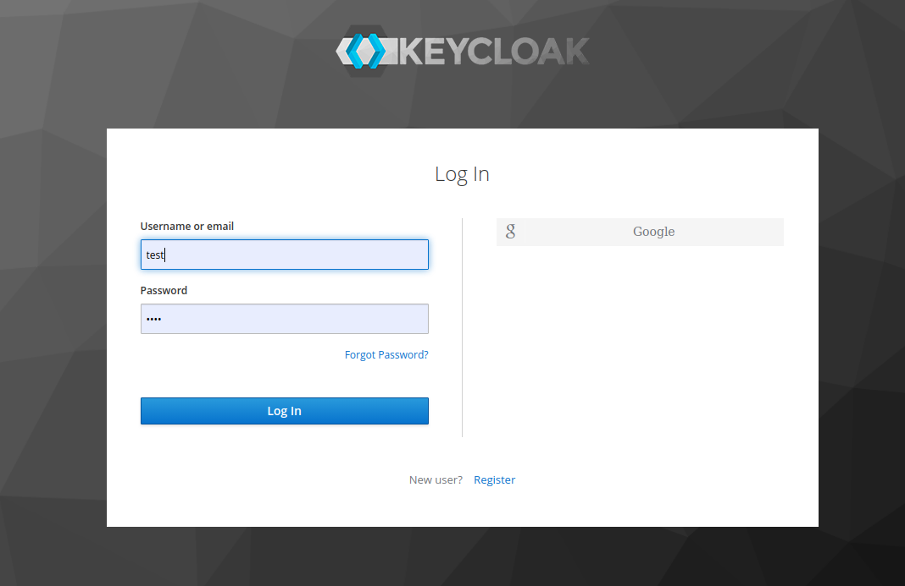
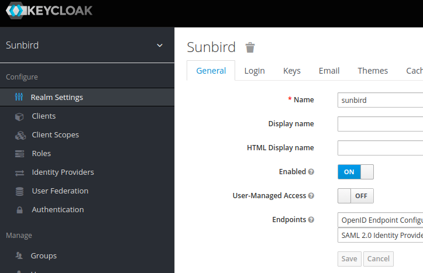
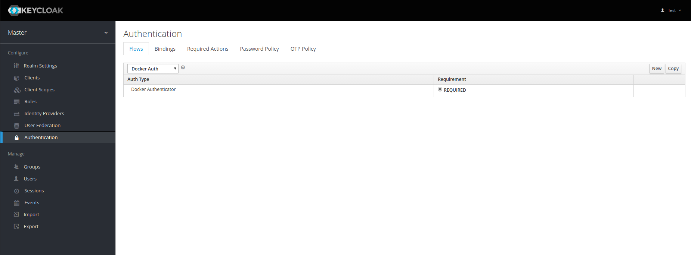
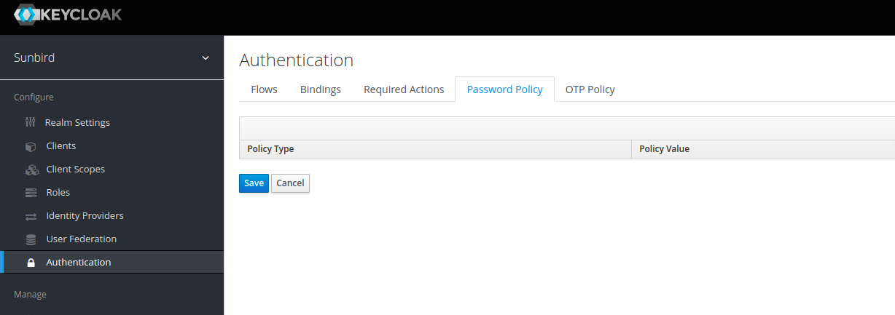
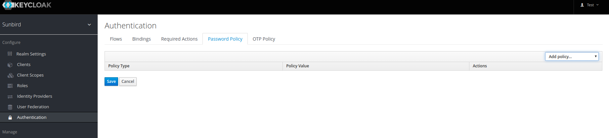
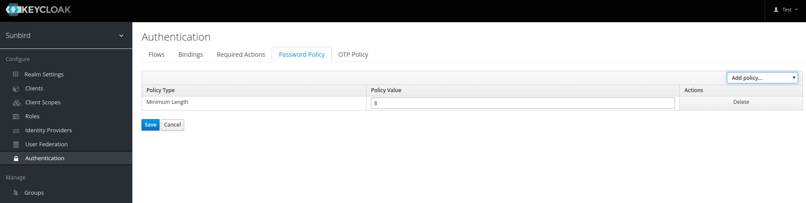
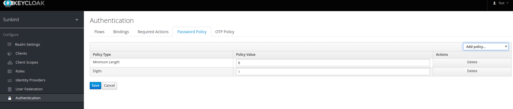
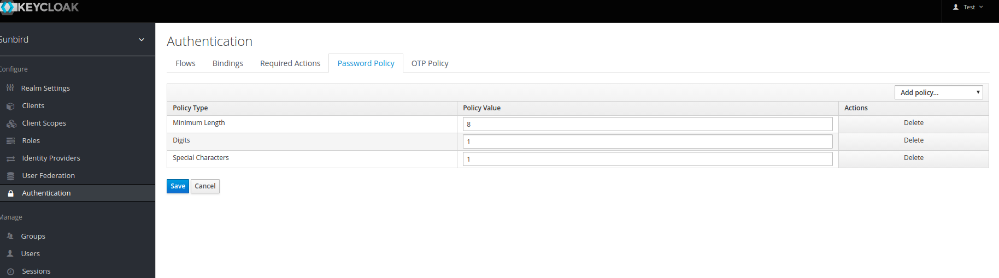

## About 
The current user created in sunbird has no password policies associated with it. And we want to set some stronger set of rules for password.  [SC-1319 System JIRA](https:///browse/SC-1319)

## Why Stronger password policy 
In sunbird users can set their password as they want. Such settings are fine for development but unacceptable in production environment. Consequences of insecure password can include the loss of personal data.

## Proposed set of rules for password

1. Minimum of 8 characters
1. At least 1 numeric value
1. At least one special character

Suggestion (To include the below password policy)
1. The password is not allowed to be the same as username.

What is not changing?
1. Changing password policy will not affect the existing user password, until they try to reset their password.

What is changing?
1. Password policy for sunbird user via keycloak
1. new user will be forced to provide the strong password as per our password policy

Password policy types (Default provided by keycloak)  Ref :  [https://www.keycloak.org/docs/latest/server_admin/index.html#_password-policies](https://www.keycloak.org/docs/latest/server_admin/index.html#_password-policies)
1. HashAlgorithm (Passwords are not set as clear plain text, instead hashed using standard hash algorithm)
1. Hashing Iterations (Specifies the number of times password will be hashed before it stored , default is 20000)
1. Digits (Number of digits required to be in password)
1. Lowercase characters (Number of lowercase letters required to be in password)
1. Uppercase characters (Number of uppercase letters required to be in password)
1. Not Username (password should not be same as username)
1. Regular expression (define Perl regular expression to match the password pattern)
1. Expire password (The number of days for which the password is valid)
1. Not Recently Used (it stores the history of password)
1. Password Blacklist (This policy checks , if given password contains in blacklist file)

Steps for setting password policy in keycloak

| SNo. | Steps | Screen | 
|  --- |  --- |  --- | 
| 1 | Login to admin console |  | 
| 2 | Select the Realm |  | 
| 3 | Go to Authentication tab on left side of admin console  |  | 
| 4 | Go to Password Policy tab on top of Authentication page | 

 | 
| 5 | Click on Add Policy drop down menu and add the policy | 

 | 
| 6 | Add Minimum Length policy | 

 | 
| 7 | Add Digits Policy | 

 | 
| 8 | Add Special Character Policy | 

 | 
| 9 | Click on save Button | 

 | 

## Open Question

1. Do we force logout/reset password for existing user

Implementation Design : 

[https://project-sunbird.atlassian.net/wiki/spaces/UM/pages/1122566187/Stronger+rule+of+password+SC-1345](https://project-sunbird.atlassian.net/wiki/spaces/UM/pages/1122566187/Stronger+rule+of+password+SC-1345)

*****

[[category.storage-team]] 
[[category.confluence]] 
