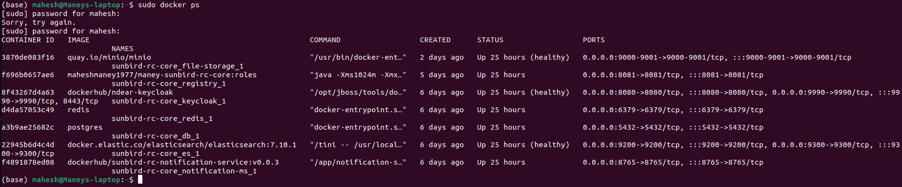
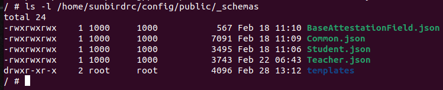

Assuming you have followed the procedure mentioned in [Sunbird-RC Setup](https://project-sunbird.atlassian.net/wiki/spaces/UM/pages/3085500423/Sunbird+RC+Setup?focusedCommentId=3096510507#comment-3096510507), you may follow the steps below;

Once the Sunbird-RC setup is successful, Execute the following commands in the sequential order.


1. List all the images started.  **sudo docker ps** 


We need to make sure the configuration files \[ Teacher.json, Student.json and Common.json ] are in the container.

The first column is the CONTAINER-ID. Copy the container-ID of Sunbird-RC core

 **sudo docker exec -it <CONTAINER-ID> /bin/sh** 

Eg :  **sudo docker exec -it f696b0657ae6 /bin/sh** 

once you are inside the system, 

 **ls -l /home/sunbirdrc/config/public/_schemas** 

The above command should return a list of files on that location

In case this command does return any listing, we are missing the configuration files.

The required configuration files are attached at the end of this document. 

You may download the attached files, navigate to the location where these files are downloaded and open the terminal at the same location and execute the below commands

\[command to fetch the docker image id -  **sudo docker ps**  ]


*  **sudo docker cp Student.json <docker-image-id-of-sunird-rc>:/home/sunbirdrc/config/public/_schemas/** 


*  **sudo docker cp Teacher.json <docker-image-id-of-sunird-rc>:/home/sunbirdrc/config/public/_schemas/** 


*  **sudo docker cp Common.json <docker-image-id-of-sunird-rc>:/home/sunbirdrc/config/public/_schemas/** 


*  **sudo docker cp Teacher.html 155a3afd05fd:/home/sunbirdrc/config/public/_schemas/templates/** 


\[Note: you need to create a folder by name templates on  **/home/sunbirdrc/config/public/_schemas/**  ]

Now the configuration files are in place and we are ready to execute the sunbird-RC API for School examples.


1. Invite an Entity (Teacher)


```
curl --location --request POST 'http://localhost:8081/api/v1/Teacher/invite' \
--header 'content-type: application/json' \
--header 'Authorization: bearer ' \
--data-raw '{
    "personalDetails": {
        "userName": "mahesh maney r",
        "dob": "1977-12-30"
    },
    "IdentityDetails": {
        "type": "id",
        "value": 12
    },
    "ContactDetails": {
        "mobile": "1234567890",
        "email": "mahesh.maney@example.com",
        "address": {
            "street": "mysore",
            "state": "Karnataka",
            "pincode": "560001"
        }
    }
}'
```


2. Generate Access Token for a user (admin)


```
curl --location --request POST 'http://localhost:8080/auth/realms/sunbird-rc/protocol/openid-connect/token' \
--header 'content-type: application/x-www-form-urlencoded' \
--data-urlencode 'client_id=registry-frontend' \
--data-urlencode 'username=admin' \
--data-urlencode 'password=abcd@123' \
--data-urlencode 'grant_type=password'
```


3. Fetch the information of an user (entity)


```
curl --location --request GET 'http://localhost:8081/api/v1/Teacher/<osid>' \
--header 'content-type: application/json' \
--header 'authorization: bearer <access-token>' \
--data-raw ''
```


4. Update Name and Experience of an entity (Teacher)


```
curl --location --request PUT 'http://localhost:8081/api/v1/Teacher/0d2b0e6b-6ae0-4c41-b0c7-378aaef9f622' \
--header 'content-type: application/json' \
--header 'authorization: bearer <access-token>' \
--data-raw '"ContactDetails":{"name": "test name"}, "experience":[{"institute":"Some other school"}]}'
```


5. Invite an Student


```
curl --location --request POST 'http://localhost:8081/api/v1/Student/invite' \
--header 'content-type: application/json' \
--header 'Authorization: bearer' \
--data-raw '{
    "identityDetails": {
        "fullName": "mahesh maney r",
        "gender": "male"
    },
    "educationDetails": [{
        "institute": "Sri Jayachanarajendra College of Engineering"
    }]
}'
```


6.  Raise a claim \[ Make an claim ]


```
curl --location --request PUT 'http://localhost:8081/api/v1/send?send=true' \
--header 'Content-Type: application/json' \
--header 'authorization: Bearer ' \
--data-raw '{
    "entityName": "Student",
    "entityId": "1-97b3de54-9d40-4d1d-843e-b7e739666be6",
    "name": "schoolId",
    "propertiesOSID": {"osid": ["1-c4c30da7-e1f8-4dbf-a81c-cc0b054f5661"]},
    "additionalInput": {
        "idx": "1-97b3de54-9d40-4d1d-843e-b7e739666be6"
    }
}'
```


7. Attest the claim


```
curl --location --request POST 'http://localhost:8081/api/v1/Teacher/claims/aec110fd-8c05-44bb-8897-bc3c8442b9d6/attest' \
--header 'Content-Type: application/json' \
--header 'Authorization: Bearer ' \
--data-raw '{
    "action":"GRANT_CLAIM"
}'
```


# Generate a Certificate

1. Add a task


```
curl --location --request POST 'http://localhost:8081/api/v1/Teacher' \
--header 'Content-Type: application/json' \
--header 'Authorization: bearer ' \
--data-raw '{
    "name": "Sunbird Learner",
    "contact": "mahesh-maney-r",
    "trainingTitle": "Sunbird RC Certificate Module"
}'
```


2.  Prepare data for certificate generation


```
curl --location --request GET 'http://localhost:8081/api/v1/Teacher/<idx>' \
--header 'Accept: application/vc+ld+json' \
--header 'Authorization: bearer'
```


3. Download certificate in PDF format


```
curl --location --request GET 'http://localhost:8081/api/v1/Teacher/<idx>' \
--header 'Accept: application/application/pdf' \
--header 'Authorization: bearer'
```


*****

[[category.storage-team]] 
[[category.confluence]] 
