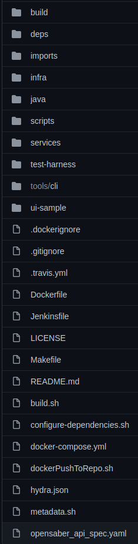
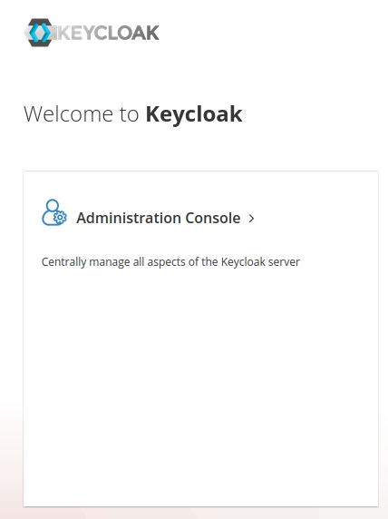
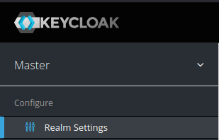
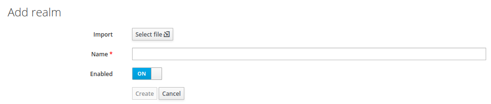
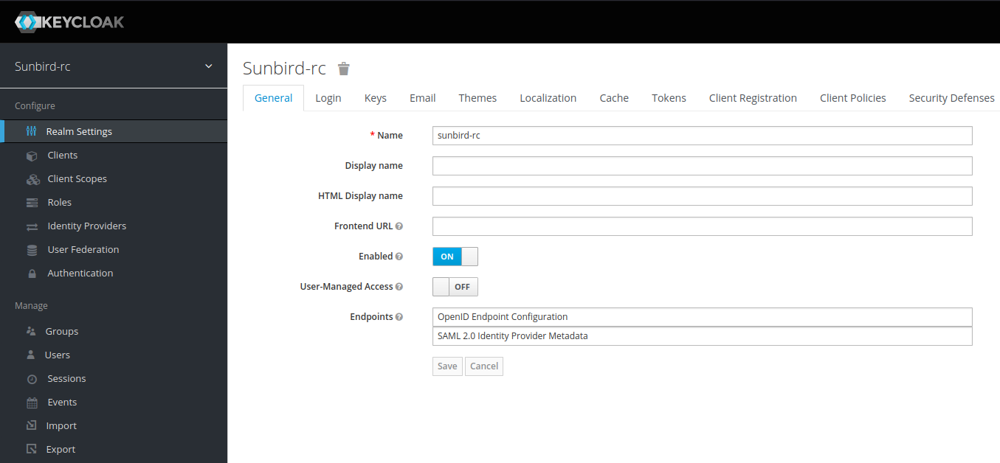
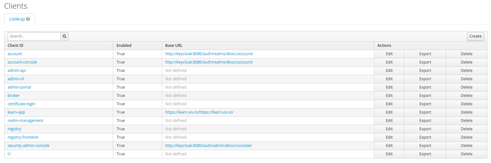
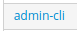
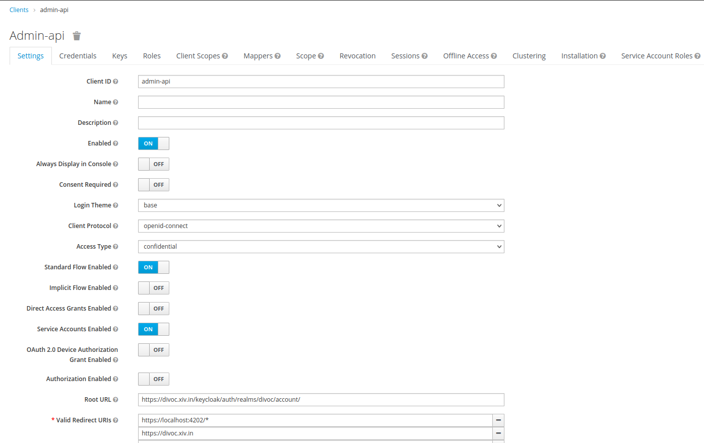
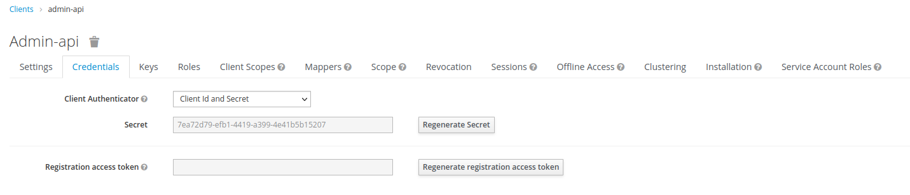

Clone Sunbird-RC from (MAIN - branch)

[https://github.com/Sunbird-RC/sunbird-rc-core](https://github.com/Sunbird-RC/sunbird-rc-core)

The Sunbird-RC consists of 4 services that needs be run independently - namely;

|  **Micro-Service**  |  **Port**  |  **Purpose**  | 
|  --- |  --- |  --- | 
| Registry | 8081 |  | 
| claims | 8082 |  | 
| Certificate API | 8087 |  | 
| Certificate Signer | 8079 |  | 

The following are the dependent services used by the above micro-services;

|  **Service**  |  **Port**  |  **Mandatory**  |  **Purpose**  | 
|  --- |  --- |  --- |  --- | 
| Redis | 6379 | No |  | 
| Elasticsearch | 9200 - http9300 - tcp/ip | No |  | 
| Database (Postgres) | 5432 | Yes |  | 
| Keycloak | 8080 | Yes |  | 
| File-Storage | 90009001 | No |  | 
| Notification | 8765 | No |  | 

Folder Structure of Sunbird-RC

Prerequisites:

* Open jdk 8 and above

* Node 16 and above

Steps to start Sunbird-RC

1.  After Cloning - $ cd sunbird-rc-core

 **_Build Note_**  : We need to build all four services before executing them;

1. To build Registry and Claim services : Navigate to <cloned-location-of-sunbirdrc>/java and open the terminal - execute command  in order

    *  **sh configure-dependencies.sh** 

    *  **mvn clean install -DskipTests=true** . this will build the java service for Registry and claims

    
1. To build Certificate-API : Navigate to <cloned-location-of-sunbirdrc>/services/certificate-api/ and open the terminal - execute command :  **npm install**  \[if you have installed yarn, execute command  **yarn** ]

1. To build Certificate-signer: Navigate to <cloned-location-of-sunbirdrc>/services/certificate-signer/ and open the terminal - execute command :  **npm install**  \[if you have installed yarn, execute command  **yarn]** 

This above procedure will build all the 4 required services.

1. Navigate to <cloned-location-of-sunbirdrc> and open a terminal and execute  $ sudo docker-compose up  - This will start all the micro-services and services (as mentioned in the table above on respective ports)

1. Open your favorite browser and open [http://keycloak:8080](http://keycloak:8080) this will open the keycloak home page

Click on Administration Console, that will navigate you to Authorization page.

username: admin

password: admin

4. Once authenticated you will be navigated to the homepage of keycloak. on the left top corner of the page click on the drop down next to MASTER

and choose - Add Realm and this will navigate you to Add Realm page

Click on  **Select file**  button and that will pop-up an window to select the realm settings json file.

Navigate to the location where Sunbird-RC is cloned - 

<cloned-location-of-sunbirdrc> **/imports/realm-export.json** 

Click on  **Create**  button.

Keycloak will create the Sunbirdrc realm.

After the sunbirdrc realm is created (screenshot above), 

Click on Clients (on LHS) - Clients page is loaded

Click on admin-api

Admin API page is loaded

Click on  **Credentials**  tab and Click on  **Regenerate Secret**  button.

Copy the  **Secret**  key and paste it on to  **docker-compose.yml**  file under  **registry**  -  **environment**  -  **sunbird_sso_admin_client_secret**  key

Save the file.

Navigate the windows where sudo docker-compose up command was executed and hot Ctrl+X to stop the service.

 **_Build Note_**  : We need to build all four services before executing them;

1. To build Registry and Claim services : Navigate to <cloned-location-of-sunbirdrc>/java and open the terminal - execute command  in order

*  **sh configure-dependencies.sh** 

*  **mvn clean install -DskipTests=true** . this will build the java service for Registry and claims

2.  To build Certificate-API : Navigate to <cloned-location-of-sunbirdrc>/services/certificate-api/ and open the terminal - execute command  **npm install**  \[if you have installed yarn, execute command  **yarn** ]

3. To build Certificate-signer: Navigate to <cloned-location-of-sunbirdrc>/services/certificate-signer/ and open the terminal - execute command  **npm install**  \[if you have installed yarn, execute command  **yarn]** 

This above procedure will build all the 4 required services.

now navigate to <cloned-location-of-sunbirdrc> and execute the command  **sudo docker-compose up** . 

All the required dependent services and micro-services are up and running.

Reference : 

### Developer setup guide : 

1. [https://github.com/Sunbird-RC/community/discussions/106](https://github.com/Sunbird-RC/community/discussions/106)

2. [https://docs.sunbirdrc.dev/developer-setup](https://docs.sunbirdrc.dev/developer-setup)

In case you want to execute the School example on Sunbird-RC you may follow the document [[here|Sunbird-RC---Functional-setup-(School-Entity)]].

*****

[[category.storage-team]] 
[[category.confluence]] 
