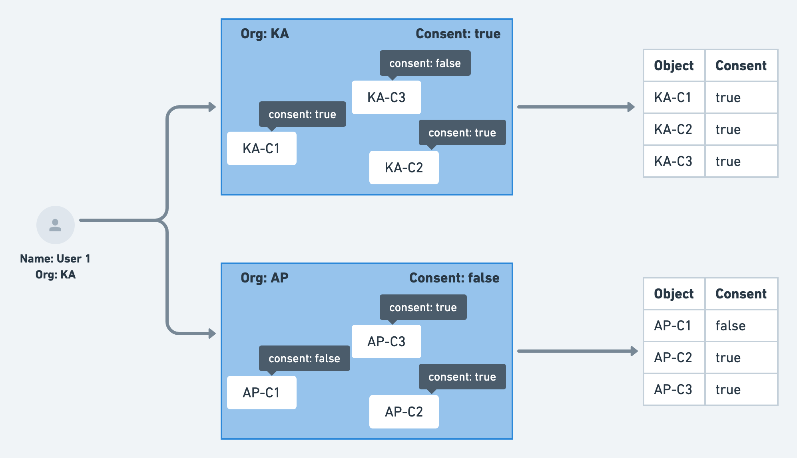

## Introduction
Sunbird Platform generates and uses the masked personal data of the users when returned via API or Reports for Administrators or Organisations.

The organisations and administrators create trackable collections and use reports to understand the progress of the users who are consuming it. The reports share masked user personal details so, for administrators or organisation, it is not easy to help in improving the learning process.

To start sharing the personal data for the users, the platform should get consent from the user or the organisation under which the user belongs.

A  **user**  can either  **consent**  or  **not consent**  to share data to an  **object**  in the context of an  **organisation** . The consent can be for  **all**  or minimal  **set**  of personal data and can be only used for  **specific purposes**  and/or for a  **specific duration.** 

This wiki explains the proposed design, the API specification and data model for reading or update of  **User Consent** .


|  **Type**  |  **Details**  | 
|  --- |  --- | 
| Global Consent | Global consent is given to organisation to access the personal data of users. | 
| Object-Level Consent | Consent is given to a specific object (Ex: collection) by the user to access personal data by the object’s creator or the organisation. | 
|  **Note:** Global consent override the object-level consent value. | 


## Design
The consent is computed for a given user, organisation (subject) and object. The platform uses global and object-level consent data provided by the user to determine the final consent value.


* If the consent is not available defaults to false


* The global consent value is computed at run time using the user’s organisation and object organisation.


* It uses an  **OR**  condition for computing the final consent value between global and object-level consent.


 **Examples:** 


*  **Global Consent:**  a user (User 1) gives the consent for an organisation (KA)


*  **Object-Level Consent:**  a user (User 1) gives the consent for a collection (KA-C1) created by an organisation (KA)


*  **User Consent (aggregated):** 


    * For Organisation KA - Consent was given and its value is true.


    * For KA-C1 collection - Consent was given and its value is true.


    * Consent: true (KA.consent || KA-C1.consent)


    
    * For KA-C3 collection - Consent not provided and its value is false.


    * Consent: false (KA.consent || KA-C3.consent)


    

    



The sunbird platform provides the Consent APIs to read or update for a given subject (organisation) and object. The APIs completely use the data available in DB for the read API response and returns 404 (Not Found) in case of the consent data not there in DB.

The above computation used to determine the final consent of the users for reports and other use cases in future.

noteThe platform will generate an  **AUDIT**  telemetry event for any update to the user consent. This will be used for any analysis in future or to trace the user audit history.

The platform will generate an  **AUDIT**  telemetry event for any update to the user consent. This will be used for any analysis in future or to trace the user audit history.


### Data Model:
 **Table:**  sunbird.user_consent


|  **Property**  |  **DataType**  |  **Description**  | 
|  --- |  --- |  --- | 
| user_id | text | Identifier of the user | 
| object_id | text | Identifier of the object for which the consent is given. | 
| object_type | text | Object Type for the object_id. | 
| consumer_id | text | The identifier of the org or channel or user for whom the consent is given. | 
| consumer_type | text | Type of the subject. | 
| status | text | ACTIVE/REVOKED/EXPIRED | 
| created_on | timestamp | When for the first time consented. | 
| last_updated_on | timestamp | Timestamp when the consent is updated. | 
| expiry | text | Consent expiry date in yyyy-MM-dd format. | 
| consent_id | text | Unique identifier of the consent | 
| categories | list<text> | List of categories of user data for which the access requested. | 
| consent_data | text | consent entity of the user in JSON format. | 
|  **Primary Key:**  (user_id, subject_id, object_id). | 

 **Consent Update API Request - Payload Format:** 

{

    "request": {

        "consent": {

            "userId": "5a8a3f2b-3409-42e0-9001-f913bc0fde31",

            "consumerId": "channel id",

            "status": "ACTIVE", //ACTIVE or REVOKED

            "objectType": "Collection", 

            "objectId": "do_3130299686648299521293" 

        }

    }

}


1.  **consumerId**  should be channel id, 


    1. channel id of the course in case of course consent, ie, the rootOrgId. //Ex: 0126684405014528002. 


    1. channel id of the root org to which self declaration is given in case of self declaration consent, ie, the rootOrgId. //Ex: 0126202691023585280. 


    
1.  **objectType**  should be 


    1. 'collection' in case of course consent 


    1. 'organisation' in case of self declaration consent


    
1.  **objectId**  should be 


    1. course id / collection id in case of course consent, Ex: do_3130299686648299521293, 


    1. channel id,  ie, the rootOrgId. //Ex: 0126202691023585280, channel id of the root org to which self declaration is given in case of self declaration consent.


    

In user read (user/v3/read/)

For self declaration consent, should be the declarations\[].orgId from user read response

{

"channel": "dikshacustodian",

"rootOrgName": "DIKSHA Custodian Org",

"rootOrgId": "0126684405014528002",

"declarations": \[{

        "persona": "teacher",

        "orgId": "0126202691023585280",

        "status": "PENDING",

        "info": {

        "declared-email": "[abc@yopmail.com](mailto:abc@yopmail.com)",

        "declared-ext-id": "4545",

        "declared-phone": "34545455355",

        "declared-school-name": "org",

        "declared-school-udise-code": "534543"

}

}]

}


## API Specification
APIs are completely driven by data in DB.


* In the case of the user consent not available in DB - Response Code 404


note **Update - User Consent** 

 **Update - User Consent** 

POST - /v1/user/consent/update **Request:** 

 **Note:**  All the attributes in the request are required.


```js
{
	"request": {
		"consent": {
			"status": "ACTIVE/REVOKED",
			"userId": "",
			"consumerId": "",
			"objectId": "",
			"objectType": "",
			"expiry": "" // yyyy-MM-dd
		}
	}
}
```
 **Response:** 


```js
{
  "id": "api.user.consent.update",
  "ver": "1.0",
  "params":{},
  "responseCode": "OK",
  "result": {
		"consent": {
			"userId": ""
		},
		"message": "User Consent updated successfully"
	}
}
```
note **Read - User Consent** 

 **Read - User Consent** 

 POST - /v1/user/consent/read **Request:** 

All the parameters are required in this request.


```js
{
  "request": {
    "consent": {
      "filters": {
          "userId": "<user UUID>",
          "consumerId": "",
          "objectId": ""
      }
    }
  }
}
```
 **Response:** 


```js
{
  "id": "api.user.consent.read",
  "ver": "1.0",
  "params":{},
  "responseCode": "OK",
  "result": {
    "consents": [{
      "status": "ACTIVE",
      "userId": "",
      "consumerId": "",
      "objectId": "",
      "objectType": "",
      "expiry": "" // yyyy-MM-dd
  }]
  }
}
```


### Consent Entity
For each consent given by the user, we generate a Consent Entity in JSON format and store.


* scope.type value is global or local. If consumer is available with consent it’s value is local otherwise global.


* If user provide the expiry then the same will be set otherwise, system default value computed and applied.


```js
"consent": {
	"def": {
		"identifier": "", // Consent ID. System Generated
		"expiry": "", // Consent expiry date. Defaults to system policy if no user input provided
		"revocable": true, // Whether the consent is revocable. Defaults to true
		"status": "ACTIVE|REVOKED|EXPIRED", // Current status of the consent. Active/Re
	},
	"user": {
		"type": "UUID|USERNAME|EXTERNALID", // Type of the user identity
		"value": "<userId>", // User ID within the system
		"name": "", // User name
		"issuer": "Sunbird", // Issuer of the user ID. 
	},
	"provider": {
		"value": "https://sunbird.org", // The provider of the data upon user consent
		"type": "URI"
	},
	"consumer": { // Consumer of the Data
		"identifier": "", // ID of the organization.
		"type": "Organisation"
	},
	"purpose": {
		"code": "", // Purpose code
		"text": "", // Raw purpose text
	},
	"data": {
		"identifier": "", // ID of the data
		"type": "", // type of the data. transactional/usage/profile etc
		"access": "VIEW|STORE|QUERY", // Defaults to STORE in sunbird context
		"scope": {
			"type": "local/global", // if consumer is not available (then global)
			"object": {
				"identifier":"",
				"type": ""
			},
			"categories": ["profile", "assessment scores", "learning history", "proficiency report"],
		}
	},
	"signature": "", // base64 encoded binary string of users signature
}
```
 **Consent Audit telemetry sample format:** 

AUDIT telemetry need to have change in edata structure, with edata.type field getting added with value “user-consent”. edata.state should have value "ACTIVE/REVOKED" and cdata should have collection id and type and consumer id and type added to it.


```
{
  "eid": "AUDIT",
  "ets": 1600677903771,
  "ver": "3.0",
  "mid": "b7565b407deb60c95ec173d79bbda6e6",
  "actor": {
    "id": "95e4942d-cbe8-477d-aebd-ad8e6de4bfc8",
    "type": "User"
  },
  "context": {
    "channel": "01285019302823526477",
    "pdata": {
      "id": "dev.sunbird.learning.service",
      "pid": "learner-service",
      "ver": "3.2.0"
    },
    "env": "User",
    "cdata": [
      {
        "id": "b7565b407deb60c95ec173d79bbda6e6",
        "type": "Request"
      },
      {
        "id": "<collection id>",
        "type": "object"
      },
      {
        "id": "<consumerId",
        "type": "consumer"
      }
    ],
    "rollup": {
      "l1": "ORG_001"
    }
  },
  "object": {
    "id": "<consent - identifier>",
    "type": "UserConsent"
  },
  "edata": {
    "state": "ACTIVE/REVOKED",
    "type": "user-consent",
    "props": [
      "userId",
      "consumerId",
      "status",
      "objectType",
      "objectId"
    ]
  }
}
```

### Queries:

1. Generalisation of object


    1. We are assuming the object as collection/content. Do we have any other object which requires consent?


    1. content/collection metadata storing the  **User Consent**  required or not. Maybe we should generalise this also.


    1. purpose: The reason for contacting a customer/user.


    1. policy: requireExplicitConsent, None


    1. scope: what fields of the user are accessed with this.


    

    


### Current Release:

1. The API spec defined is generic but, the implementation is specific to capture the consent for Content/Collection objects.


1. Duration, Scope (properties) and Purpose of the consent not handled in this release. We will implement it in future releases.


*****

[[category.storage-team]] 
[[category.confluence]] 
