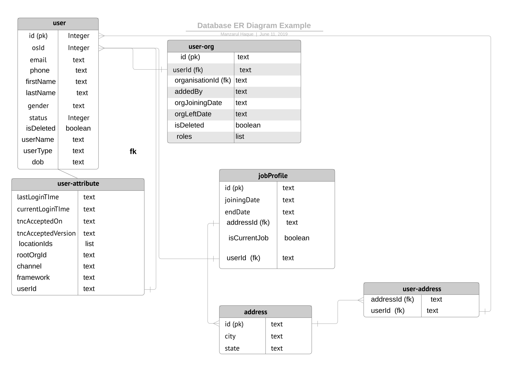

##   * 
  * [Approach 1:  ](#approach-1:  )
  * [Approach 2:](#approach-2:)
  * [Approach 3:](#approach-3:)
  * [User table:](#user-table:)
Description : 
             This page will have details of new user schema. This schema is design as relational database. I haven't keep all the attribute, here main focus is on DB structure instead of a

## Approach 1:  
      \*   User table will have direct attribute related to user all additional attribute is going to store inside user_attribute table.

      \*   Each table will be linked with fk concept.

      \*  in case one object having list of anoter object then will create separate table (Example as user_address) 

## Approach 2:
In Approach 1 user-attributes are pr-defined , For adding any new attribute alter table required. we can use approach 2 to solve this:

* Problem with this approach is number of rows will grow.

.svg)

   

## Approach 3:

.svg)

## User table:

| Attribute | Type | Description | 
|  --- |  --- |  --- | 
| id | Int  | auto generated numebr by DB | 
| osId | text | shardId:uuid | 
| email | text | valid email id | 
| phone | text | valid phone numer | 
| gender | text  | will be predefine set of string | 
| firstName | text | user firstName (Mostly last name will come alsong with firstName as well , with space seperation) | 
| lastName | text | only used for old user , for all new user last name is coming with firstname | 
| lastLoginTime | text | when user was last login to system | 
| locationId | list of text | user location identifier | 
| rootOrgId | text | root org if of user | 
| tncAcceptedOn | text | terms and condition accepted date | 
| tncAcceptedVersion | text | whcih verison user has accepted | 
| isDeleted | boolean |  | 
| status | int |  | 
| channel | text | channel value , that can be derived from rootOrgId | 
| countryCode | text | +91 | 
| currentLoginTime | text | user current login time | 
| userName | text | unique name of user | 
| userType | text | pre-define set of user type | 
| dob  | text |  | 
| framework | text | need to be saved as json string | 
|  |  |  | 

*****

[[category.storage-team]] 
[[category.confluence]] 
